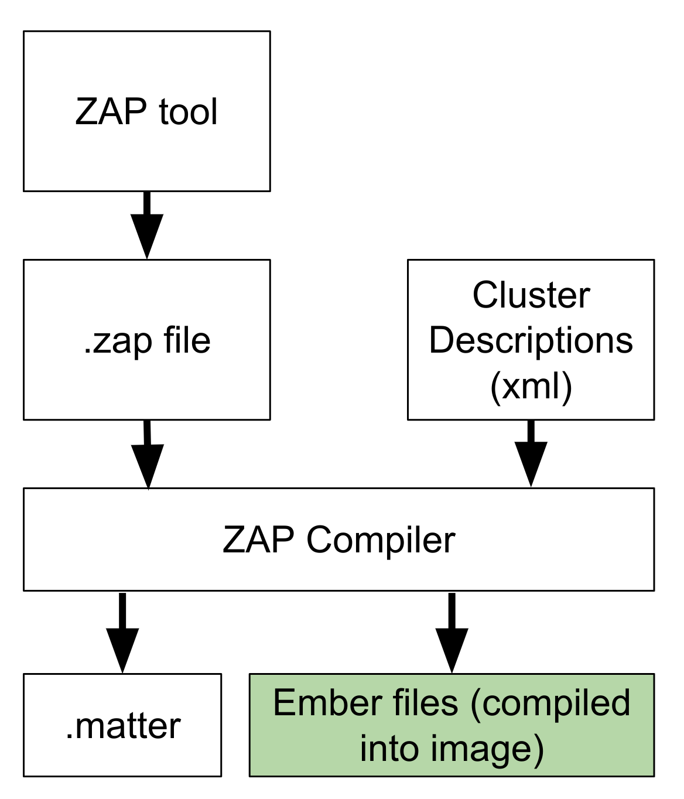
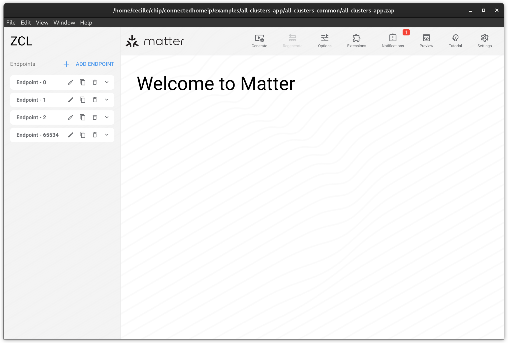
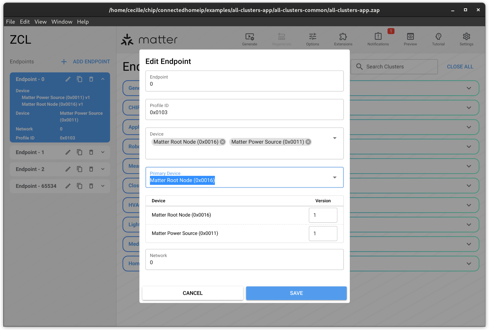
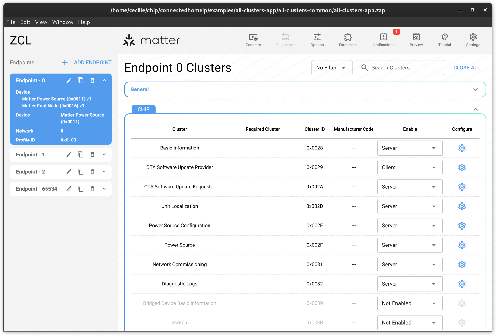
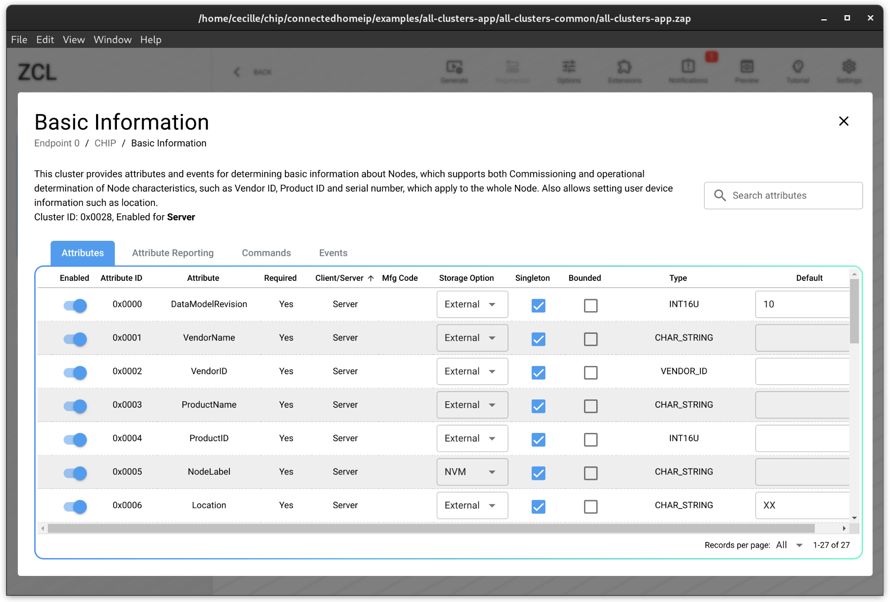
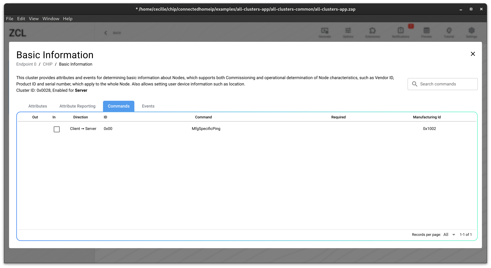

# ZAP

The ZAP tool is a GUI tool that is used to generate a .zap file that describes
the endpoint composition of a device. This includes the endpoints on the device,
the clusters and device types on each endpoint, as well as the cluster features,
attributes, commands and events. The .zap file is used by the ZAP compiler along
with the cluster definitions files to generate an ember layer. This happens
automatically as part of the build process, and the ember layer is compiled into
the firmware.

.matter files are a human-readable version of the .zap that can be used for
review

## A quick tour

Run ./scripts/tools/zap/run_zaptool.sh \<filename\> to open a file in zap.
Select the Matter format.

The left hand side shows the endpoint configuration.

Select the edit button (pencil) on an endpoint to edit it.

This will open a dialog where you can edit the device types and revisions of
your endpoint. Do not edit the profile ID or network. The profile ID identifies
the zap endpoint as being a matter endpoint, network is a property that only
applies to zigbee products.

To edit the clusters on an endpoint, select the endpoint. To enable a cluster on
an endpoint, set the "enable" drop down to "server" and click the gear to edit
the cluster

### Cluster setup

#### Attributes

The zap file will list all the available attributes in the cluster. The column
settings are as follows:

-   Enabled - turn this on to enable the attribute on the device.
-   Attribute ID - Attribute ID of the attribute from the spec
-   Attribute - Attribute name from the spec
-   Required - This is set to yes if the attribute is mandatory. Note that some
    attributes become mandatory when features or other attributes are enabled.
    This will NOT be reflected in the UI. It is up to the device manufacture to
    ensure the device is conformant with the specification. Conformance can be
    checked using the conformance checker test
    [TC_DeviceConformance.py](https://github.com/project-chip/connectedhomeip/blob/master/src/python_testing/TC_DeviceConformance.py)

-   Client/Server - For Matter, all attributes will be server
-   Mfg code - applies only to manufacturer specific attributes
-   Storage option - determines whether ember allocates storage for the
    attribute. The correct value for this field is determined by the cluster
    implementation. Clusters that use the ember layer directly will be RAM,
    clusters that use the override layer and implement their own storage are
    external. Files in the Matter SDK will set these values as appropriate based
    on the the cluster implementations and as described in the Matter zap config
    document. It is best to leave these values as-is unless you have a specific
    reason to override them.

[//]:
    #
    "NOTE: Insert a link to the override specification documentation once that is up"

-   Type - type from the spec
-   Default - this is different than the "default" set in the spec, and
    represents the desired starting value for an attribute IF it is implemented
    in the ember layer (RAM storage)

#### Attribute Reporting

This does not apply to Matter and is unused.

#### Commands

Check off the commands you wish to support. Response commands are required if
the corresponding Request command is supported. 

#### Events

This does not apply to Matter and is unused.
