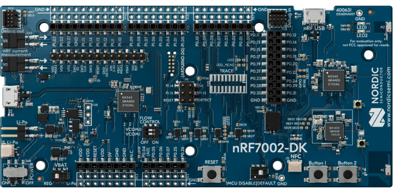

# Matter nRF Connect All Clusters Example Application

> **Note:** This example is intended only to perform smoke tests of a Matter
> solution integrated with nRF Connect SDK platform. The example quality is not
> production ready and it may contain minor bugs or use not optimal
> configuration. It is not recommended to use this example as a basis for
> creating a market ready product.
>
> For the production ready and optimized Matter samples, see
> [nRF Connect SDK samples](https://docs.nordicsemi.com/bundle/ncs-latest/page/nrf/samples/matter.html).
> The Matter samples in nRF Connect SDK use various additional software
> components and provide multiple optional features that improve the developer
> and user experience. To read more about it, see
> [Matter support in nRF Connect SDK](https://docs.nordicsemi.com/bundle/ncs-latest/page/nrf/protocols/matter/index.html#ug-matter)
> page. Using Matter samples from nRF Connect SDK allows you to get a full
> Nordic technical support via [DevZone](https://devzone.nordicsemi.com/)
> portal.

The nRF All Clusters Example Application implements various ZCL clusters
populated on three endpoints. You can use this example as a reference for
creating your own application.


The example is based on
[Matter](https://github.com/project-chip/connectedhomeip) and Nordic
Semiconductor's nRF Connect SDK, and was created to facilitate testing and
certification of a Matter device communicating over a low-power 802.15.4 Thread
network, or Wi-Fi network.

The example behaves as a Matter accessory, that is a device that can be paired
into an existing Matter network and can be controlled by this network. In the
case of Thread, this device works as a Thread Sleepy End Device. Support for
both Thread and Wi-Fi is mutually exclusive and depends on the hardware
platform, so only one protocol can be supported for a specific device.

<hr>

## Overview

This example is running on the nRF Connect platform, which is based on Nordic
Semiconductor's
[nRF Connect SDK](https://developer.nordicsemi.com/nRF_Connect_SDK/doc/latest/nrf/index.html)
and [Zephyr RTOS](https://zephyrproject.org/). Visit Matter's
[nRF Connect platform overview](../../../docs/guides/nrfconnect_platform_overview.md)
to read more about the platform structure and dependencies.

By default, the Matter accessory device has IPv6 networking disabled. You must
pair it with the Matter controller over Bluetooth® LE to get the configuration
from the controller to use the device within a Thread or Wi-Fi network. You have
to make the device discoverable manually (for security reasons). See
[Bluetooth LE advertising](#bluetooth-le-advertising) to learn how to do this.
The controller must get the commissioning information from the Matter accessory
device and provision the device into the network.

You can test this application remotely over the Thread or the Wi-Fi protocol,
which in either case requires more devices, including a Matter controller that
you can configure either on a PC or a mobile device.

### Bluetooth LE advertising

In this example, to commission the device onto a Matter network, it must be
discoverable over Bluetooth LE. For security reasons, you must start Bluetooth
LE advertising manually after powering up the device by pressing:

-   On nRF52840 DK, nRF5340 DK, and nRF21540 DK: **Button 4**.

-   On nRF7002 DK: **Button 2**.

### Bluetooth LE rendezvous

In this example, the commissioning procedure is done over Bluetooth LE between a
Matter device and the Matter controller, where the controller has the
commissioner role.

To start the rendezvous, the controller must get the commissioning information
from the Matter device. The data payload is encoded within a QR code, printed to
the UART console, and shared using an NFC tag. The emulation of the NFC tag
starts automatically when Bluetooth LE advertising is started and stays enabled
until Bluetooth LE advertising timeout expires.

#### Thread or Wi-Fi provisioning

Last part of the rendezvous procedure, the provisioning operation involves
sending the Thread or Wi-Fi network credentials from the Matter controller to
the Matter device. As a result, the device joins the Thread or Wi-Fi network and
can communicate with other devices in the network.

<hr>

## Requirements

The application requires a specific revision of the nRF Connect SDK to work
correctly. See [Setting up the environment](#setting-up-the-environment) for
more information.

### Supported devices

The example supports building and running on the following devices:

| Hardware platform                                                                                 | Build target               | Platform image                                                                                                                                          |
| ------------------------------------------------------------------------------------------------- | -------------------------- | ------------------------------------------------------------------------------------------------------------------------------------------------------- |
| [nRF52840 DK](https://www.nordicsemi.com/Software-and-Tools/Development-Kits/nRF52840-DK)         | `nrf52840dk/nrf52840`      | <details><summary>nRF52840 DK</summary></details>        |
| [nRF5340 DK](https://www.nordicsemi.com/Software-and-Tools/Development-Kits/nRF5340-DK)           | `nrf5340dk/nrf5340/cpuapp` | <details><summary>nRF5340 DK</summary></details>           |
| [nRF52840 Dongle](https://www.nordicsemi.com/Software-and-Tools/Development-Kits/nRF52840-Dongle) | `nrf52840dongle/nrf52840`  | <details><summary>nRF52840 Dongle</summary></details> |
| [nRF7002 DK](https://www.nordicsemi.com/Products/Development-hardware/nRF7002-DK)                 | `nrf7002dk/nrf5340/cpuapp` | <details><summary>nRF7002 DK</summary></details>           |

<hr>

### IPv6 network support

The development kits for this sample offer the following IPv6 network support
for Matter:

-   Matter over Thread is supported for `nrf52840dk/nrf52840` and
    `nrf5340dk/nrf5340/cpuapp`.
-   Matter over Wi-Fi is supported for `nrf7002dk/nrf5340/cpuapp`.

## Device UI

This section lists the User Interface elements that you can use to control and
monitor the state of the device. These correspond to PCB components on the
platform image.

> **Note**:
>
> The following Device UI elements are missing on the nRF52840 Dongle: **Button
> 2**, **Button 3**, **Button 4**, **SEGGER J-Link USB port**, and **NFC port
> with antenna attached**. You can collect logs from the nRF52840 Dongle using
> the **nRF USB port** instead of the **SEGGER J-Link USB port**.
> Functionalities associated with the remaining missing elements are
> inaccessible.

**LED 1** shows the overall state of the device and its connectivity. The
following states are possible:

-   _Short Flash On (50 ms on/950 ms off)_ &mdash; The device is in the
    unprovisioned (unpaired) state and is waiting for a commissioning
    application to connect.

-   _Rapid Even Flashing (100 ms on/100 ms off)_ &mdash; The device is in the
    unprovisioned state and a commissioning application is connected through
    Bluetooth LE.

-   _Short Flash Off (950ms on/50ms off)_ &mdash; The device is fully
    provisioned, but does not yet have full connectivity for Thread or Wi-Fi
    network.

-   _Solid On_ &mdash; The device is fully provisioned.

**Button 1** can be used for the following purposes:

-   _Pressed for less than 3 s_ &mdash; Initiates the OTA software update
    process. This feature is disabled by default, but can be enabled by
    following the
    [Building with Device Firmware Upgrade support](#building-with-device-firmware-upgrade-support)
    instructions.

-   _Pressed for more than 3 s_ &mdash; initiates the factory reset of the
    device. Releasing the button within the 3-second window cancels the factory
    reset procedure.

**Button 2**:

-   On nRF52840 DK, nRF5340 DK, and nRF21540 DK: Not available.

-   On nRF7002 DK:

    -   If pressed for more than three seconds, it starts the NFC tag emulation,
        enables Bluetooth LE advertising for the predefined period of time (15
        minutes by default), and makes the device discoverable over Bluetooth
        LE.

**Button 4**:

-   On nRF52840 DK, nRF5340 DK, and nRF21540 DK: Starts the NFC tag emulation,
    enables Bluetooth LE advertising for the predefined period of time (15
    minutes by default), and makes the device discoverable over Bluetooth LE.
    This button is used during the commissioning procedure.

-   On nRF7002 DK: Not available.

**SEGGER J-Link USB port** can be used to get logs from the device or
communicate with it using the
[command line interface](../../../docs/guides/nrfconnect_examples_cli.md).

<hr>

## Setting up the environment

Before building the example, check out the Matter repository and sync submodules
using the following command:

        $ python3 scripts/checkout_submodules.py --shallow --platform nrfconnect

> **Note**:
>
> For Linux operating system install
> [SEGGER J-Link Software](https://www.segger.com/downloads/jlink/#J-LinkSoftwareAndDocumentationPack).

### Install Command Line Tools

With admin permissions enabled, download and install the
[nRF Command Line Tools](https://www.nordicsemi.com/Products/Development-tools/nrf-command-line-tools).

### Install Toolchain Manager

Toolchain Manager is available from
[nRF Connect for Desktop](https://www.nordicsemi.com/Products/Development-tools/nrf-connect-for-desktop),
a cross-platform tool that provides different applications that simplify
installing the nRF Connect SDK. Both the tool and the application are available
for Windows, Linux, and macOS.

To install the Toolchain Manager app, complete the following steps:

1.  [Download nRF Connect for Desktop](https://www.nordicsemi.com/Products/Development-tools/nrf-connect-for-desktop/download#infotabs)
    for your operating system.

2.  Install and run the tool on your machine.

3.  In the **APPS** section, click **Install** button on the Toolchain Manager
    tab.

### Install nRF Connect SDK

Complete the following steps to install the nRF Connect SDK:

1.  Open Toolchain Manager in nRF Connect for Desktop.

2.  Click the **Install** button next to the
    [recommended](../../../config/nrfconnect/.nrfconnect-recommended-revision)
    version of the nRF Connect SDK.

3.  A pop-up window will inform you about the current installation directory. If
    you want to change the directory, click the **Change directory** button.
    Otherwise, click the **Continue installation** button.

4.  When the nRF Connect SDK is installed on your machine, the **Install**
    button changes to the **Open VS Code** button.

5.  Click the dropdown menu next to the **Open VS Code** button for the
    installed nRF Connect SDK version, and select **Open terminal**.

6.  Make sure that the nRF Connect SDK version is compatible with the Matter SDK
    version:

    ```
         $ cd {connectedhomeip directory}
         $ python3 scripts/setup/nrfconnect/update_ncs.py --update
    ```

Now you can proceed with the [Building](#building) instruction.

<hr>

## Building

Complete the following steps to build the sample:

1.  Navigate to the example's directory:

        $ cd examples/all-clusters-app/nrfconnect

2.  Run the following command to build the example, with _build-target_ replaced
    with the build target name of the Nordic Semiconductor's kit you own, for
    example `nrf52840dk/nrf52840`:

         $ west build -b build-target --sysbuild

    You only need to specify the build target on the first build. See
    [Requirements](#requirements) for the build target names of compatible kits.

The output `zephyr.hex` file will be available in the `build/nrfconnect/zephyr/`
directory.

### Removing build artifacts

If you're planning to build the example for a different kit or make changes to
the configuration, remove all build artifacts before building. To do so, use the
following command:

    $ rm -r build

### Building with release configuration

To build the example with release configuration that disables the diagnostic
features like logs and command-line interface, run the following command:

    $ west build -b build-target --sysbuild -- -DFILE_SUFFIX=release

Remember to replace _build-target_ with the build target name of the Nordic
Semiconductor's kit you own.

### Building with Device Firmware Upgrade support

Support for DFU using Matter OTA is disabled by default.

To build the example with configuration that supports DFU, run the following
command with _build-target_ replaced with the build target name of the Nordic
Semiconductor kit you are using (for example `nrf52840dk/nrf52840`):

    $ west build -b build-target --sysbuild -- -DFILE_SUFFIX=dfu

> **Note**:
>
> There are two types of Device Firmware Upgrade modes: single-image DFU and
> multi-image DFU. Single-image mode supports upgrading only one firmware image,
> the application image, and should be used for single-core nRF52840 DK devices.
> Multi-image mode allows to upgrade more firmware images and is suitable for
> upgrading the application core and network core firmware in two-core nRF5340
> DK devices.
>
> Currently the multi-image mode is not available for the Matter OTA DFU.

#### Changing bootloader configuration

To change the default MCUboot configuration, edit the `prj.conf` file located in
the `sysbuild/mcuboot` directory.

#### Changing flash memory settings

In the default configuration, the MCUboot uses the
[Partition Manager](https://developer.nordicsemi.com/nRF_Connect_SDK/doc/latest/nrf/scripts/partition_manager/partition_manager.html#partition-manager)
to configure flash partitions used for the bootloader application image slot
purposes. You can change these settings by defining
[static partitions](https://developer.nordicsemi.com/nRF_Connect_SDK/doc/latest/nrf/scripts/partition_manager/partition_manager.html#ug-pm-static).
This example uses this option to define using an external flash.

To modify the flash settings of your board (that is, your _build-target_, for
example `nrf52840dk/nrf52840`), edit the `pm_static_<build_target>.yml` file
(for example `pm_static_nrf52840dk_nrf52840.yml`), located in the main
application directory.

<hr>

## Configuring the example

The Zephyr ecosystem is based on Kconfig files and the settings can be modified
using the menuconfig utility.

To open the menuconfig utility, run the following command from the example
directory:

    $ west build -b build-target --sysbuild -t menuconfig

Remember to replace _build-target_ with the build target name of the Nordic
Semiconductor's kit you own.

Changes done with menuconfig will be lost if the `build` directory is deleted.
To make them persistent, save the configuration options in the `prj.conf` file.

### Example build types

The example uses different configuration files depending on the supported
features. Configuration files are provided for different build types and they
are located in the application root directory.

The `prj.conf` file represents a debug build type. Other build types are covered
by dedicated files with the build type added as a suffix to the prj part, as per
the following list. For example, the release build type file name is
`prj_release.conf`. If a board has other configuration files, for example
associated with partition layout or child image configuration, these follow the
same pattern.

Before you start testing the application, you can select one of the build types
supported by the sample. This sample supports the following build types,
depending on the selected board:

-   debug -- Debug version of the application - can be used to enable additional
    features for verifying the application behavior, such as logs or
    command-line shell.
-   release -- Release version of the application - can be used to enable only
    the necessary application functionalities to optimize its performance. It
    has Device Firmware Upgrade feature enabled. It can be used only for the
    nRF52840 DK and nRF5340 DK, as only those platforms support the DFU.
-   dfu -- Debug version of the application with Device Firmware Upgrade feature
    support. It can be used only for the nRF52840 DK and nRF5340 DK, as only
    those platforms support the DFU.

For more information, see the
[Configuring nRF Connect SDK examples](../../../docs/guides/nrfconnect_examples_configuration.md)
page.

<hr>

## Flashing and debugging

The flashing and debugging procedure is different for the development kits and
the nRF52840 Dongle.

### Flashing on the development kits

To flash the application to the device, use the west tool and run the following
command from the example directory:

        $ west flash --erase

If you have multiple development kits connected, west will prompt you to pick
the correct one.

To debug the application on target, run the following command from the example
directory:

        $ west debug

### Flashing on the nRF52840 Dongle

Visit
[Programming and Debugging nRF52840 Dongle](https://docs.zephyrproject.org/latest/boards/arm/nrf52840dongle_nrf52840/doc/index.html#programming-and-debugging)
to read more about flashing on the nRF52840 Dongle.

<hr>

## Testing the example

Check the [CLI tutorial](../../../docs/guides/nrfconnect_examples_cli.md) to
learn how to use command-line interface of the application.

### Testing using Linux CHIPTool

Read the [CHIP Tool user guide](../../../docs/guides/chip_tool_guide.md) to see
how to use [CHIP Tool for Linux or mac OS](../../chip-tool/README.md) to
commission and control the application within a Matter-enabled Thread network.

### Testing using Android CHIPTool

Read the
[Android commissioning guide](../../../docs/guides/nrfconnect_android_commissioning.md)
to see how to use [CHIPTool](../../../examples/android/CHIPTool/README.md) for
Android smartphones to commission and control the application within a
Matter-enabled Thread network.
