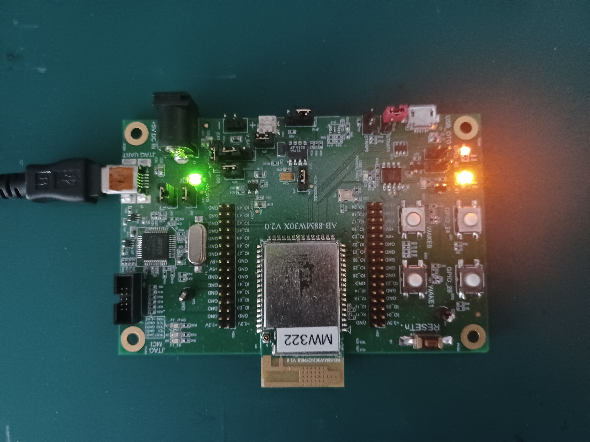

# MW320 All Clusters Example Application

The example is based on
[Matter](https://github.com/project-chip/connectedhomeip) and the NXP MW320 SDK
to demonstrates device commissioning and cluster control over a low-power, WiFi
802.11n network.

<hr>

-   [MW320 All Clusters Example Application](#mw320-all-clusters-example-application)
-   [Introduction](#introduction)
-   [Building](#building)
-   [Flashing and debugging](#flashdebug)
-   [Testing the example](#testing-the-example)

<hr>

<a name="intro"></a>

## Introduction


The example targets the
[NXP MW320 WiFi Micro controller Soc](https://www.nxp.com/products/wireless/wi-fi-plus-bluetooth/88mw32x-802-11n-wi-fi-microcontroller-soc:88MW32X)
development kit.

<a name="building"></a>

## Building

Building the example application is quite straightforward. It can be done via
following commands:
```
git submodule update --init
source third_party/connectedhomeip/scripts/activate.sh
gn gen out/debug
ninja -v -C out/debug
```
Example application binary file "all-cluster-mw320.bin" will be generated under
directory "out/debug".

Note:
1. "git submodule update --init" only needs to be issued for the first time in order
   to download MW320 SDK for Matter.
3. "source third_party/connectedhomeip/scripts/activate.sh" can be omitted if your
   environment is already setup without issues.

<a name="flashdebug"></a>

## Flashing and debugging

Connected to Universal Asynchronous Receiver/Transmitter port on MW320 platform
to Ubuntu 20 USB port and open Linux text-based serial port communications
program at second USB interface. ex. /dev/ttyUSB1.

## Testing the example


