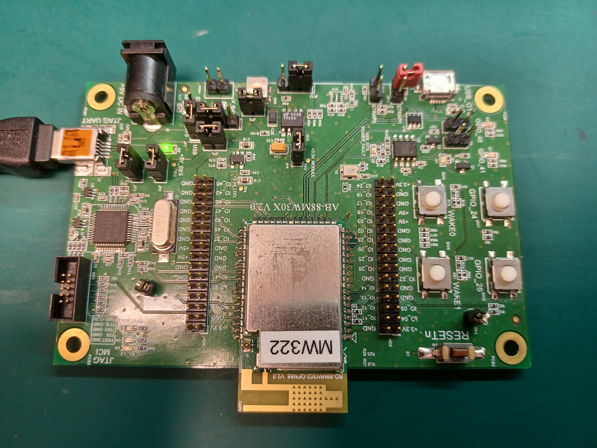
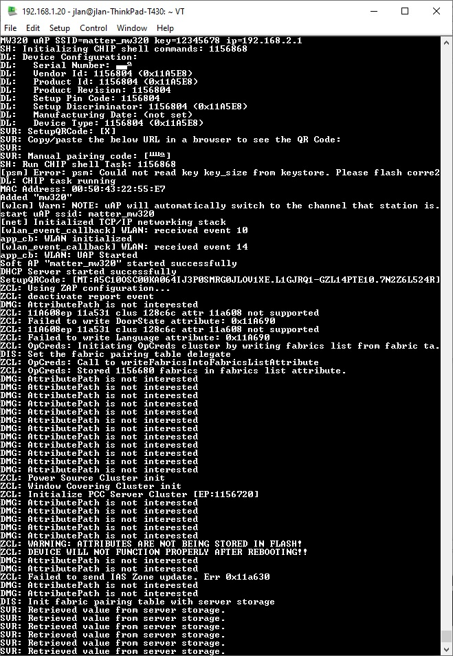

# Matter MW320 All Clusters Example Application

The example is based on
[Matter](https://github.com/project-chip/connectedhomeip) and the NXP MW320 SDK
to demonstrates device commissioning and cluster control over a low-power, WiFi
802.11n network.

<hr>

-   [Matter MW320 All Clusters Example Application](#matter-mw320-all-clusters-example-application)
-   [Introduction](#introduction)
-   [Building](#building)
-   [Flashing](#flashing)

<hr>

## Introduction



The example targets the
[NXP MW320 WiFi Micro controller Soc](https://www.nxp.com/products/wireless/wi-fi-plus-bluetooth/88mw32x-802-11n-wi-fi-microcontroller-soc:88MW32X)
development kit.

## Building

Building the example application is quite straightforward. It can be done via
following commands:

```
$ cd examples/all-clusters-app/nxp/mw320/
$ git submodule update --init
$ source third_party/connectedhomeip/scripts/activate.sh
$ gn gen out/debug
$ ninja -v -C out/debug
```

Example application binary file "chip-mw320-all-clusters-app.bin" will be
generated under directory "out/debug".

Note:

1. "git submodule update --init" only needs to be issued for the first time in
   order to download MW320 SDK for Matter.
2. "source third_party/connectedhomeip/scripts/activate.sh" can be omitted if
   your environment is already setup without issues.

Tinycrypt ECC operations:

Note: This solution is temporary.

In order to use the tinycrypt ecc operations, use the following build arguments:

```
$ gn gen out/debug --args='treat_warnings_as_errors=false mbedtls_repo="//third_party/connectedhomeip/third_party/nxp/libs/mbedtls" chip_crypto="tinycrypt"'
```

## Flashing

Connect MW320 to Ubuntu USB port and open Linux text-based serial port
communications program at second USB interface (/dev/ttyUSB1):

```
$ TERM=linux minicom -D /dev/ttyUSB1 -b 115200
```

Prepare MW320 download firmware image:

```
$ ln -sf third_party/connectedhomeip/third_party/nxp/mw320_sdk/repo mw320_sdk
$ mw320_sdk/tools/mw_img_conv/bin/mw_img_conv mcufw out/debug/chip-mw320-all-clusters-app.bin out/debug/all-cluster-mw320.mcufw.bin 0x1F010000
$ cp out/debug/all-cluster-mw320.mcufw.bin mw320_sdk/mw320_matter_flash/Matter/.
```

Install OpenOCD (Open On-Chip Debugger):

```
$ sudo apt-get install openocd
```

Flashing firmware image to MW320:

```
$ cd mw320_sdk/mw320_matter_flash
$ sudo python2 flashprog.py -l Matter/layout-4m.txt --boot2 Matter/boot2.bin --wififw Matter/mw32x_uapsta_W14.88.36.p172.bin --mcufw Matter/all-cluster-mw320.mcufw.bin -r
```

After MW320 is reset, console will allow you to enter commands:


