# CHIP RT1060 All-clusters Application

The all-clusters example implements a server which can be accessed by a CHIP
controller and can accept basic cluster commands.

The example is based on
[Project CHIP](https://github.com/project-chip/connectedhomeip) and the NXP
RT1060 SDK, and provides a prototype application that demonstrates device
commissioning and different cluster control.

<hr>

-   [CHIP RT1060 All-clusters Application](#chip-rt1060-all-clusters-application)
    -   [Introduction](#introduction)
        -   [Configurations supported](#configurations-supported)
        -   [Hardware requirements RT1060 + transceiver](#hardware-requirements-rt1060--transceiver)
            -   [Hardware requirements RT1060+IW416](#hardware-requirements-rt1060iw416)
            -   [Hardware requirements RT1060+88W8801](#hardware-requirements-rt106088w8801)
            -   [Hardware requirements RT1060 + K32W0](#hardware-requirements-rt1060--k32w0)
            -   [Hardware requirements RT1060-EVK-C+IW612](#hardware-requirements-rt1060-evk-ciw612)
            -   [Hardware requirements RT1060 + 88W8801 + K32W0x1DK6](#hardware-requirements-rt1060--88w8801--k32w0x1dk6)
    -   [Building](#building)
        -   [Building with Matter over Wifi configuration on RT1060 + transceiver](#building-with-matter-over-wifi-configuration-on-rt1060--transceiver)
        -   [Build with Matter over Thread configuration on RT1060 + transceiver](#build-with-matter-over-thread-configuration-on-rt1060--transceiver)
            -   [Build with Matter over Thread configuration on RT1060 + K32W0](#build-with-matter-over-thread-configuration-on-rt1060--k32w0)
            -   [Build with Matter over Thread configuration on RT1060-EVK-C + IW612](#build-with-matter-over-thread-configuration-on-rt1060-evk-c--iw612)
        -   [Build with Matter over Wi-Fi + OpenThread Border Router configuration on RT1060 + 88W8801 + K32W0x1DK6](#build-with-matter-over-wi-fi--openthread-border-router-configuration-on-rt1060--88w8801--k32w0x1dk6)
        -   [General Information](#general-information)
    -   [Manufacturing data](#manufacturing-data)
    -   [Flashing and debugging](#flashing-and-debugging)
    -   [Testing the example](#testing-the-example)
        -   [Matter over wifi configuration :](#matter-over-wifi-configuration-)
        -   [Matter over thread configuration :](#matter-over-thread-configuration-)
        -   [Matter over wifi with openthread border router configuration :](#matter-over-wifi-with-openthread-border-router-configuration-)
        -   [Testing the all-clusters application without Matter CLI:](#testing-the-all-clusters-application-without-matter-cli)
        -   [Testing the all-clusters application with Matter CLI enabled:](#testing-the-all-clusters-application-with-matter-cli-enabled)
    -   [Thread Border Router overview](#thread-border-router-overview)
        <hr>

<a name="intro"></a>

## Introduction

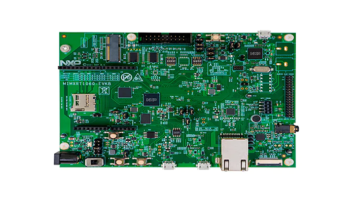

The RT1060 all-cluster application provides a working demonstration of the
RT1060 board integration, built using the Project CHIP codebase and the NXP
RT1060 SDK.

The example supports:

-   Matter over Wi-Fi
-   Matter over Openthread
-   Matter over Wi-Fi with Openthread Border Router support

The example targets the
[NXP MIMXRT1060-EVK-B](https://www.nxp.com/design/development-boards/i-mx-evaluation-and-development-boards/mimxrt1060-evk-i-mx-rt1060-evaluation-kit:MIMXRT1060-EVK)
board by default. It is also possible to use the older MIMXRT1060-EVK board,
build and board setup instructions differ in some steps.

### Configurations supported

Here are listed configurations supported on RT1060.

Matter over Wi-Fi :

-   RT1060 + IW416 (Wi-Fi + BLE)
-   RT1060 + 88W8801 (Wi-Fi)
-   **Experimental:** _RT1060-EVK-C + IW612 (Wi-fi +BLE)_

Matter over Thread :

-   RT1060 + K32W0 (15.4 + BLE)
-   **Experimental:** _RT1060-EVK-C + IW612 (15.4 + BLE)_

Matter over Wi-Fi with Openthread Border Router support :

-   RT1060 + 88W8801 + K32W0x1DK6

### Hardware requirements RT1060 + transceiver

#### Hardware requirements RT1060+IW416

Host part:

-   1 MIMXRT1060-EVK-B or MIMXRT1060-EVK board
-   external 5V supply

Transceiver part:

-   1 AzureWave AW-AM510-uSD evaluation board

Jumper settings for MIMXRT1060-EVK-B (enables external 5V supply):

-   remove J40 5-6
-   connect J40 1-2
-   connect J45 with external power (controlled by SW6 - position 3)

Jumper settings for MIMXRT1060-EVK (enables external 5V supply):

-   remove J1 5-6
-   connect J1 1-2
-   connect J2 with external power (enabled by SW1 - position 3)

The hardware should be reworked according to the chapter _Hardware Rework Guide
for MIMXRT1060-EVK-B and AW-AM510-uSD_ or the chapter _Hardware Rework Guide for
MIMXRT1060-EVK and AW-AM510-uSD_ in the document
_`Hardware Rework Guide for EdgeFast BT PAL`_ which can be found in the NXP
RT1060 SDK (_docs/wireless/bluetooth/`edgefast_bluetooth`/Hardware Rework Guide
for EdgeFast BT PAL.pdf_):

-   Make sure resistors R368/R376/R347/R349/R365/R363/R193/R186 are removed.

Only the SDK package downloaded from https://mcuxpresso.nxp.com contains the PDF
document mentioned above, it is not present in the SDK downloaded from GitHub
using the west tool.

Jumper settings for AzureWave AW-AM510-uSD Module:

-   J4 1-2: `VIO` 1.8V (Voltage level of SD-IO pins is 1.8V)
-   J2 1-2: 3.3V `VIO_uSD` (Power Supply from uSD connector)
-   The pin 1 of J4 is not marked on the board. Please note that pin numbering
    of J4 is opposite to J2.

Plug AW-AM510-uSD into uSD connector J22 on MIMXRT1060-EVK-B or J39 on
MIMXRT1060-EVK.

Connect the following pins between RT1060 and AW-AM510-uSD to enable Bluetooth
HCI UART:

|  PIN NAME  | AW-AM510-uSD  | MIMXRT1060-EVK-B | MIMXRT1060-EVK | PIN NAME OF RT1060 | GPIO NAME OF RT1060 |
| :--------: | :-----------: | :--------------: | :------------: | :----------------: | :-----------------: |
| `UART_TXD` | `J10 (pin 4)` |  `J16 (pin 1)`   | `J22 (pin 1)`  |   `LPUART3_RXD`    |   `GPIO_AD_B1_07`   |
| `UART_RXD` | `J10 (pin 2)` |  `J16 (pin 2)`   | `J22 (pin 2)`  |   `LPUART3_TXD`    |   `GPIO_AD_B1_06`   |
| `UART_RTS` | `J10 (pin 6)` |  `J33 (pin 3)`   | `J23 (pin 3)`  |   `LPUART3_CTS`    |   `GPIO_AD_B1_04`   |
| `UART_CTS` | `J10 (pin 8)` |  `J33 (pin 4)`   | `J23 (pin 4)`  |   `LPUART3_RTS`    |   `GPIO_AD_B1_05`   |
|   `GND`    | `J6 (pin 7)`  |  `J32 (pin 7)`   | `J25 (pin 7)`  |       `GND`        |        `GND`        |

Attach external antenna into connector on AW-AM510-uSD.

Additional information about the AW-AM510-uSD can be found in the user manual
_UM11441 - Getting Started with NXP-based Wireless Modules and i.MX RT Platform
Running RTOS_, which can be found in the NXP RT1060 SDK
(docs/wireless/UM11441-Getting-Started-with-NXP-based-Wireless-Modules-and-i.MX-RT-Platform-Running-on-RTOS.pdf).
Only the SDK package downloaded from https://mcuxpresso.nxp.com contains the PDF
document, it is not present in the SDK downloaded from GitHub using the west
tool.

#### Hardware requirements RT1060+88W8801

Host part:

-   1 MIMXRT1060-EVK-B

Transceiver part :

-   1 88W8801 2DS M.2 Module (rev A)
-   1 Murata uSD-M.2 Adapter (rev B1)

The 88W8801 2DS M.2 Module should be inserted into the Murata uSD-M.2 Adapter
and inserted in the uSD slot J22 of MIMXRT1060-EVK-B. The Murata uSD-M.2 Adapter
can be powered up using uSD pins. For that, set the J1 jumper of Murata uSD-M.2
to position 2-3 (Position 2-3: `VBAT supply`, typical 3.1 ~ 3.3V, from microSD
connector).

Note: as the 88W8801 module supports only the 2.4 GHz Wi-Fi band, it is
mandatory to connect it to a Wi-Fi access point on the 2.4 GHz band.

#### Hardware requirements RT1060 + K32W0

Host part:

-   1 MIMXRT1060-EVK-B or MIMXRT1060-EVK board

Transceiver part:

-   1 OM15076-3 Carrier Board (DK6 board)
-   1 K32W0 Module to be plugged on the Carrier Board

**Board settings**

The below table explains pin settings (UART settings) to connect the
MIMXRT1060-EVK-B (host) to a k32w061 transceiver (rcp).

|     PIN NAME     | DK6 (K32W061) | MIMXRT1060-EVK-B | MIMXRT1060-EVK | PIN NAME OF RT1060 | GPIO NAME OF RT1060 |
| :--------------: | :-----------: | :--------------: | :------------: | :----------------: | :-----------------: |
|    `UART_TXD`    | `PIO, pin 8`  |   `J16, pin 1`   |  `J22, pin 1`  |   `LPUART3_RXD`    |   `GPIO_AD_B1_07`   |
|    `UART_RXD`    | `PIO, pin 9`  |   `J16, pin 2`   |  `J22, pin 2`  |   `LPUART3_TXD`    |   `GPIO_AD_B1_06`   |
|    `UART_RTS`    | `PIO, pin 6`  |   `J33, pin 3`   |  `J23, pin 3`  |   `LPUART3_CTS`    |   `GPIO_AD_B1_04`   |
|    `UART_CTS`    | `PIO, pin 7`  |   `J33, pin 4`   |  `J23, pin 4`  |   `LPUART3_RTS`    |   `GPIO_AD_B1_05`   |
|      `GND`       |  `J3, pin 1`  |   `J32, pin 7`   |  `J25, pin 7`  |        `XX`        |        `XX`         |
|     `RESET`      |    `RSTN`     |   `J33, pin 2`   |  `J23, pin 2`  |  `GPIO_AD_B1_11`   |   `GPIO_AD_B1_11`   |
| `DIO5/ISP Entry` | `PIO, pin 5`  |   `J33, pin 1`   |  `J23, pin 1`  |  `GPIO_AD_B1_10`   |   `GPIO_AD_B1_10`   |

The below picture shows pins connections for the MIMXRT1060-EVK.

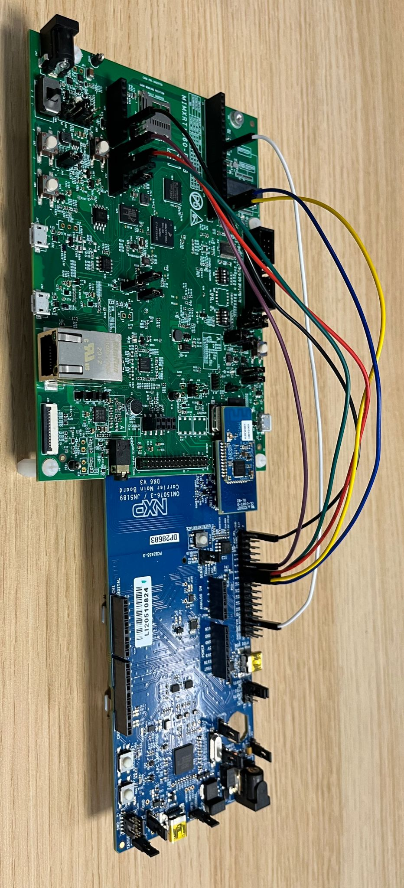

#### Hardware requirements RT1060-EVK-C+IW612

Host part:

-   1 MIMXRT1060-EVK-C

    Hardware should be reworked as below:

    -   populate R93, R96, R2155, R2156, R2157, R2158, R2159 with 0Ohm resistors
    -   J76 and J107 jumpers in 2-3 position.
    -   J109 and J110 jumpers in 1-2 position.
    -   disconnect pin15 of component U9

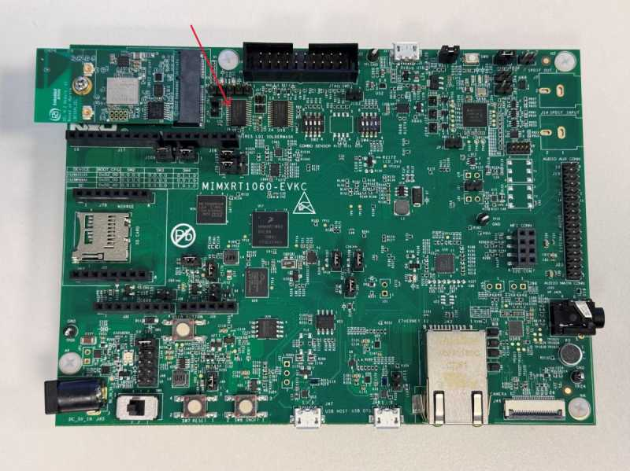

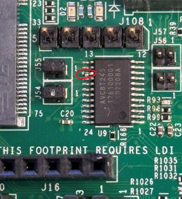

Transceiver part :

-   1
    [2EL M2 A1 IW612 Secure Module](https://www.nxp.com/products/wireless/wi-fi-plus-bluetooth-plus-802-15-4/2-4-5-ghz-dual-band-1x1-wi-fi-6-802-11ax-plus-bluetooth-5-2-plus-802-15-4-tri-radio-solution:IW612)

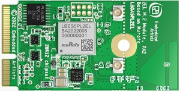

#### Hardware requirements RT1060 + 88W8801 + K32W0x1DK6

-   i.MX RT1060 EVK-A or EVK-B board
-   88W8801 module (for Wi-Fi connection), for example 88W8801 2DS M.2 Module
    (rev A) and Murata uSD-M.2 Adapter (rev B1)
-   K32W0x1 mezzanine module (for Thread connection)
-   `IOT_ZTB-DK006` carrier board for the K32W0x1 module (referenced as DK6
    carrier board)

<a name="building"></a>

## Building

In order to build the Project CHIP example, we recommend using a Linux
distribution. Supported Operating Systems are listed in
[BUILDING.md](../../../../../docs/guides/BUILDING.md).

-   Make sure that below prerequisites are correctly installed, as described in
    [BUILDING.md](../../../../../docs/guides/BUILDING.md).

```
sudo apt-get install git gcc g++ pkg-config libssl-dev libdbus-1-dev \
     libglib2.0-dev libavahi-client-dev ninja-build python3-venv python3-dev \
     python3-pip unzip libgirepository1.0-dev libcairo2-dev libreadline-dev
```

-   Step 1: checkout NXP specific submodules only

```
user@ubuntu:~/Desktop/git/connectedhomeip$ scripts/checkout_submodules.py --shallow --platform nxp --recursive
```

-   Step 2: activate local environment

```
user@ubuntu:~/Desktop/git/connectedhomeip$ source scripts/activate.sh
```

If the script says the environment is out of date, you can update it by running
the following command:

```
user@ubuntu:~/Desktop/git/connectedhomeip$ source scripts/bootstrap.sh
```

-   Step 3: Init NXP SDK(s)

```
user@ubuntu:~/Desktop/git/connectedhomeip$ third_party/nxp/nxp_matter_support/scripts/update_nxp_sdk.py --platform common
```

Note: By default update_nxp_sdk.py will try to initialize all NXP SDKs. Arg "--
help" could be used to view all available options.

-   Start building the application.

### Building with Matter over Wifi configuration on RT1060 + transceiver

-   Build the Wi-fi configuration for **MIMXRT1060-EVK-B board + IW416
    transceiver** (with BLE for commissioning).

```
user@ubuntu:~/Desktop/git/connectedhomeip/examples/all-clusters-app/nxp/rt/rt1060$ gn gen --args="chip_enable_wifi=true iw416_transceiver=true" out/debug
user@ubuntu:~/Desktop/git/connectedhomeip/examples/all-clusters-app/nxp/rt/rt1060$ ninja -C out/debug
```

-   Build the Wi-fi configuration for **MIMXRT1060-EVK-B board + 88W8801
    transceiver** with Matter-over-Wifi configuration and only onnetwork
    commissioning (without BLE, the WiFi network credentials are provided at
    build-time which will enable the device to join the Wi-Fi AP at startup):

```
user@ubuntu:~/Desktop/git/connectedhomeip/examples/all-clusters-app/nxp/rt/rt1060$ export ssid_name=<nwk_ssid> && export ssid_password=<nwk_password> && gn gen --args="chip_enable_wifi=true w8801_transceiver=true chip_config_network_layer_ble=false wifi_auto_connect_at_boot=true wifi_auto_connect_at_boot_ssid=\"${ssid_name}\" wifi_auto_connect_at_boot_password=\"${ssid_password}\"" out/debug
user@ubuntu:~/Desktop/git/connectedhomeip/examples/all-clusters-app/nxp/rt/rt1060$ ninja -C out/debug
```

-   Build the Wi-fi configuration for **MIMXRT1060-EVK-C board + IW612
    transceiver** (with BLE for commissioning).

```
user@ubuntu:~/Desktop/git/connectedhomeip/examples/all-clusters-app/nxp/rt/rt1060$ gn gen --args="chip_enable_wifi=true iwx12_transceiver=true evkname=\"evkcmimxrt1060\" " out/debug
user@ubuntu:~/Desktop/git/connectedhomeip/examples/all-clusters-app/nxp/rt/rt1060$ ninja -C out/debug
```

-   Build the Wi-fi configuration for **MIMXRT1060-EVK-C board + IW612
    transceiver** with Matter-over-Wifi configuration and only onnetwork
    commissioning (without BLE, the WiFi network credentials are provided at
    build-time which will enable the device to join the Wi-Fi AP at startup):

```
user@ubuntu:~/Desktop/git/connectedhomeip/examples/all-clusters-app/nxp/rt/rt1060$ gn gen --args="chip_enable_wifi=true iwx12_transceiver=true evkname=\"evkcmimxrt1060\" chip_config_network_layer_ble=false tcp_download=true wifi_ssid=\"your_wifi_ssid\" wifi_password=\"your_wifi_password\"" out/debug
user@ubuntu:~/Desktop/git/connectedhomeip/examples/all-clusters-app/nxp/rt/rt1060$ ninja -C out/debug
```

### Build with Matter over Thread configuration on RT1060 + transceiver

#### Build with Matter over Thread configuration on RT1060 + K32W0

For this configuration a K32W0 RCP image is required and must support in a
single image the openthread RCP configuration and the BLE HCI BB configuration.
Messages between the host and the K32W0 transceiver are transferred on a single
UART with flow control support. For that the HDLC-Lite framing protocol is used
to transfer spinel and hci frames. In addition, hci and spinel frames can be
distinguished by using the Spinel convention which is line compatible with
BT/BLE HCI.

Before building the Matter host application, it is required to generate the
K32W0 image supporting features as described above. To build this binary the
target `ot_rcp_ble_hci_bb_single_uart_fc` should be built by following the
[Readme.md][ot_rcp_ble_hci_bb_k32w0_readme]. After a successful build, a `".h"`
file will be generated and would contain the K32W0 RCP binary. As described in
the [Readme.md][ot_rcp_ble_hci_bb_k32w0_readme], the application binaries will
be generated in
`ot_nxp/build_k32w061/ot_rcp_ble_hci_bb_single_uart_fc/bin/ot-rcp-ble-hci-bb-k32w061.elf.bin.h`.

The generate K32W0 transceiver binary `".h"` file path must be indicated to the
host Matter application build. In fact the Matter host application is in charge
of storing the K32W0 firmware in its flash to be able to use the
`The Over The Wire (OTW) protocol (over UART)` to download (at host startup) the
k32w0 transceiver image from the host to the K32W0 internal flash. For more
information on the k32w0 `OTW` protocol, user can consult the doxygen header of
the file located in
`<repo_root>/third_party/nxp/nxp_matter_support/github_sdk/common_sdk/repo/middleware/wireless/framework/OTW/k32w0_transceiver/fwk_otw.c`.

Here is a summary of the k32w0 _gn gen_ arguments that are mandatory or
optional:

-   Mandatory: `k32w0_transceiver=true`
-   Mandatory: `hci_spinel_single_uart=true`
-   Optional:
    `k32w0_transceiver_bin_path=\"/home/ot-nxp/build_k32w061/ot_rcp_ble_hci_bb_single_uart_fc/bin/ot-rcp-ble-hci-bb-k32w061.elf.bin.h\"`
    This argument is optional, by default, if not set, the binary file located
    in
    "\${chip_root}/third_party/openthread/ot_nxp/build_k32w061/ot_rcp_ble_hci_bb_single_uart_fc/bin/ot-rcp-ble-hci-bb-k32w061.elf.bin.h"
    will be used. If the K32W061 transceiver binary is saved at another location
    an absolute path of its location should be given.
-   Optional: `otw_logs_enabled=true` This argument is optional, by default
    being set to false. If set to true, RT logging will print the `OTW` logs.

[ot_rcp_ble_hci_bb_k32w0_readme]:
    https://github.com/NXP/ot-nxp/blob/v1.0.0.2-tag-nxp/examples/hybrid/ot_rcp_ble_hci_bb/k32w061/README.md#building-the-examples

Below is presented an example of _gn gen_ argument that could be used to
generate the host matter application with a k32w0 transceiver.

```
user@ubuntu:~/Desktop/git/connectedhomeip/examples/all-clusters-app/nxp/rt/rt1060$ gn gen --args="chip_enable_openthread=true k32w0_transceiver=true k32w0_transceiver_bin_path=\"/home/ot-nxp/build_k32w061/ot_rcp_ble_hci_bb_single_uart_fc/bin/ot-rcp-ble-hci-bb-k32w061.elf.bin.h\" hci_spinel_single_uart=true chip_inet_config_enable_ipv4=false chip_config_network_layer_ble=true" out/debug
user@ubuntu:~/Desktop/git/connectedhomeip/examples/all-clusters-app/nxp/rt/rt1060$ ninja -C out/debug
```

#### Build with Matter over Thread configuration on RT1060-EVK-C + IW612

Build the OpenThread configuration for MIMXRT1060-EVK-C board + IW612
transceiver (with BLE for commissioning).

```
user@ubuntu:~/Desktop/git/connectedhomeip/examples/all-clusters-app/nxp/rt/rt1060$ gn gen --args="chip_enable_openthread=true  iwx12_transceiver=true evkname=\"evkcmimxrt1060\" chip_inet_config_enable_ipv4=false chip_config_network_layer_ble=true" " out/debug
user@ubuntu:~/Desktop/git/connectedhomeip/examples/all-clusters-app/nxp/rt/rt1060$ ninja -C out/debug
```

### Build with Matter over Wi-Fi + OpenThread Border Router configuration on RT1060 + 88W8801 + K32W0x1DK6

This configuration supports the Thread Border Router management cluster to
provision the Thread credentials. Enabling the Matter CLI in order to control
the Thread network on the Border Router is optional but recommended for other
features like the Thread credential sharing.

Note that the Thread Border Router management cluster is only supported on the
thermostat application for now.

-   Build Matter with Border Router configuration with ble-wifi commissioning:

```
user@ubuntu:~/Desktop/git/connectedhomeip/examples/all-clusters-app/nxp/rt/rt1060$ gn gen --args="chip_enable_wifi=true w8801_transceiver=true nxp_enable_matter_cli=true chip_config_network_layer_ble=true chip_enable_openthread=true k32w0_transceiver=true k32w0_transceiver_bin_path=\"/path/to/ot-rcp/ot-rcp-ble-hci-bb-k32w061.elf.bin.h\" hci_spinel_single_uart=true" out/debug
user@ubuntu:~/Desktop/git/connectedhomeip/examples/all-clusters-app/nxp/rt/rt1060$ ninja -C out/debug
```

-   Build Matter with Border Router configuration with onnetwork commissioning:

```
user@ubuntu:~/Desktop/git/connectedhomeip/examples/all-clusters-app/nxp/rt/rt1060$ gn gen --args="chip_enable_wifi=true w8801_transceiver=true nxp_enable_matter_cli=true chip_config_network_layer_ble=false wifi_auto_connect_at_boot=true wifi_auto_connect_at_boot_ssid=\"your_wifi_ssid\" wifi_auto_connect_at_boot_password=\"your_wifi_password\" chip_enable_openthread=true k32w0_transceiver=true k32w0_transceiver_bin_path=\"/path/to/ot-rcp/ot-rcp-ble-hci-bb-k32w061.elf.bin.h\"" out/debug
user@ubuntu:~/Desktop/git/connectedhomeip/examples/all-clusters-app/nxp/rt/rt1060$ ninja -C out/debug
```

### General Information

The resulting output file can be found in
out/debug/chip-rt1060-all-cluster-example.

Optional GN options that can be added when building an application:

-   To enable the
    [secondary network commissioning interface](../../../../../docs/platforms/nxp/nxp_otbr_guide.md#using-the-secondary-network-commissioning-interface),
    the arguments `chip_enable_secondary_nwk_if=true` and
    `chip_device_config_thread_network_endpoint_id=3` must be added to the _gn
    gen_ command. Note that this is only supported when building the Matter over
    Wifi + OpenThread Border Router configuration. Note that is only supported
    on the on the thermostat application for now.
-   To enable the [matter CLI](README.md#matter-shell), the argument
    `nxp_enable_matter_cli=true` must be added to the _gn gen_ command.
-   To build the application in debug mode, the argument
    `is_debug=true optimize_debug=false` must be added to the _gn gen_ command.
-   By default, the MIMXRT1060-EVK-B will be chosen. To switch to an
    MIMXRT1060-EVK, the argument `evkname=\"evkmimxrt1060\"` must be added to
    the _gn gen_ command.
-   To build with the option to have Matter certificates/keys pre-loaded in a
    specific flash area the argument `nxp_use_factory_data=true` must be added
    to the _gn gen_ command. For more information, see
    [Guide for writing manufacturing data on NXP devices](../../../../../docs/platforms/nxp/nxp_manufacturing_flow.md)

<a name="manufacturing"></a>

## Manufacturing data

See
[Guide for writing manufacturing data on NXP devices](../../../../../docs/platforms/nxp/nxp_manufacturing_flow.md)

Other comments:

The RT1060 all cluster app demonstrates the usage of encrypted Matter
manufacturing data storage. Matter manufacturing data should be encrypted before
flashing them to the RT1060 flash.

For development purpose the RT1060 all cluster app code could use the hardcoded
AES 128 software key. This software key should be used only during development
stage.

For production usage, it is recommended to use the `OTP key` which needs to be
fused in the RT1060 SW_GP2. The application note AN12800 should be followed to
get more information. In this case the all cluster app should be updated to
indicate to the `DCP` module to use the `OTP key` instead of the software key.
For that the call to `FactoryDataPrvdImpl().SetAes128Key()` should be changed to
`FactoryDataPrvdImpl().SetKeySelected(KeySelect::)` with the arg value
specifying where the `OTP key` is stored (`kDCP_OCOTPKeyLow` for [127:0] of
SW_GP2 or `kDCP_OCOTPKeyHigh` for [255:128] of SW_GP2). For more information the
RT1060 `FactoryDataProviderImpl` class description should be checked.

<a name="flashdebug"></a>

## Flashing and debugging

In order to flash the application we recommend using
[MCUXpresso IDE (version >= 11.6.0)](https://www.nxp.com/design/software/development-software/mcuxpresso-software-and-tools-/mcuxpresso-integrated-development-environment-ide:MCUXpresso-IDE).

-   Import the previously downloaded NXP SDK into MCUXpresso IDE.

Right click the empty space in the MCUXpresso IDE "Installed SDKs" tab to show
the menu, select the "Import local SDK Git repository" menu item.

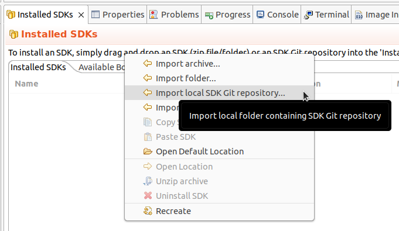

The "Import SDK Git" window will open. The "Repository location" text field
should point to the west workspace
(third_party/nxp/nxp_matter_support/github_sdk/common_sdk/repo subfolder of the
Matter repository). The "Manifest(s) folder" text field should point to its core
subfolder (third_party/nxp/nxp_matter_support/github_sdk/common_sdk/repo/core
subfolder of the Matter repository). Click "OK" and wait for MCUXpresso IDE to
import the SDK.

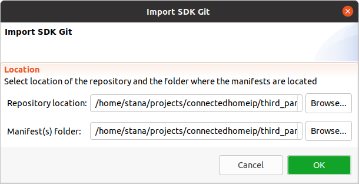

Finally select the desired board's SDK manifest in the "Installed SDKs" tab.

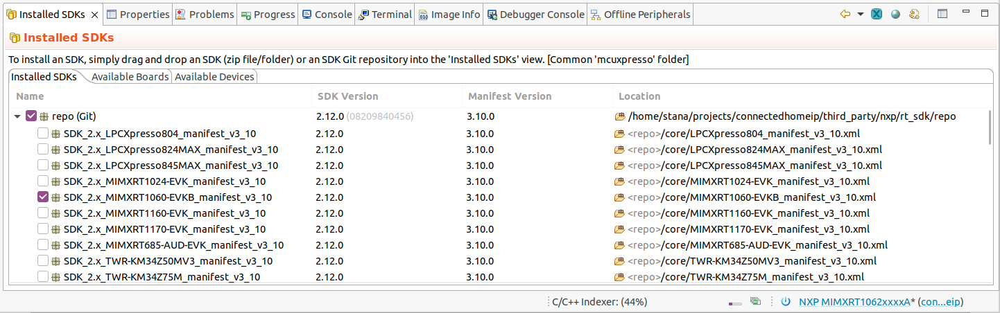

-   Import the connectedhomeip repo in MCUXpresso IDE as Makefile Project. Use
    _none_ as _Toolchain for Indexer Settings_:

```
File -> Import -> C/C++ -> Existing Code as Makefile Project
```

-   Configure MCU Settings:

```
Right click on the Project -> Properties -> C/C++ Build -> MCU Settings -> Select MIMXRT1060 -> Apply & Close
```

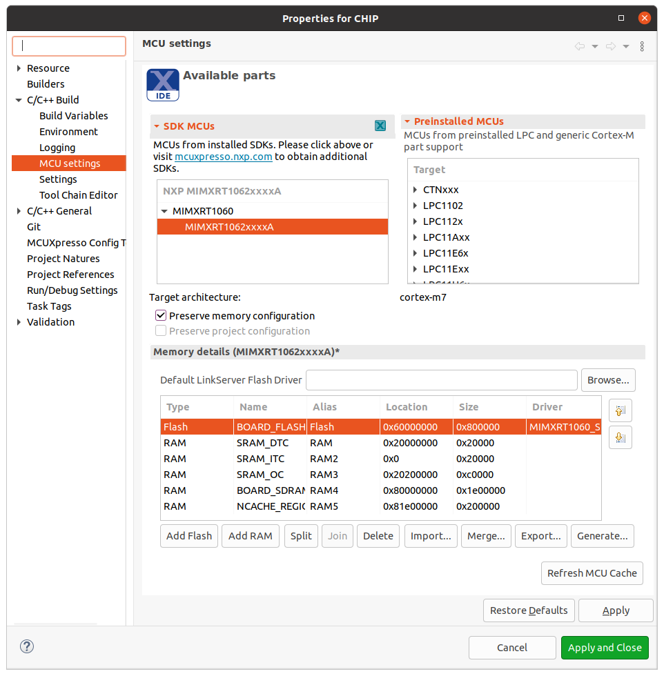

Sometimes when the MCU is selected it will not initialize all the memory regions
(usually the `BOARD_FLASH`, `BOARD_SDRAM` and `NCACHE_REGION`) so it is required
that this regions are added manually like in the image above. In addition to
that on the `BOARD_FLASH` line, in the driver tab:

```
click inside the tab and on the right side a button with three horizontal dots will appear
click on the button and an window will show
form the dropdown menu select the MIMXRT1060_SFDP_QSPI driver
```

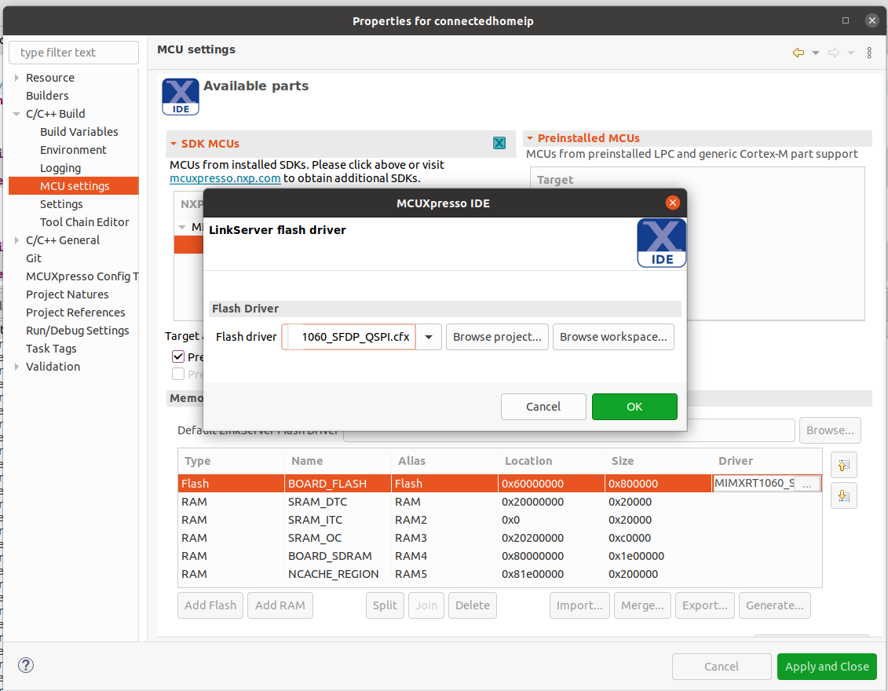

-   Configure the toolchain editor:

```
Right click on the Project -> C/C++ Build-> Tool Chain Editor -> NXP MCU Tools -> Apply & Close
```

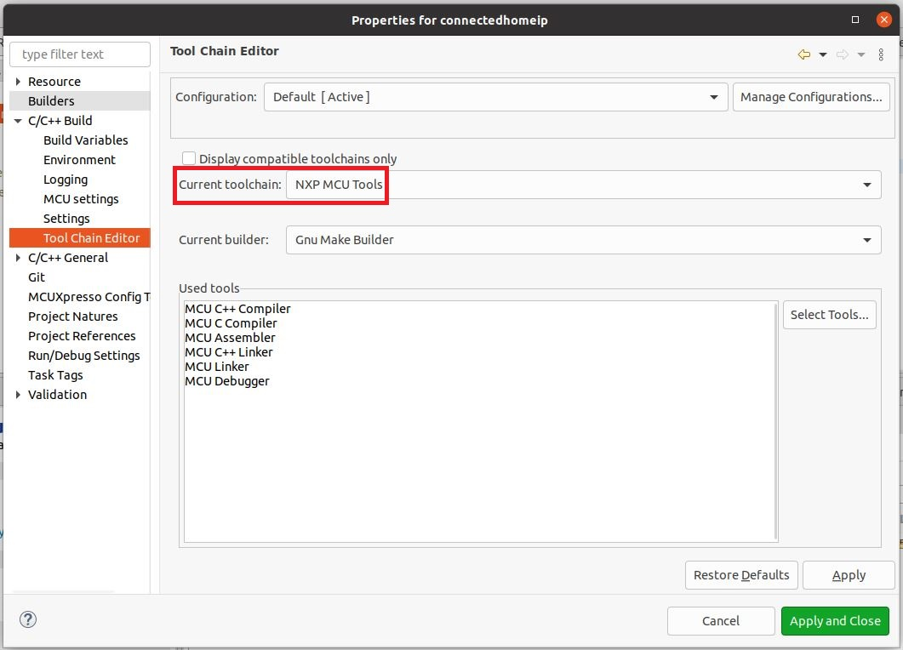

-   Create a debug configuration:

```
Right click on the Project -> Debug -> As->MCUXpresso IDE LinkServer (inc. CMSIS-DAP) probes -> OK -> Select elf file
```

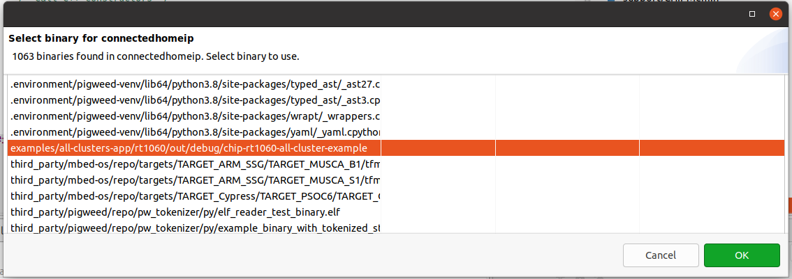

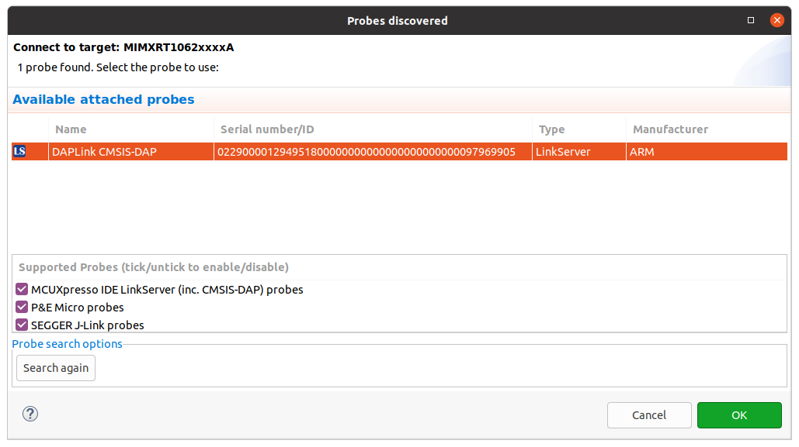

-   Set the _Connect script_ for the debug configuration to _RT1060_connect.scp_
    from the dropdown list:

```
Right click on the Project -> Debug As -> Debug configurations... -> LinkServer Debugger
```

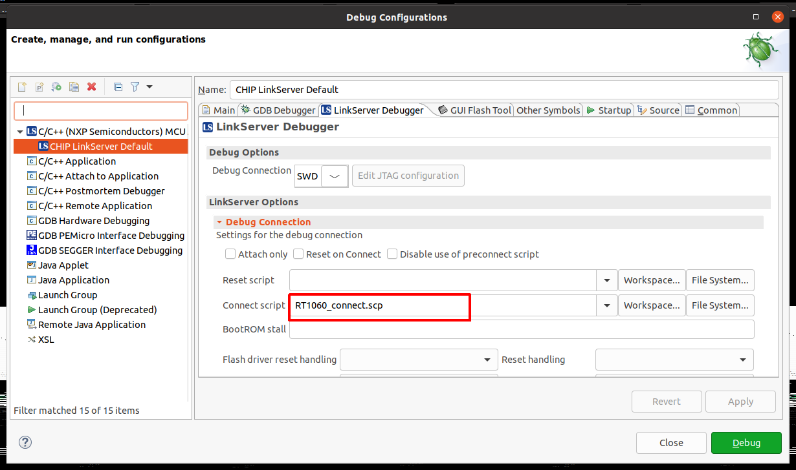

-   Set the _Initialization Commands_ to:

```
Right click on the Project -> Debug As -> Debug configurations... -> Startup

set non-stop on
set pagination off
set mi-async
set remotetimeout 60000
##target_extended_remote##
set mem inaccessible-by-default ${mem.access}
mon ondisconnect ${ondisconnect}
set arm force-mode thumb
${load}
```


-   Set the _vector.catch_ value to _false_ inside the .launch file:

```
Right click on the Project -> Utilities -> Open Directory Browser here -> edit *.launch file:

<booleanAttribute key="vector.catch" value="false"/>

```

-   Debug using the newly created configuration file:

<a name="testing-the-example"></a>

## Testing the example

To know how to commission a device over BLE, follow the instructions from
[chip-tool's README.md 'Commission a device over
BLE'][readme_ble_commissioning_section].

[readme_ble_commissioning_section]:
    ../../../../chip-tool/README.md#commission-a-device-over-ble

To know how to commissioning a device over IP, follow the instructions from
[chip-tool's README.md 'Pair a device over
IP'][readme_pair_ip_commissioning_section]

[readme_pair_ip_commissioning_section]:
    ../../../../chip-tool/README.md#pair-a-device-over-ip

#### Matter over wifi configuration :

The "ble-wifi" pairing method can be used in order to commission the device.

#### Matter over thread configuration :

The "ble-thread" pairing method can be used in order to commission the device.

#### Matter over wifi with openthread border router configuration :

In order to create or join a Thread network on the Matter Border Router, the TBR
management cluster or the `otcli` commands from the matter CLI can be used. For
more information about using the TBR management cluster follow instructions from
['Using the TBR management cluster'](../../../../../docs/platforms/nxp/nxp_otbr_guide.md#using-the-thread-border-router-management-cluster).
For more information about using the matter shell, follow instructions from
['Testing the all-clusters application with Matter CLI'](#testing-the-all-clusters-application-with-matter-cli-enabled).

In this configuration, the device can be commissioned over Wi-Fi with the
'ble-wifi' or 'onnetwork' pairing method.

### Testing the all-clusters application without Matter CLI:

1. Prepare the board with the flashed `All-cluster application` (as shown
   above).
2. The All-cluster example uses UART1 to print logs while running the server. To
   view raw UART output, start a terminal emulator like PuTTY and connect to the
   used COM port with the following UART settings:

    - Baud rate: 115200
    - 8 data bits
    - 1 stop bit
    - No parity
    - No flow control

3. Open a terminal connection on the board and watch the printed logs.

4. On the client side, start sending commands using the chip-tool application as
   it is described
   [here](../../../../chip-tool/README.md#using-the-client-to-send-matter-commands).

### Testing the all-clusters application with Matter CLI enabled:

The Matter CLI can be enabled with the all-clusters application.

For more information about the Matter CLI default commands, you can refer to the
dedicated [ReadMe](../../../../shell/README.md).

The All-clusters application supports additional commands :

```
> help
[...]
mattercommissioning     Open/close the commissioning window. Usage : mattercommissioning [on|off]
matterfactoryreset      Perform a factory reset on the device
matterreset             Reset the device
```

-   `matterfactoryreset` command erases the file system completely (all Matter
    settings are erased).
-   `matterreset` enables the device to reboot without erasing the settings.

Here are described steps to use the all-cluster-app with the Matter CLI enabled

1. Prepare the board with the flashed `All-cluster application` (as shown
   above).
2. The matter CLI is accessible in UART1. For that, start a terminal emulator
   like PuTTY and connect to the used COM port with the following UART settings:

    - Baud rate: 115200
    - 8 data bits
    - 1 stop bit
    - No parity
    - No flow control

3. The All-cluster example uses UART2 to print logs while running the server. To
   view raw UART output, a pin should be plugged to an USB to UART adapter
   (connector J16 pin 7 in case of MIMXRT1060-EVK-B board or connector J22 pin 7
   in case of MIMXRT1060-EVK board), then start a terminal emulator like PuTTY
   and connect to the used COM port with the following UART settings:

    - Baud rate: 115200
    - 8 data bits
    - 1 stop bit
    - No parity
    - No flow control

4. On the client side, start sending commands using the chip-tool application as
   it is described
   [here](../../../../chip-tool/README.md#using-the-client-to-send-matter-commands).

For Matter with OpenThread Border Router support, the matter CLI can be used to
start/join the Thread network, using the following ot-cli commands. (Note that
setting channel, panid, and network key is not enough anymore because of an Open
Thread stack update. We first need to initialize a new dataset.)

```
> otcli dataset init new
Done
> otcli dataset
Active Timestamp: 1
Channel: 25
Channel Mask: 0x07fff800
Ext PAN ID: 42af793f623aab54
Mesh Local Prefix: fd6e:c358:7078:5a8d::/64
Network Key: f824658f79d8ca033fbb85ecc3ca91cc
Network Name: OpenThread-b870
PAN ID: 0xb870
PSKc: f438a194a5e968cc43cc4b3a6f560ca4
Security Policy: 672 onrc 0
Done
> otcli dataset panid 0xabcd
Done
> otcli dataset channel 25
Done
> otcli dataset commit active
Done
> otcli ifconfig up
Done
> otcli thread start
Done
> otcli state
leader
Done
```

<a name="thread-border-router-overview"></a>

## Thread Border Router overview

To enable Thread Border Router support see the [build](README.md#building)
section.

The complete Border Router guide is located
[here](../../../../../docs/platforms/nxp/nxp_otbr_guide.md).
