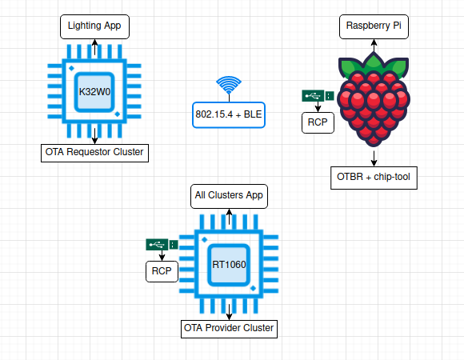

# OTA provider feature for Matter over Openthread - WARNING NOT SUPPORTED

### OTA Provider Feature

The following process describes how to do a firmware update over Matter for a K32W0x1 device running the Lighting app, using as firmware provider a RT1060 Host + K32W0x1 RCP running the All Cluster App.
The OTA topology used for OTA testing is illustrated in the figure below.



The concept for OTA is the next one:

-   the OTA Provider functionality is embedded inside the All Clusters Application.
    It will be used for sending the OTA blocks to the OTA Requestor;
-   the OTA Requestor functionality is embedded inside the Lighting Application.
    It will be used for requesting OTA blocks from the OTA Provider;
-   the controller (a linux application called chip-tool) will be used for
    commissioning both the devices, the one with the OTA Provider Cluster
    and the one with the OTA Requestor Cluster. The devices will be commissioned 
    using the standard Matter flow (BLE + IEEE 802.15.4);
-   during commissioning, each device is assigned a node id by the chip-tool
    (can be specified manually by the user) and chip-tool triggers the OTA 
    transfer by invoking the _announce-ota-provider_ command - basically, 
    the OTA Requestor is informed of the node id of the OTA Provider.

Build OTA image and add it the All Clusters App:

```
user@ubuntu:~/Desktop/git/connectedhomeip/$ ./scripts/tools/nxp/ota/ota_image_tool.py create -v 0xDEAD -p 0xBEEF -vn 42021 -vs "1.0" -da sha256 --app-input-file chip-k32w0x-light-example.bin ota-fw-placeholder.bin
user@ubuntu:~/Desktop/git/connectedhomeip/$ xxd -i ota-fw-placeholder.bin > ota-fw-placeholder.bin.h
user@ubuntu:~/Desktop/git/connectedhomeip/$ sed -i 's/unsigned/const unsigned/g' ota-fw-placeholder.bin.h
user@ubuntu:~/Desktop/git/connectedhomeip/$ mv ota-fw-placeholder.bin.h ./examples/all-clusters-app/nxp/rt/rt1060/ota_provider/include
```

Build the RT1060 All Cluster App, containing the OTA Provider and the newly added Lighting App Firmware:

```
user@ubuntu:~/Desktop/git/connectedhomeip/examples/all-clusters-app/nxp/rt/rt1060$ gn gen --args="chip_enable_openthread=true k32w0_transceiver=true chip_inet_config_enable_ipv4=false chip_config_network_layer_ble=true hci_spinel_single_uart=true is_debug=true optimize_debug=false enable_ota_provider=true" out/debug
user@ubuntu:~/Desktop/git/connectedhomeip/examples/all-clusters-app/nxp/rt/rt1060$ ninja -C out/debug
```

Provision the device containing the OTA Provider and assign node id _1_. Also, grant ACL
entries to allow OTA requestors:

```
user@computer1:~/connectedhomeip$ : ./out/chip-tool-app/chip-tool pairing ble-thread 1 hex:<operationalDataset> 20202021 3840
user@computer1:~/connectedhomeip$ : ./out/chip-tool-app/chip-tool accesscontrol write acl '[{"fabricIndex": 1, "privilege": 5, "authMode": 2, "subjects": [112233], "targets": null}, {"fabricIndex": 1, "privilege": 3, "authMode": 2, "subjects": null, "targets": null}]' 1 0
```

Provision the device containing the OTA Requestor and assign node id _2_:

```
user@computer1:~/connectedhomeip$ : ./out/chip-tool-app/chip-tool pairing ble-thread 2 hex:<operationalDataset> 20202021 3840
```

Start the OTA process:

```
user@computer1:~/connectedhomeip$ : ./out/chip-tool-app/chip-tool otasoftwareupdaterequestor announce-otaprovider 1 0 0 0 2 0
```