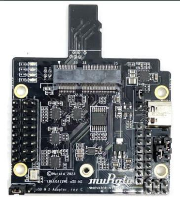
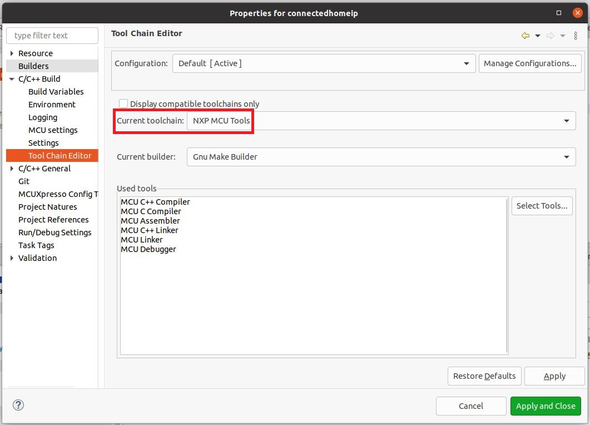

# CHIP RT1170 All-clusters Application

The all-clusters example implements a server which can be accessed by a CHIP
controller and can accept basic cluster commands.

The example is based on
[Project CHIP](https://github.com/project-chip/connectedhomeip) and the NXP
RT1170 SDK, and provides a prototype application that demonstrates device
commissioning and different cluster control.

<hr>

-   [CHIP RT1170 All-clusters Application](#chip-rt1170-all-clusters-application)
    -   [Introduction](#introduction)
        -   [Configuration(s) supported](#configurations-supported)
        -   [Hardware requirements for RT1170 + IW612](#hardware-requirements-for-rt1170--iw612)
            -   [Hardware rework for SPI support on MIMXRT1170-EVK-B](#hardware-rework-for-spi-support-on-mimxrt1170-evk-b)
            -   [Board settings (Spinel over SPI, I2C, BLE over UART)](#board-settings-spinel-over-spi-i2c-ble-over-uart)
    -   [Building](#building)
        -   [Building with Matter over Wifi configuration on RT1170 + IW612](#building-with-matter-over-wifi-configuration-on-rt1170--iw612)
        -   [Building with Matter over Thread configuration on RT1170 + IW612](#building-with-matter-over-thread-configuration-on-rt1170--iw612)
        -   [Building with Matter over Wifi + OpenThread Border Router configuration on RT1170 + IW612](#building-with-matter-over-wifi--openthread-border-router-configuration-on-rt1170--iw612)
        -   [General information](#general-information)
    -   [Manufacturing data](#manufacturing-data)
    -   [Flashing and debugging](#flashing-and-debugging)
    -   [Testing the example](#testing-the-example)
        -   [Matter over wifi configuration :](#matter-over-wifi-configuration-)
        -   [Matter over thread configuration :](#matter-over-thread-configuration-)
        -   [Matter over wifi with openthread border router configuration :](#matter-over-wifi-with-openthread-border-router-configuration-)
        -   [Testing the all-clusters application without Matter CLI:](#testing-the-all-clusters-application-without-matter-cli)
        -   [Testing the all-clusters application with Matter CLI enabled:](#testing-the-all-clusters-application-with-matter-cli-enabled)
    -   [Thread Border Router overview](#thread-border-router-overview)
        <hr>

## Introduction


The RT1170 all-cluster application provides a working demonstration of the
RT1170 board integration, built using the Project CHIP codebase and the NXP
RT1170 SDK.

The example supports:

-   Matter over Wi-Fi
-   Matter over Openthread
-   Matter over Wi-Fi with Openthread Border Router support

The example targets the
[NXP MIMXRT1170-EVKB](https://www.nxp.com/part/MIMXRT1170-EVKB#/) board by
default.

### Configuration(s) supported

Here are listed configurations that allow to support Matter over Wi-Fi & Matter
over Thread on RT1170 :

-   RT1170 + IW612 (Wi-Fi + BLE + 15.4)

### Hardware requirements for RT1170 + IW612

Host part:

-   1 MIMXRT1170-EVK-B

Transceiver part :

-   1
    [2EL M2 A1 IW612 Secure Module](https://www.nxp.com/products/wireless/wi-fi-plus-bluetooth-plus-802-15-4/2-4-5-ghz-dual-band-1x1-wi-fi-6-802-11ax-plus-bluetooth-5-2-plus-802-15-4-tri-radio-solution:IW612)


-   1
    [Murata uSD to M2 adapter revC](https://www.murata.com/en-eu/products/connectivitymodule/wi-fi-bluetooth/overview/lineup/usd-m2-adapter-2we-2wf)



-   Male to female Burg cables

#### Hardware rework for SPI support on MIMXRT1170-EVK-B

To support SPI on the MIMXRT1170-EVK-B board, it is required to remove 0Ω
resistors R404,R406,R2015.

#### Board settings (Spinel over SPI, I2C, BLE over UART)

Plug IW612 module to M.2 connector on Murata uSD to M2 adapter

The Murata uSD-M2 adapter should be plugged to the RT1170 via SD-IO.

The below tables explain pin settings (SPI settings) to connect the
MIMXRT1170-EVK-B (host) to a IW612 transceiver (rcp).

-   Murata uSD to M2 adapter connections description:


-   Jumpers positions on Murata uSD to M2 adapter:

    Use USB-C power supply | Jumper | Position| | :----: | :-----: | | J1 | 1-2
    | | J12 | 1-2 | | J13 | 1-2 | | J14 | 1-2 | | JP1.1 (back side)| ON |

-   Jumpers positions on MIMXRT1170-EVK-B:

    | Jumper | Position |
    | :----: | :------: |
    | `J56`  |  `2-3`   |

-   I2C connection to program `IO_Expander` on the IW612 module

    |  MIMXRT1170-EVK-B  | uSD-M2 adapter |
    | :----------------: | :------------: |
    | `I2C_SDA (J10.18)` |     `J5.2`     |
    | `I2C_SDL (J10.20)` |     `J5.4`     |

-   SPI connection between RT1170 and uSD-M2 adapter

    |  MIMXRT1170-EVK-B   | uSD-M2 adapter |
    | :-----------------: | :------------: |
    | `SPI_MOSI (J10.8)`  |    `J5.10`     |
    | `SPI_MISO (J10.10)` |     `J9.7`     |
    | `SPI_CLK (J10.12)`  |     `J9.8`     |
    |  `SPI_CS (J10.6)`   |     `J5.8`     |
    |  `SPI_INT (J26.4)`  |     `J5.6`     |
    |   `GND (J10.14)`    |    `J5.15`     |

-   UART BLE and Reset connections between RT1170 and uSD-M2 adapter

    |  MIMXRT1170-EVK-B   | uSD-M2 adapter |
    | :-----------------: | :------------: |
    |   `RESET (J26.2)`   |     `J9.3`     |
    | `UART_RXD (J25.13)` |     `J9.1`     |
    | `UART_TXD (J25.15)` |     `J9.2`     |
    | `UART_CTS (J25.9)`  |     `J8.4`     |
    | `UART_RTS (J25.11)` |     `J8.3`     |
    |    `GND (J26.1)`    |     `J7.6`     |

## Building

In order to build the Project CHIP example, we recommend using a Linux
distribution. Supported Operating Systems are listed in
[BUILDING.md](../../../../../docs/guides/BUILDING.md).

-   Make sure that below prerequisites are correctly installed, as described in
    [BUILDING.md](../../../../../docs/guides/BUILDING.md).

```
sudo apt-get install git gcc g++ pkg-config libssl-dev libdbus-1-dev \
     libglib2.0-dev libavahi-client-dev ninja-build python3-venv python3-dev \
     python3-pip unzip libgirepository1.0-dev libcairo2-dev libreadline-dev
```

-   Step 1: checkout NXP specific submodules only

```
user@ubuntu:~/Desktop/git/connectedhomeip$ scripts/checkout_submodules.py --shallow --platform nxp --recursive
```

-   Step 2: activate local environment

```
user@ubuntu:~/Desktop/git/connectedhomeip$ source scripts/activate.sh
```

If the script says the environment is out of date, you can update it by running
the following command:

```
user@ubuntu:~/Desktop/git/connectedhomeip$ source scripts/bootstrap.sh
```

-   Step 3: Init NXP SDK(s)

```
user@ubuntu:~/Desktop/git/connectedhomeip$ third_party/nxp/nxp_matter_support/scripts/update_nxp_sdk.py --platform common
```

Note: By default update_nxp_sdk.py will try to initialize all NXP SDKs. Arg "--
help" could be used to view all available options.

```
user@ubuntu:~/Desktop/git/connectedhomeip$ cd examples/all-cluster-app/nxp/rt/rt1170/
```

### Building with Matter over Wifi configuration on RT1170 + IW612

-   Build the Wi-fi configuration for MIMXRT1170 board + IW612 transceiver (with
    BLE for commissioning).

```
user@ubuntu:~/Desktop/git/connectedhomeip/examples/all-clusters-app/nxp/rt/rt1170$ gn gen --args="chip_enable_wifi=true iwx12_transceiver=true chip_config_network_layer_ble=true chip_enable_ble=true " out/debug
user@ubuntu:~/Desktop/git/connectedhomeip/examples/all-clusters-app/nxp/rt/rt1170$ ninja -C out/debug
```

### Building with Matter over Thread configuration on RT1170 + IW612

-   Build the Openthread configuration for MIMXRT1170 board + IW612 transceiver
    (with BLE for commissioning).

```
user@ubuntu:~/Desktop/git/connectedhomeip/examples/all-cluster/nxp/rt/rt1170$ gn gen --args="chip_enable_openthread=true iwx12_transceiver=true chip_inet_config_enable_ipv4=false chip_config_network_layer_ble=true" out/debug
user@ubuntu:~/Desktop/git/connectedhomeip/examples/all-cluster/nxp/rt/rt1170/$ ninja -C out/debug
```

### Building with Matter over Wifi + OpenThread Border Router configuration on RT1170 + IW612

This configuration supports the Thread Border Router management cluster to
provision the Thread credentials. Enabling the Matter CLI in order to control
the Thread network on the Border Router is optional but recommended for other
features like the Thread credential sharing.

Note that the Thread Border Router management cluster is only supported on the
thermostat application for now.

-   Build Matter with Border Router configuration with BLE commissioning
    (ble-wifi) :

```
user@ubuntu:~/Desktop/git/connectedhomeip/examples/all-clusters-app/nxp/rt/rt11170$ gn gen --args="chip_enable_wifi=true iwx12_transceiver=true chip_config_network_layer_ble=true chip_enable_ble=true chip_enable_openthread=true nxp_enable_matter_cli=true" out/debug
user@ubuntu:~/Desktop/git/connectedhomeip/examples/all-clusters-app/nxp/rt/rt1170$ ninja -C out/debug
```

### General information

The resulting output file can be found in
out/debug/chip-rt1170-all-cluster-example.

Optional GN options that can be added when building an application:

-   To enable the
    [secondary network commissioning interface](../../../../../docs/platforms/nxp/nxp_otbr_guide.md#using-the-secondary-network-commissioning-interface),
    the arguments `chip_enable_secondary_nwk_if=true` and
    `chip_device_config_thread_network_endpoint_id=3` must be added to the _gn
    gen_ command. Note that this is only supported when building the Matter over
    Wifi + OpenThread Border Router configuration. Note that is only supported
    on the on the thermostat application for now.
-   To enable the
    [matter CLI](#testing-the-all-clusters-application-with-matter-cli-enabled),
    the argument `nxp_enable_matter_cli=true` must be added to the _gn gen_
    command.
-   To build the application in debug mode, the argument
    `is_debug=true optimize_debug=false` must be added to the _gn gen_ command.
-   To build with the option to have Matter certificates/keys pre-loaded in a
    specific flash area the argument `nxp_use_factory_data=true` must be added
    to the _gn gen_ command. For more information, see
    [Guide for writing manufacturing data on NXP devices](../../../../../docs/platforms/nxp/nxp_manufacturing_flow.md)
-   To build the application with the OTA Requestor enabled, the arguments
    `chip_enable_ota_requestor=true no_mcuboot=false` must be added to the _gn
    gen_ command. More information about the OTA Requestor feature in
    [OTA Requestor README](../../../../../docs/platforms/nxp/nxp_RTs_ota_software_update.md).

## Manufacturing data

See
[Guide for writing manufacturing data on NXP devices](../../../../../docs/platforms/nxp/nxp_manufacturing_flow.md)

Other comments:

The all cluster app demonstrates the usage of encrypted Matter manufacturing
data storage. Matter manufacturing data should be encrypted using an AES 128
software key before flashing them to the device flash.

## Flashing and debugging

In order to flash the application we recommend using
[MCUXpresso IDE (version >= 11.5.0)](https://www.nxp.com/design/software/development-software/mcuxpresso-software-and-tools-/mcuxpresso-integrated-development-environment-ide:MCUXpresso-IDE).

-   Import the previously downloaded NXP SDK into MCUXpresso IDE. This can be
    done by drag-and-dropping the SDK archive into MCUXpresso IDE "Installed
    SDKs" tab;
    
-   Import the connectedhomeip repo in MCUXpresso IDE as Makefile Project. Use
    _none_ as _Toolchain for Indexer Settings_:

```
File -> Import -> C/C++ -> Existing Code as Makefile Project
```

-   Configure MCU Settings:

```
Right click on the Project -> Properties -> C/C++ Build -> MCU Settings -> Select MIMXRT1170 -> Apply & Close
```


Sometimes when the MCU is selected it will not initialize all the memory regions
(usually the `BOARD_FLASH`, `BOARD_SDRAM` and `NCACHE_REGION`) so it is required
that this regions are added manually like in the image above. In addition to
that on the `BOARD_FLASH` line, in the driver tab:

```
click inside the tab and on the right side a button with three horizontal dots will appear
click on the button and an window will show
form the dropdown menu select the MIMXRT1170_SFDP_QSPI driver
```


-   Configure the toolchain editor:

```
Right click on the Project -> C/C++ Build-> Tool Chain Editor -> NXP MCU Tools -> Apply & Close
```



-   Create a debug configuration:

    MIMXRT1170-EVK-B board supports CMSIS-DAP debug protocol by default. It
    should be switched to JLink.

    -   download and install
        [MCU-LINK_INSTALLER 2.263](https://www.nxp.com/webapp/Download?colCode=MCU-LINK_INSTALLER_2.263_LIN)
    -   connect jumper JP3 to get board in ISP mode when powered
    -   connect board and run installed MCU-LINK, follow steps to flash JLINK
        firmware
    -   remove jumper JP3 and reboot board

```
Right click on the Project -> Debug -> As->SEGGER J-Link probes -> OK -> Select elf file
```


-   Set the _Initialization Commands_ to:

```
Right click on the Project -> Debug As -> Debug configurations... -> Startup

set non-stop on
set pagination off
set mi-async
set remotetimeout 60000
##target_extended_remote##
set mem inaccessible-by-default ${mem.access}
mon ondisconnect ${ondisconnect}
set arm force-mode thumb
${load}
```


-   Set the _vector.catch_ value to _false_ inside the .launch file:

```
Right click on the Project -> Utilities -> Open Directory Browser here -> edit .launch file:

<booleanAttribute key="vector.catch" value="false"/>

```

-   Debug using the newly created configuration file:

## Testing the example

To know how to commission a device over BLE, follow the instructions from
[chip-tool's README.md 'Commission a device over
BLE'][readme_ble_commissioning_section].

[readme_ble_commissioning_section]:
    ../../../../chip-tool/README.md#commission-a-device-over-ble

To know how to commissioning a device over IP, follow the instructions from
[chip-tool's README.md 'Pair a device over
IP'][readme_pair_ip_commissioning_section]

[readme_pair_ip_commissioning_section]:
    ../../../../chip-tool/README.md#pair-a-device-over-ip

#### Matter over wifi configuration :

The "ble-wifi" pairing method can be used in order to commission the device.

#### Matter over thread configuration :

The "ble-thread" pairing method can be used in order to commission the device.

#### Matter over wifi with openthread border router configuration :

In order to create or join a Thread network on the Matter Border Router, the TBR
management cluster or the `otcli` commands from the matter CLI can be used. For
more information about using the TBR management cluster follow instructions from
['Using the TBR management cluster'](../../../../../docs/platforms/nxp/nxp_otbr_guide.md#using-the-thread-border-router-management-cluster).
For more information about using the matter shell, follow instructions from
['Testing the all-clusters application with Matter CLI'](#testing-the-all-clusters-application-with-matter-cli-enabled).

In this configuration, the device can be commissioned over Wi-Fi with the
'ble-wifi' pairing method.

### Testing the all-clusters application without Matter CLI:

1. Prepare the board with the flashed `All-cluster application` (as shown
   above).
2. The All-cluster example uses UART1 to print logs while running the server. To
   view raw UART output, start a terminal emulator like PuTTY and connect to the
   used COM port with the following UART settings:

    - Baud rate: 115200
    - 8 data bits
    - 1 stop bit
    - No parity
    - No flow control

3. Open a terminal connection on the board and watch the printed logs.

4. On the client side, start sending commands using the chip-tool application as
   it is described
   [here](../../../../chip-tool/README.md#using-the-client-to-send-matter-commands).

### Testing the all-clusters application with Matter CLI enabled:

Testing the all-clusters application with Matter CLI enabled:

The Matter CLI can be enabled with the all-clusters application.

For more information about the Matter CLI default commands, you can refer to the
dedicated [ReadMe](../../../../shell/README.md).

The All-clusters application supports additional commands :

```
> help
[...]
mattercommissioning     Open/close the commissioning window. Usage : mattercommissioning [on|off]
matterfactoryreset      Perform a factory reset on the device
matterreset             Reset the device
```

-   `matterfactoryreset` command erases the file system completely (all Matter
    settings are erased).
-   `matterreset` enables the device to reboot without erasing the settings.

Here are described steps to use the all-cluster-app with the Matter CLI enabled

1. Prepare the board with the flashed `All-cluster application` (as shown
   above).
2. The matter CLI is accessible in UART1. For that, start a terminal emulator
   like PuTTY and connect to the used COM port with the following UART settings:

    - Baud rate: 115200
    - 8 data bits
    - 1 stop bit
    - No parity
    - No flow control

3. The All-cluster example uses UART2 to print logs while running the server. To
   view raw UART output, a pin should be plugged to an USB to UART adapter
   (connector J9 pin 4), then start a terminal emulator like PuTTY and connect
   to the used COM port with the following UART settings:

    - Baud rate: 115200
    - 8 data bits
    - 1 stop bit
    - No parity
    - No flow control

4. On the client side, start sending commands using the chip-tool application as
   it is described
   [here](../../../../chip-tool/README.md#using-the-client-to-send-matter-commands).

For Matter with OpenThread Border Router support, the matter CLI can be used to
start/join the Thread network, using the following ot-cli commands. (Note that
setting channel, panid, and network key is not enough anymore because of an Open
Thread stack update. We first need to initialize a new dataset.)

```
> otcli dataset init new
Done
> otcli dataset
Active Timestamp: 1
Channel: 25
Channel Mask: 0x07fff800
Ext PAN ID: 42af793f623aab54
Mesh Local Prefix: fd6e:c358:7078:5a8d::/64
Network Key: f824658f79d8ca033fbb85ecc3ca91cc
Network Name: OpenThread-b870
PAN ID: 0xb870
PSKc: f438a194a5e968cc43cc4b3a6f560ca4
Security Policy: 672 onrc 0
Done
> otcli dataset panid 0xabcd
Done
> otcli dataset channel 25
Done
> otcli dataset commit active
Done
> otcli ifconfig up
Done
> otcli thread start
Done
> otcli state
leader
Done
```

## Thread Border Router overview

To enable Thread Border Router support see the [build](README.md#building)
section.

The complete Border Router guide is located
[here](../../../../../docs/platforms/nxp/nxp_otbr_guide.md).
