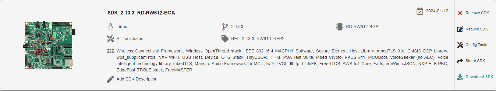

# CHIP RW61x All-clusters Application

The all-clusters example implements a server which can be accessed by a CHIP controller and can accept basic cluster commands.

The example is based on
[Project CHIP](https://github.com/project-chip/connectedhomeip) and the NXP RW612 SDK,
and provides a prototype application that demonstrates device commissioning and different cluster
control.


<hr>

-   [Introduction](#introduction)
-   [Building](#building)
-   [Flashing and debugging](#flashing-and-debugging)
-   [Testing the example](#testing-the-example)
-   [Matter Shell](#testing-the-all-clusters-application-with-matter-cli-enabled)

<hr>

<a name="introduction"></a>

## Introduction

The RW61x all-cluster application provides a working demonstration of the
RW610/RW612 board integration, built using the Project CHIP codebase and the NXP
RW612 SDK. The example supports basic ZCL commands and acts as a thermostat device-type.

The example supports:

- Matter over Wi-Fi. For that follow instructions from [README_Wifi.md][README_Wifi.md].
- Matter over Openthread. For that follow instructions from [README_Openthread.md][README_Openthread.md].

[README_Wifi.md]: README_Wifi.md
[README_Openthread.md]: README_Openthread.md

The example targets the
[`NXP RD-RW610-BGA`] and the [`NXP RD-RW612-BGA`]
boards, with the following configurations :
- RW610 : Matter over Wi-Fi.
- RW612 : Matter over Wi-Fi and Matter over Thread.


<a name="building"></a>

## Building

In order to build the Project CHIP example, we recommend using a Linux
distribution (the demo-application was compiled on Ubuntu 20.04).

- Follow instruction in [BUILDING.md](../../../../../docs/guides/BUILDING.md) to setup the environment to be able to build Matter.

-   Download [RD-RW612 SDK v2.13.1](https://mcuxpresso.nxp.com/en/select).
    Creating an nxp.com account is required before being able to download the
    SDK. Once the account is created, login and follow the steps for downloading
    SDK. The SDK Builder UI selection should be similar with
    the one from the image below. In case you do not have access to the SDK, please ask your NXP representative.

    

    (Note: All SDK components should be selected. If size is an issue Azure RTOS component can be omitted.)

-   Start building the application.

```
user@ubuntu:~/Desktop/git/connectedhomeip$ export NXP_SDK_ROOT=/home/user/Desktop/SDK_RW612/
user@ubuntu:~/Desktop/git/connectedhomeip$ source ./scripts/activate.sh
user@ubuntu:~/Desktop/git/connectedhomeip$ cd examples/all-clusters-app/nxp/rt/rw61x/
```

Optional GN options that can be added when building an application:

- To enable the [matter CLI](README.md#testing-the-all-clusters-application-with-matter-cli-enabled), the argument ```chip_enable_matter_cli=true``` must be added to the *gn gen* command.
- To switch the SDK type used, the argument ```is_<sdk_type>=true``` must be added to the *gn gen* command (with <sdk_type> being either sdk_package or sdk_internal).
- By default, the RW612 A1 board revision will be chosen. To switch to an A0 revision, the argument ```board_version=\"A0\"``` must be added to the *gn gen* command.
- To build the application in debug mode, the argument ```is_debug=true optimize_debug=false``` must be added to the *gn gen* command.
- To build with the option to have Matter certificates/keys pre-loaded in a specific flash area the argument ```chip_with_factory_data=1``` must be added to the *gn gen* command. (for more information see [Guide for writing manufacturing data on NXP devices](../../../../../docs/guides/nxp_manufacturing_flow.md).
- To build the application with the OTA Requestor enabled, the arguments ```chip_enable_ota_requestor=true no_mcuboot=false``` must be added to the *gn gen* command. (More information about the OTA Requestor feature in [OTA Requestor README](README_OTA_Requestor.md)))


## Manufacturing data

See [Guide for writing manufacturing data on NXP devices](../../../../../docs/guides/nxp_manufacturing_flow.md)

Other comments:

The all cluster app demonstrates the usage of encrypted Matter manufacturing data storage. Matter manufacturing data should be encrypted using an AES 128 software key before flashing them to the device flash.

<a name="flashing-and-debugging"></a>

## Flashing and debugging
### Flashing the All-Clusters application

In order to flash the application we recommend using
[MCUXpresso IDE (version >= 11.6.0)](https://www.nxp.com/design/software/development-software/mcuxpresso-software-and-tools-/mcuxpresso-integrated-development-environment-ide:MCUXpresso-IDE).

- Import the previously downloaded NXP SDK into MCUXpresso IDE.

Right click the empty space in the MCUXpresso IDE "Installed SDKs" tab to show the menu, select the "Import archive" (or "Import folder" if a folder is used) menu item.


-   Import the connectedhomeip repo in MCUXpresso IDE as Makefile Project. Use _none_ as _Toolchain for Indexer Settings_:

```
File -> Import -> C/C++ -> Existing Code as Makefile Project
```

- Configure MCU Settings:

```
Right click on the Project -> Properties -> C/C++ Build -> MCU Settings -> Select RW612 -> Apply & Close
```


- Configure the toolchain editor:

```
Right click on the Project -> C/C++ Build-> Tool Chain Editor -> NXP MCU Tools -> Apply & Close
```


- Create a debug configuration :

```
Right click on the Project -> Debug -> As->SEGGER JLink probes -> OK -> Select elf file
```
(Note : if SDK package is used, a simpler way could be duplicating the debug configuration from the SDK Hello World example after importing it.)

- Debug using the newly created configuration file.

<a name="testing-the-example"></a>

## Testing the example

To know how to commission a device over BLE, follow the instructions from [chip-tool's README.md 'Commission a device over BLE'][readme_ble_commissioning_section].

[readme_ble_commissioning_section]:../../../../chip-tool/README.md#commission-a-device-over-ble

To know how to commissioning a device over IP, follow the instructions from [chip-tool's README.md 'Pair a device over IP'][readme_pair_ip_commissioning_section]

[readme_pair_ip_commissioning_section]: ../../../../chip-tool/README.md#pair-a-device-over-ip

### Testing the all-clusters application without Matter CLI:

1. Prepare the board with the flashed `All-cluster application` (as shown above).
2. The All-cluster example uses UART1 (`FlexComm3`) to print logs while running the server. To view raw UART output, start a terminal emulator like PuTTY and connect to the used COM port with the following UART settings:

   - Baud rate: 115200
   - 8 data bits
   - 1 stop bit
   - No parity
   - No flow control

3. Open a terminal connection on the board and watch the printed logs.

4. On the client side, start sending commands using the chip-tool application as it is described [here](../../../../chip-tool/README.md#using-the-client-to-send-matter-commands).

<a name="testing-the-all-clusters-application-with-matter-cli-enabled"></a>
### Testing the all-clusters application with Matter CLI enabled:

The Matter CLI can be enabled with the all-clusters application.

For more information about the Matter CLI default commands, you can refer to the dedicated [ReadMe](../../../../shell/README.md).

The All-clusters application supports additional commands :
```
> help
[...]
mattercommissioning     Open/close the commissioning window. Usage : mattercommissioning [on|off]
matterfactoryreset      Perform a factory reset on the device
matterreset             Reset the device
```
- ```matterfactoryreset``` command erases the file system completely (all Matter settings are erased).
- ```matterreset``` enables the device to reboot without erasing the settings.

Here are described steps to use the all-cluster-app with the Matter CLI enabled

1. Prepare the board with the flashed `All-cluster application` (as shown above).
2. The matter CLI is accessible in UART1. For that, start a terminal emulator like PuTTY and connect to the used COM port with the following UART settings:

   - Baud rate: 115200
   - 8 data bits
   - 1 stop bit
   - No parity
   - No flow control

3. The All-cluster example uses UART2 (`FlexComm0`) to print logs while running the server. To view raw UART output, a pin should be plugged to an USB to UART adapter (connector `HD2 pin 03`), then start a terminal emulator like PuTTY and connect to the used COM port with the following UART settings:

   - Baud rate: 115200
   - 8 data bits
   - 1 stop bit
   - No parity
   - No flow control

4. On the client side, start sending commands using the chip-tool application as it is described [here](../../../../chip-tool/README.md#using-the-client-to-send-matter-commands).