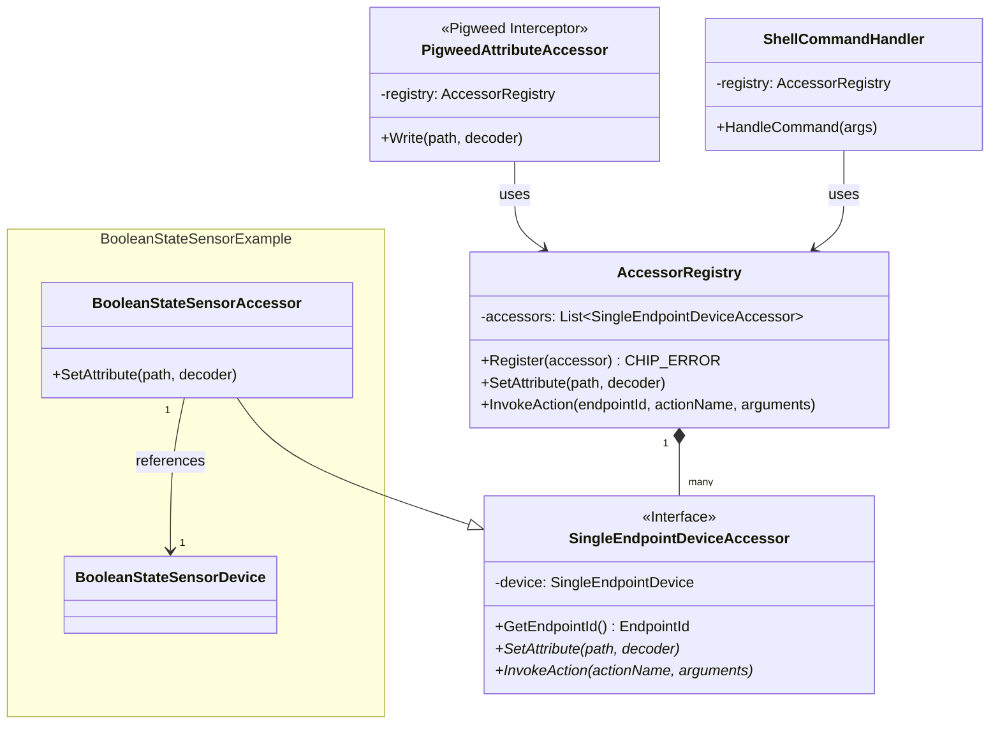

# Out-of-Band (OOB) Control and Simulation Accessors

This directory contains the Out-of-Band (OOB) control and simulation framework
for the `all-devices-app`.

The framework provides a generic interface for simulating physical events or
writing to read-only attributes on simulated devices, decoupling the core device
logic from specific transport protocols (like Pigweed RPC or Shell commands).

## Architecture Overview

The framework consists of a central `AccessorRegistry` that manages a list of
`SingleEndpointDeviceAccessor` instances. External interfaces (such as Pigweed
RPC services or CLI shell handlers) route requests through the registry, which
forwards them to the appropriate accessor based on the target Endpoint ID.



## Core Interfaces

### Attribute Writes (`SetAttribute`)

Concrete accessors can intercept write requests for attributes (including
read-only attributes) on their endpoint by overriding:

```cpp
virtual CHIP_ERROR SetAttribute(const ConcreteDataAttributePath & path, AttributeValueDecoder & decoder);
```

-   **Contract**:
    -   Return `CHIP_NO_ERROR` on success (the implementation MUST decode the
        value using `decoder.Decode()`).
    -   Return `CHIP_ERROR_NOT_IMPLEMENTED` if the attribute is not handled by
        this accessor, allowing the registry to fall back to the default data
        model write path.
    -   Return other `CHIP_ERROR` codes on actual failure to apply the value,
        which blocks fallback and returns the error to the client.

### Custom Actions (`InvokeAction`)

For simulations that do not map directly to simple attribute writes (e.g.,
simulating a sensor obstruction or physical tampering), accessors implement:

```cpp
virtual CHIP_ERROR InvokeAction(CharSpan actionName, chip::TLV::TLVReader & arguments);
```

-   **`actionName`**: The name of the custom action to perform, passed as a
    `CharSpan` for efficiency.
-   **`arguments`**: A `TLVReader` containing the arguments for the action,
    allowing arbitrary payload structures (integers, strings, structures, lists)
    to be passed to the simulation.

## Memory Management

-   **Intrusive List**: The `AccessorRegistry` stores accessors using a
    `chip::IntrusiveList`, avoiding dynamic memory allocations for list nodes.
-   **Auto-Unlink**: `SingleEndpointDeviceAccessor` inherits from
    `IntrusiveListNodeBase<IntrusiveMode::AutoUnlink>`. When an accessor is
    destroyed, it automatically removes itself from the registry, preventing
    dangling pointers.

## Build Configuration

The OOB Accessor framework can be enabled or disabled at compile time:

-   **GN Argument**: `chip_all_devices_app_enable_oob_accessors` (defined in
    `accessors.gni`, defaults to `true`).
-   **Preprocessor Macro**: `CHIP_ALL_DEVICES_APP_ENABLE_OOB_ACCESSORS` is
    defined as `1` when enabled.

When disabled, accessor source files are not compiled, and all integration code
in the application startup is conditionally excluded to save flash and RAM.
