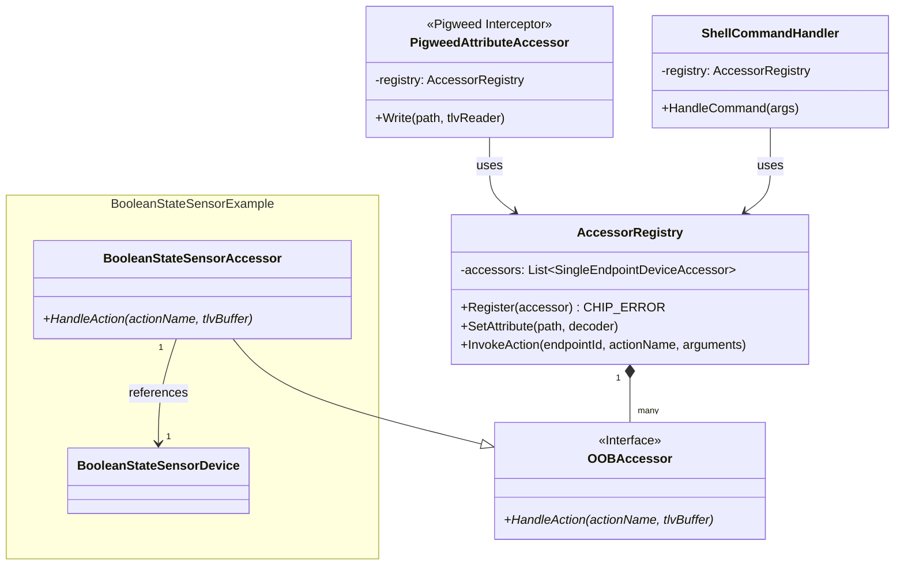

# Out-of-Band (OOB) Control and Simulation Accessors

This directory contains the Out-of-Band (OOB) control and simulation framework
for the `all-devices-app`.

The framework provides a generic interface for simulating physical events or
writing to read-only attributes on simulated devices, decoupling the core device
logic from specific transport protocols (like Pigweed RPC or Shell commands).

## Architecture Overview

The framework consists of a central `AccessorRegistry` that manages a list of
`OOBAccessor` instances. External interfaces (such as Pigweed RPC services or
CLI shell handlers) route requests through the registry, which forwards them to
the appropriate accessor based on the target Endpoint ID.

