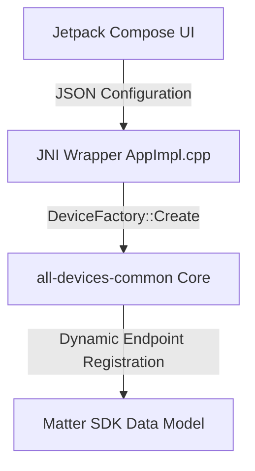

# Matter Android All-Devices Simulator

This directory contains the Android implementation of the `all-devices-app` simulator. It demonstrates the **Code-Driven paradigm** on Android, allowing users to configure, preview, and run a simulated Matter data model containing arbitrary endpoints (including complex bridge topologies) dynamically at runtime.

---

## Architecture Overview

The Android simulator builds upon the platform-agnostic `all-devices-common` core library, providing an interactive Kotlin-based user interface using Jetpack Compose.



1. **Jetpack Compose UI (`MainActivity.kt`):** Manages user configuration forms (Basic/Advanced configuration), coordinates real-time hierarchy diagram preview computation, and runs the log viewer console.
2. **JNI Bridge Wrapper (`AppImpl.cpp` / `AllDevicesApp-JNI.cpp`):** Receives the JSON configuration array representing endpoints from Kotlin at server start, parses it, and dynamically instantiates Matter endpoints.
3. **Common Core (`all-devices-common`):** Provides the modular code-driven cluster bindings and registration helpers.

---

## Features

### 1. Dynamic Data Model Configuration
* **Basic Tab:**
  * **Bridge Mode:** When enabled, automatically configures a Matter Aggregator (System Bridge) at Endpoint 1, and nests each checked device under an automatically generated intermediate `Bridged Node` parent endpoint linked to the aggregator.
  * **ALL Checkbox:** Instantly toggles selection for all supported device types.
  * **Device Selection Checklist:** Individually check device types to simulate.
* **Advanced Tab:**
  * Form editor to declare arbitrary endpoints: configure Endpoint ID, select Device Type, input parent Endpoint ID, assign custom Node Labels, and set Bridged status flag.

### 2. Real-Time Topology Diagram Preview
* Displays a nested graphical tree showing parent-child node connections.
* Color-coded tags for Endpoint IDs, device class indicators (e.g. `root`, `aggregator`, `bridged-node`), and custom labels.
* Can be collapsed/expanded via a **"Hide/Show Preview"** text button.

### 3. Active Server Sub-Tab Panels
Once the server is started, the screen transitions to a clean tab row separating operational views:
* **Onboarding Tab:** Shows the Commissioning QR Code image, manual pairing code, passcode, and discriminator.
* **Topology Tab:** Displays the active, commissioned endpoint tree layout.
* **Logs Tab:** Renders an auto-scrolling monospaced console logging panel for debugging cluster and device events.

---

## Building and Running

### Prerequisites
Make sure your build environment is set up according to the top-level [Matter documentation](../../../docs/guides/BUILDING.md).

### 1. Build the APK
Use the standard Matter build helper script to compile the Android app package:

```bash
# Activate the SDK build environment
source scripts/activate.sh

# Build the android-x64-all-devices-app target
./scripts/build/build_examples.py --target android-x64-all-devices-app build
```

This compiles both the native C++ dynamic JNI library (`libAllDevicesApp.so`) and packages the APK.

### 2. Install on Emulator or Physical Device
Install the generated debug package on a running AVD emulator or connected USB device:

```bash
adb install -r out/android-x64-all-devices-app/AllDevicesApp/app/outputs/apk/debug/app-debug.apk
```

### 3. Start the Simulator
Launch the application:

```bash
adb shell monkey -p com.google.matter.alldevices -c android.intent.category.LAUNCHER 1
```

---

## Configuration JNI Format

When clicking **Start Server**, the list of configured endpoints is serialized into a clean JSON array format and forwarded to JNI:

```json
[
  {
    "endpointId": 1,
    "deviceType": "aggregator",
    "parentId": 0,
    "bridged": false,
    "nodeLabel": "Aggregator"
  },
  {
    "endpointId": 2,
    "deviceType": "chime",
    "parentId": 1,
    "bridged": true,
    "nodeLabel": "Front Door Chime"
  }
]
```

The native parser parses this payload and registers intermediate `bridged-node` devices automatically at endpoint ID `n` if `"bridged": true` is set, mapping the target leaf device to endpoint ID `n + 1`.

---

## Testing with `chip-tool`

You can commission and test the simulator application against the Matter interactive command-line tool `chip-tool`.

### 1. Build `chip-tool`
If you haven't built `chip-tool` on your host platform yet, compile it:

```bash
./scripts/build/build_examples.py --target linux-x64-chip-tool-clang build
```

### 2. Commission the Android Simulator
1. Start the simulator on the emulator or device.
2. Select the devices you wish to simulate and optionally check **Bridge Mode**.
3. Tap **Start Server** and navigate to the **Onboarding** tab to get the **Manual Pairing Code** (e.g., `34970112332`).
4. Commission the device from your host using the `pairing code` command:

```bash
# Node ID: 1234, Pairing Code: 34970112332
./out/linux-x64-chip-tool-clang/chip-tool pairing code 1234 34970112332
```

### 3. Send Commands (e.g. Chime Device)
If you simulated a **Chime** device:

* **Non-Bridged Mode:**
  The chime device will be registered directly under Endpoint 1:

  ```bash
  # Send play-chime-sound to chime on Node 1234, Endpoint 1
  ./out/linux-x64-chip-tool-clang/chip-tool chime play-chime-sound 1234 1
  ```

* **Bridge Mode:**
  The aggregator resides on Endpoint 1, the intermediate `bridged-node` on Endpoint 2, and the chime device is nested under Endpoint 3:

  ```bash
  # Send play-chime-sound to chime on Node 1234, Endpoint 3
  ./out/linux-x64-chip-tool-clang/chip-tool chime play-chime-sound 1234 3
  ```

### 4. Verify Logs
Navigate to the **Logs** tab on the running server screen. You should see incoming Interaction Model commands and action logs (such as chime sound ding-dong feedback):

```
06-23 22:50:00.123 I/SVR: PlayChimeSound command received
06-23 22:50:00.124 I/SVR: Ding Dong! Play chime sound command received...
```

