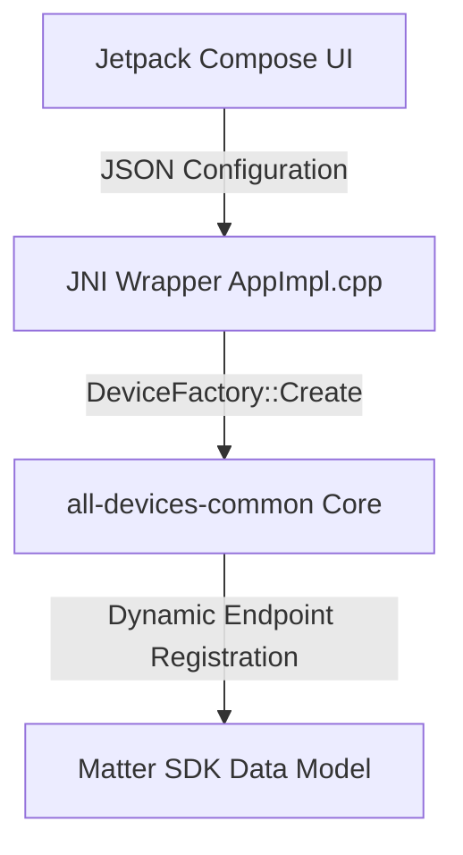

# Matter Android All-Devices Simulator

This directory contains the Android implementation of the `all-devices-app`
simulator. It demonstrates the **Code-Driven paradigm** on Android, allowing
users to configure, preview, and run a simulated Matter data model containing
arbitrary endpoints (including complex bridge topologies) dynamically at
runtime.

---

## Architecture Overview

The Android simulator builds upon the platform-agnostic `all-devices-common`
core library, providing an interactive Kotlin-based user interface using Jetpack
Compose.



1. **Jetpack Compose UI (`MainActivity.kt`):** Manages user configuration forms
   (Basic/Advanced configuration), coordinates real-time hierarchy diagram
   preview computation, and runs the log viewer console.
2. **JNI Bridge Wrapper (`AppImpl.cpp` / `AllDevicesApp-JNI.cpp`):** Receives
   the JSON configuration array representing endpoints from Kotlin at server
   start, parses it, and dynamically instantiates Matter endpoints.
3. **Common Core (`all-devices-common`):** Provides the modular code-driven
   cluster bindings and registration helpers.

---

## Features

### 1. Dynamic Data Model Configuration

-   **Basic Tab:**
    -   **Bridge Mode:** When enabled, automatically configures a Matter
        Aggregator (System Bridge) at Endpoint 1, and nests each checked device
        under an automatically generated intermediate `Bridged Node` parent
        endpoint linked to the aggregator.
    -   **ALL Checkbox:** Instantly toggles selection for all supported device
        types.
    -   **Device Selection Checklist:** Individually check device types to
        simulate.
-   **Advanced Tab:**
    -   Form editor to declare arbitrary endpoints: configure Endpoint ID,
        select Device Type, input parent Endpoint ID, assign custom Node Labels,
        and set Bridged status flag.

### 2. Real-Time Topology Diagram Preview

-   Displays a nested graphical tree showing parent-child node connections.
-   Color-coded tags for Endpoint IDs, device class indicators (e.g. `root`,
    `aggregator`, `bridged-node`), and custom labels.
-   Can be collapsed/expanded via a **"Hide/Show Preview"** text button.

### 3. Active Server Sub-Tab Panels

Once the server is started, the screen transitions to a clean tab row separating
operational views:

-   **Onboarding Tab:** Shows the Commissioning QR Code image, manual pairing
    code, passcode, and discriminator.
-   **Topology Tab:** Displays the active, commissioned endpoint tree layout.
-   **Logs Tab:** Renders an auto-scrolling monospaced console logging panel for
    debugging cluster and device events.

---

## Building and Running

### Prerequisites

Make sure your build environment is set up according to the top-level
[Matter documentation](../../../docs/guides/BUILDING.md).

### 1. Build the APK

Use the standard Matter build helper script to compile the Android app package:

```bash
# Activate the SDK build environment
source scripts/activate.sh

# Build the android-x64-all-devices-app target
./scripts/build/build_examples.py --target android-x64-all-devices-app build
```

This compiles both the native C++ dynamic JNI library (`libAllDevicesApp.so`)
and packages the APK.

### 2. Install on Emulator or Physical Device

Install the generated debug package on a running AVD emulator or connected USB
device:

```bash
adb install -r out/android-x64-all-devices-app/AllDevicesApp/app/outputs/apk/debug/app-debug.apk
```

### 3. Start the Simulator

Launch the application:

```bash
adb shell monkey -p com.google.matter.alldevices -c android.intent.category.LAUNCHER 1
```

---

## Configuration JNI Format

When clicking **Start Server**, the list of configured endpoints is serialized
into a clean JSON array format and forwarded to JNI:

```json
[
    {
        "endpointId": 1,
        "deviceType": "aggregator",
        "parentId": 0,
        "bridged": false,
        "nodeLabel": "Aggregator"
    },
    {
        "endpointId": 2,
        "deviceType": "chime",
        "parentId": 1,
        "bridged": true,
        "nodeLabel": "Front Door Chime"
    }
]
```

The native parser parses this payload and registers intermediate `bridged-node`
devices automatically at endpoint ID `n` if `"bridged": true` is set, mapping
the target leaf device to endpoint ID `n + 1`.

---

## Testing and Commissioning

You can commission and test the simulator application in two ways:

1. **In-Device Commissioning (Recommended):** Run both the simulator app and the
   Android `CHIPTool` controller app together on the emulator, communicating
   natively via loopback.
2. **Host-to-Device Commissioning:** Run the simulator on the emulator, and
   commission it from your Linux host terminal using the C++ `chip-tool` binary.

---

### Option A: In-Device Commissioning (Recommended)

Since both the controller (`CHIPTool`) and responder (`AllDevicesApp`) run
within the same emulator system, they can communicate directly over loopback
(`127.0.0.1`) without any network bridging or port forwarding workarounds.

#### 1. Build and Install CHIPTool

Compile the Android `CHIPTool` app and install it on your emulator:

```bash
# Build CHIPTool APK inside container:
./scripts/build/build_examples.py --target android-x64-chip-tool build

# Install on emulator:
adb install -r out/android-x64-chip-tool/outputs/apk/debug/app-debug.apk
```

#### 2. Pair the Devices

1. Start the **AllDevicesApp** simulator. Check the desired device types (e.g.
   **chime**) and tap **Start Server**.
2. Open the **CHIPTool** app.
3. Tap **PROVISION CHIP DEVICE WITH WI-FI**.
4. Tap **INPUT DEVICE ADDRESS** (in the top right).
5. Type `127.0.0.1` into the **Device address** field. Leave other default
   settings (Discriminator: `3840`, Pincode: `20202021`, Port: `5540`) as they
   are.
6. Tap **COMMISSION**. Once pairing finishes, you will be redirected back to the
   main menu.

#### 3. Send Commands

1. In **CHIPTool**, tap **CLUSTER INTERACTION TOOL**.
2. Select the commissioned Node ID (typically `6`) from the **Commissioned
   Device ID** dropdown.
3. Tap **RETRIEVE ENDPOINT LIST**.
4. Tap **Endpoint 1** (our chime endpoint).
5. In the **Select a cluster** dropdown, select **chime**.
6. In the **Select a command** dropdown, select **playChimeSound**.
7. Enter `1` (or desired index) in the **chimeID** parameter field, and tap
   **INVOKE**.
8. Verify the simulator log view or `adb logcat` output:
    ```
    ChimeDevice: Playing sound Ring Ring
    ```

---

### Option B: Host-to-Device Commissioning

To pair the simulator running inside the emulator from a `chip-tool` binary
running on your host machine, you must configure port redirection.

#### 1. Build host `chip-tool`

```bash
./scripts/build/build_examples.py --target linux-x64-chip-tool-clang build
```

#### 2. Set Up Port Redirection

Forward the UDP port `5540` from your host to the emulator instance:

```bash
# Get emulator auth token:
cat ~/.emulator_console_auth_token

# Connect to emulator console and add redirection:
telnet localhost 5554
auth <auth_token>
redir add udp:5540:5540
exit
```

#### 3. Pair the Simulator

Run the simulator app, check **chime**, and tap **Start Server**. Then run:

```bash
CHIP_TOOL_ADDRESS_OVERRIDE=127.0.0.1:5540 ./out/linux-x64-chip-tool-clang/chip-tool pairing already-discovered 1234 20202021 127.0.0.1 5540
```

#### 4. Send Commands

```bash
# Non-Bridged Mode (Endpoint 1):
CHIP_TOOL_ADDRESS_OVERRIDE=127.0.0.1:5540 ./out/linux-x64-chip-tool-clang/chip-tool chime play-chime-sound 1234 1
```
