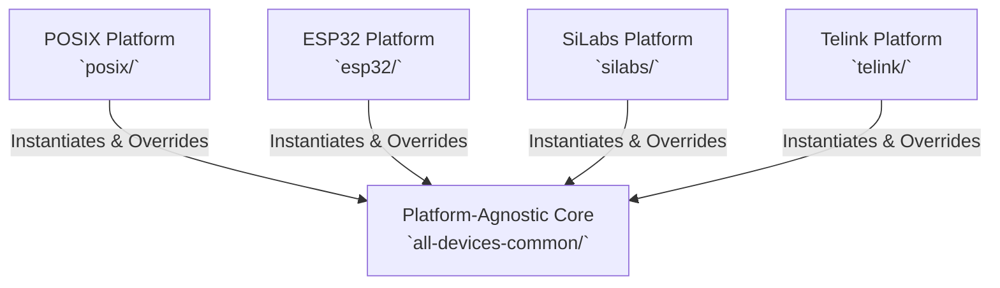
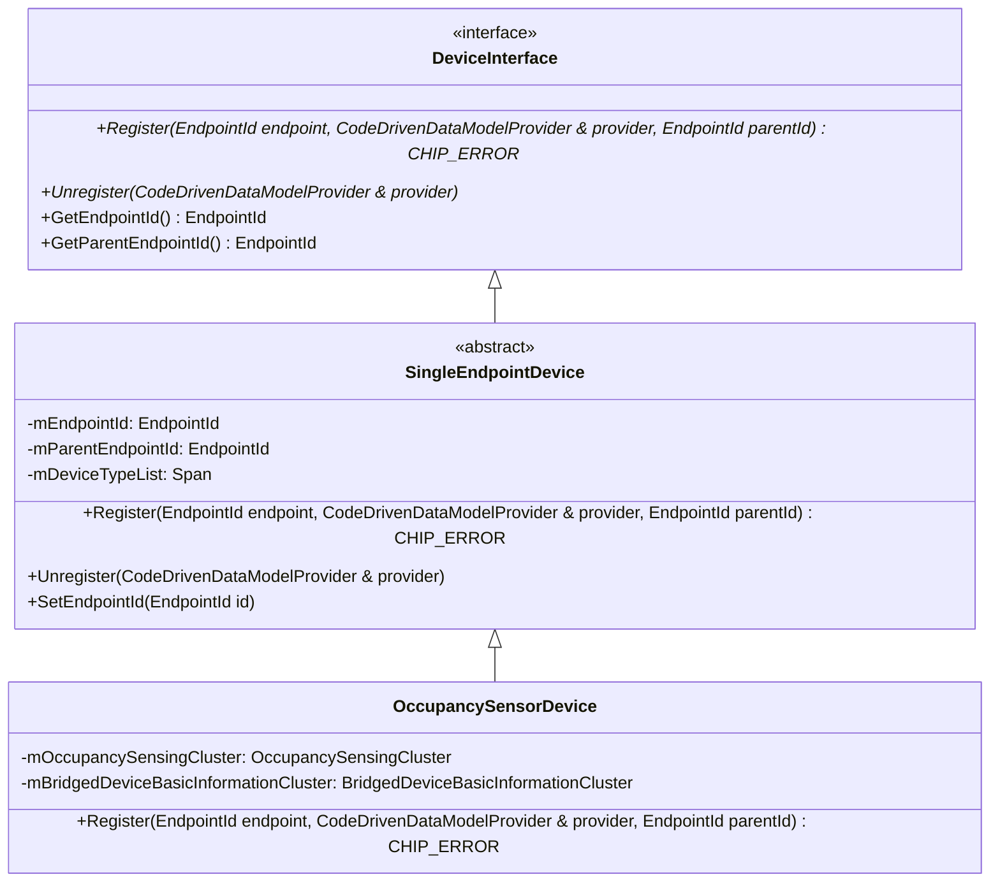

# Architecture & Design

The `all-devices-app` is a reference application demonstrating the **Code-Driven
Data Model** within the Matter SDK. It implements a runtime-configurable data
model.

This document describes the architectural layers, core classes, and design
principles of the application.

---

## 1. The Code-Driven Data Model

The `all-devices-app` implements the **Code-Driven Data Model**:

-   **Dynamic Runtime Registration**: Clusters and endpoints are instantiated as
    standard C++ objects and registered with the active data model provider at
    runtime using `provider.AddEndpoint(...)` via `CodeDrivenDataModelProvider`.
-   **Decoupled Cluster Logic**: Server clusters are implemented by deriving
    from `DefaultServerCluster` (or similar code-driven base classes).
    Attributes and commands are strongly typed and encapsulated within the
    cluster classes.
-   **Enhanced Testability**: Because devices and clusters are plain C++
    objects, they can be directly instantiated in standalone unit tests without
    booting the full Matter network stack.

---

## 2. Platform Separation

The `all-devices-app` enforces platform separation between core logic and target
drivers:

### Platform-Agnostic Core (`all-devices-common/`)

Contains simulated device behaviors and capability management. This layer
compiles independently of the operating system or hardware drivers. It includes:

-   **`devices/`**: Concrete implementations of simulated Matter devices (e.g.,
    `OccupancySensor`, `DimmableLight`, `Speaker`).
-   **`device-factory/`**: Registry (`DeviceFactory`) responsible for mapping
    CLI device names to creation factories.
-   **`providers/`**: SDK-level data providers (such as
    `AllDevicesExampleDeviceInfoProviderImpl`) that supply node lifecycle
    information, storage interfaces, and descriptor details.

### Platform-Specific Target Builds (`posix/`, `esp32/`, `silabs/`, `telink/`)

These directories contain hardware-specific or OS-specific drivers, entrypoint
`main()` functions, and build configurations.

-   **Platform Overrides**: Platforms can replace simulated behaviors with
    hardware drivers. For example, `DeviceFactoryPlatformOverride.cpp` can
    register an LED driver for the `on-off-light` device instead of the
    simulated device.

---

## 3. Key Core Classes

### The Device Interface

All devices in the application implement `DeviceInterface` and its core base
class, `SingleEndpointDevice`.

-   **`DeviceInterface`**
    (`all-devices-common/devices/interface/DeviceInterface.h`): Defines the pure
    virtual lifecycle contracts (`Register`, `Unregister`, etc.) required for
    registering a block of data model elements into the active server.
-   **`SingleEndpointDevice`**
    (`all-devices-common/devices/interface/SingleEndpointDevice.h`):
    Encapsulates endpoint state, managing its assigned `EndpointId`, its parent
    endpoint relationship (for bridges or composite devices), and a list of
    `DeviceTypeDescriptor` structures.
-   **Concrete Devices** (e.g., `OccupancySensorDevice`): Inherit from
    `SingleEndpointDevice`, own one or more concrete strongly-typed cluster
    instances (`LazyRegisteredServerCluster`), and bind them to the endpoint
    during registration.

### The Device Factory

The `DeviceFactory` singleton acts as the central device creator.

1. When a particular device type is enabled during the build, its static
   self-registering factory macro executes at startup.
2. The factory maintains an internal map of string keys (e.g.,
   `"occupancy-sensor"`) to creation callbacks.
3. During boot, the application parses command-line device types and calls
   `DeviceFactory::CreateDevice(...)` to instantiate the specified runtime
   devices.

---

## 4. Design Principles & Best Practices

When maintaining or extending the `all-devices-app` architecture, adhere to the
following guidelines:

1. **Platform-Agnostic Core**: Do not introduce OS-specific APIs, direct POSIX
   calls, or global singletons into `all-devices-common/`. If a capability
   requires platform integration, define an interface in `all-devices-common/`
   and provide the implementation in target directories (`posix/`, `esp32/`,
   etc.).
2. **Encapsulate Storage via Providers**: Do not write direct persistent files
   from device classes. Use the injected `DeviceInfoProvider` or
   `DeviceInstanceInfoProvider` interfaces to handle non-volatile runtime
   variables and user settings.
3. **Explicit Lifecycle Management**: Do not rely on RAII or C++ destructor
   methods for automated endpoint teardown. Core device type implementations
   must use `~Device() override = default;` and manage lifecycle teardown
   explicitly by executing `Unregister(provider)`.
4. **Concrete Naming**: Avoid ambiguous umbrella folders or generic utility
   names. Use specific operational titles (e.g., `DeviceTypeParser.h`,
   `NetworkInfrastructureManager.h`).
