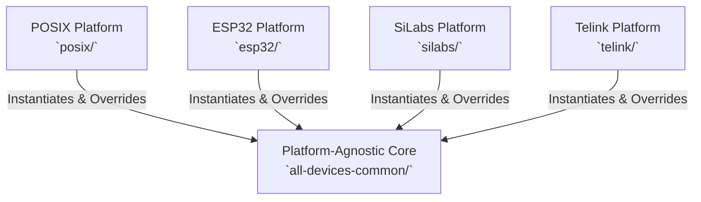
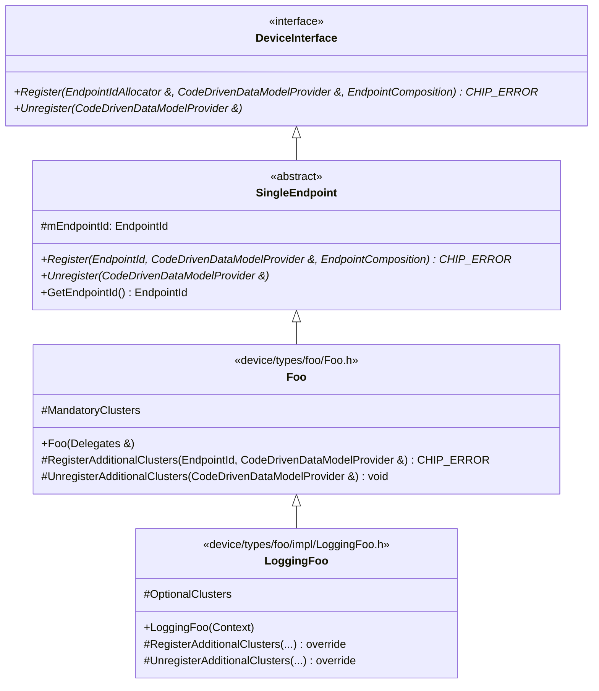
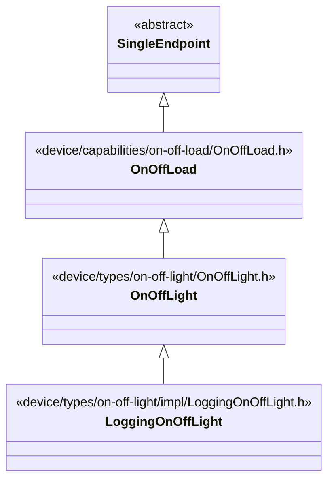
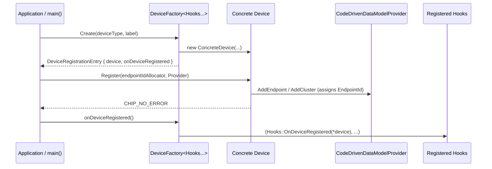

# Architecture & Design

The `all-devices-app` is a reference application demonstrating the **Code-Driven
Data Model** within the Matter SDK. It implements a runtime-configurable data
model.

This document describes the architectural layers, core classes, and design
principles of the application.

---

## 1. The Code-Driven Data Model

The `all-devices-app` implements the **Code-Driven Data Model**:

-   **Dynamic Runtime Registration**: Clusters and endpoints are instantiated as
    standard C++ objects and registered with the active data model provider at
    runtime using `provider.AddEndpoint(...)` via `CodeDrivenDataModelProvider`.
-   **Decoupled Cluster Logic**: Server clusters are implemented by deriving
    from `DefaultServerCluster` (or similar code-driven base classes).
    Attributes and commands are strongly typed and encapsulated within the
    cluster classes.
-   **Enhanced Testability**: Because devices and clusters are plain C++
    objects, they can be directly instantiated in standalone unit tests without
    booting the full Matter network stack.

---

## 2. Platform Separation

The `all-devices-app` enforces platform separation between core logic and target
drivers:

```mermaid
graph TD
    A[Platform-Agnostic Core<br>`all-devices-common/`]
    B[POSIX Platform<br>`posix/`]
    C[ESP32 Platform<br>`esp32/`]
    D[SiLabs Platform<br>`silabs/`]
    E[Telink Platform<br>`telink/`]

    B -->|Instantiates & Overrides| A
    C -->|Instantiates & Overrides| A
    D -->|Instantiates & Overrides| A
    E -->|Instantiates & Overrides| A
```

### Platform-Agnostic Core (`all-devices-common/`)

Contains simulated device behaviors and capability management. This layer
compiles independently of the operating system or hardware drivers. It includes:

-   **`device/types/`**: Concrete implementations of simulated Matter devices
    (e.g., `OccupancySensor`, `DimmableLight`, `Speaker`).
-   **`device/api/`**: Base contracts and abstractions (`DeviceInterface`,
    `SingleEndpoint`, `device/api/allocator/DynamicEndpointIdAllocator.h`).
-   **`device/capabilities/`**: Reusable device loads and capabilities (e.g.,
    `OnOffLoad`, `DimmableLoad`, `FanLoad`).
-   **`device-factory/`**: Registry (`DeviceFactory<Hooks...>`) responsible for
    mapping CLI device names to creation factories.
-   **`oob-accessors/`**: Out-of-Band cluster manipulation layer (`OOBAccessor`,
    `OOBAccessorRegistry`).
-   **`providers/`**: SDK-level data providers (such as
    `AllDevicesExampleDeviceInfoProviderImpl`) that supply node lifecycle
    information, storage interfaces, and descriptor details.

### Platform-Specific Target Builds (`posix/`, `esp32/`, `silabs/`, `telink/`)

These directories contain hardware-specific or OS-specific drivers, entrypoint
`main()` functions, and build configurations.

-   **Platform Overrides**: Platforms can replace simulated behaviors with
    hardware drivers. For example, `DeviceFactoryPlatformOverride.h` can
    register an LED driver for the `on-off-light` device instead of the
    simulated device.

---

## 3. Key Core Classes

### Device Inheritance & Extension Model

All single-endpoint devices inherit from `DeviceInterface` and `SingleEndpoint`.
Device types follow a strict inheritance direction separating generic spec
definitions from concrete simulations or hardware drivers.

#### 1. Default 2-Tier Hierarchy (`SingleEndpoint <- Foo <- LoggingFoo`)

```mermaid
classDiagram
    class DeviceInterface {
        <<interface>>
        +Register(EndpointIdAllocator &, CodeDrivenDataModelProvider &, EndpointComposition)* CHIP_ERROR
        +Unregister(CodeDrivenDataModelProvider &)*
    }

    class SingleEndpoint {
        <<abstract>>
        #mEndpointId: EndpointId
        +Register(EndpointId, CodeDrivenDataModelProvider &, EndpointComposition)* CHIP_ERROR
        +Unregister(CodeDrivenDataModelProvider &)*
        +GetEndpointId() EndpointId
    }

    class Foo {
        <<device/types/foo/Foo.h>>
        #MandatoryClusters
        +Foo(Delegates &)
        #RegisterAdditionalClusters(EndpointId, CodeDrivenDataModelProvider &) CHIP_ERROR
        #UnregisterAdditionalClusters(CodeDrivenDataModelProvider &) void
    }

    class LoggingFoo {
        <<device/types/foo/impl/LoggingFoo.h>>
        #OptionalClusters
        +LoggingFoo(Context)
        #RegisterAdditionalClusters(...) override
        #UnregisterAdditionalClusters(...) override
    }

    DeviceInterface <|-- SingleEndpoint
    SingleEndpoint <|-- Foo
    Foo <|-- LoggingFoo
```

-   **`SingleEndpoint`** (`all-devices-common/device/api/SingleEndpoint.h`):
    Encapsulates endpoint state, `EndpointId` assignment, parent composition,
    and `DeviceTypeEntry` descriptors.
-   **Base Device Type (`device/types/foo/Foo.h`, e.g. `LaundryWasher`)**:
    Represents the spec-defined Matter Device Type. It inherits directly from
    `SingleEndpoint`, defines the `DeviceTypeEntry` (ID and revision), owns
    **only mandatory clusters**, and accepts abstract `Delegate &` references
    via constructor injection. It contains zero simulation, logging, or hardware
    pin logic.
-   **Concrete Implementation / Simulation
    (`device/types/foo/impl/LoggingFoo.h`)**: Inherits from `Foo` (**never the
    reverse**). `LoggingFoo` (or `EmulatedFoo`) provides a self-contained
    simulation for `DeviceFactory` by implementing the required cluster
    delegates (inheriting privately from delegate bases _before_ `public Foo`
    for base-from-member initialization safety). Hardware targets subclass or
    instantiate `Foo` with real hardware drivers.

Because `impl/LoggingFoo` and platform subclasses derive from `Foo`, UI screens,
Out-of-Band (OOB) CLI controls, and generic application logic bind to the base
device type interface (`Foo`) without coupling to simulation or hardware
details.

#### 2. Optional Clusters & Registration Hooks

Optional clusters must **not** reside in the base `Foo` class. Keeping `Foo`
restricted to mandatory clusters avoids RAM/Flash overhead for minimal products.

Because `CodeDrivenDataModelProvider` requires all clusters on an endpoint to be
registered via `provider.AddCluster()` **before** `provider.AddEndpoint()`
commits the endpoint (and removed **after** `UnregisterDescriptor()` unregisters
the endpoint), base device classes expose virtual extension hooks inside their
`Register()` and `Unregister()` methods:

-   `RegisterAdditionalClusters(EndpointId endpoint, CodeDrivenDataModelProvider & provider)`:
    Invoked inside `Foo::Register()` after mandatory clusters are added,
    immediately before `provider.AddEndpoint(mEndpointRegistration)`.
-   `UnregisterAdditionalClusters(CodeDrivenDataModelProvider & provider)`:
    Invoked inside `Foo::Unregister()` immediately after
    `UnregisterDescriptor(provider)`.

Subclasses in `impl/` or platform targets override these hooks to attach
optional clusters cleanly.

#### 3. Special Case: Shared Capabilities (`device/capabilities/`)

```mermaid
classDiagram
    class SingleEndpoint {
        <<abstract>>
    }

    class OnOffLoad {
        <<device/capabilities/on-off-load/OnOffLoad.h>>
    }

    class OnOffLight {
        <<device/types/on-off-light/OnOffLight.h>>
    }

    class LoggingOnOffLight {
        <<device/types/on-off-light/impl/LoggingOnOffLight.h>>
    }

    SingleEndpoint <|-- OnOffLoad
    OnOffLoad <|-- OnOffLight
    OnOffLight <|-- LoggingOnOffLight
```

A small set of closely related device families (`OnOffLoad`, `DimmableLoad`,
`FanLoad`) use a 3-tier hierarchy:
`impl -> device_type -> capability -> SingleEndpoint`.

-   **Capabilities are an exception, not the default**: Deep endpoint
    inheritance increases coupling, complicates constructor/context plumbing,
    and obscures cluster lifecycles.
-   **Prefer duplication over new capabilities**: When creating new device
    types, inherit directly from `SingleEndpoint` even if cluster declarations
    repeat across similar devices.
-   **Share delegates, not endpoint bases**: To share cluster behavior or
    logging stubs across device types, implement reusable delegate classes in
    `capabilities/impl/` (e.g. `LoggingOnOffDelegate`) and compose or inherit
    those in `impl/LoggingFoo` while keeping `Foo` derived directly from
    `SingleEndpoint`.

### The Device Factory

The `DeviceFactory<typename... Hooks>` template class acts as the central device
creator and post-registration dispatcher:

```mermaid
sequenceDiagram
    participant App as Application / main()
    participant Factory as DeviceFactory<Hooks...>
    participant Device as Concrete Device
    participant Provider as CodeDrivenDataModelProvider
    participant Hook as Registered Hooks

    App->>Factory: Create(deviceType, label)
    Factory->>Device: new ConcreteDevice(...)
    Factory-->>App: DeviceRegistrationEntry { device, onDeviceRegistered }

    App->>Device: Register(endpointIdAllocator, Provider)
    Device->>Provider: AddEndpoint / AddCluster (assigns EndpointId)
    Device-->>App: CHIP_NO_ERROR

    App->>Factory: onDeviceRegistered()
    Factory->>Hook: (Hooks::OnDeviceRegistered(*device), ...)
```

1. **Factory Registration**: Enabled device types register creator lambdas in
   the `DeviceFactory` constructor.
2. **Hook Specialization**: Platforms instantiate `DeviceFactory` with
   target-specific static hooks:
    - **`NoHooksDeviceFactory`** (`DeviceFactory<>`): Default specialization
      with no hooks, used by embedded targets (ESP32, SiLabs, Telink) to
      minimize binary footprint.
    - **`PosixDeviceFactory`**
      (`DeviceFactory<OOBAccessorHook, NamedPipe::Hook>`): Specialized for
      POSIX, dynamically registering OOB cluster accessors and named pipe JSON
      translators only for instantiated devices.
3. **Creation & Registration Lifecycle**:
    - `factory.Create(type, label)` instantiates the device and returns a
      `DeviceRegistrationEntry` struct containing the
      `std::unique_ptr<DeviceInterface>` and a
      `std::function<void()> onDeviceRegistered` callback.
    - The application registers the endpoint with the
      `CodeDrivenDataModelProvider`, allocating its valid runtime `EndpointId`.
    - The application invokes `entry.onDeviceRegistered()`, which expands the
      `variadic` fold expression `(Hooks::OnDeviceRegistered(*rawDevice), ...)`
      statically for each configured hook.

---

## 4. Design Principles & Best Practices

When maintaining or extending the `all-devices-app` architecture, adhere to the
following guidelines:

1. **Platform-Agnostic Core**: Do not introduce OS-specific APIs, direct POSIX
   calls, or global singletons into `all-devices-common/`. If a capability
   requires platform integration, define an interface in `all-devices-common/`
   and provide the implementation in target directories (`posix/`, `esp32/`,
   etc.).
2. **Encapsulate Storage via Providers**: Do not write direct persistent files
   from device classes. Use the injected `DeviceInfoProvider` or
   `DeviceInstanceInfoProvider` interfaces to handle non-volatile runtime
   variables and user settings.
3. **Explicit Lifecycle Management**: Do not rely on RAII or C++ destructor
   methods for automated endpoint teardown. Core device type implementations
   must use `~Device() override = default;` and manage lifecycle teardown
   explicitly by executing `Unregister(provider)`. Teardown must unregister the
   endpoint first (via `UnregisterDescriptor()`) before removing or destroying
   individual clusters, as `CodeDrivenDataModelProvider` disallows removing
   clusters from an actively registered endpoint once started
   (`CHIP_ERROR_INCORRECT_STATE`).
4. **Concrete Naming**: Avoid ambiguous umbrella folders or generic utility
   names. Use specific operational titles (e.g., `DeviceTypeParser.h`,
   `NetworkInfrastructureManager.h`).

---

## 5. Subsystem Design Documents

Detailed architecture specifications for application subsystems:

-   **[Out-of-Band Control Architecture](design/out_of_band_control.md)**:
    Unified architecture for external control interfaces (Named Pipes, Pigweed
    RPC, test runners), separating transport translators from cluster execution
    backends (`OOBAccessor`).
