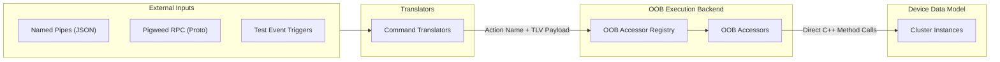
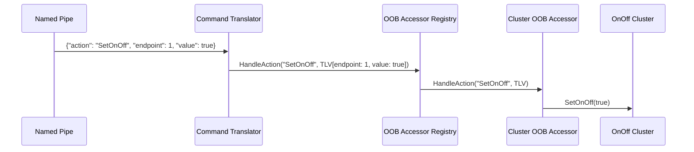

# Out-of-Band Control Architecture

This document describes the Out-of-Band (OOB) control architecture in
`all-devices-app`.

OOB control allows external interfaces (POSIX Named Pipes, Pigweed RPC, test
runners, platform buttons) to mutate cluster state, simulate sensor triggers,
and execute device actions independently of the Matter Interaction Model.

---

## 1. Core Architecture

The architecture separates **Transport Translation** from **Action Execution**:



### How OOB Control Works

-   **Single Control Surface**: `OOBAccessor` is the only mechanism to control
    simulated devices and clusters outside of the Matter protocol.
-   **Generic Action Dispatch**: An `OOBAccessor` receives a semantic action
    name and a TLV data buffer. The application maintains a registry of
    accessors and queries them in order:
    -   `CHIP_NO_ERROR`: The action was recognized and executed successfully.
        Dispatch terminates.
    -   `CHIP_ERROR_NOT_FOUND`: The action is not supported by this accessor.
        Registry continues querying the next accessor.
    -   Other `CHIP_ERROR`: The action was recognized by this accessor, but
        execution failed. Dispatch terminates immediately and propagates the
        error.
    -   If no registered accessor handles the action, `HandleAction` returns
        `CHIP_ERROR_NOT_FOUND`.
-   **Transport Translation**: External protocols and transports (Named Pipe
    JSON, Pigweed RPC, Test Event Triggers) parse incoming requests, convert
    them into an action name and TLV payload, and forward them to
    `OOBAccessorRegistry`.
-   **Code Organization**:
    -   **Shared Cluster Accessors**: Accessors for common Matter clusters
        (e.g., `OnOff`, `OccupancySensing`) live in
        `all-devices-common/oob-accessors/clusters/` so any device containing
        that cluster reuses the same implementation.
    -   **Device-Specific Accessors & Integrations**: Device implementations and
        their associated OOB hooks live together in
        `all-devices-common/device/types/<device-name>/`:
        -   Core logic and `OOBAccessors.h/.cpp` belong to the platform-neutral
            `:<device-name>` target.
        -   `NamedPipes.h/.cpp` belongs to the POSIX-only `:<device-name>:posix`
            sub-target.
    -   **Platform Transport Infrastructure**: Dispatchers and base interfaces
        (e.g., POSIX Named Pipes) live in platform directories under
        `posix/named_pipe/`.

---

## 2. Directory Layout

```text
examples/all-devices-app/
├── all-devices-common/
│   ├── device/
│   │   └── types/
│   │       └── <device-name>/
│   │           ├── <DeviceName>.h/.cpp                 # Core device implementation (platform-neutral)
│   │           ├── OOBAccessors.h/.cpp                 # Device OOB accessor registration (platform-neutral)
│   │           ├── NamedPipes.h/.cpp                   # Device Named Pipe registration (POSIX-only)
│   │           └── BUILD.gn                            # GN targets: :<device-name>, :posix, :logging
│   └── oob-accessors/
│       ├── OOBAccessor.h                               # Base interface: HandleAction(action, tlvData)
│       ├── OOBAccessorRegistry.h                       # Active alias (InMemory vs Noop)
│       ├── InMemoryOOBAccessorRegistry.h/.cpp           # Intrusive list of registered OOBAccessors
│       ├── NoopOOBAccessorRegistry.h                   # Zero-cost inline stub for disabled targets
│       └── clusters/
│           └── <Cluster>OobAccessor.h/.cpp             # Cluster accessors (e.g. OnOffOobAccessor, OccupancyOobAccessor)
└── posix/
    └── named_pipe/
        ├── NamedPipeCommandTranslator.h                # Base interface: TranslateAndExecute(json)
        ├── PosixNamedPipeDispatcher.h/.cpp             # POSIX pipe listener & JSON command router
        └── translators/
            └── <Command>Translator.h/.cpp              # Command translators (e.g. OnOffTranslator, OccupancyTranslator)
```

---

## 3. Interfaces & Core Types

### `OOBAccessor` Interface

```cpp
namespace chip::app::Clusters {

class OOBAccessor
{
public:
    virtual ~OOBAccessor() = default;

    /**
     * @brief Executes an out-of-band action on a target endpoint.
     * @param action Semantic action string (e.g. "SetOnOff", "SetOccupancy").
     * @param tlvData Encoded TLV payload containing endpoint ID and action parameters.
     * @return CHIP_NO_ERROR if action was recognized and executed successfully.
     * @return CHIP_ERROR_NOT_FOUND if action is not supported (registry continues dispatch).
     * @return Other CHIP_ERROR on execution failure (registry stops dispatch).
     */
    virtual CHIP_ERROR HandleAction(CharSpan action, ByteSpan tlvData) = 0;
};

} // namespace chip::app::Clusters
```

### `InMemoryOOBAccessorRegistry` Class

```cpp
namespace chip::app {

class InMemoryOOBAccessorRegistry
{
public:
    /**
     * @brief Registers an OOB accessor instance.
     * @param accessor The accessor instance to register.
     */
    CHIP_ERROR Register(std::unique_ptr<chip::app::Clusters::OOBAccessor> accessor);

    /**
     * @brief Dispatches an action to registered accessors in order.
     * @return CHIP_NO_ERROR on success, CHIP_ERROR_NOT_FOUND if unhandled, or specific error on execution failure.
     */
    CHIP_ERROR HandleAction(CharSpan action, ByteSpan tlvData);

    /**
     * @brief Helper to attach all accessors declared by a device instance.
     */
    template <typename ConcreteDevice>
    void AttachAccessors(ConcreteDevice & device)
    {
        RegisterOOBAccessors(device, *this);
    }
};

} // namespace chip::app
```

### `NamedPipeCommandTranslator` Interface

```cpp
namespace chip::app {

class NamedPipeCommandTranslator
{
public:
    virtual ~NamedPipeCommandTranslator() = default;

    /**
     * @brief Translates a JSON payload into TLV and executes the action via OOBAccessorRegistry.
     * @param json Parsed JSON payload from named pipe.
     */
    virtual CHIP_ERROR TranslateAndExecute(const Json::Value & json) = 0;
};

} // namespace chip::app
```

### `PosixNamedPipeDispatcher` Interface

```cpp
namespace chip::app {

class PosixNamedPipeDispatcher
{
public:
    explicit PosixNamedPipeDispatcher(OOBAccessorRegistry & oobRegistry) :
        mOobRegistry(oobRegistry) {}

    /**
     * @brief Registers a translator if not already present, deduping by TranslatorType::kName.
     */
    template <typename TranslatorType, typename... Args>
    CHIP_ERROR EnsureTranslatorRegistered(Args &&... args)
    {
        if (HasTranslator(TranslatorType::kName))
        {
            return CHIP_NO_ERROR;
        }
        return RegisterTranslator(
            TranslatorType::kName,
            std::make_unique<TranslatorType>(mOobRegistry, std::forward<Args>(args)...)
        );
    }

    /**
     * @brief Helper to attach all named pipe translators required by a device instance.
     */
    template <typename ConcreteDevice>
    void AttachDevice(ConcreteDevice & device)
    {
        RegisterNamedPipes(device, *this);
    }

    CHIP_ERROR DispatchJson(const Json::Value & json);

private:
    OOBAccessorRegistry & mOobRegistry;
    std::unordered_map<std::string, std::unique_ptr<NamedPipeCommandTranslator>> mTranslators;
};

} // namespace chip::app
```

---

## 4. Execution Flow

### Named Pipe Command Flow



1.  **Ingress**: External process writes JSON string to named pipe (e.g.
    `/tmp/chip_all_devices_fifo`):
    ```json
    {
        "action": "SetOnOff",
        "endpoint": 1,
        "value": true
    }
    ```
2.  **Dispatch**: `PosixNamedPipeDispatcher` reads pipe, parses JSON, and
    extracts `"action"`.
3.  **Translation**: Dispatcher invokes
    `OnOffTranslator::TranslateAndExecute(json)`:
    -   Extracts `endpoint = 1` and `value = true`.
    -   Encodes flat TLV payload:
        -   Tag 1: `EndpointId` (`uint16_t`)
        -   Tag 2: `Value` (`bool`)
    -   Calls `mOobRegistry.HandleAction("SetOnOff", tlvBuffer)`.
4.  **Execution**: `OOBAccessorRegistry` routes to `OnOffOobAccessor` registered
    for Endpoint 1:
    -   Decodes TLV fields.
    -   Calls `mCluster.SetOnOff(true)` on target cluster instance.

---

## 5. Adding OOB Support for a Device

### Step 1: Register Cluster OOB Accessors (Platform-Neutral)

In `all-devices-common/device/types/<device-name>/OOBAccessors.h`:

```cpp
#pragma once
#include <oob-accessors/OOBAccessorRegistry.h>

class MyDevice;

void RegisterOOBAccessors(MyDevice & device, OOBAccessorRegistry & registry);
```

In `all-devices-common/device/types/<device-name>/OOBAccessors.cpp`:

```cpp
#include "OOBAccessors.h"
#include "MyDevice.h"
#include <oob-accessors/clusters/OnOffOobAccessor.h>

void RegisterOOBAccessors(MyDevice & device, OOBAccessorRegistry & registry)
{
    registry.Register(std::make_unique<OnOffOobAccessor>(device.GetOnOffCluster(), device.GetEndpointId()));
}
```

### Step 2: Register Named Pipe Translators (POSIX-Only)

In `all-devices-common/device/types/<device-name>/NamedPipes.h`:

```cpp
#pragma once
#include <posix/named_pipe/PosixNamedPipeDispatcher.h>

class MyDevice;

void RegisterNamedPipes(MyDevice & device, PosixNamedPipeDispatcher & dispatcher);
```

In `all-devices-common/device/types/<device-name>/NamedPipes.cpp`:

```cpp
#include "NamedPipes.h"
#include "MyDevice.h"
#include <posix/named_pipe/translators/OnOffTranslator.h>

void RegisterNamedPipes(MyDevice & device, PosixNamedPipeDispatcher & dispatcher)
{
    dispatcher.EnsureTranslatorRegistered<OnOffTranslator>();
}
```

### Step 3: Define Granular GN Sub-Targets

In `all-devices-common/device/types/<device-name>/BUILD.gn`:

```gn
import("//build_overrides/chip.gni")

# Platform-neutral device target (used by all platforms)
source_set("<device-name>") {
  sources = [
    "<DeviceName>.cpp",
    "<DeviceName>.h",
    "OOBAccessors.cpp",
    "OOBAccessors.h",
  ]

  public_deps = [
    "${chip_root}/examples/all-devices-app/all-devices-common/oob-accessors",
  ]
}

# POSIX-only named pipe integration (pulled exclusively by POSIX builds)
source_set("posix") {
  sources = [
    "NamedPipes.cpp",
    "NamedPipes.h",
  ]

  public_deps = [
    ":<device-name>",
    "${chip_root}/examples/all-devices-app/posix/named_pipe:dispatcher",
  ]
}
```

### Step 4: Factory & Application Attachment

In `DeviceFactory.h` (common across all platforms):

```cpp
mContext->oobRegistry.AttachAccessors(*device);
```

In POSIX application initialization (`posix/main.cpp`):

```cpp
mNamedPipeDispatcher.AttachDevice(*device);
```

---

## 6. Build Configuration & Target Isolation

Target separation prevents platform-specific dependencies from leaking into
embedded builds:

-   **POSIX GN Target (`posix/BUILD.gn`)**: Pulls both the base device target
    and the `:posix` sub-target:
    ```gn
    deps = [
      "${chip_root}/examples/all-devices-app/all-devices-common/device/types/on-off-light",
      "${chip_root}/examples/all-devices-app/all-devices-common/device/types/on-off-light:posix",
    ]
    ```
-   **Embedded GN Targets (`silabs/BUILD.gn`)**: Pulls only the platform-neutral
    base target `device/types/<name>` (and any `:silabs` / `:logging`
    sub-targets). The `:posix` target is never referenced, eliminating
    transitive POSIX headers.
-   **Embedded CMake Targets (`esp32`, `telink`)**: `enabled_devices.cmake`
    collects `${DEVICE_DIR}/<DeviceName>.cpp` and
    `${DEVICE_DIR}/OOBAccessors.cpp`. `NamedPipes.cpp` is excluded from CMake
    source lists.

Configuration defines are generated into `app_config/all_devices_config.h` for
both GN and CMake:

-   **GN Build** (`oob-accessors/all_devices_config.gni`): Uses
    `buildconfig_header` to emit `app_config/all_devices_config.h`.
-   **CMake Build** (`oob-accessors/all_devices_config.cmake`): Uses
    `configure_file` with `all_devices_config.h.in` to emit
    `${CMAKE_CURRENT_BINARY_DIR}/app_config/all_devices_config.h`.

| Build Target / Flag                      | `ALL_DEVICES_APP_ENABLE_NAMED_PIPES` | `PW_RPC_ENABLED` (via `chip_enable_pw_rpc`) | `ALL_DEVICES_APP_ENABLE_OOB_ACCESSORS` |
| :--------------------------------------- | :----------------------------------- | :------------------------------------------ | :------------------------------------- |
| POSIX Linux (`all-devices-app`)          | 1                                    | 0 (or 1 if `chip_enable_pw_rpc`)            | 1                                      |
| Embedded Targets (ESP32, SiLabs, Telink) | 0                                    | 0                                           | 0                                      |

Header aliasing in `all-devices-common/oob-accessors/OOBAccessorRegistry.h`:

```cpp
#pragma once
#include <app_config/all_devices_config.h>

#if ALL_DEVICES_APP_ENABLE_OOB_ACCESSORS
#include <oob-accessors/InMemoryOOBAccessorRegistry.h>
using OOBAccessorRegistry = chip::app::InMemoryOOBAccessorRegistry;
#else
#include <oob-accessors/NoopOOBAccessorRegistry.h>
using OOBAccessorRegistry = chip::app::NoopOOBAccessorRegistry;
#endif
```

---

## 7. TODO / Implementation Checklist

> [!NOTE] The unified Out-of-Band Control architecture is specified above and
> tracked for implementation via the following phased checklist.

### Phase 1: Core OOB Registry & Cluster Accessors

-   [ ] Create `all-devices-common/oob-accessors/all_devices_config.gni`,
        `all_devices_config.cmake`, and `all_devices_config.h.in`.
-   [ ] Create `all-devices-common/oob-accessors/OOBAccessor.h`.
-   [ ] Create `all-devices-common/oob-accessors/InMemoryOOBAccessorRegistry.h`
        and `.cpp`.
-   [ ] Create `all-devices-common/oob-accessors/NoopOOBAccessorRegistry.h`.
-   [ ] Create `all-devices-common/oob-accessors/OOBAccessorRegistry.h`
        (aliasing header).
-   [ ] Implement shared cluster accessors in
        `all-devices-common/oob-accessors/clusters/`:
    -   [ ] `OnOffOobAccessor.h/.cpp`
    -   [ ] `OccupancyOobAccessor.h/.cpp`
    -   [ ] `BooleanStateOobAccessor.h/.cpp`
    -   [ ] `AmbientContextOobAccessor.h/.cpp`
    -   [ ] `BasicInformationOobAccessor.h/.cpp`
-   [ ] Update `all-devices-common/BUILD.gn` with new OOB source targets.

### Phase 2: Device-Type OOB Accessor Registration

-   [ ] Add `OOBAccessors.h` and `OOBAccessors.cpp` for all existing device
        types:
    -   [ ] `all-devices-common/device/types/on-off-light/`
    -   [ ] `all-devices-common/device/types/dimmable-light/`
    -   [ ] `all-devices-common/device/types/occupancy-sensor/`
    -   [ ] `all-devices-common/device/types/contact-sensor/`
    -   [ ] `all-devices-common/device/types/light-sensor/`
    -   [ ] `all-devices-common/device/types/air-quality-sensor/`
    -   [ ] `all-devices-common/device/types/speaker/`
    -   [ ] `all-devices-common/device/types/smart-plug/`
-   [ ] Hook `oobRegistry.AttachAccessors(*device)` into `DeviceFactory.h`.

### Phase 3: POSIX Named Pipe Dispatcher & Translators

-   [ ] Create `posix/named_pipe/NamedPipeCommandTranslator.h`.
-   [ ] Create `posix/named_pipe/PosixNamedPipeDispatcher.h` and `.cpp`.
-   [ ] Implement granular translators in `posix/named_pipe/translators/`:
    -   [ ] `OnOffTranslator.h/.cpp`
    -   [ ] `OccupancyTranslator.h/.cpp`
    -   [ ] `BooleanStateTranslator.h/.cpp`
    -   [ ] `AmbientContextTranslator.h/.cpp`
    -   [ ] `BasicInformationTranslator.h/.cpp`

### Phase 4: Device-Type Named Pipe Registration & Sub-Targets

-   [ ] Add `NamedPipes.h` and `NamedPipes.cpp` under
        `all-devices-common/device/types/<device-name>/` for each supported
        device.
-   [ ] Add `source_set("posix")` to each device's `BUILD.gn`.
-   [ ] Wire `mNamedPipeDispatcher.AttachDevice(*device)` in `posix/main.cpp`.

### Phase 5: Legacy Cleanup & Build Verification

-   [ ] Remove legacy `AppCommandDelegate.h/.cpp`.
-   [ ] Remove legacy `ClusterTypeMappings.h/.cpp`.
-   [ ] Remove legacy `AllDevicesAppClusterImplementationRegistry.h`.
-   [ ] Update build files (`posix/BUILD.gn`, `all-devices-common/BUILD.gn`).
-   [ ] Build target `linux-x64-all-devices-clang` and verify with sample named
        pipe commands.
