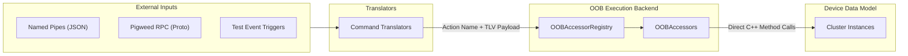
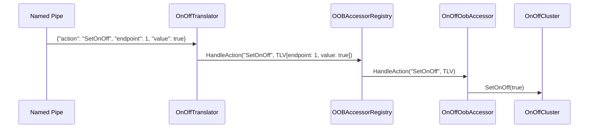

# Out-of-Band Control Architecture

This document describes the Out-of-Band (OOB) control architecture in
`all-devices-app`.

OOB control allows external interfaces (POSIX Named Pipes, Pigweed RPC, test
runners, platform buttons) to mutate cluster state, simulate sensor triggers,
and execute device actions independently of the Matter Interaction Model.

---

## 1. Core Architecture

The architecture separates **Transport Translation** from **Action Execution**:



### How OOB Control Works

-   **Single Control Surface**: `OOBAccessor` is the only mechanism to control
    simulated devices and clusters outside of the Matter protocol.
-   **Generic Action Dispatch**: An `OOBAccessor` receives a semantic action
    name and a TLV data buffer. The application maintains a registry of
    accessors and queries them in order until one handles the action.
-   **Transport Translation**: External protocols and transports (Named Pipe
    JSON, Pigweed RPC, Test Event Triggers) parse incoming requests, convert
    them into an action name and TLV payload, and forward them to
    `OOBAccessorRegistry`.
-   **Code Organization**:
    -   **Shared Cluster Accessors**: Accessors for common Matter clusters
        (e.g., `OnOff`, `OccupancySensing`) live in
        `all-devices-common/oob-accessors/clusters/` so any device containing
        that cluster reuses the same implementation.
    -   **Device-Specific Accessors**: Accessors tied to a specific device live
        directly alongside the device implementation in
        `devices/types/<device-name>/`.
    -   **Platform Transport Code**: Transport translators and listener
        dispatchers (e.g., POSIX Named Pipes) live in platform directories under
        `posix/named_pipe/`.

---

## 2. Directory Layout

```
examples/all-devices-app/
├── all-devices-common/
│   ├── device/
│   │   └── types/
│   │       └── <device-name>/
│   │           ├── <DeviceName>.h/.cpp                 # Core device implementation
│   │           ├── OOBAccessors.h/.cpp                 # Device-level OOB accessor registration
│   │           └── NamedPipes.h/.cpp                   # Device-level Named Pipe translator registration
│   └── oob-accessors/
│       ├── OOBAccessor.h                               # Base interface: HandleAction(action, tlvData)
│       ├── OOBAccessorRegistry.h                       # Active alias (InMemory vs Noop)
│       ├── InMemoryOOBAccessorRegistry.h/.cpp           # Intrusive list of registered OOBAccessors
│       ├── NoopOOBAccessorRegistry.h                   # Zero-cost inline stub for disabled targets
│       └── clusters/
│           └── <Cluster>OobAccessor.h/.cpp             # Cluster accessors (e.g. OnOffOobAccessor, OccupancyOobAccessor)
└── posix/
    └── named_pipe/
        ├── NamedPipeCommandTranslator.h                # Base interface: TranslateAndExecute(json)
        ├── NamedPipeDispatcher.h                       # Active alias (Posix vs Noop)
        ├── PosixNamedPipeDispatcher.h/.cpp             # POSIX pipe listener & JSON command router
        ├── NoopNamedPipeDispatcher.h                   # Zero-cost inline stub for disabled targets
        └── translators/
            └── <Command>Translator.h/.cpp              # Command translators (e.g. OnOffTranslator, OccupancyTranslator)
```

---

## 3. Interfaces & Core Types

### OOBAccessor Interface

```cpp
namespace chip::app::Clusters {

class OOBAccessor
{
public:
    virtual ~OOBAccessor() = default;

    /**
     * @brief Executes an out-of-band action on a target endpoint.
     * @param action Semantic action string (e.g. "SetOnOff", "SetOccupancy").
     * @param tlvData Encoded TLV payload containing endpoint ID and action parameters.
     */
    virtual CHIP_ERROR HandleAction(CharSpan action, ByteSpan tlvData) = 0;
};

} // namespace chip::app::Clusters
```

### OOBAccessorRegistry Interface

```cpp
class InMemoryOOBAccessorRegistry
{
public:
    /**
     * @brief Registers an OOB accessor instance.
     * @param accessor The accessor instance to register.
     */
    CHIP_ERROR Register(std::unique_ptr<chip::app::Clusters::OOBAccessor> accessor);

    /**
     * @brief Dispatches an action to registered accessors.
     */
    CHIP_ERROR HandleAction(CharSpan action, ByteSpan tlvData);

    /**
     * @brief Helper to attach all accessors declared by a device instance.
     */
    template <typename ConcreteDevice>
    void AttachAccessors(ConcreteDevice & device)
    {
        RegisterOOBAccessors(device, *this);
    }
};
```

### NamedPipeCommandTranslator Interface

```cpp
class NamedPipeCommandTranslator
{
public:
    virtual ~NamedPipeCommandTranslator() = default;

    /**
     * @brief Translates a JSON payload into TLV and executes the action via OOBAccessorRegistry.
     * @param json Parsed JSON payload from named pipe.
     */
    virtual CHIP_ERROR TranslateAndExecute(const Json::Value & json) = 0;
};
```

### PosixNamedPipeDispatcher Interface

```cpp
class PosixNamedPipeDispatcher
{
public:
    explicit PosixNamedPipeDispatcher(InMemoryOOBAccessorRegistry & oobRegistry) :
        mOobRegistry(oobRegistry) {}

    /**
     * @brief Registers a translator if not already present, deduping by TranslatorType::kName.
     */
    template <typename TranslatorType, typename... Args>
    CHIP_ERROR EnsureTranslatorRegistered(Args &&... args)
    {
        if (HasTranslator(TranslatorType::kName))
        {
            return CHIP_NO_ERROR;
        }
        return RegisterTranslator(
            TranslatorType::kName,
            std::make_unique<TranslatorType>(mOobRegistry, std::forward<Args>(args)...)
        );
    }

    /**
     * @brief Helper to attach all named pipe translators required by a device instance.
     */
    template <typename ConcreteDevice>
    void AttachDevice(ConcreteDevice & device)
    {
        RegisterNamedPipes(device, *this);
    }

    CHIP_ERROR DispatchJson(const Json::Value & json);

private:
    InMemoryOOBAccessorRegistry & mOobRegistry;
    std::unordered_map<std::string, std::unique_ptr<NamedPipeCommandTranslator>> mTranslators;
};
```

---

## 4. Execution Flow

### Named Pipe Command Flow



1. **Ingress**: External process writes JSON string to named pipe (e.g.
   `/tmp/chip_all_devices_fifo`):
    ```json
    {
        "action": "SetOnOff",
        "endpoint": 1,
        "value": true
    }
    ```
2. **Dispatch**: `PosixNamedPipeDispatcher` reads pipe, parses JSON, and
   extracts `"action"`.
3. **Translation**: Dispatcher invokes
   `OnOffTranslator::TranslateAndExecute(json)`:
    - Extracts `endpoint = 1` and `value = true`.
    - Encodes flat TLV payload:
        - Tag 1: `EndpointId` (`uint16_t`)
        - Tag 2: `Value` (`bool`)
    - Calls `mOobRegistry.HandleAction("SetOnOff", tlvBuffer)`.
4. **Execution**: `OOBAccessorRegistry` routes to `OnOffOobAccessor` registered
   for Endpoint 1:
    - Decodes TLV fields.
    - Calls `mCluster.SetOnOff(true)` on target cluster instance.

---

## 5. Adding OOB Support for a Device

### Step 1: Register Cluster OOB Accessors

In `all-devices-common/device/types/<device-name>/OOBAccessors.h`:

```cpp
#pragma once
#include <oob-accessors/OOBAccessorRegistry.h>

class MyDevice;

void RegisterOOBAccessors(MyDevice & device, OOBAccessorRegistry & registry);
```

In `all-devices-common/device/types/<device-name>/OOBAccessors.cpp`:

```cpp
#include "OOBAccessors.h"
#include "MyDevice.h"
#include <oob-accessors/clusters/OnOffOobAccessor.h>

void RegisterOOBAccessors(MyDevice & device, OOBAccessorRegistry & registry)
{
    registry.Register(std::make_unique<OnOffOobAccessor>(device.GetOnOffCluster(), device.GetEndpointId()));
}
```

### Step 2: Register Named Pipe Translators

In `all-devices-common/device/types/<device-name>/NamedPipes.h`:

```cpp
#pragma once
#include <posix/named_pipe/NamedPipeDispatcher.h>

class MyDevice;

void RegisterNamedPipes(MyDevice & device, NamedPipeDispatcher & dispatcher);
```

In `all-devices-common/device/types/<device-name>/NamedPipes.cpp`:

```cpp
#include "NamedPipes.h"
#include "MyDevice.h"
#include <posix/named_pipe/translators/OnOffTranslator.h>

void RegisterNamedPipes(MyDevice & device, NamedPipeDispatcher & dispatcher)
{
    dispatcher.EnsureTranslatorRegistered<OnOffTranslator>();
}
```

### Step 3: Factory Attachment

In `DeviceFactory.h`, creator lambdas attach registered accessors and
translators uniformly:

```cpp
mContext->oobRegistry.AttachAccessors(*device);
mContext->namedPipesRegistry.AttachDevice(*device);
```

---

## 6. Build Configuration & Conditional Compilation

Configuration defines are generated into `<app_config/all_devices_config.h>` for
both GN and CMake, mirroring the `enabled_devices` build system:

-   **GN Build** (`oob-accessors/all_devices_config.gni`): Uses
    `buildconfig_header` to emit `app_config/all_devices_config.h`.
-   **CMake Build** (`oob-accessors/all_devices_config.cmake`): Uses
    `configure_file` with `all_devices_config.h.in` to emit
    `${CMAKE_CURRENT_BINARY_DIR}/app_config/all_devices_config.h`.

| Build Target / Flag                      | `ALL_DEVICES_APP_ENABLE_NAMED_PIPES` | `ALL_DEVICES_APP_ENABLE_PWRPC`   | `ALL_DEVICES_APP_ENABLE_OOB_ACCESSORS` |
| :--------------------------------------- | :----------------------------------- | :------------------------------- | :------------------------------------- |
| POSIX Linux (`all-devices-app`)          | 1                                    | 0 (or 1 if `chip_enable_pw_rpc`) | 1                                      |
| Embedded Targets (ESP32, SiLabs, Telink) | 0                                    | 0                                | 0                                      |

Header aliasing in `all-devices-common/oob-accessors/OOBAccessorRegistry.h`:

```cpp
#pragma once
#include <app_config/all_devices_config.h>

#if ALL_DEVICES_APP_ENABLE_OOB_ACCESSORS
#include <oob-accessors/InMemoryOOBAccessorRegistry.h>
using OOBAccessorRegistry = chip::app::InMemoryOOBAccessorRegistry;
#else
#include <oob-accessors/NoopOOBAccessorRegistry.h>
using OOBAccessorRegistry = chip::app::NoopOOBAccessorRegistry;
#endif
```

Header aliasing in `posix/named_pipe/NamedPipeDispatcher.h`:

```cpp
#pragma once
#include <app_config/all_devices_config.h>

#if ALL_DEVICES_APP_ENABLE_NAMED_PIPES
#include <posix/named_pipe/PosixNamedPipeDispatcher.h>
using NamedPipeDispatcher = chip::app::PosixNamedPipeDispatcher;
#else
#include <posix/named_pipe/NoopNamedPipeDispatcher.h>
using NamedPipeDispatcher = chip::app::NoopNamedPipeDispatcher;
#endif
```

---

## 7. TODO / Implementation Checklist

> [!NOTE] The unified Out-of-Band Control architecture is specified above and
> tracked for implementation via the following phased checklist.

### Phase 1: Core OOB Registry & Cluster Accessors

-   [ ] Create `all-devices-common/oob-accessors/all_devices_config.gni`,
        `all_devices_config.cmake`, and `all_devices_config.h.in`.
-   [ ] Create `all-devices-common/oob-accessors/OOBAccessor.h`.
-   [ ] Create `all-devices-common/oob-accessors/InMemoryOOBAccessorRegistry.h`
        and `.cpp`.
-   [ ] Create `all-devices-common/oob-accessors/NoopOOBAccessorRegistry.h`.
-   [ ] Create `all-devices-common/oob-accessors/OOBAccessorRegistry.h`
        (aliasing header).
-   [ ] Implement shared cluster accessors in
        `all-devices-common/oob-accessors/clusters/`:
    -   [ ] `OnOffOobAccessor.h/.cpp`
    -   [ ] `OccupancyOobAccessor.h/.cpp`
    -   [ ] `BooleanStateOobAccessor.h/.cpp`
    -   [ ] `AmbientContextOobAccessor.h/.cpp`
    -   [ ] `BasicInformationOobAccessor.h/.cpp`
-   [ ] Update `all-devices-common/BUILD.gn` with new OOB source targets.

### Phase 2: Device-Type OOB Accessor Registration

-   [ ] Add `OOBAccessors.h` and `OOBAccessors.cpp` for all existing device
        types:
    -   [ ] `all-devices-common/device/types/on-off-light/`
    -   [ ] `all-devices-common/device/types/dimmable-light/`
    -   [ ] `all-devices-common/device/types/occupancy-sensor/`
    -   [ ] `all-devices-common/device/types/contact-sensor/`
    -   [ ] `all-devices-common/device/types/light-sensor/`
    -   [ ] `all-devices-common/device/types/air-quality-sensor/`
    -   [ ] `all-devices-common/device/types/speaker/`
    -   [ ] `all-devices-common/device/types/smart-plug/`
-   [ ] Hook `oobRegistry.AttachAccessors(*device)` into `DeviceFactory.h`.

### Phase 3: POSIX Named Pipe Dispatcher & Translators

-   [ ] Create `posix/named_pipe/NamedPipeCommandTranslator.h`.
-   [ ] Create `posix/named_pipe/PosixNamedPipeDispatcher.h` and `.cpp`.
-   [ ] Create `posix/named_pipe/NoopNamedPipeDispatcher.h`.
-   [ ] Create `posix/named_pipe/NamedPipeDispatcher.h` (aliasing header).
-   [ ] Implement granular translators in `posix/named_pipe/translators/`:
    -   [ ] `OnOffTranslator.h/.cpp`
    -   [ ] `OccupancyTranslator.h/.cpp`
    -   [ ] `BooleanStateTranslator.h/.cpp`
    -   [ ] `AmbientContextTranslator.h/.cpp`
    -   [ ] `BasicInformationTranslator.h/.cpp`

### Phase 4: Device-Type Named Pipe Registration & Integration

-   [ ] Add `NamedPipes.h` and `NamedPipes.cpp` under
        `all-devices-common/device/types/<device-name>/` for each supported
        device.
-   [ ] Inject `NamedPipeDispatcher` and `OOBAccessorRegistry` into
        `DeviceFactory::Context`.
-   [ ] Wire initialization in `posix/main.cpp`.

### Phase 5: Legacy Cleanup & Build Verification

-   [ ] Remove legacy `AppCommandDelegate.h/.cpp`.
-   [ ] Remove legacy `ClusterTypeMappings.h/.cpp`.
-   [ ] Remove legacy `AllDevicesAppClusterImplementationRegistry.h`.
-   [ ] Update build files (`posix/BUILD.gn`, `all-devices-common/BUILD.gn`).
-   [ ] Build target `linux-x64-all-devices-clang` and verify with sample named
        pipe commands.
