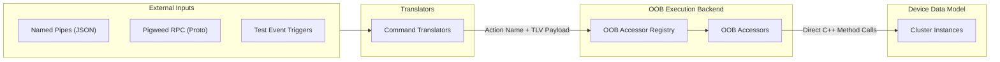
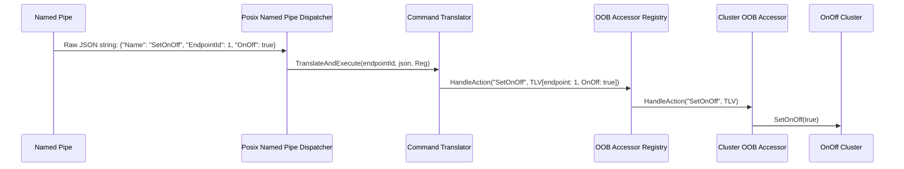

# Out-of-Band Control Architecture

This document describes the Out-of-Band (OOB) control architecture in
`all-devices-app`.

OOB control allows external interfaces (POSIX Named Pipes, Pigweed RPC, test
runners, platform buttons) to mutate cluster state, simulate sensor triggers,
and execute device actions independently of the Matter Interaction Model.

---

## 1. Core Architecture

The architecture separates **Transport Translation** from **Action Execution**:



### How OOB Control Works

-   **Single Control Surface**: `OOBAccessor` is the only mechanism to control
    simulated devices and clusters outside of the Matter protocol.
-   **Generic Action Dispatch**: An `OOBAccessor` receives a semantic action
    name and a TLV data buffer. The application maintains a registry of
    accessors and queries them in order:
    -   `std::nullopt`: The action is not supported by this accessor. Registry
        continues querying the next accessor.
    -   `CHIP_NO_ERROR`: The action was recognized and executed successfully.
        Dispatch terminates.
    -   Other `CHIP_ERROR`: The action was recognized by this accessor, but
        execution failed. Dispatch terminates immediately and propagates the
        error.
    -   If no registered accessor handles the action (all return
        `std::nullopt`), `HandleAction` returns `CHIP_ERROR_NOT_FOUND`.
-   **Transport Translation**: External protocols and transports (Named Pipe
    JSON, Pigweed RPC, Test Event Triggers) parse incoming requests, convert
    them into an action name and TLV payload, and forward them to
    `OOBAccessorRegistry`.
-   **Code Organization**:
    -   **Shared Cluster Accessors**: Accessors for common Matter clusters
        (e.g., `OnOff`, `OccupancySensing`) live in
        `all-devices-common/oob-accessors/clusters/` so any device containing
        that cluster reuses the same implementation.
    -   **Device-Specific Accessors & Translators**: Device implementations and their
        associated OOB accessor and named pipe registrations live together in
        `all-devices-common/device/types/<device-name>/`:
        -   Core logic and `OOBAccessors.h/.cpp` belong to the platform-neutral
            `:<device-name>` target.
        -   `NamedPipeTranslators.h/.cpp` belong to the target's `:<device-name>:posix`
            source set.
    -   **Platform Transport Infrastructure**: Dispatchers, hooks, and base interfaces
        (e.g., POSIX Named Pipes and JSON translators) live under
        `posix/named_pipe/` and `all-devices-common/oob-accessors/`.

---

## 2. Directory Layout

```text
examples/all-devices-app/
├── all-devices-common/
│   ├── device-factory/
│   │   ├── DeviceFactory.h                             # Variadic DeviceFactory<Hooks...> & SimpleDeviceFactory
│   │   └── BUILD.gn
│   ├── device/
│   │   └── types/
│   │       └── <device-name>/
│   │           ├── <DeviceName>.h/.cpp                 # Core device implementation (platform-neutral)
│   │           ├── OOBAccessors.h/.cpp                 # Device OOB accessor registration (platform-neutral)
│   │           ├── NamedPipeTranslators.h/.cpp         # POSIX NamedPipe translator registration (POSIX-specific)
│   │           └── BUILD.gn                            # GN targets: :<device-name>, :posix, :logging
│   └── oob-accessors/
│       ├── all_devices_config.gni                      # GN build configuration header generator
│       ├── all_devices_config.cmake                    # CMake build configuration header generator
│       ├── all_devices_config.h.in                     # CMake configuration template
│       ├── BUILD.gn                                    # GN rules for oob-accessors
│       ├── OOBAccessor.h                               # Base interface: HandleAction(action, tlvData)
│       ├── OOBAccessorHook.h                           # Static OOB accessor registration hook for DeviceFactory
│       ├── OOBAccessorRegistry.h                       # Active alias (InMemory vs Noop)
│       ├── InMemoryOOBAccessorRegistry.h/.cpp          # Container of registered OOBAccessors
│       ├── NoopOOBAccessorRegistry.h                   # Zero-cost inline stub for disabled targets
│       └── clusters/
│           └── <Cluster>OOBAccessor.h/.cpp             # Cluster accessors (e.g. OnOffOOBAccessor, OccupancyOOBAccessor)
└── posix/
    └── named_pipe/
        ├── BUILD.gn                                    # GN rules for POSIX dispatcher & translators
        ├── NamedPipeCommandTranslator.h                # Base interface: TranslateAndExecute(endpointId, json, registry)
        ├── NamedPipeHook.h                             # Static named pipe translator registration hook for DeviceFactory
        ├── PosixNamedPipeDispatcher.h/.cpp             # POSIX pipe listener & JSON command router
        └── translators/
            └── <Command>Translator.h/.cpp              # Command-specific JSON-to-TLV translators
```

---

## 3. Interfaces & Core Types

### `CreatedDevice` Struct

```cpp
namespace chip::app {

struct CreatedDevice
{
    std::unique_ptr<DeviceInterface> device;

    /**
     * @brief Optional callback to execute actions after endpoint registration.
     *
     * This callback MUST be invoked after `device->Register(...)` completes so that
     * any actions requiring a valid allocated EndpointId (such as registering OOB
     * cluster accessors or named pipe translators) have access to `device->GetEndpointId()`.
     */
    std::function<void()> onDeviceRegistered;
};

} // namespace chip::app
```

### `OOBAccessor` Interface

```cpp
namespace chip::app {

class OOBAccessor
{
public:
    virtual ~OOBAccessor() = default;

    /**
     * @brief Executes an out-of-band action on a target endpoint.
     * @param action Semantic action string (e.g. "SetOnOff", "SetOccupancy").
     * @param tlvData Encoded TLV payload containing endpoint ID and action parameters.
     * @return std::nullopt if action is not supported (registry continues dispatch).
     * @return CHIP_NO_ERROR if action was recognized and executed successfully.
     * @return Other CHIP_ERROR on execution failure (registry stops dispatch).
     *
     * @note Asynchronous Safety: The tlvData parameter is a non-owning temporary view valid
     *       only during synchronous execution of this call.
     */
    virtual std::optional<CHIP_ERROR> HandleAction(CharSpan action, ByteSpan tlvData) = 0;
};

} // namespace chip::app
```

### `InMemoryOOBAccessorRegistry` Class

```cpp
namespace chip::app {

class InMemoryOOBAccessorRegistry
{
public:
    static InMemoryOOBAccessorRegistry & Instance();

    /**
     * @brief Registers an OOB accessor instance.
     * @param accessor The accessor instance to register.
     */
    CHIP_ERROR Register(std::unique_ptr<OOBAccessor> accessor);

    /**
     * @brief Dispatches an action to registered accessors in order.
     * @return CHIP_NO_ERROR on success, CHIP_ERROR_NOT_FOUND if unhandled, or specific error on execution failure.
     */
    CHIP_ERROR HandleAction(CharSpan action, ByteSpan tlvData);

    /**
     * @brief Clears all registered accessors during device teardown.
     */
    void Clear() { mAccessors.clear(); }

private:
    std::vector<std::unique_ptr<OOBAccessor>> mAccessors;
};

} // namespace chip::app
```

### `NoopOOBAccessorRegistry` Class

```cpp
namespace chip::app {

class NoopOOBAccessorRegistry
{
public:
    static NoopOOBAccessorRegistry & Instance();

    CHIP_ERROR Register(std::unique_ptr<OOBAccessor> /* accessor */) { return CHIP_NO_ERROR; }
    CHIP_ERROR HandleAction(CharSpan /* action */, ByteSpan /* tlvData */) { return CHIP_ERROR_NOT_FOUND; }
    void Clear() {}
};

} // namespace chip::app
```

### `OOBAccessorHook` Class

```cpp
namespace chip::app {

class OOBAccessorHook
{
public:
    template <typename TDevice>
    static void OnDeviceRegistered(TDevice & device)
    {
        if constexpr (detail::HasOOBAccessors<TDevice>::value)
        {
            RegisterOOBAccessors(device, OOBAccessorRegistry::Instance());
        }
    }
};

} // namespace chip::app
```

### `NamedPipeHook` Class

```cpp
namespace chip::app {

class NamedPipeHook
{
public:
    template <typename TDevice>
    static void OnDeviceRegistered(TDevice & device)
    {
        if constexpr (detail::HasNamedPipeTranslators<TDevice>::value)
        {
            RegisterNamedPipeTranslators(device, PosixNamedPipeDispatcher::Instance());
        }
    }
};

} // namespace chip::app
```

### `NamedPipeCommandTranslator` Interface

```cpp
namespace chip::app {

class OOBAccessorRegistry;

class NamedPipeCommandTranslator
{
public:
    virtual ~NamedPipeCommandTranslator() = default;

    /**
     * @brief Translates a JSON payload into TLV and executes the action via OOBAccessorRegistry.
     * @param endpointId Target endpoint ID.
     * @param json Parsed JSON payload from named pipe.
     * @param registry Target registry to dispatch the translated action.
     */
    virtual CHIP_ERROR TranslateAndExecute(EndpointId endpointId, const Json::Value & json, OOBAccessorRegistry & registry) = 0;
};

} // namespace chip::app
```

### `PosixNamedPipeDispatcher` Interface

```cpp
namespace chip::app {

class PosixNamedPipeDispatcher
{
public:
    static PosixNamedPipeDispatcher & Instance();

    explicit PosixNamedPipeDispatcher(OOBAccessorRegistry & oobRegistry) :
        mOobRegistry(oobRegistry) {}
    ~PosixNamedPipeDispatcher();

    CHIP_ERROR Start(const char * fifoPath);
    CHIP_ERROR Stop();

    bool HasTranslator(CharSpan actionName) const;
    CHIP_ERROR RegisterTranslator(CharSpan actionName, std::shared_ptr<NamedPipeCommandTranslator> translator);

    /**
     * @brief Registers a translator if not already present, deduping by TranslatorType::GetActionNames().
     */
    template <typename TranslatorType>
    CHIP_ERROR EnsureTranslatorRegistered()
    {
        for (const auto & action : TranslatorType::GetActionNames())
        {
            if (HasTranslator(action))
            {
                return CHIP_NO_ERROR;
            }
        }
        auto translator = std::make_shared<TranslatorType>();
        for (const auto & action : TranslatorType::GetActionNames())
        {
            ReturnErrorOnFailure(RegisterTranslator(action, translator));
        }
        return CHIP_NO_ERROR;
    }

    CHIP_ERROR DispatchJson(const Json::Value & json);

private:
    OOBAccessorRegistry & mOobRegistry;
    std::unordered_map<std::string, std::shared_ptr<NamedPipeCommandTranslator>> mTranslators;
};

} // namespace chip::app
```

---

## 4. Execution Flow

### Named Pipe Command Flow



1.  **Ingress**: External process writes JSON string to named pipe (e.g.
    `/tmp/chip_all_devices_fifo`):
    ```json
    {
        "Name": "SetOnOff",
        "EndpointId": 1,
        "OnOff": true
    }
    ```
2.  **Dispatch**: `PosixNamedPipeDispatcher` reads pipe, parses JSON, and
    extracts `"Name"` and `"EndpointId"`.
3.  **Translation**: Dispatcher invokes
    `OnOffTranslator::TranslateAndExecute(endpointId, json, mOobRegistry)`:
    -   Extracts `OnOff = true`.
    -   Encodes flat TLV payload:
        -   Tag 1: `EndpointId` (`uint16_t`)
        -   Tag 2: `OnOff` (`bool`)
    -   Calls `registry.HandleAction("SetOnOff", tlvBuffer)`.
4.  **Execution**: `OOBAccessorRegistry` routes to `OnOffOOBAccessor` registered
    for Endpoint 1:
    -   Decodes TLV fields.
    -   Calls `mCluster.SetOnOff(true)` on target cluster instance.

> [!NOTE]
>
> **Thread Safety & Stack Synchronization**: The POSIX named pipe listener runs
> on a background worker thread. When a command is received,
> `PosixNamedPipeDispatcher` synchronizes execution onto the Matter event loop
> via `chip::DeviceLayer::PlatformMgr().ScheduleWork(...)` or acquires
> `chip::DeviceLayer::PlatformMgr().LockChipStack()` before invoking
> `HandleAction` on `OOBAccessorRegistry`.

---

## 5. Adding OOB Support for a Device

### Step 1: Register Cluster OOB Accessors (Platform-Neutral)

In `all-devices-common/device/types/<device-name>/OOBAccessors.h`:

```cpp
#pragma once
#include <oob-accessors/OOBAccessorRegistry.h>

namespace chip::app {

class OnOffLight;

void RegisterOOBAccessors(OnOffLight & device, OOBAccessorRegistry & registry);

} // namespace chip::app
```

In `all-devices-common/device/types/<device-name>/OOBAccessors.cpp`:

```cpp
#include "OOBAccessors.h"
#include "OnOffLight.h"

#if ALL_DEVICES_APP_ENABLE_OOB_ACCESSORS
#include <oob-accessors/clusters/OnOffOOBAccessor.h>
#endif

namespace chip::app {

void RegisterOOBAccessors(OnOffLight & device, OOBAccessorRegistry & registry)
{
#if ALL_DEVICES_APP_ENABLE_OOB_ACCESSORS
    registry.Register(std::make_unique<OnOffOOBAccessor>(device.OnOffCluster(), device.GetEndpointId()));
#endif
}

} // namespace chip::app
```

### Step 2: Register Named Pipe Translators (POSIX-Only)

In `all-devices-common/device/types/<device-name>/NamedPipeTranslators.h`:

```cpp
#pragma once
#include <posix/named_pipe/PosixNamedPipeDispatcher.h>

namespace chip::app {

class OnOffLight;

void RegisterNamedPipeTranslators(OnOffLight & device, PosixNamedPipeDispatcher & dispatcher);

} // namespace chip::app
```

In `all-devices-common/device/types/<device-name>/NamedPipeTranslators.cpp`:

```cpp
#include "NamedPipeTranslators.h"
#include <posix/named_pipe/translators/OnOffTranslator.h>

namespace chip::app {

void RegisterNamedPipeTranslators(OnOffLight & device, PosixNamedPipeDispatcher & dispatcher)
{
    dispatcher.EnsureTranslatorRegistered<OnOffTranslator>();
}

} // namespace chip::app
```

### Step 3: Define Granular GN Sub-Targets

In `all-devices-common/device/types/<device-name>/BUILD.gn`:

```text
import("//build_overrides/chip.gni")

# Platform-neutral device target (used by all platforms)
source_set("<device-name>") {
  sources = [
    "<DeviceName>.cpp",
    "<DeviceName>.h",
    "OOBAccessors.cpp",
    "OOBAccessors.h",
  ]

  public_deps = [
    "${chip_root}/examples/all-devices-app/all-devices-common/oob-accessors",
  ]
}

# POSIX target for named pipe translator registration
source_set("posix") {
  sources = [
    "NamedPipeTranslators.cpp",
    "NamedPipeTranslators.h",
  ]

  public_deps = [
    ":<device-name>",
    "${chip_root}/examples/all-devices-app/posix/named_pipe",
  ]
}
```

### Step 4: Factory Creation & Application Lifecycle

In `DeviceFactory.h` (creator registration):

```cpp
RegisterCreator("on-off-light", [this](const std::string & label) -> CreatedDevice {
    VerifyOrDie(mContext.has_value());
    auto device = std::make_unique<LoggingOnOffLight>(LoggingOnOffLight::Context{
        .groupDataProvider = mContext->groupDataProvider,
        .fabricTable       = mContext->fabricTable,
        .timerDelegate     = mContext->timerDelegate,
    });
    auto * rawDevice = device.get();

    return CreatedDevice{
        .device = std::move(device),
        .onDeviceRegistered = MakeOnDeviceRegisteredCallback(rawDevice),
    };
});
```

In application initialization (`posix/main.cpp` and embedded setup):

```cpp
// In posix/main.cpp:
using PosixDeviceFactory = DeviceFactory<OOBAccessorHook, NamedPipeHook>;

for (const auto & entry : AppOptions::GetDeviceTypeEntries())
{
    // 1. Create device + post-registration callback via factory
    auto created = PosixDeviceFactory::GetInstance().Create(entry.type, entry.label);
    VerifyOrReturnError(created.device != nullptr, CHIP_ERROR_NO_MEMORY);

    // 2. Register endpoint with data model provider (allocates valid endpoint ID)
    ReturnErrorOnFailure(
        created.device->Register(endpointIdAllocator, mDataModelProvider, EndpointComposition::WithParent(entry.parentId)));

    // 3. Invoke post-registration callback once EndpointId is assigned
    if (created.onDeviceRegistered)
    {
        created.onDeviceRegistered();
    }

    mConstructedDevices.push_back(std::move(created.device));
}

// 4. Start named pipe listener in POSIX main
mNamedPipeDispatcher.Start(kDefaultFifoPath);
```

---

## 6. Build Configuration & Target Isolation

Target separation prevents platform-specific dependencies from leaking into
embedded builds:

-   **POSIX GN Target (`posix/BUILD.gn`)**: Pulls the platform-neutral device
    targets and the `posix/named_pipe` dispatcher target.
-   **Embedded GN Targets (`silabs/BUILD.gn`)**: Pulls only the platform-neutral
    base target `device/types/<name>` (and any `:silabs` / `:logging`
    sub-targets). POSIX dispatchers and named pipe headers are never referenced.
-   **Embedded CMake Targets (`esp32`, `telink`)**: `enabled_devices.cmake`
    collects `${DEVICE_DIR}/<DeviceName>.cpp` and
    `${DEVICE_DIR}/OOBAccessors.cpp`.

Configuration defines are generated into `app_config/all_devices_config.h` for
both GN and CMake:

-   **GN Build** (`oob-accessors/all_devices_config.gni`): Uses
    `buildconfig_header` to emit `app_config/all_devices_config.h`.
-   **CMake Build** (`oob-accessors/all_devices_config.cmake`): Uses
    `configure_file` with `all_devices_config.h.in` to emit
    `${CMAKE_CURRENT_BINARY_DIR}/app_config/all_devices_config.h`.

| Build Target / Flag                      | `ALL_DEVICES_APP_ENABLE_NAMED_PIPES` | `PW_RPC_ENABLED` (via `chip_enable_pw_rpc`) | `ALL_DEVICES_APP_ENABLE_OOB_ACCESSORS` |
| :--------------------------------------- | :----------------------------------- | :------------------------------------------ | :------------------------------------- |
| POSIX Linux (`all-devices-app`)          | 1                                    | 0 (or 1 if `chip_enable_pw_rpc`)            | 1                                      |
| Embedded Targets (ESP32, SiLabs, Telink) | 0                                    | 0                                           | 0                                      |

Header aliasing in `all-devices-common/oob-accessors/OOBAccessorRegistry.h`:

```cpp
#pragma once
#include <app_config/all_devices_config.h>

#if ALL_DEVICES_APP_ENABLE_OOB_ACCESSORS
#include <oob-accessors/InMemoryOOBAccessorRegistry.h>
#else
#include <oob-accessors/NoopOOBAccessorRegistry.h>
#endif

namespace chip::app {

#if ALL_DEVICES_APP_ENABLE_OOB_ACCESSORS
using OOBAccessorRegistry = InMemoryOOBAccessorRegistry;
#else
using OOBAccessorRegistry = NoopOOBAccessorRegistry;
#endif

} // namespace chip::app
```

