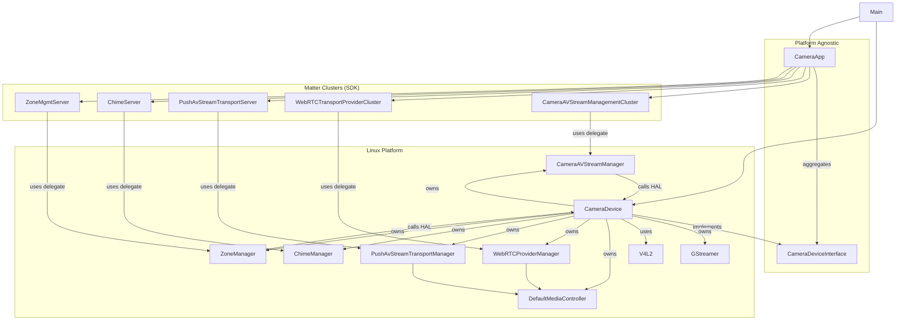
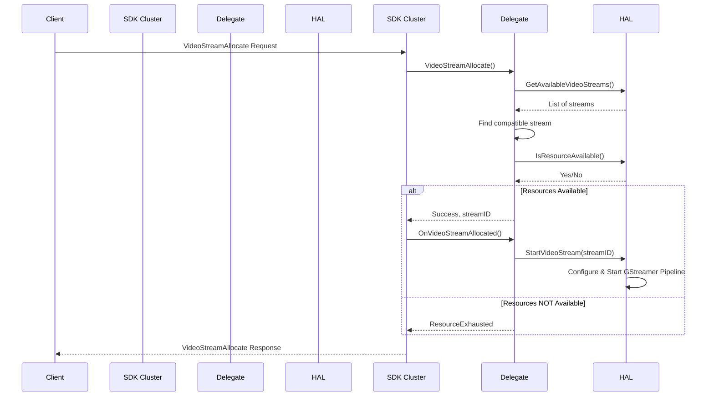
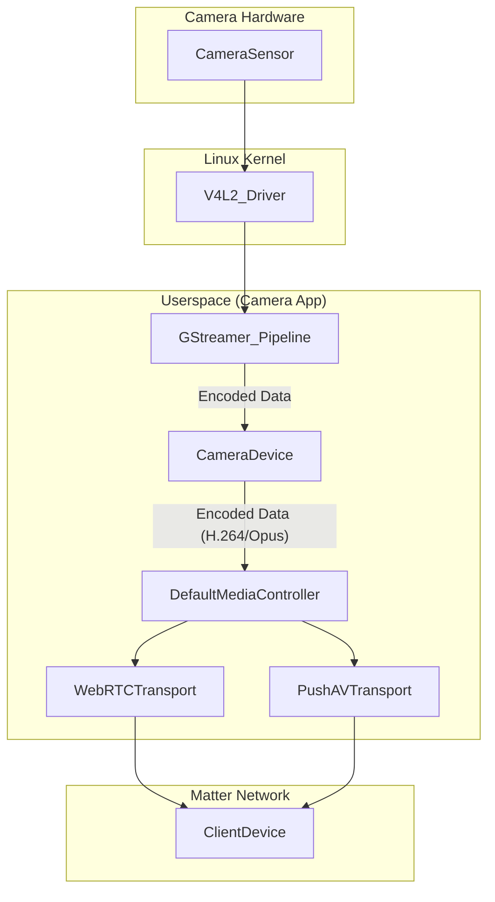

# Camera App Architecture and Design

This document provides a detailed overview of the design and architecture of the
Matter camera application, focusing on the Linux implementation.

## High-Level Architecture

The camera application is designed with a clear separation between the generic
Matter cluster logic and the platform-specific hardware abstraction. This is
achieved through the use of a `CameraDeviceInterface`, which defines the
contract that any platform-specific camera implementation must adhere to.

The core components are:

-   **Camera App (`CameraApp`):** Responsible for initializing and managing the
    Matter clusters related to camera functionality. It is platform-agnostic and
    interacts with the hardware through the `CameraDeviceInterface`.
-   **Camera Device (`CameraDevice`):** The Linux-specific implementation of the
    `CameraDeviceInterface`. It manages the camera hardware, using V4L2 and
    GStreamer, and provides the necessary delegates for the Matter clusters.
-   **Media Controller (`DefaultMediaController`):** The central hub for media
    data distribution. It receives encoded media frames from the `CameraDevice`
    and distributes them to the various transport managers.
-   **Transport Managers (`WebRTCProviderManager`,
    `PushAvStreamTransportManager`):** These classes manage the specific
    transport protocols for streaming media to clients.
-   **Matter Clusters:** The various Matter clusters that expose the camera's
    functionality to the Matter network (e.g., `CameraAVStreamManagement`,
    `WebRTCTransportProvider`).

This layered architecture allows for easy porting of the camera application to
other platforms by simply providing a new implementation of the
`CameraDeviceInterface`.

## Component Breakdown

### `CameraApp`

-   **Responsibilities:**
    -   Initializes and configures the Matter clusters for camera functionality
        (e.g., `CameraAVStreamManagementCluster`,
        `WebRTCTransportProviderCluster`, `ChimeServer`).
    -   Fetches camera capabilities and settings from the
        `CameraDeviceInterface` to configure the clusters.
    -   Manages the lifecycle of the cluster servers.
-   **Key Interactions:**
    -   Takes a `CameraDeviceInterface` pointer in its constructor.
    -   Calls methods on the `CameraDeviceInterface` to get delegates and
        hardware information.

### `CameraDeviceInterface`

-   **Responsibilities:**
    -   Defines the abstract interface for a camera device.
    -   Declares methods for accessing the various delegates required by the
        Matter clusters.
    -   Defines the `CameraHALInterface`, an inner interface that abstracts the
        hardware-specific operations (e.g., starting/stopping streams, taking
        snapshots).

### `CameraDevice`

-   **Responsibilities:**
    -   Implements the `CameraDeviceInterface` and
        `CameraDeviceInterface::CameraHALInterface` for the Linux platform.
    -   Manages the video device using V4L2.
    -   Uses GStreamer to create and manage pipelines for video and audio
        streaming, as well as snapshots.
    -   Instantiates and manages the various manager classes that implement the
        cluster delegate logic (e.g., `CameraAVStreamManager`,
        `WebRTCProviderManager`).
    -   Instantiates the `DefaultMediaController` and passes the encoded media
        frames to it.
    -   Maintains the state of the camera device (e.g., pan, tilt, zoom, privacy
        modes).
    -   Provides the `CameraHALInterface` implementation to the
        `CameraAVStreamManager`.
-   **Key Interactions:**
    -   Is instantiated in `main.cpp` and passed to `CameraAppInit`.
    -   The manager classes it contains are returned by the `Get...Delegate()`
        methods to the `CameraApp`.
    -   Its `CameraHALInterface` methods (like `StartVideoStream`,
        `StopVideoStream`) are called by `CameraAVStreamManager`.

### `DefaultMediaController`

-   **Responsibilities:**
    -   Acts as the central distribution point for all encoded media data (video
        and audio).
    -   Receives media frames from the `CameraDevice`'s GStreamer pipeline
        callbacks.
    -   Maintains a pre-roll buffer (`PushAVPreRollBuffer`) that stores a
        configurable duration of recent media frames. This is crucial for
        event-based recording, as it allows the recording to include footage
        from before the event occurred.
    -   Manages a list of registered transports (e.g., `WebRTCTransport`,
        `PushAVTransport`).
    -   When a new media frame is received, it is pushed to the pre-roll buffer,
        which then multicasts the frame to all interested and registered
        transports.
-   **Key Interactions:**
    -   Is owned by the `CameraDevice`.
    -   The `WebRTCProviderManager` and `PushAvStreamTransportManager` register
        their transport instances with the `MediaController`.

### Manager Classes and SDK Interaction

The manager classes in the camera-app are concrete implementations of the
delegate interfaces defined in the Matter SDK. They act as a bridge between the
generic cluster logic in the SDK and the specific hardware implementation in the
camera-app.

-   **`CameraAVStreamManager`:**

    -   **SDK Interface:**
        `chip::app::Clusters::CameraAvStreamManagement::CameraAVStreamManagementDelegate`
    -   **Responsibilities:** Implements the application-specific logic for the
        Camera AV Stream Management cluster. This includes:
        -   Handling requests to allocate, deallocate, and modify video, audio,
            and snapshot streams (`VideoStreamAllocate`, `AudioStreamAllocate`,
            etc.).
        -   Validating stream parameters against camera capabilities obtained
            from `CameraDeviceHAL`.
        -   Checking for resource availability (e.g., encoder slots).
        -   Interacting with the `CameraDevice` (specifically its
            `CameraHALInterface` implementation) to start and stop the GStreamer
            pipelines for the various streams (e.g., calling `StartVideoStream`,
            `StopVideoStream`).
        -   Notifying the SDK cluster of allocation/deallocation results.
    -   **Interaction with SDK:** The `CameraAVStreamManagementCluster` in the
        SDK calls the methods of the `CameraAVStreamManager` to handle the
        commands it receives from the Matter network. For example, when a
        `VideoStreamAllocate` command is received, the
        `CameraAVStreamManagementCluster` calls the `VideoStreamAllocate` method
        on the `CameraAVStreamManager`.
    -   **Interaction with `CameraDevice`:** It holds a
        `CameraDeviceInterface * mCameraDeviceHAL` pointer, set via
        `SetCameraDeviceHAL`. When a stream needs to be started, stopped, or
        modified, `CameraAVStreamManager` calls the appropriate method on
        `mCameraDeviceHAL->GetCameraHALInterface()`, e.g.,
        `mCameraDeviceHAL->GetCameraHALInterface().StartVideoStream(allocatedStream)`.

-   **`WebRTCProviderManager`:**

    -   **SDK Interface:**
        `chip::app::Clusters::WebRTCTransportProvider::Delegate`
    -   **Responsibilities:** Manages the lifecycle of WebRTC sessions for live
        streaming.
    -   **Session Initiation:**
        -   `HandleSolicitOffer`: When a client wants the camera to initiate the
            WebRTC handshake, this method creates a `WebrtcTransport`, generates
            an SDP Offer, and sends it to the client.
        -   `HandleProvideOffer`: When a client initiates the handshake, this
            method processes the received SDP Offer, creates a
            `WebrtcTransport`, generates an SDP Answer, and sends it back.
    -   **Handshake:** Manages the exchange of SDP messages and ICE candidates
        between the camera and the WebRTC client. It uses callbacks like
        `OnLocalDescription` to send the locally generated SDP, and
        `HandleProvideICECandidates` to process candidates from the client.
    -   **Media Flow:** Once the WebRTC connection is established
        (`OnConnectionStateChanged(Connected)`), it registers the
        `WebrtcTransport` with the `DefaultMediaController` to receive and send
        audio/video frames.
    -   **Stream Management:** Acquires and releases audio/video stream
        resources from `CameraAVStreamManager` using `AcquireAudioVideoStreams`
        and `ReleaseAudioVideoStreams`.
    -   **Privacy:** Handles `LiveStreamPrivacyModeChanged` to end sessions if
        live stream privacy is enabled.

-   **`PushAvStreamTransportManager`:**

    -   **SDK Interface:**
        `chip::app::Clusters::PushAvStreamTransport::Delegate`
    -   **Responsibilities:** Manages push-based AV streaming for event-based
        recording (e.g., CMAF).
    -   **Allocation:** `AllocatePushTransport` creates a `PushAVTransport`
        object for a given client request. This object is configured with
        details like container type (CMAF), segment duration, and target
        streams.
    -   **Registration:** The created `PushAVTransport` is registered with the
        `DefaultMediaController` to access media data, including the pre-roll
        buffer.
    -   **Triggering:**
        -   `ManuallyTriggerTransport`: Allows a client to force a recording.
        -   `HandleZoneTrigger`: Called by `CameraDevice` when a motion zone
            alarm is raised. This checks which `PushAVTransport` instances are
            configured for that zone and initiates the recording and upload
            process.
    -   **Bandwidth Management:** Validates that new or modified transport
        configurations do not exceed the camera's maximum network bandwidth
        (`ValidateBandwidthLimit`).
    -   **Session Management:** Monitors active recording sessions and can
        restart them to limit maximum session duration, generating new session
        IDs.

-   **`ChimeManager`:**
    -   **SDK Interface:** `chip::app::Clusters::Chime::Delegate`
    -   **Responsibilities:** Implements the logic for the Chime cluster.
    -   **Sound Management:** Provides a list of available chime sounds
        (`GetChimeSoundByIndex`).
    -   **Playback:** The `PlayChimeSound` command handler checks if the chime
        is enabled and logs the intent to play the selected sound. The current
        Linux example does not include actual audio playback for chimes.
    -   **Configuration:** Interacts with the `ChimeServer` to get the enabled
        state and selected chime ID.

*   **`ZoneManager`:**

    -   **SDK Interface:** `chip::app::Clusters::ZoneManagement::Delegate`
    -   **Responsibilities:**
        -   Manages the creation, update, and removal of 2D Cartesian zones.
        -   Handles the creation and management of triggers associated with
            zones (e.g., motion detection).
        -   Receives zone event notifications from the `CameraDevice` HAL (e.g.,
            `OnZoneTriggeredEvent`).
        -   Emits `ZoneTriggered` and `ZoneStopped` Matter events to
            subscribers.
        -   Manages trigger logic, including initial duration, augmentation
            duration, max duration, and blind duration using an internal timer.
    -   **Key Interactions:**
        -   `CreateTrigger`, `UpdateTrigger`, `RemoveTrigger` commands delegate
            to the `CameraHALInterface`.
        -   `CameraDevice` calls `OnZoneTriggeredEvent` on this manager when the
            HAL detects activity in a zone.
        -   `PushAvStreamTransportManager` is notified of zone triggers to start
            recordings.

*   **`CameraAVSettingsUserLevelManager`:**
    -   **SDK Interface:**
        `chip::app::Clusters::CameraAvSettingsUserLevelManagement::Delegate`
    -   **Responsibilities:** Handles user-level settings, including Pan, Tilt,
        Zoom.
    -   **Mechanical PTZ (MPTZ):**
        -   Commands like `MPTZSetPosition`, `MPTZRelativeMove`, and
            `MPTZMoveToPreset` are received from the SDK cluster.
        -   These commands are delegated to the `CameraHALInterface`
            (`CameraDevice`) to interact with the physical hardware (simulated
            in this app).
        -   The manager simulates the time taken for physical movement using a
            timer before responding to the command.
    -   **Digital PTZ (DPTZ):**
        -   `DPTZSetViewport`: Sets the digital viewport for a _specific
            allocated video stream ID_. It validates the requested viewport
            against the stream's resolution, aspect ratio, and the camera
            sensor's capabilities. The change is applied via
            `CameraHALInterface::SetViewport`.
        -   `DPTZRelativeMove`: Adjusts the current viewport of a specific video
            stream by a delta. Calculations are done to keep the viewport within
            bounds and maintain the aspect ratio.

## Interaction Diagrams

### Component Relationships

### Video Stream Allocation Sequence

### Push AV Transport Allocation Sequence

### WebRTC Livestream Setup Sequence (Client Offer)

### High-Level Data Flow

## Data Flow

### Video Streaming

1.  A Matter client requests a video stream from the `CameraAVStreamManagement`
    cluster.
2.  The `CameraAVStreamManagementCluster` (in the SDK) receives the request and
    calls the `VideoStreamAllocate` method on its delegate, the
    `CameraAVStreamManager`.
3.  The `CameraAVStreamManager` validates the request, checks for compatible
    stream configurations and available resources by querying the `CameraDevice`
    (HAL).
4.  If a stream can be allocated, `CameraAVStreamManager` updates the stream
    state.
5.  The SDK server informs the `CameraAVStreamManager` via
    `OnVideoStreamAllocated`.
6.  `CameraAVStreamManager` calls `StartVideoStream` on the `CameraDevice`'s
    `CameraHALInterface`.
7.  The `CameraDevice` creates and starts a GStreamer pipeline to handle the
    video stream. The pipeline is configured to:
    -   Read raw video frames from the V4L2 device (`v4l2src`).
    -   Convert the video frames to the I420 format (`videoconvert`).
    -   Encode the frames to H.264 (`x264enc`).
    -   Send the encoded frames to an `appsink`.
8.  The `appsink` has a callback function (`OnNewVideoSampleFromAppSink`) that
    is called for each new frame.
9.  In the callback, the encoded H.264 data is retrieved and passed to the
    `DefaultMediaController`.
10. The `DefaultMediaController` pushes the frame to its pre-roll buffer, which
    then distributes it to all registered transports.
11. For a live stream, the `WebRTCTransport` receives the frame and sends it
    over the established WebRTC connection to the client.
12. For an event-based recording, the `PushAVTransport` receives the frame and
    includes it in the recording that is pushed to the client.

### Snapshot

1.  A Matter client requests a snapshot from the `CameraAVStreamManagement`
    cluster.
2.  The `CameraAVStreamManagementCluster` receives the request and calls the
    `CaptureSnapshot` method on the `CameraAVStreamManager`.
3.  `CameraAVStreamManager` delegates the call to
    `CameraDevice::CaptureSnapshot`.
4.  The `CameraDevice` (if a snapshot stream is not running) creates a GStreamer
    pipeline to capture a single frame. The pipeline is configured to:
    -   Read a frame from the V4L2 device (`v4l2src` or `libcamerasrc`).
    -   Encode the frame as a JPEG (`jpegenc`).
    -   Save the JPEG to a file (`multifilesink`).
5.  The `CameraDevice` then reads the JPEG file from disk and sends the data
    back to the client as the response to the snapshot request.

## GStreamer Integration

GStreamer is used extensively in the `CameraDevice` to handle all media
processing. The `CameraDevice` class contains helper methods
(`CreateVideoPipeline`, `CreateAudioPipeline`, `CreateSnapshotPipeline`,
`CreateAudioPlaybackPipeline`) that construct these GStreamer pipelines.
Pipelines are dynamically created, started, and stopped based on requests from
the Matter clusters, as orchestrated by the various managers (especially
`CameraAVStreamManager`).

-   **Video Streaming (`CreateVideoPipeline`):**

    -   **Source:** `v4l2src` (or `videotestsrc` for testing) to capture from
        the camera device.
    -   **Caps Negotiation:** `capsfilter` to set resolution and framerate.
    -   **Format Conversion:** `videoconvert` to ensure the format is suitable
        for the encoder (e.g., I420).
    -   **Encoding:** `x264enc` for H.264 encoding.
    -   **Sink:** `appsink` with the `OnNewVideoSampleFromAppSink` callback.
        This callback receives the encoded H.264 buffers and passes them to
        `DefaultMediaController::DistributeVideo`.
    -   **Lifecycle:** Started by `CameraDevice::StartVideoStream`, stopped by
        `CameraDevice::StopVideoStream`.

-   **Audio Streaming (`CreateAudioPipeline`):**

    -   **Source:** `pulsesrc` (or `audiotestsrc` for testing).
    -   **Caps Negotiation:** `capsfilter` to set sample rate, channels.
    -   **Format Conversion:** `audioconvert` and `audioresample`.
    -   **Encoding:** `opusenc` for Opus encoding.
    -   **Sink:** `appsink` with the `OnNewAudioSampleFromAppSink` callback,
        which passes encoded Opus buffers to
        `DefaultMediaController::DistributeAudio`.
    -   **Lifecycle:** Started by `CameraDevice::StartAudioStream`, stopped by
        `CameraDevice::StopAudioStream`.

-   **Snapshots (`CreateSnapshotPipeline`):**

    -   **Source:** `v4l2src` or `libcamerasrc` depending on camera type.
    -   **Caps Negotiation:** `capsfilter` for resolution/format.
    -   **Encoding:** `jpegenc` to create a JPEG image.
    -   **Sink:** `multifilesink` to save the JPEG to a temporary file
        (`SNAPSHOT_FILE_PATH`). The `CameraDevice::CaptureSnapshot` method then
        reads this file.
    -   **Lifecycle:** Created on-demand when `CameraDevice::CaptureSnapshot` is
        called and a snapshot stream is active.

-   **Audio Playback (`CreateAudioPlaybackPipeline`):**
    -   **Source:** `udpsrc` to receive RTP Opus packets from the network (e.g.,
        from a WebRTC session).
    -   **Jitter Buffer:** `rtpjitterbuffer` to handle network jitter.
    -   **Depacketization:** `rtpopusdepay` to extract Opus frames from RTP.
    -   **Decoding:** `opusdec` to decode Opus audio.
    -   **Output:** `audioconvert`, `audioresample`, and `autoaudiosink` to play
        the audio on the device speakers.
    -   **Lifecycle:** Started by `CameraDevice::StartAudioPlaybackStream`,
        stopped by `CameraDevice::StopAudioPlaybackStream`.

The state of these pipelines (e.g., NULL, READY, PLAYING) is managed using
`gst_element_set_state`. Callbacks on `appsink` elements are crucial for linking
GStreamer's data flow to the Matter application logic.
