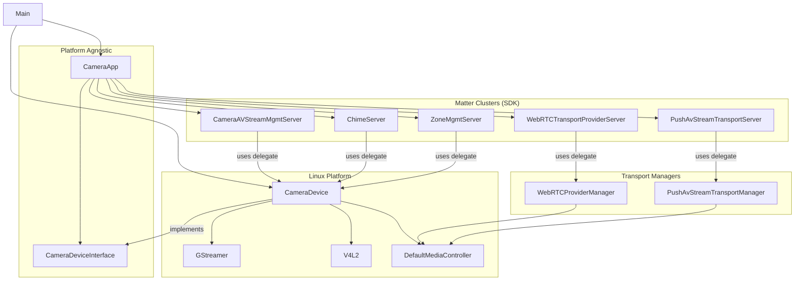
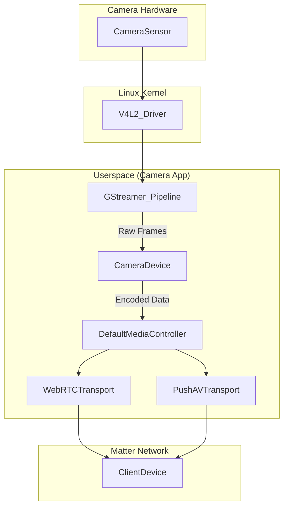

# Camera App Architecture and Design

This document provides a detailed overview of the design and architecture of the Matter camera application, focusing on the Linux implementation.

## High-Level Architecture

The camera application is designed with a clear separation between the generic Matter cluster logic and the platform-specific hardware abstraction. This is achieved through the use of a `CameraDeviceInterface`, which defines the contract that any platform-specific camera implementation must adhere to.

The core components are:

*   **Camera App (`CameraApp`):** Responsible for initializing and managing the Matter clusters related to camera functionality. It is platform-agnostic and interacts with the hardware through the `CameraDeviceInterface`.
*   **Camera Device (`CameraDevice`):** The Linux-specific implementation of the `CameraDeviceInterface`. It manages the camera hardware, using V4L2 and GStreamer, and provides the necessary delegates for the Matter clusters.
*   **Media Controller (`DefaultMediaController`):** The central hub for media data distribution. It receives encoded media frames from the `CameraDevice` and distributes them to the various transport managers.
*   **Transport Managers (`WebRTCProviderManager`, `PushAvStreamTransportManager`):** These classes manage the specific transport protocols for streaming media to clients.
*   **Matter Clusters:** The various Matter clusters that expose the camera's functionality to the Matter network (e.g., `CameraAVStreamManagement`, `WebRTCTransportProvider`).

This layered architecture allows for easy porting of the camera application to other platforms by simply providing a new implementation of the `CameraDeviceInterface`.

## Component Breakdown

### `CameraApp`

*   **Responsibilities:**
    *   Initializes and configures the Matter clusters for camera functionality (e.g., `CameraAVStreamMgmtServer`, `WebRTCTransportProviderServer`, `ChimeServer`).
    *   Fetches camera capabilities and settings from the `CameraDeviceInterface` to configure the clusters.
    *   Manages the lifecycle of the cluster servers.
*   **Key Interactions:**
    *   Takes a `CameraDeviceInterface` pointer in its constructor.
    *   Calls methods on the `CameraDeviceInterface` to get delegates and hardware information.

### `CameraDeviceInterface`

*   **Responsibilities:**
    *   Defines the abstract interface for a camera device.
    *   Declares methods for accessing the various delegates required by the Matter clusters.
    *   Defines the `CameraHALInterface`, an inner interface that abstracts the hardware-specific operations (e.g., starting/stopping streams, taking snapshots).

### `CameraDevice`

*   **Responsibilities:**
    *   Implements the `CameraDeviceInterface` and `CameraDeviceInterface::CameraHALInterface` for the Linux platform.
    *   Manages the video device using V4L2.
    *   Uses GStreamer to create and manage pipelines for video and audio streaming, as well as snapshots.
    *   Instantiates and manages the various manager classes that implement the cluster delegate logic (e.g., `CameraAVStreamManager`, `WebRTCProviderManager`).
    *   Instantiates the `DefaultMediaController` and passes the encoded media frames to it.
    *   Maintains the state of the camera device (e.g., pan, tilt, zoom, privacy modes).
*   **Key Interactions:**
    *   Is instantiated in `main.cpp` and passed to `CameraAppInit`.
    *   The manager classes it contains are returned by the `Get...Delegate()` methods to the `CameraApp`.

### `DefaultMediaController`

*   **Responsibilities:**
    *   Acts as the central distribution point for all encoded media data (video and audio).
    *   Receives media frames from the `CameraDevice`.
    *   Maintains a pre-roll buffer (`PushAVPreRollBuffer`) that stores a configurable duration of recent media frames. This is crucial for event-based recording, as it allows the recording to include footage from before the event occurred.
    *   Manages a list of registered transports (e.g., `WebRTCTransport`, `PushAVTransport`).
    *   When a new media frame is received, it is pushed to the pre-roll buffer, which then multicasts the frame to all interested and registered transports.
*   **Key Interactions:**
    *   Is owned by the `CameraDevice`.
    *   The `WebRTCProviderManager` and `PushAvStreamTransportManager` register their transport instances with the `MediaController`.

### Manager Classes and SDK Interaction

The manager classes in the camera-app are concrete implementations of the delegate interfaces defined in the Matter SDK. They act as a bridge between the generic cluster logic in the SDK and the specific hardware implementation in the camera-app.

*   **`CameraAVStreamManager`:**
    *   **SDK Interface:** `chip::app::Clusters::CameraAvStreamManagement::CameraAVStreamMgmtDelegate`
    *   **Responsibilities:** Implements the application-specific logic for the Camera AV Stream Management cluster. This includes:
        *   Handling requests to allocate, deallocate, and modify video, audio, and snapshot streams.
        *   Interacting with the `CameraDevice` to start and stop the GStreamer pipelines for the various streams.
        *   Validating stream parameters and managing stream resources.
    *   **Interaction with SDK:** The `CameraAVStreamMgmtServer` in the SDK calls the methods of the `CameraAVStreamManager` to handle the commands it receives from the Matter network. For example, when a `VideoStreamAllocate` command is received, the `CameraAVStreamMgmtServer` calls the `VideoStreamAllocate` method on the `CameraAVStreamManager`.

*   **`WebRTCProviderManager`:**
    *   **SDK Interface:** `chip::app::Clusters::WebRTCTransportProvider::Delegate`
    *   **Responsibilities:** Manages the lifecycle of WebRTC sessions for live streaming. This includes:
        *   Handling `SolicitOffer` and `ProvideOffer` requests from clients.
        *   Creating and managing `WebrtcTransport` instances for each session.
        *   Handling the exchange of SDP offers/answers and ICE candidates.
        *   Registering the `WebrtcTransport` instances with the `MediaController` so they can receive live media data.

*   **`PushAvStreamTransportManager`:**
    *   **SDK Interface:** `chip::app::Clusters::PushAvStreamTransport::Delegate`
    *   **Responsibilities:** Manages push-based AV streaming, which is typically used for event-based recording. This includes:
        *   Allocating and deallocating `PushAVTransport` instances based on client requests.
        *   Managing the bandwidth used by push transports.
        *   Triggering transports based on events (e.g., motion detection).
        *   Registering the `PushAVTransport` instances with the `MediaController` to receive media data from the pre-roll buffer.

*   **`ChimeManager`:**
    *   **SDK Interface:** `chip::app::Clusters::Chime::Delegate`
    *   **Responsibilities:** Implements the logic for the Chime cluster, which is used to play sounds on the camera device.

*   **`ZoneManager`:**
    *   **SDK Interface:** `chip::app::Clusters::ZoneManagement::Delegate`
    *   **Responsibilities:** Implements the logic for the Zone Management cluster, which is used to define and manage zones for motion detection and other purposes.

*   **`CameraAVSettingsUserLevelManager`:**
    *   **SDK Interface:** `chip::app::Clusters::CameraAvSettingsUserLevelManagement::Delegate`
    *   **Responsibilities:** Implements the logic for the Camera AV Settings User Level Management cluster, which allows for user-level configuration of camera settings.

## Interaction Diagrams

### Component Relationships

### High-Level Data Flow

## Data Flow

### Video Streaming

1.  A Matter client requests a video stream from the `CameraAVStreamManagement` cluster.
2.  The `CameraAVStreamMgmtServer` (in the SDK) receives the request and calls the `VideoStreamAllocate` method on its delegate, the `CameraAVStreamManager`.
3.  The `CameraAVStreamManager` validates the request and interacts with the `CameraDevice` to allocate a video stream and determine the appropriate parameters (resolution, framerate, etc.).
4.  The `CameraDevice` creates a GStreamer pipeline to handle the video stream. The pipeline is configured to:
    *   Read raw video frames from the V4L2 device (`v4l2src`).
    *   Convert the video frames to the I420 format (`videoconvert`).
    *   Encode the frames to H.264 (`x264enc`).
    *   Send the encoded frames to an `appsink`.
5.  The `appsink` has a callback function (`OnNewVideoSampleFromAppSink`) that is called for each new frame.
6.  In the callback, the encoded H.264 data is retrieved and passed to the `DefaultMediaController`.
7.  The `DefaultMediaController` pushes the frame to its pre-roll buffer, which then distributes it to all registered transports.
8.  For a live stream, the `WebRTCTransport` receives the frame and sends it over the established WebRTC connection to the client.
9.  For an event-based recording, the `PushAVTransport` receives the frame and includes it in the recording that is pushed to the client.

### Snapshot

1.  A Matter client requests a snapshot from the `CameraAVStreamManagement` cluster.
2.  The `CameraAVStreamMgmtServer` receives the request and calls the `CaptureSnapshot` method on the `CameraAVStreamManager`.
3.  The `CameraDevice` creates a GStreamer pipeline to capture a single frame. The pipeline is configured to:
    *   Read a frame from the V4L2 device (`v4l2src` or `libcamerasrc`).
    *   Encode the frame as a JPEG (`jpegenc`).
    *   Save the JPEG to a file (`multifilesink`).
4.  The `CameraDevice` then reads the JPEG file from disk and sends the data back to the client as the response to the snapshot request.

## GStreamer Integration

GStreamer is used extensively in the `CameraDevice` to handle all media processing. Separate GStreamer pipelines are created for:

*   **Video Streaming:** As described in the "Data Flow" section.
*   **Audio Streaming:** A similar pipeline is created for audio, using `pulsesrc` (or `audiotestsrc`) to get raw audio, `opusenc` to encode it, and an `appsink` to send it to the `MediaController`.
*   **Snapshots:** A pipeline is created to capture a single frame and save it as a JPEG.
*   **Audio Playback:** A pipeline is created to receive audio from the network (via UDP) and play it out the speakers.

The `CameraDevice` class contains helper methods (`CreateVideoPipeline`, `CreateAudioPipeline`, `CreateSnapshotPipeline`) that construct these GStreamer pipelines. The pipelines are started and stopped as needed based on requests from the Matter clusters.