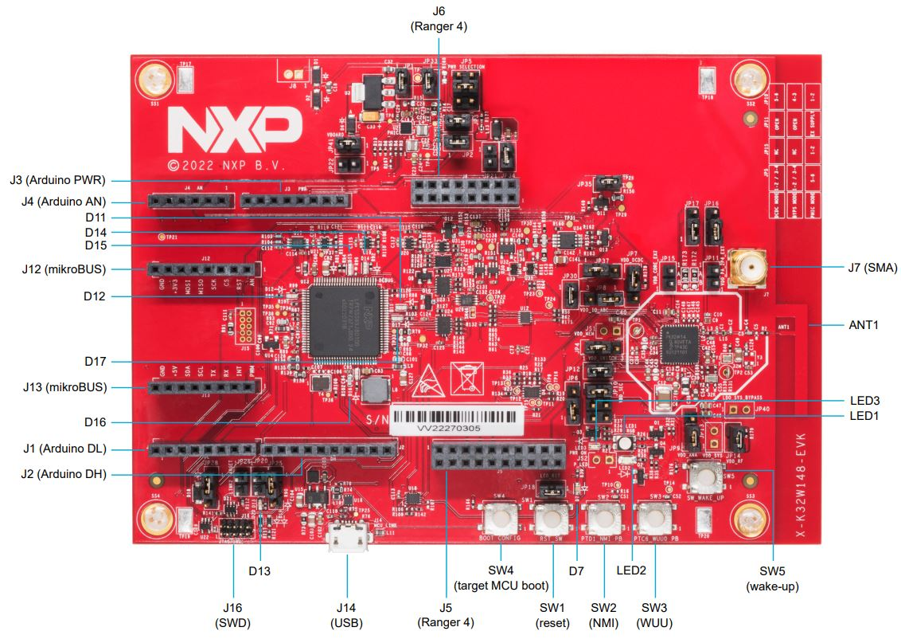

# Matter K32W1 Contact Sensor Example Application

For generic information related to contact sensor application, please see the
[common README](../README.md).

-   [Matter K32W1 Contact Sensor Example Application](#matter-k32w1-contact-sensor-example-application)
    -   [Introduction](#introduction)
    -   [Device UI](#device-ui)
    -   [Building](#building)
    -   [Flashing](#flashing)
        -   [Flashing the `NBU` image](#flashing-the-nbu-image)
        -   [Flashing the host image](#flashing-the-host-image)
    -   [Debugging](#debugging)
    -   [OTA](#ota)

## Introduction

This is a contact sensor application implemented for a k32w1 device.

The following board was used when testing this Matter reference app for a
`k32w1` device:


## Device UI

The state feedback is provided through LED effects:

| widget  | effect                              | description                                                                                           |
| ------- | ----------------------------------- | ----------------------------------------------------------------------------------------------------- |
| LED2    | short flash on (50ms on/950ms off)  | The device is in an unprovisioned (unpaired) state and is waiting for a commissioner to connect.      |
| LED2    | rapid even flashing (100ms period)  | The device is in an unprovisioned state and a commissioner is connected via BLE.                      |
| LED2    | short flash off (950ms on/50ms off) | The device is fully provisioned, but does not yet have full network (Thread) or service connectivity. |
| LED2    | solid on                            | The device is fully provisioned and has full network and service connectivity.                        |
| RGB LED | on                                  | The `StateValue` attribute of the `BooleanState` cluster is `true` (simulating detection).            |
| RGB LED | off                                 | The `StateValue` attribute of the `BooleanState` cluster is `false` (simulating no detection).        |

NOTE: `LED2` will be disabled when OTA is used. On K32W1 EVK board, `PTB0` is
wired to both `LED2` and CS (Chip Select) of the External Flash Memory. Since
the OTA image is stored in external memory, `LED2` operations will affect OTA
operation by corrupting packages and OTA will not work.

The user actions are summarized below:

| button | action       | state                                        | output                                                                                                                                 |
| ------ | ------------ | -------------------------------------------- | -------------------------------------------------------------------------------------------------------------------------------------- |
| SW2    | short press  | not commissioned                             | Enable BLE advertising                                                                                                                 |
| SW2    | short press  | commissioned + device is LIT                 | Enable Active Mode                                                                                                                     |
| SW2    | double press | commissioned + device is LIT + supports DSLS | Enable / Disable SIT Mode                                                                                                              |
| SW2    | long press   | NA                                           | Initiate a factory reset (can be cancelled by pressing the button again within the factory reset timeout limit - 6 seconds by default) |
| SW3    | short press  | NA                                           | Toggle attribute `StateValue` value                                                                                                    |
| SW3    | long press   | NA                                           | Clean soft reset of the device (takes into account proper Matter shutdown procedure)                                                   |

## Building

Manually building requires running the following commands:

```
user@ubuntu:~/Desktop/git/connectedhomeip$ cd examples/contact-sensor-app/nxp/k32w1
user@ubuntu:~/Desktop/git/connectedhomeip/examples/contact-sensor-app/nxp/k32w1$ gn gen out/debug
user@ubuntu:~/Desktop/git/connectedhomeip/examples/contact-sensor-app/nxp/k32w1$ ninja -C out/debug
```

Please note that running `gn gen out/debug` without `--args` option will use the
default gn args values found in `args.gni`.

After a successful build, the `elf` and `srec` files are found in `out/debug/`.
See the files prefixed with `chip-k32w1-contact-example`.

## Flashing

Two images must be written to the board: one for the host (CM33) and one for the
`NBU` (CM3).

The image needed on the host side is the one generated in `out/debug/` while the
one needed on the `NBU` side can be found in the downloaded NXP-SDK package at
path -
`middleware\wireless\ieee-802.15.4\bin\k32w1\k32w1_nbu_ble_15_4_dyn_matter.sb3`.

### Flashing the `NBU` image

`NBU` image should be written only when a new NXP-SDK is released.

[K32W148 board quick start guide](https://www.nxp.com/document/guide/getting-started-with-the-k32w148-development-platform:GS-K32W148EVK)
can be used for updating the `NBU/radio` core:

-   Section 2.5 – Get Software – install `SPSDK` (Secure Provisioning Command
    Line Tool)
-   Section 3.3 – Updating `NBU` for Wireless examples - use the corresponding
    `.sb3` file found in the SDK package at path
    `middleware\wireless\ieee-802.15.4\bin\k32w1\`

### Flashing the host image

Host image is the one found under `out/debug/`. It should be written after each
build process.

If debugging is needed then jump directly to the [Debugging](#debugging)
section. Otherwise, if only flashing is needed then
[JLink 7.84b or greater](https://www.segger.com/downloads/jlink/) can be used:

-   Plug K32W1 to the USB port (no need to keep the SW4 button pressed while
    doing this, e.g. ISP mode is not needed for host flashing)

-   Connect JLink to the device:

    ```bash
    JLinkExe -device K32W1480 -if SWD -speed 4000 -autoconnect 1
    ```

-   Run the following commands:
    ```bash
    reset
    halt
    loadfile chip-k32w1-contact-example.srec
    reset
    go
    quit
    ```

## Debugging

One option for debugging would be to use MCUXpresso IDE.

-   Drag-and-drop the zip file containing the NXP SDK in the "Installed SDKs"
    tab:


-   Import any demo application from the installed SDK:

```
Import SDK example(s).. -> choose a demo app (demo_apps -> hello_world) -> Finish
```


-   Flash the previously imported demo application on the board:

```
Right click on the application (from Project Explorer) -> Debug as -> JLink/CMSIS-DAP
```

After this step, a debug configuration specific for the K32W1 board was created.
This debug configuration will be used later on for debugging the application
resulted after ot-nxp compilation.

-   Import Matter repo in MCUXpresso IDE as Makefile Project. Use _none_ as
    _Toolchain for Indexer Settings_:

```
File -> Import -> C/C++ -> Existing Code as Makefile Project
```


-   Replace the path of the existing demo application with the path of the K32W1
    application:

```
Run -> Debug Configurations... -> C/C++ Application
```


## OTA

Please see
[k32w1 OTA guide](../../../../docs/guides/nxp/nxp_mcxw71_ota_guide.md).
