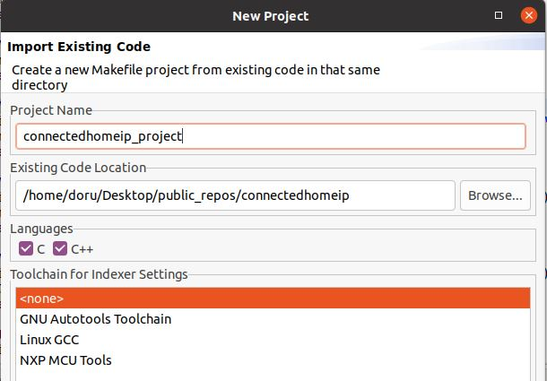

# Matter `MCXW71` Contact Sensor Example Application

For generic information related to contact sensor application, please see the
[common README](../README.md).

-   [Matter `MCXW71` Contact Sensor Example Application](#matter-mcxw71-contact-sensor-example-application)
    -   [Introduction](#introduction)
    -   [Device UI](#device-ui)
    -   [Building](#building)
    -   [Flashing](#flashing)
        -   [Flashing the `NBU` image](#flashing-the-nbu-image)
        -   [Flashing the host image](#flashing-the-host-image)
    -   [Debugging](#debugging)
    -   [OTA](#ota)

## Introduction

This is a contact sensor application implemented for an `mcxw71` device.

The following board was used when testing this Matter reference app for an
`mcxw71` device:


## Device UI

The state feedback is provided through LED effects:

| widget  | effect                              | description                                                                                           |
| ------- | ----------------------------------- | ----------------------------------------------------------------------------------------------------- |
| LED2    | short flash on (50ms on/950ms off)  | The device is in an unprovisioned (unpaired) state and is waiting for a commissioner to connect.      |
| LED2    | rapid even flashing (100ms period)  | The device is in an unprovisioned state and a commissioner is connected via BLE.                      |
| LED2    | short flash off (950ms on/50ms off) | The device is fully provisioned, but does not yet have full network (Thread) or service connectivity. |
| LED2    | solid on                            | The device is fully provisioned and has full network and service connectivity.                        |
| RGB LED | on                                  | The `StateValue` attribute of the `BooleanState` cluster is `true` (simulating detection).            |
| RGB LED | off                                 | The `StateValue` attribute of the `BooleanState` cluster is `false` (simulating no detection).        |

NOTE: `LED2` will be disabled when OTA is used. On `FRDM-MCXW71` board, `PTB0`
is wired to both `LED2` and CS (Chip Select) of the External Flash Memory. Since
the OTA image is stored in external memory, `LED2` operations will affect OTA
operation by corrupting packages and OTA will not work.

The user actions are summarized below:

| button | action       | state                                        | output                                                                                                                                 |
| ------ | ------------ | -------------------------------------------- | -------------------------------------------------------------------------------------------------------------------------------------- |
| SW2    | short press  | not commissioned                             | Enable BLE advertising                                                                                                                 |
| SW2    | short press  | commissioned + device is LIT                 | Enable Active Mode                                                                                                                     |
| SW2    | long press   | NA                                           | Initiate a factory reset (can be cancelled by pressing the button again within the factory reset timeout limit - 6 seconds by default) |
| SW2    | double press | commissioned + device is LIT + supports DSLS | Enable / Disable SIT Mode                                                                                                              |
| SW3    | short press  | NA                                           | Toggle attribute `StateValue` value                                                                                                    |
| SW3    | long press   | NA                                           | Clean soft reset of the device (takes into account proper Matter shutdown procedure)                                                   |

## Building

Manually building requires running the following commands:

```
user@ubuntu:~/Desktop/git/connectedhomeip$ cd examples/contact-sensor-app/nxp/mcxw71
user@ubuntu:~/Desktop/git/connectedhomeip/examples/contact-sensor-app/nxp/mcxw71$ gn gen out/debug
user@ubuntu:~/Desktop/git/connectedhomeip/examples/contact-sensor-app/nxp/mcxw71$ ninja -C out/debug
```

Please note that running `gn gen out/debug` without `--args` option will use the
default gn args values found in `args.gni`.

After a successful build, the `elf` and `srec` files are found in `out/debug/`.
See the files prefixed with `chip-mcxw71-contact-example`.

## Flashing

Two images must be written to the board: one for the host (CM33) and one for the
`NBU` (CM3).

### Flashing the `NBU` image

`NBU` image should be written only when a new NXP SDK is released.

1. Install
   [Secure Provisioning SDK tool](https://www.nxp.com/design/design-center/software/development-software/secure-provisioning-sdk-spsdk:SPSDK)
   using Python:

    ```
    pip install spsdk
    ```

    Note: There might be some dependencies that cause conflicts with already
    installed Python modules. However, `blhost` tool is still installed and can
    be used.

2. Updating `NBU` for Wireless examples

    It is necessary to work with the matching `NBU` image for the SDK version of
    the application you are working with. This means that when you download your
    SDK, prior to loading any wireless SDK example, update your `NBU` image with
    the SDK provided binaries. For `FRDM` users, please write the following
    binary:

    `middleware\wireless\ieee-802.15.4\bin\mcxw71\mcxw71_nbu_ble_15_4_dyn_matter_<nbu_version>.sb3`

    Please note that `<nbu_version>` may vary depending on the SDK version.

    1. Place your device in `ISP` mode.

        - Make sure a jumper is placed on `JP25`
        - Press and hold `SW4`, press and release Reset, then release `SW4`

    2. Once the device is connected, you may find the assigned port by running:

        ```
        nxpdevscan
        ```

    3. Run the `blhost` command to write the `sb3` file:

        ```
        blhost -p <assigned_port> receive-sb-file <path_to_SDK>\middleware\wireless\ieee-802.15.4\bin\mcxw71\mcxw71_nbu_ble_15_4_dyn_matter_<nbu_version>.sb3
        ```

### Flashing the host image

Host image is the one found under `out/debug/`. It should be written after each
build process.

If debugging is needed then jump directly to the [Debugging](#debugging)
section. Otherwise, if only flashing is needed then
[JLink](https://www.segger.com/downloads/jlink/) can be used:

-   Plug `MCXW71` to the USB port (no need to keep the `SW4` button pressed
    while doing this, e.g. ISP mode is not needed for host flashing)

-   Connect JLink to the device:

    ```bash
    JLinkExe -device MCXW71 -if SWD -speed 4000 -autoconnect 1
    ```

-   Run the following commands:
    ```bash
    reset
    halt
    loadfile chip-mcxw71-contact-example.srec
    reset
    go
    quit
    ```

## Debugging

One option for debugging would be to use MCUXpresso IDE.

-   Drag-and-drop the zip file containing the NXP SDK in the "Installed SDKs"
    tab:


-   Import any demo application from the installed SDK:

```
Import SDK example(s).. -> choose a demo app (demo_apps -> hello_world) -> Finish
```


-   Flash the previously imported demo application on the board:

```
Right click on the application (from Project Explorer) -> Debug as -> JLink/CMSIS-DAP
```

After this step, a debug configuration specific for the `MCXW71` board was
created. This debug configuration will be used later on for debugging the
application resulted after ot-nxp compilation.

-   Import Matter repo in MCUXpresso IDE as Makefile Project. Use _none_ as
    _Toolchain for Indexer Settings_:

```
File -> Import -> C/C++ -> Existing Code as Makefile Project
```



-   Replace the path of the existing demo application with the path of the
    `MCXW71` application:

```
Run -> Debug Configurations... -> C/C++ Application
```


## OTA

Please see
[mcxw71 OTA guide](../../../../docs/platforms/nxp/nxp_mcxw71_ota_guide.md).
