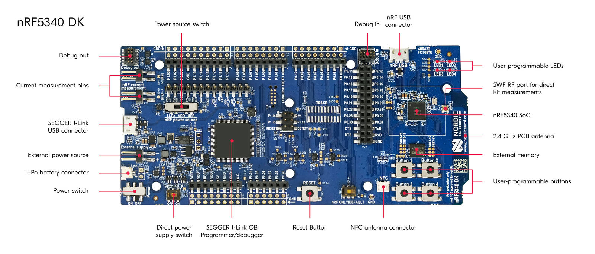
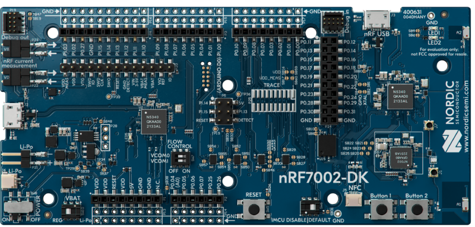

# Matter nRF Connect Light Switch Example Application

The nRF Connect Light Switch Example demonstrates how to remotely control a
lighting devices such as light bulbs or LEDs. The application should be used
together with the
[lighting app example](../../lighting-app/nrfconnect/README.md). The light
switch uses buttons to test changing the lighting application example LED state
and works as a brightness dimmer. You can use this example as a reference for
creating your own application.


The example is based on
[Matter](https://github.com/project-chip/connectedhomeip) and Nordic
Semiconductor's nRF Connect SDK, and was created to facilitate testing and
certification of a Matter device communicating over a low-power, 802.15.4 Thread
network, or Wi-Fi network.

The example behaves as a Matter accessory, that is a device that can be paired
into an existing Matter network and can be controlled by this network. In the
case of Thread, this device works as a Thread Sleepy End Device. Support for
both Thread and Wi-Fi is mutually exclusive and depends on the hardware
platform, so only one protocol can be supported for a specific light switch
device.

<hr>

## Overview

This example is running on the nRF Connect platform, which is based on Nordic
Semiconductor's
[nRF Connect SDK](https://developer.nordicsemi.com/nRF_Connect_SDK/doc/latest/nrf/index.html)
and [Zephyr RTOS](https://zephyrproject.org/). Visit Matter's
[nRF Connect platform overview](../../../docs/guides/nrfconnect_platform_overview.md)
to read more about the platform structure and dependencies.

By default, the Matter accessory device has IPv6 networking disabled. You must
pair it with the Matter controller over Bluetooth® LE to get the configuration
from the controller to use the device within a Thread or Wi-Fi network. You have
to make the device discoverable manually (for security reasons). See
[Bluetooth LE advertising](#bluetooth-le-advertising) to learn how to do this.
The controller must get the commissioning information from the Matter accessory
device and provision the device into the network.

You can test this application remotely over the Thread or the Wi-Fi protocol,
which in either case requires more devices, including a Matter controller that
you can configure either on a PC or a mobile device.

The sample uses buttons for controlling the bound device's LEDs. You can test it
in the following ways:

-   Standalone, using a single DK that runs the light switch application.

-   Remotely over the Thread or the Wi-Fi protocol, which in either case
    requires more devices, including a Matter controller that you can configure
    either on a PC or a mobile device.

In Matter, the following types of light switch devices are available:

-   Group 1: On/Off Light Switch, Dimmer Switch, Color Dimmer Switch, Control
    Bridge
-   Group 2: Generic Switch

The first type (here referred to as Group 1) uses client application clusters
(for example, Level Control) and bindings to send commands to the server
clusters. This type of switch is on the endpoint 1 of this example.

With the second type (Group 2), controllers can use event subscriptions to be
informed about changes on the switch server cluster. This type of switch is on
the endpoint 2 of this example.

### Group 1 light switch devices overview

A light switch device is a simple embedded controller, which has the ability to
control lighting devices, such as light bulbs or LEDs. After commissioning into
a Matter network, the light switch device does not know what it can control. In
other words, it has no information about another device being connected to the
same network. You must provide this information to the light switch through the
process called binding, which links clusters and endpoints on both devices, so
that the devices can interact with each other. This functionality is on the
endpoint 1 and triggered by **Button 2**.

### Generic Switch

The Generic Switch on the endpoint 2 offers the switch server cluster. It
implements the Momentary Switch (`MS`) and Momentary Switch Release (`MSR`)
features. For this reason, it sends event notifications `InitialPress` and
`ShortRelease` if **Button 3** of the DK is pressed and released.

### Common example settings

The Matter device that runs the light switch application is controlled by the
Matter controller device over the Thread protocol. By default, the Matter device
has Thread disabled, and it should be paired with the Matter controller and get
configuration from it. Some actions required before establishing full
communication are described below.

The example can be configured to use the secure bootloader and utilize it for
performing over-the-air Device Firmware Upgrade using Bluetooth LE.

### Bluetooth LE advertising

In this example, to commission the device onto a Matter network, it must be
discoverable over Bluetooth LE. For security reasons, you must start Bluetooth
LE advertising manually after powering up the device by pressing:

-   On nRF52840 DK, nRF5340 DK, and nRF21540 DK: **Button 4**.

-   On nRF7002 DK: **Button 2**.

### Bluetooth LE rendezvous

In this example, the commissioning procedure is done over Bluetooth LE between a
Matter device and the Matter controller, where the controller has the
commissioner role.

To start the rendezvous, the controller must get the commissioning information
from the Matter device. The data payload is encoded within a QR code, printed to
the UART console, and shared using an NFC tag. The emulation of the NFC tag
emulation starts automatically when Bluetooth LE advertising is started and
stays enabled until Bluetooth LE advertising timeout expires.

#### Thread or Wi-Fi provisioning

The provisioning operation, which is the Last part of the rendezvous procedure,
involves sending the Thread or Wi-Fi network credentials from the Matter
controller to the Matter device. As a result, the device joins the Thread or
Wi-Fi network and can communicate with other devices in the network.

### Device Firmware Upgrade

The example supports over-the-air (OTA) device firmware upgrade (DFU) using one
of the two available methods:

-   Matter OTA DFU that is mandatory for Matter-compliant devices. This option
    is enabled by default.
-   [Simple Management Protocol](https://developer.nordicsemi.com/nRF_Connect_SDK/doc/latest/zephyr/guides/device_mgmt/index.html#device-mgmt)
    over Bluetooth LE from Nordic Semiconductor's nRF Connect SDK. This is an
    optional proprietary method that is not part of the Matter specification and
    can be enabled to work alongside the default Matter OTA DFU.

For both methods, the
[MCUboot](https://developer.nordicsemi.com/nRF_Connect_SDK/doc/latest/mcuboot/index.html)
bootloader solution is used to replace the old firmware image with the new one.

#### Matter Over-the-Air DFU

The Matter over-the-air DFU distinguishes two types of nodes: OTA Provider and
OTA Requestor.

An OTA Provider is a node that hosts a new firmware image and is able to respond
on an OTA Requestor's queries regarding availability of new firmware images or
requests to start sending the update packages.

An OTA Requestor is a node that wants to download a new firmware image and sends
requests to an OTA Provider to start the update process.

#### Simple Management Protocol

Simple Management Protocol (SMP) is a basic transfer encoding that is used for
device management purposes, including application image management. SMP supports
using different transports, such as Bluetooth LE, UDP, or serial USB/UART.

In this example, the Matter device runs the SMP Server to download the
application update image using the Bluetooth LE transport.

See the
[Building with Device Firmware Upgrade support](#building-with-device-firmware-upgrade-support)
section to learn how to enable SMP and use it for the DFU purpose in this
example.

#### Bootloader

MCUboot is a secure bootloader used for swapping firmware images of different
versions and generating proper build output files that can be used in the device
firmware upgrade process.

The bootloader solution requires an area of flash memory to swap application
images during the firmware upgrade. Nordic Semiconductor devices use an external
memory chip for this purpose. The memory chip communicates with the
microcontroller through the QSPI bus.

See the
[Building with Device Firmware Upgrade support](#building-with-device-firmware-upgrade-support)
section to learn how to change MCUboot and flash configuration in this example.

<hr>

## Requirements

The application requires a specific revision of the nRF Connect SDK to work
correctly. See [Setting up the environment](#setting-up-the-environment) for
more information.

### Supported devices

The example supports building and running on the following devices:

| Hardware platform                                                                         | Build target               | Platform image                                                                                                                                   |
| ----------------------------------------------------------------------------------------- | -------------------------- | ------------------------------------------------------------------------------------------------------------------------------------------------ |
| [nRF52840 DK](https://www.nordicsemi.com/Software-and-Tools/Development-Kits/nRF52840-DK) | `nrf52840dk_nrf52840`      | <details><summary>nRF52840 DK</summary></details> |
| [nRF5340 DK](https://www.nordicsemi.com/Software-and-Tools/Development-Kits/nRF5340-DK)   | `nrf5340dk_nrf5340_cpuapp` | <details><summary>nRF5340 DK</summary></details>    |
| [nRF7002 DK](https://www.nordicsemi.com/Products/Development-hardware/nRF7002-DK)         | `nrf7002dk_nrf5340_cpuapp` | <details><summary>nRF7002 DK</summary></details>    |

### IPv6 network support

The development kits for this sample offer the following IPv6 network support
for Matter:

-   Matter over Thread is supported for `nrf52840dk_nrf52840` and
    `nrf5340dk_nrf5340_cpuapp`.
-   Matter over Wi-Fi is supported for `nrf7002dk_nrf5340_cpuapp`.

### Additional requirements for testing

If you want to test the Light Switch Example application with other devices, you
also need to flash and program the following examples using the compatible
development kits:

-   [Lighting Example Application](../../lighting-app/nrfconnect/README.md)

Read the [CHIP Tool user guide](../../../docs/guides/chip_tool_guide.md) to
learn how to commission the lighting device to the same Matter network using the
CHIP Tool.

<hr>

## Device UI

This section lists the User Interface elements that you can use to control and
monitor the state of the device. These correspond to PCB components on the
platform image.

### LEDs

This section describes all behaviors of LEDs located on platform image.

**LED 1** shows the overall state of the device and its connectivity. The
following states are possible:

-   _Short Flash On (50 ms on/950 ms off)_ &mdash; The device is in the
    unprovisioned (unpaired) state and is waiting for a commissioning
    application to connect.

-   _Rapid Even Flashing (100 ms on/100 ms off)_ &mdash; The device is in the
    unprovisioned state and a commissioning application is connected through
    Bluetooth LE.

-   _Short Flash Off (950ms on/50ms off)_ &mdash; The device is fully
    provisioned, but does not yet have full connectivity for Thread or Wi-Fi
    network.

-   _Solid On_ &mdash; The device is fully provisioned.

**LED 2** simulates the BLE DFU process. The following states are possible:

-   _Off_ &mdash; BLE is not advertising and DFU can not be performed.

-   _Rapid Even Flashing (30 ms off / 170 ms on)_ &mdash; BLE is advertising,
    DFU process can be started.

**All LEDs**

Blink in unison when the factory reset procedure is initiated.

### Buttons

This section describes a reaction to pressing or holding buttons located on the
platform image.

**Button 1** can be used for the following purposes:

-   _Pressed for less than 3 s_ &mdash; Initiates the OTA software update
    process. This feature is disabled by default, but can be enabled by
    following the
    [Building with Device Firmware Upgrade support](#building-with-device-firmware-upgrade-support)
    instructions.

-   _Pressed for more than 3 s_ &mdash; initiates the factory reset of the
    device. Releasing the button within the 3-second window cancels the factory
    reset procedure.

**Button 2** can be used for the following purposes:

-   On nRF52840 DK, nRF5340 DK and nRF21540 DK:

    -   If pressed for less than 0.5 seconds, it changes the light state to the
        opposite one on the bound lighting device
        [lighting-app](../../lighting-app/nrfconnect/README.md)

    -   If pressed for more than 0.5 seconds, it changes the brightness of the
        light on the bound lighting bulb device
        [lighting-app](../../lighting-app/nrfconnect/README.md). The brightness
        is changing from 0% to 100% with 1% increments every 300 milliseconds as
        long as **Button 2** is pressed.

-   On nRF7002 DK:

    -   If the device is not commissioned to a Matter network, it starts the NFC
        tag emulation, enables Bluetooth LE advertising for the predefined
        period of time (15 minutes by default), and makes the device
        discoverable over Bluetooth LE. This button is used during the
        commissioning procedure.

    -   If the device is commissioned to a Matter network, it controls the light
        on the bound lighting device. Depending on how long you press the
        button:

            - If pressed for less than 0.5 seconds, it changes the light state to the opposite one on the bound lighting device ([lighting-app](../../lighting-app/nrfconnect/)).

            - If pressed for more than 0.5 seconds, it changes the brightness of the light on the bound lighting bulb device ([lighting-app](../../lighting-app/nrfconnect/)). The brightness is changing from 0% to 100% with 1% increments every 300 milliseconds as long as **Button 2** is pressed.

**Button 4**

-   On nRF52840 DK, nRF5340 DK and nRF21540 DK:

    Starts the NFC tag emulation, enables Bluetooth LE advertising for the
    predefined period of time (15 minutes by default), and makes the device
    discoverable over Bluetooth LE. This button is used during the commissioning
    procedure.

-   On nRF7002 DK:

    Not available.

**SEGGER J-Link USB port** can be used to get logs from the device or
communicate with it using the
[command line interface](../../../docs/guides/nrfconnect_examples_cli.md).

**NFC port with antenna attached** can be used to start the
[rendezvous](#bluetooth-le-rendezvous) by providing the commissioning
information from the Matter device in a data payload that can be shared using
NFC.

### Matter CLI commands

The Matter CLI allows to run commands via serial interface after USB cable
connection to Nordic Semiconductor's kit.

To enable the Matter CLI, you must compile the Light Switch Example application
with the additional option **-DCONFIG_CHIP_LIB_SHELL=y**. Run the following
command with _build-target_ replaced with the build target name of Nordic
Semiconductor's kit you are using (for example, `nrf52840dk_nrf52840`):

    west build -b build-target -- -DCONFIG_CHIP_LIB_SHELL=y

You can use the following commands to control a device that is programmed with
the Light Switch Example application by using the Matter CLI:

    uart:~$ switch onoff on     : sends unicast On command to bound device
    uart:~$ switch onoff off    : sends unicast Off command to bound device
    uart:~$ switch onoff toggle : sends unicast Toggle command to bound device

You can use the following commands a group of devices that are programmed with
the Light Switch Example application by using the Matter CLI:

    uart:~$ switch groups onoff on     : sends multicast On command to all bound devices in a group
    uart:~$ switch groups onoff off    : sends multicast Off command to  all bound devices in a group
    uart:~$ switch groups onoff toggle : sends multicast Toggle command to all bound devices in a group

Check the [CLI user guide](../../../docs/guides/nrfconnect_examples_cli.md) to
learn how to use other CLI commands of the application.

<hr>

## Setting up the environment

Before building the example, check out the Matter repository and sync submodules
using the following command:

        $ python3 scripts/checkout_submodules.py --shallow --platform nrfconnect

> **Note**:
>
> For Linux operating system install
> [SEGGER J-Link Software](https://www.segger.com/downloads/jlink/#J-LinkSoftwareAndDocumentationPack).

### Install Command Line Tools

With admin permissions enabled, download and install the
[nRF Command Line Tools](https://www.nordicsemi.com/Products/Development-tools/nrf-command-line-tools).

### Install Toolchain Manager

Toolchain Manager is available from
[nRF Connect for Desktop](https://www.nordicsemi.com/Products/Development-tools/nrf-connect-for-desktop),
a cross-platform tool that provides different applications that simplify
installing the nRF Connect SDK. Both the tool and the application are available
for Windows, Linux, and macOS.

To install the Toolchain Manager app, complete the following steps:

1.  [Download nRF Connect for Desktop](https://www.nordicsemi.com/Products/Development-tools/nrf-connect-for-desktop/download#infotabs)
    for your operating system.

2.  Install and run the tool on your machine.

3.  In the **APPS** section, click **Install** button on the Toolchain Manager
    tab.

### Install nRF Connect SDK

Complete the following steps to install the nRF Connect SDK:

1.  Open Toolchain Manager in nRF Connect for Desktop.

2.  Click the **Install** button next to the
    [recommended](../../../config/nrfconnect/.nrfconnect-recommended-revision)
    version of the nRF Connect SDK.

3.  A pop-up window will inform you about the current installation directory. If
    you want to change the directory, click the **Change directory** button.
    Otherwise, click the **Continue installation** button.

4.  When the nRF Connect SDK is installed on your machine, the **Install**
    button changes to the **Open VS Code** button.

5.  Click the dropdown menu next to the **Open VS Code** button for the
    installed nRF Connect SDK version, and select **Open terminal**.

6.  Make sure that the nRF Connect SDK version is compatible with the Matter SDK
    version:

    ```
         $ cd {connectedhomeip directory}
         $ python3 scripts/setup/nrfconnect/update_ncs.py --update
    ```

Now you can proceed with the [Building](#building) instruction.

<hr>

## Building

Complete the following steps to build the sample:

1.  Navigate to the example's directory:

        $ cd examples/light-switch-app/nrfconnect

2.  Run the following command to build the example, with _build-target_ replaced
    with the build target name of the Nordic Semiconductor's kit you own, for
    example `nrf52840dk_nrf52840`:

         $ west build -b build-target

    You only need to specify the build target on the first build. See
    [Requirements](#requirements) for the build target names of compatible kits.

The output `zephyr.hex` file will be available in the `build/zephyr/` directory.

### Removing build artifacts

If you're planning to build the example for a different kit or make changes to
the configuration, remove all build artifacts before building. To do so, use the
following command:

    $ rm -r build

### Building with release configuration

To build the example with release configuration that disables the diagnostic
features like logs and command-line interface, run the following command:

    $ west build -b build-target -- -DCONF_FILE=prj_release.conf

Remember to replace _build-target_ with the build target name of the Nordic
Semiconductor's kit you own.

### Building with Device Firmware Upgrade support

Support for DFU using Matter OTA is enabled by default.

To enable DFU over Bluetooth LE, run the following command with _build-target_
replaced with the build target name of the Nordic Semiconductor kit you are
using (for example `nrf52840dk_nrf52840`):

    $ west build -b build-target -- -DCONFIG_CHIP_DFU_OVER_BT_SMP=y

To completely disable support for both DFU methods, run the following command
with _build-target_ replaced with the build target name of the Nordic
Semiconductor kit you are using (for example `nrf52840dk_nrf52840`):

    $ west build -b build-target -- -DCONF_FILE=prj_no_dfu.conf

> **Note**:
>
> There are two types of Device Firmware Upgrade modes: single-image DFU and
> multi-image DFU. Single-image mode supports upgrading only one firmware image,
> the application image, and should be used for single-core nRF52840 DK devices.
> Multi-image mode allows to upgrade more firmware images and is suitable for
> upgrading the application core and network core firmware in two-core nRF5340
> DK devices.

#### Changing bootloader configuration

To change the default MCUboot configuration, edit the `prj.conf` file located in
the `child_image/mcuboot` directory.

Make sure to keep the configuration consistent with changes made to the
application configuration. This is necessary for the configuration to work, as
the bootloader image is a separate application from the user application and it
has its own configuration file.

#### Changing flash memory settings

In the default configuration, the MCUboot uses the
[Partition Manager](https://developer.nordicsemi.com/nRF_Connect_SDK/doc/latest/nrf/scripts/partition_manager/partition_manager.html#partition-manager)
to configure flash partitions used for the bootloader application image slot
purposes. You can change these settings by defining
[static partitions](https://developer.nordicsemi.com/nRF_Connect_SDK/doc/latest/nrf/scripts/partition_manager/partition_manager.html#ug-pm-static).
This example uses this option to define using an external flash.

To modify the flash settings of your board (that is, your _build-target_, for
example `nrf52840dk_nrf52840`), edit the `pm_static_dfu.yml` file located in the
`configuration/build-target/` directory.

<hr>

## Configuring the example

The Zephyr ecosystem is based on Kconfig files and the settings can be modified
using the menuconfig utility.

To open the menuconfig utility, run the following command from the example
directory:

    $ west build -b build-target -t menuconfig

Remember to replace _build-target_ with the build target name of the Nordic
Semiconductor's kit you own.

Changes done with menuconfig will be lost if the `build` directory is deleted.
To make them persistent, save the configuration options in the `prj.conf` file.

### Example build types

The example uses different configuration files depending on the supported
features. Configuration files are provided for different build types and they
are located in the application root directory.

The `prj.conf` file represents a debug build type. Other build types are covered
by dedicated files with the build type added as a suffix to the prj part, as per
the following list. For example, the release build type file name is
`prj_release.conf`. If a board has other configuration files, for example
associated with partition layout or child image configuration, these follow the
same pattern.

Before you start testing the application, you can select one of the build types
supported by the sample. This sample supports the following build types,
depending on the selected board:

-   debug -- Debug version of the application - can be used to enable additional
    features for verifying the application behavior, such as logs or
    command-line shell.
-   release -- Release version of the application - can be used to enable only
    the necessary application functionalities to optimize its performance.
-   no_dfu -- Debug version of the application without Device Firmware Upgrade
    feature support - can be used only for the nRF52840 DK and nRF5340 DK, as
    those platforms have DFU enabled by default.

For more information, see the
[Configuring nRF Connect SDK examples](../../../docs/guides/nrfconnect_examples_configuration.md)
page.

<hr>

## Flashing and debugging

To flash the application to the device, use the west tool and run the following
command from the example directory:

    $ west flash --erase

If you have multiple development kits connected, west will prompt you to pick
the correct one.

To debug the application on target, run the following command from the example
directory:

    $ west debug

<hr>

## Testing the example

After building and flashing the example, you can test its functionalities. For
this purpose, you need to prepare a second device that is programmed with the
[Lighting Example](../../lighting-app/nrfconnect/README.md), perform the binding
process, and add Access Control Lists (ACLs).

### Commissioning the lighting device

To commission the Lighting Example Application to the same Matter network, read
the [CHIP Tool user guide](../../../docs/guides/chip_tool_guide.md).

### Binding cluster and endpoints

Binding links clusters and endpoints on both devices, which enables them to
communicate with each other.

To perform binding, you need a controller that can write the binding table to
the light switch device and write proper ACL to the endpoint light bulb on the
[Lighting Example application](../../lighting-app/nrfconnect/README.md). For
example, you can use the
[CHIP Tool for Windows or Linux](../../chip-tool/README.md) as the controller.
The ACL should contain information about all clusters that can be called by the
light switch application. See the section about interacting with ZCL clusters in
the
[CHIP Tool's user guide](../../../docs/guides/chip_tool_guide.md#interacting-with-data-model-clusters)
for more information about ACLs.

You can perform the binding process to a single remote endpoint (unicast
binding) or to a group of remote endpoints (group multicast).

> **Note:** To use a light switch without brightness dimmer, apply only the
> first binding command with cluster no. 6.

#### Unicast binding to a remote endpoint using the CHIP Tool for Windows or Linux

In this scenario, commands are provided for a light switch device with the
`nodeId = 2` and a light bulb device with `nodeId = 1`, both commissioned to the
same Matter network.

To perform the unicast binding process, complete the following steps:

1.  Build the CHIP Tool according to the steps from the
    [CHIP Tool user guide](../../../docs/guides/chip_tool_guide.md#building-and-running-the-chip-tool).
2.  Go to the CHIP Tool build directory.
3.  Add an ACL to the development kit that is programmed with the
    [Lighting Application Example](../../lighting-app/nrfconnect/README.md) by
    running the following command:

        chip-tool accesscontrol write acl '[{"fabricIndex": 1, "privilege": 5, "authMode": 2, "subjects": [112233], "targets": null}, {"fabricIndex": 1, "privilege": 3, "authMode": 2, "subjects": [2], "targets": [{"cluster": 6, "endpoint": 1, "deviceType": null}, {"cluster": 8, "endpoint": 1, "deviceType": null}]}]' 1 0

    In this command:

    -   `{"fabricIndex": 1, "privilege": 5, "authMode": 2, "subjects": [112233], "targets": null}`
        is an ACL for the communication with the CHIP Tool.
    -   `{"fabricIndex": 1, "privilege": 5, "authMode": 2, "subjects": [2], "targets": [{"cluster": 6, "endpoint": 1, "deviceType": null}, {"cluster": 8, "endpoint": 1, "deviceType": null}]}`
        is an ACL for binding (cluster no. 6 is the On/Off cluster and the
        cluster no. 8 is the Level Control cluster).

    This command adds permissions on the lighting application device that allows
    it to receive commands from the light switch device.

4.  Add a binding table to the Light Switch binding cluster:

        chip-tool binding write binding '[{"fabricIndex": 1, "node": 1, "endpoint": 1, "cluster": 6}, {"fabricIndex": 1, "node": 1, "endpoint": 1, "cluster": 8}]' 2 1

    In this command:

    -   `{"fabricIndex": 1, "node": <1>, "endpoint": 1, "cluster": 6}` is a
        binding for the On/Off cluster.
    -   `{"fabricIndex": 1, "node": <1>, "endpoint": 1, "cluster": 8}` is a
        binding for the Level Control cluster.

> **Note:** When a light switch device reboots, the binding table is restored
> from flash memory and the device tries to bind a known device that is
> programmed with the Lighting Application Example.

#### Group multicast binding to the group of remote endpoints using the CHIP Tool for Windows or Linux

The group multicast binding lets you control more than one lighting device at a
time using a single light switch.

The group multicast binding targets all development kits that are programmed
with the [Lighting Application Example](../../lighting-app/nrfconnect/README.md)
and added to the same multicast group. After the binding is established, the
light switch device can send multicast requests, and all of the devices in the
bound groups can run the received command.

In this scenario, commands are provided for a light switch device with the
`nodeId = 2` and a light bulb device with `nodeId = 1`, both commissioned to the
same Matter network.

To perform the unicast binding process, complete the following steps:

1.  Build the CHIP Tool according to the steps from the
    [CHIP Tool user guide](../../../docs/guides/chip_tool_guide.md#building-and-running-the-chip-tool).
2.  Go to the CHIP Tool build directory.

3.  Add the light switch device to the multicast group by running the following
    command:

        chip-tool tests TestGroupDemoConfig --nodeId 1

4.  Add all light bulbs to the same multicast group by applying command below
    for each of the light bulbs, using the appropriate `<node_id>` (the
    user-defined ID of the node being commissioned except `2` due to use this
    `<node_id>` for light-switch) for each of them:

        chip-tool tests TestGroupDemoConfig --nodeId <node_id>

5.  Add Binding commands for group multicast:

        chip-tool binding write binding '[{"fabricIndex": 1, "group": 257}]' 2 1

### Testing the communication

To test the communication between the light switch device and the bound devices,
use [light switch buttons](#buttons) or
[Matter CLI commands](#matter-cli-commands), as described in the
[Device UI](#device-ui) section.

### Testing the Generic Switch

To test the Generic Switch, complete the following steps:

1.  Enter the interactive mode of the CHIP Tool:

        chip-tool interactive start

2.  Subscribe to the `InitialPress` and `ShortRelease` event notifications:

```shell
switch subscribe-event initial-press 1 20 <node_id> 2 --is-urgent true
switch subscribe-event short-release 1 20 <node_id> 2 --is-urgent true --keepSubscriptions true
```

3.  Press **Button 3** to test the new configuration. When pressing and
    releasing **Button 3**, both events should be sent to the controller.

### Testing Device Firmware Upgrade

Read the
[DFU tutorial](../../../docs/guides/nrfconnect_examples_software_update.md) to
see how to upgrade your device firmware.
