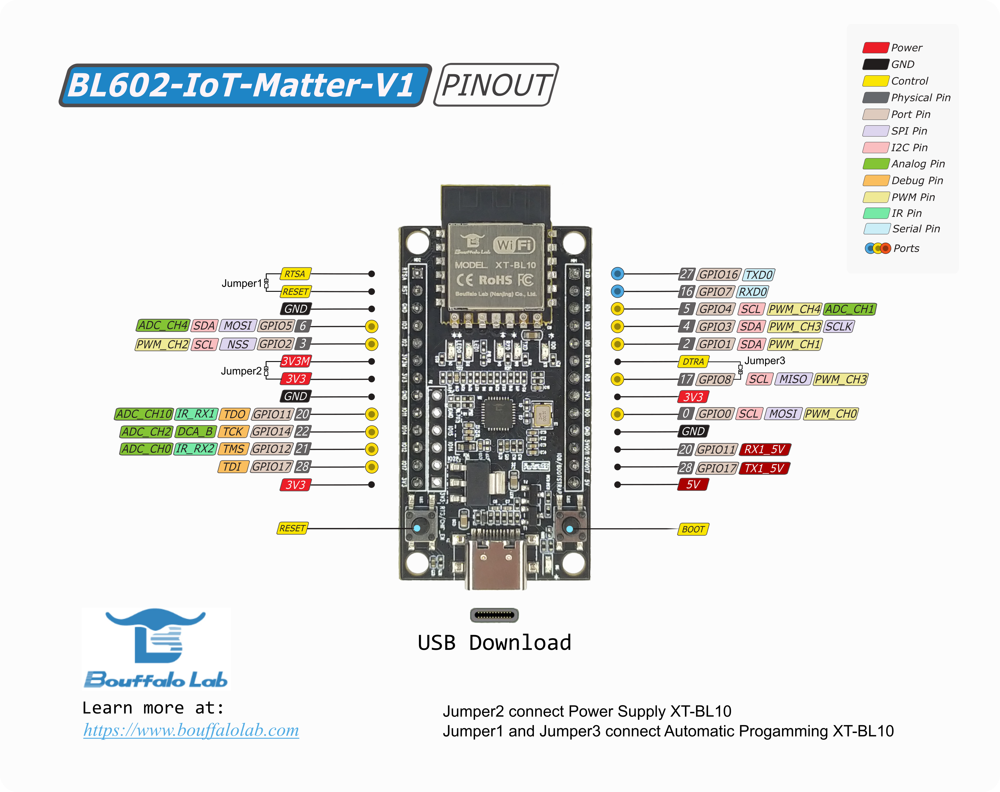
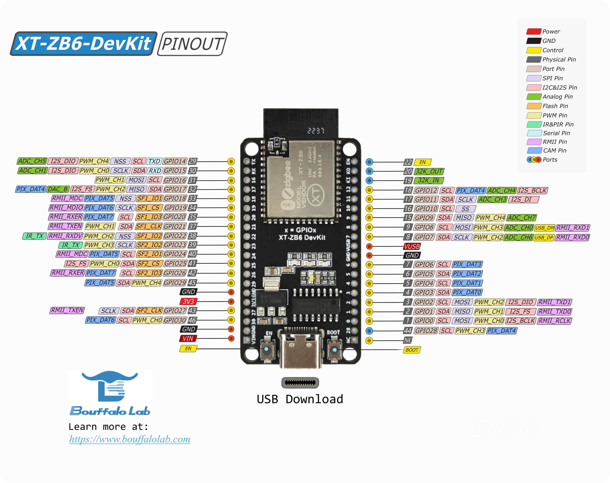

# `Bouffalo Lab`

This example functions as a light bulb device type, with on/off and level
capabilities and uses a test Vendor ID (VID) and a Product ID (PID)
of **0x8005**.

The steps were verified on `Bouffalo Lab` BL602 and BL706 development board.

-   `BL602-IoT-Matter-V1`, [here](https://www.amazon.com/dp/B0B9ZVGXD8) to
    purchase.
-   `BL602-NIGHT-LIGHT`
-   `XT-ZB6-DevKit`
-   `BL706-NIGHT-LIGHT`
-   `BL706DK`
-   `BL704LDK`

> Warning: Changing the VID/PID may cause compilation problems, we recommend
> leaving it as the default while using this example.

## BL602

BL602/BL604 is combo chip-set for Wi-Fi 802.11b/g/n and BLE 5.0 base-band/MAC.

### BL602-IoT-Matter-V1



## BL70x

BL70x is combo chip-set for BLE and IEEE 802.15.4/ZigBee/Thread.

-   BL702/BL706 has 14dbm tx power and is recommended for routing devices. SDK
    uses BL702 as a general name.
-   BL702L/BL704L is designed for low power application. SDK uses BL702L as a
    general name.

BL70x has fully certified with all Thread 1.3 features, included Thread `SSED`
and Thread Border Router with `DUA manager`.

### `XT-ZB6-DevKit`



## Initial setup

The following steps in this document were validated on Ubuntu 18.04/20.04 and
Mac OS.

-   Install dependencies as specified in the **connectedhomeip** repository:
    [Building Matter](https://github.com/project-chip/connectedhomeip/blob/master/docs/guides/BUILDING.md).

-   Clone and initialize the **connectedhomeip** repo

    ```
    git clone https://github.com/project-chip/connectedhomeip.git
    cd connectedhomeip
    git submodule update --init --recursive
    source ./scripts/activate.sh -p bouffalolab
    ```

    > After environment setup `Bouffalo Lab` flash tool, `bflb-iot-tool`,
    > imports under this environment. If not, please try
    > `scripts/bootstrap.sh -p bouffalolab` for matter environment update.

-   Setup build environment for `Bouffalo Lab` SoC

    Run `setup.sh` to install `Bouffalo Lab` SDK to /opt/bouffalolab_sdk

    ```
    cd third_party/bouffalolab/repo
    sudo bash scripts/setup.sh
    ```

    Please execute following command to export `BOUFFALOLAB_SDK_ROOT` before
    building.

    ```
    export BOUFFALOLAB_SDK_ROOT=/opt/bouffalolab_sdk
    ```

## Build CHIP Lighting App example

The following steps take examples for `BL602-IoT-Matter-V1` BL602 board,
`BL706DK` BL706 board, and `BL704LDK` BL704L board .

-   Build lighting app with UART baudrate 2000000

    ```
    ./scripts/build/build_examples.py --target bouffalolab-bl602-iot-matter-v1-light build
    ./scripts/build/build_examples.py --target bouffalolab-bl706dk-light build
    ./scripts/build/build_examples.py --target bouffalolab-bl706dk-light-ethernet build
    ./scripts/build/build_examples.py --target bouffalolab-bl706dk-light-wifi build
    ./scripts/build/build_examples.py --target bouffalolab-bl704ldk-light build
    ```

-   Build lighting app with UART baudrate 115200

    ```
    ./scripts/build/build_examples.py --target bouffalolab-bl602-iot-matter-v1-light-115200 build
    ./scripts/build/build_examples.py --target bouffalolab-bl706dk-light-light-115200 build
    ./scripts/build/build_examples.py --target bouffalolab-bl704ldk-light-light-115200 build
    ```

-   Build lighting app with RPC enabled and UART baudrate 115200.

    ```
    ./scripts/build/build_examples.py --target bouffalolab-bl602-iot-matter-v1-light-rpc build
    ./scripts/build/build_examples.py --target bouffalolab-bl706dk-light-light-rpc build
    ./scripts/build/build_examples.py --target bouffalolab-bl704ldk-light-light-rpc build
    ```

### Build options with build_examples.py

-   `-shell`, enable UART command line
-   `-115200`, set UART baudrate to 115200 for log and command line
-   `-rpc`, enable Pigweed RPC feature
-   `-cdc`, enable USB CDC feature, only support for BL706, and can't work with
    Ethernet Board
-   `-resetCnt`, enable feature to do factory reset when continues power cycle
    is greater than 3
-   `-mfd`, enable Matter factory data feature, which load factory data from
    `DTS` region and `MFD` partition
    -   Please contact to `Bouffalo Lab` for Matter factory data support.
-   `-mfdtest`, enable Matter factory data module, but only load factory data
    from `FactoryDataProvider.cpp` file.
-   `-wifi`, to specify that connectivity Wi-Fi is enabled for Matter
    application.
-   `-ethernet`, to specify that connectivity Ethernet is enabled for Matter
    application.
-   `-thread`, to specify that connectivity Thread is enabled for Matter
    application.
-   `-mot`, to specify to use openthread stack under
    `third_party/openthread/repo`
    -   Without `-mot` specified, Matter Thread will use openthread stack under
        `Bouffalo Lab` SDK
-   `-fp`, to specify to enable frame pointer feature to print call stack when
    hit an exception for debug purpose.

## Download image

-   Using script `*.flash.py`.

    After building gets done, python script `*.flash.py` will generate under
    build output folder, such as

    -   `chip-bl602-lighting-example.flash.py` for BL602
    -   `chip-bl702-lighting-example.flash.py` for BL702
    -   `chip-bl702l-lighting-example.flash.py` for BL702L

    > Note 1, `*.flash.py` should be ran under Matter build environment; if
    > python module `bflb_iot_tool` is not found, please try to do
    > `source scripts/bootstrap.sh` or install as
    > `pip3 install bflb-iot-tool`.<br> Note 2, different build options will
    > generate different output folder.

    Download operation steps as below, please check `help` option of script for
    more detail.

    -   Connect the board to your build machine

    -   Put the board to the download mode:

        -   Press and hold the **BOOT** button.
        -   Click the **RESET** or **EN** button.
        -   Release the **BOOT** button.

    -   Type following command for image download. Please set serial port
        accordingly, here we use /dev/ttyACM0 as a serial port example.

        -   `bl602-iot-matter-v1`, `bl706dk` and `bl704ldk` without additional
            build options

            ```shell
            ./out/bouffalolab-bl602-iot-matter-v1-light/chip-bl602-lighting-example.flash.py --port /dev/ttyACM0
            ./out/bouffalolab-bl706dk-light/chip-bl702-lighting-example.flash.py --port /dev/ttyACM0
            ./out/bouffalolab-bl704ldk-light/chip-bl702l-lighting-example.flash.py --port /dev/ttyACM0
            ```

        -   `bl706dk` with 115200 baudrate setting

            ```shell
            ./out/bouffalolab-bl706dk-light-115200/chip-bl702-lighting-example.flash.py --port /dev/ttyACM0
            ```

        -   To wipe out flash and download image, please append `--erase` to the
            above command.

            ```shell
            ./out/bouffalolab-bl602-iot-matter-v1-light/chip-bl602-lighting-example.flash.py --port /dev/ttyACM0 --erase
            ./out/bouffalolab-bl706dk-light-115200/chip-bl702-lighting-example.flash.py --port /dev/ttyACM0 --erase
            ./out/bouffalolab-bl704ldk-light/chip-bl702l-lighting-example.flash.py --port /dev/ttyACM0 --erase
            ```

            > Note, better to append --erase option to download image for BL602
            > develop board at first time.

-   Using `Bouffalo Lab` GUI flash tool `BLDevCube`, please download on
    [this page](https://dev.bouffalolab.com/download).
    -   Hold BOOT pin and reset chip, put the board in download mode.
    -   Select `DTS` file;
    -   Select Partition Table under
        `examples/platform/bouffalolab/bl602/flash_config` or
        `examples/platform/bouffalolab/bl702/flash_config`
    -   Select Firmware Bin;
    -   Select Chip Erase if need;
    -   Choose Target COM port.
    -   Then click Create & Download.

## Run the example

-   You can open the serial console. For example, if the device is at
    `/dev/ttyACM0` with UART baudrate 2000000 built:

        ```shell
        picocom -b 2000000 /dev/ttyACM0
        ```

-   To reset the board, Click the **RESET** or **EN** button.

-   To toggle the light bulb’s on/off state by clicking BOOT button, which also
    toggles the LED.

-   To do factory reset, press BOOT button over 4 seconds, release BOOT button
    after led blink stopped.

## Test Commission and Control with chip-tool

Please follow [chip_tool_guide](../../../docs/guides/chip_tool_guide.md) and
[guide](../../chip-tool/README.md) to build and use chip-tool for test.

### Prerequisite for Thread Protocol

Thread wireless protocol runs on BL706, which needs a Thread border router to
connect Thread network to Wi-Fi/Ethernet network. Please follow this
[guide](../../../docs/guides/openthread_border_router_pi.md) to setup a
raspberry Pi border router.

After Thread border router setup, please type following command on Thread border
router to get Thread network credential.

```shell
sudo ot-ctl dataset active -x
```

### Commissioning over BLE

-   Reset the board or factory reset the board

-   Enter build out folder of chip-tool and running the following command to do
    BLE commission

    -   BL602

        ```shell
        ./chip-tool pairing ble-wifi <node_id> <wifi_ssid> <wifi_passwd> 20202021 3840
        ```

    -   BL706

        ```shell
        ./chip-tool pairing ble-thread <node_id> hex:<thread_operational_dataset> 20202021 3840
        ```

    > `<node_id>`, which is node ID assigned to device within chip-tool
    > fabric<br> `<wifi_ssid>`, Wi-Fi network SSID<br> `<wifi_passwd>`, Wi-FI
    > network password<br> `<thread_operational_dataset>`, Thread network
    > credential which running `sudo ot-ctl dataset active -x` command on border
    > router to get.

### Cluster control

After successful commissioning, cluster commands available to control the board.

-   OnOff cluster

    The following command shows to toggle the LED on the board

    ```
    $ ./chip-tool onoff toggle <node_id> 1
    ```

-   Level cluster

    The following command shows to move level to 128.

    ```
    $ ./chip-tool levelcontrol move-to-level 128 10 0 0 <node_id> 1
    ```

-   Color cluster

    The following command shows to change hue and saturation to 240 and 100

    ```
    $ ./chip-tool colorcontrol move-to-hue-and-saturation 240 100 0 0 0 <node_id> 1
    ```

-   Identify Light

    The following command shows to identify the board 10 seconds

    ```shell
    ./chip-tool identify identify 10 <node_id> 1
    ```

## Test OTA software upgrade with ota-provider-app

Please take [guide](../../ota-provider-app/linux/README.md) for more detail on
ota-provider-app build and usage.

### Create the Matter OTA image with Bouffalolab OTA `bin.xz.hash` format image

-   `Bouffalo Lab` OTA `bin.xz.hash` format image

    -   Build `Bouffalo Lab` OTA image as following execution using python
        script `*.flash.py` under firmware build out folder,
        `shell ./<output_firmware_name>.flash.py --build` After script executed,
        a folder `ota_images` and an image `FW_OTA.bin.xz.hash` will be
        generated. `FW_OTA.bin.xz.hash` is compressed with hash verification for
        build out firmware.

    -   `bin.xz.hash` image

        After compile done, the build script will call
        `<output_firmware_name>.flash.py` to generate `Bouffalo Lab` OTA format
        image as above, and put it under out folder with name likes
        `<output_firmware_name>.bin.xz.hash`

*   Build Matter `*.ota` OTA image with `Bouffalo Lab` OTA image under
    **connectedhomeip** repo folder

    ```shell
    $ ./src/app/ota_image_tool.py create -v 0xFFF1 -p 0x8005 -vn 10 -vs "1.0" -da sha256 <FW_OTA.bin.xz.hash> lighting-app.ota

    ```

    > lighting-app.ota should have greater software version which is defined by
    > macro `CHIP_DEVICE_CONFIG_DEVICE_SOFTWARE_VERSION` in CHIPProjectConfig.h

### Start ota-provider-app

-   Start ota-provider-app for lighting-app.ota

    ```shell
    $ rm -r /tmp/chip_*
    $ ./chip-ota-provider-app -f <path_to_ota_bin>/lighting-app.ota
    ```

    where `<path_to_ota_bin>` is the folder for lighting-app.ota.

-   Provision ota-provider-app with assigned node id to 1
    ```shell
    $ ./chip-tool pairing onnetwork 1 20202021
    $ ./chip-tool accesscontrol write acl '[{"fabricIndex": 1, "privilege": 5, "authMode": 2, "subjects": [112233], "targets": null}, {"fabricIndex": 1, "privilege": 3, "authMode": 2, "subjects": null, "targets": null}]' 1 0
    ```

### Start ota software upgrade

-   BLE commission BL602/BL702 lighting if not commissioned.
-   Start OTA software upgrade process
    ```shell
    ./chip-tool otasoftwareupdaterequestor announce-otaprovider 1 0 0 0 <node_id_to_lighting_app> 0
    ```
    where `<node_id_to_lighting_app>` is node id of BL602/BL702 lighting app.
-   After OTA software upgrade gets done, BL602/BL702 will get reboot
    automatically.

## Run RPC Console

-   Build chip-console following this
    [guide](../../common/pigweed/rpc_console/README.md)

-   Start the console

    ```
    $ chip-console --device /dev/ttyUSB0 -b 2000000
    ```

-   Get or Set the light state

    `rpcs.chip.rpc.Lighting.Get()`

    `rpcs.chip.rpc.Lighting.Set(on=True, level=128)`
