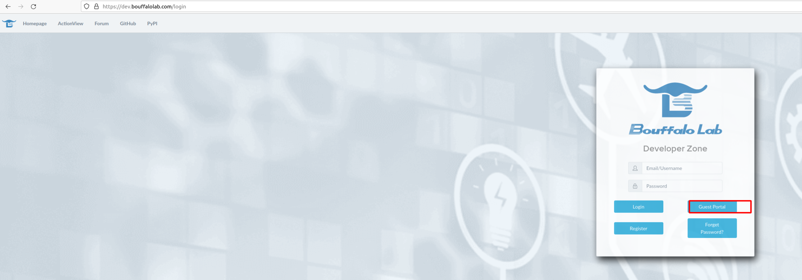
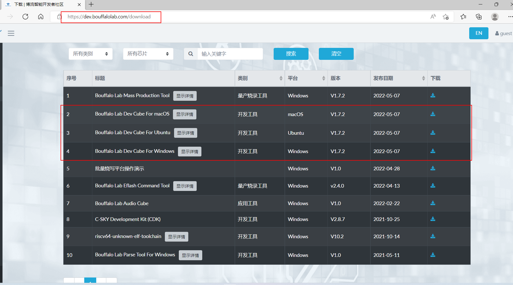
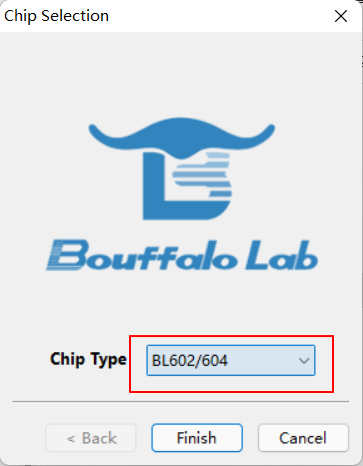
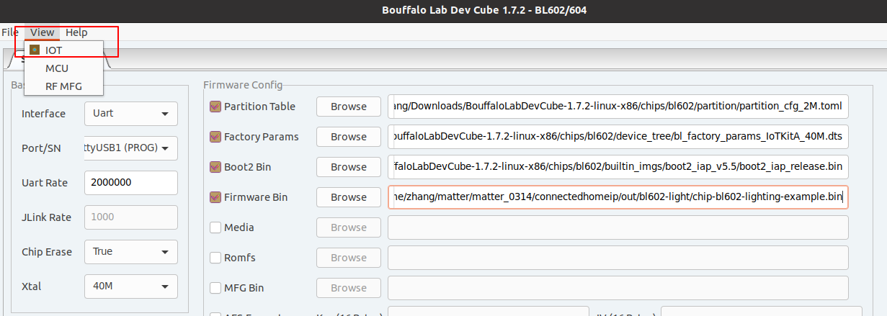
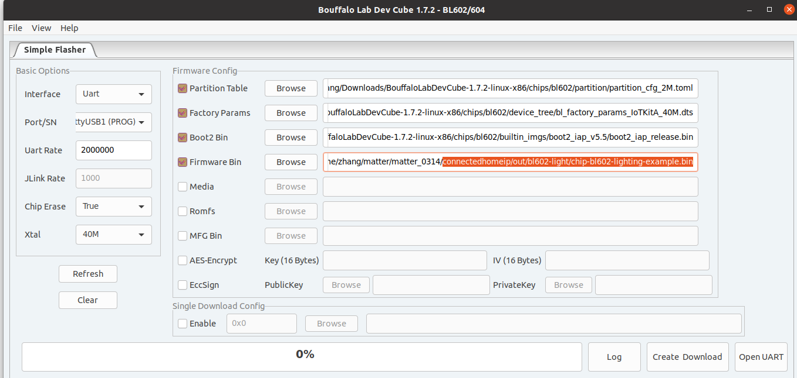

# BL602

This example functions as a wifi light bulb device type, with on/off
capabilities. The steps were verified on BL602-IoT-DVK-3S board.

BL602-IoT-DVK-3S


## Initial setup

-   Setting up the environment on ubuntu 20.04 or 18.04

```
$ sudo apt-get update
$ sudo apt-get upgrade
$ sudo apt-get install git gcc g++ python pkg-config libssl-dev libdbus-1-dev libglib2.0-dev libavahi-client-dev ninja-build python3-venv python3-dev python3-pip unzip libgirepository1.0-dev libcairo2-dev bluez avahi-daemon
$ sudo apt-get install pi-bluetooth (if not raspberry pi, sudo apt-get install bluetooth)
$ reboot

```

-   Clone and initialize the connectedhomeip repo

```
git clone https://github.com/project-chip/connectedhomeip.git
cd connectedhomeip
git submodule update --init --recursive
```

-   Install packets

```
$ cd {path-to-connectedhomeip}
connectedhomeip$ source ./scripts/bootstrap.sh
connectedhomeip$ source ./scripts/activate.sh

```

## Build the image

-   Build the example application:

    `connectedhomeip$ ./scripts/build/build_examples.py --target bl602-light build`

    Generated files

    `connectedhomeip/out/bl602-light/chip-bl602-lighting-example.bin`

    -   To delete generated executable, libraries and object files use:

    ```
    $ cd ~/connectedhomeip/
    $ rm -rf out/
    ```

## Flash the board

-   Download [Bouffalo Lab Dev Cube](https://dev.bouffalolab.com/download/).

    Log in to the site as a guest.

    

    

run the software :

  

  

The following picture shows the burning interface. To download the firmware, you
need to enter the download mode: press and hold the Boot (IO8) pin of the
development board, press the **RST** button, and then release the Boot button to
enter the burning and downloading mode.



Notice: Latest version Bouffalolab dev cube is recommended.

Factory Params:
`BouffaloLabDevCube-1.7.2-linux-x86/chips/bl602/device_tree/bl_factory_params_IoTKitA_40M.dts`

Partition Table:
`BouffaloLabDevCube-1.7.2-linux-x86/chips/bl602/partition/partition_cfg_2M.toml`

Boot2 Bin:
`BouffaloLabDevCube-1.7.2-linux-x86/chips/bl602/builtin_imgs/boot2_iap_v5.5/boot2_iap_release.bin`

Firmware Bin: `connectedhomeip/out/bl602-light/chip-bl602-lighting-example.bin`

Partition Table：

1. FW: The size of FW size0 must be larger than the bin size, we can do it by
   reducing the size of FW size1 and media partition size0.

COM Port:

```
   ls -la /dev/ttyUSB*
```

select the big one.

## Validate the example

1.The device should present itself as a USB serial device on your computer. You
may look it up in `/dev/`:

```
ls -la /dev/tty*
```

You can open the serial console. For example, if the device is at `/dev/USB1`:

```
picocom -b 2000000 /dev/ttyUSB1
```

To reset the board, press the **RST** button. And you will see the log from the
demo board.

## Commission a device using chip-tool

To initiate a client commissioning request to a device, run the built executable
and choose the pairing mode.

#### Commissioning over BLE

Run the built executable and pass it the discriminator and pairing code of the
remote device, as well as the network credentials to use.

The command below uses the default values hard-coded into the debug versions of
the BL602 lighting-app to commission it onto a Wi-Fi network:

```
$ sudo ./chip-tool pairing ble-wifi 1 ${SSID} ${PASSWORD} 20202021 3840

 Parameters:
 1. Discriminator: 3840
 2. Setup-pin-code: 20202021
 3. Node ID: 1
 4. SSID : Wi-Fi SSID
 5. PASSWORD : Wi-Fi Password
```

### Cluster control

-   After successful commissioning, use the OnOff cluster commands to control
    the OnOff attribute. This allows you to toggle a parameter implemented by
    the device to be On or Off.

    `$ sudo ./chip-tool onoff on 1 1`

-   Use ColorControl cluster command to control the color attributes:

    `$ sudo ./chip-tool colorcontrol move-to-hue-and-saturation 240 100 0 0 0 1 1`
