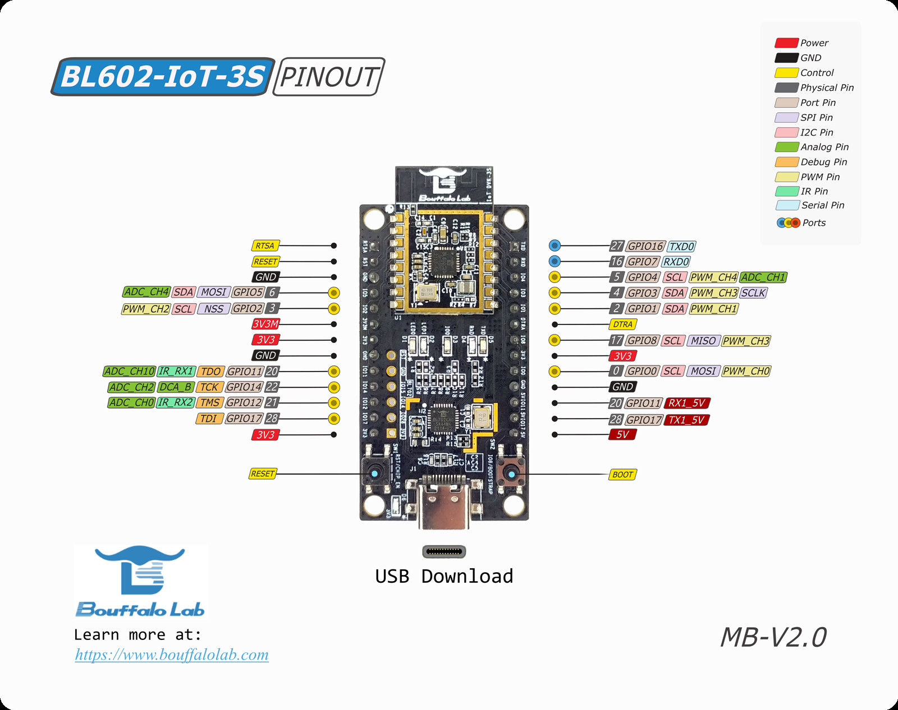

# BL602

This example functions as a wifi light bulb device type, with on/off
capabilities. The steps were verified on BL602 development board.

BL602 development board:


## Initial setup

The steps in this document were validated on Ubuntu 18.04 and 20.04.

-   Install dependencies as specified in the connectedhomeip repository:
    [Building Matter](https://github.com/project-chip/connectedhomeip/blob/interop_testing_te9/docs/guides/BUILDING.md).
-   Install other dependencies:

    ```
    sudo apt-get update
    sudo apt-get upgrade
    sudo apt-get install bluez avahi-daemon bluetooth
    reboot
    ```

-   Clone and initialize the connectedhomeip repo

    ```
    git clone https://github.com/project-chip/connectedhomeip.git
    cd connectedhomeip
    git submodule update --init --recursive
    source ./scripts/activate.sh
    ```

## Build the image

-   Build the example application:

    ```
    connectedhomeip$ ./scripts/build/build_examples.py --target bl602-light build
    ```

    Generated files

    ```
    connectedhomeip/out/bl602-light/chip-bl602-lighting-example.bin
    ```

    To delete generated executable, libraries and object files use:

    ```
    cd ~/connectedhomeip/
    rm -rf out/
    ```

## Flash the board

-   Build the
    [lighting-app](https://github.com/project-chip/connectedhomeip/tree/master/examples/lighting-app/bouffalolab/bl602)

    ```
    ./scripts/build/build_examples.py --target bl602-light build
    ```

-   Connect the board to your flashing station (MacOS, Ubuntu, Windows).

-   Set the board to the download mode:

    -   Press and hold the BOOT button.
    -   Press the RESET button and release it.
    -   Release the BOOT button.

-   The device should present itself as a USB serial device on your computer.
    You may look it up in /dev/ttyACM0

    ```
    ls -la /dev/tty*
    ```

    If the device is at /dev/ttyACM0, flash the board using the following
    commands:

    ```
    cd third_party/bouffalolab/bl602_sdk/repo/tools/flash_tool

    ./bflb_iot_tool-ubuntu18 --chipname=BL602 --baudrate=115200  --port=/dev/ttyACM0 --pt=chips/bl602/partition/partition_cfg_4M.toml --dts=chips/bl602/device_tree/bl_factory_params_IoTKitA_40M.dts --firmware=../../../../../../out/bl602-light/chip-bl602-lighting-example.bin
    ```

    ```
    If you want to erase previous network information in flash, you can add --erase parameters to the bflb_iot_tool-ubuntu18 command. For Windows and MacOS, replace bflb_iot_tool-ubuntu18 with bflb_iot_tool.exe and bflb_iot_tool-macos, respectively.
    ```

## Validate the example

1.You can open the serial console. For example, if the device is at
`/dev/ttyACM0`:

```
picocom -b 2000000 /dev/ttyACM0
```

2.To reset the board, press the RESET button, and you will see the log in the
`picocom terminal`.

## Commission a device using chip-tool

To initiate a client commissioning request to a device, run the built executable
and choose the pairing mode.

#### Commissioning over BLE

Run the built executable and pass it the discriminator and pairing code of the
remote device, as well as the network credentials to use.

The command below uses the default values hard-coded into the debug versions of
the BL602 lighting-app to commission it onto a Wi-Fi network:

```
$ sudo ./chip-tool pairing ble-wifi 1 ${SSID} ${PASSWORD} 20202021 3840

 Parameters:
 1. Discriminator: 3840
 2. Setup-pin-code: 20202021
 3. Node ID: 1
 4. SSID : Wi-Fi SSID
 5. PASSWORD : Wi-Fi Password
```

### Cluster control

-   After successful commissioning, use the OnOff cluster commands to control
    the OnOff attribute. This allows you to toggle a parameter implemented by
    the device to be On or Off.

    ```
    $ sudo ./chip-tool onoff on 1 1
    ```

-   Use ColorControl cluster command to control the color attributes:

    ```
    $ sudo ./chip-tool colorcontrol move-to-hue-and-saturation 240 100 0 0 0 1 1
    ```
