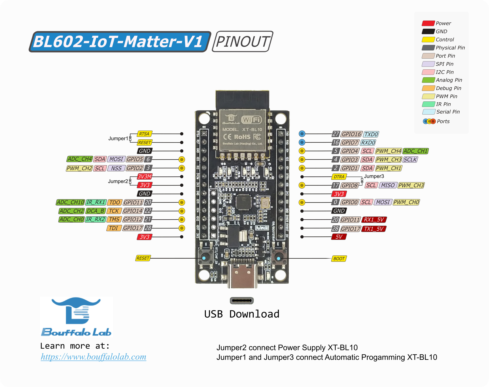

# BL602

This example functions as a wifi light bulb device type, with on/off
capabilities. The steps were verified on following boards:

-   BL602-IoT-Matter-V1, [here](https://www.amazon.com/dp/B0B9ZVGXD8) to
    purchase.
-   BL602-NIGHT-LIGHT

## BL602-IoT-Matter-V1 board



## Initial setup

The steps in this document were validated on Ubuntu 18.04 and 20.04.

-   Install dependencies as specified in the connectedhomeip repository:
    [Building Matter](https://github.com/project-chip/connectedhomeip/blob/master/docs/guides/BUILDING.md).
-   Install other dependencies:

    ```
    sudo apt-get update
    sudo apt-get upgrade
    sudo apt-get install bluez avahi-daemon bluetooth
    reboot
    ```

-   Clone and initialize the connectedhomeip repo

    ```
    git clone https://github.com/project-chip/connectedhomeip.git
    cd connectedhomeip
    git submodule update --init --recursive
    source ./scripts/activate.sh
    ```

    > Note, Bouffalolab flash tool, `bflb-iot-tool`, imports under this
    > environment. If not, please try `scripts/bootstrap.sh` for matter
    > environment update.

## Build CHIP BL602 Lighting App example

-   Build the
    [lighting-app](https://github.com/project-chip/connectedhomeip/tree/master/examples/lighting-app/bouffalolab/bl602)

    ```
    ./scripts/build/build_examples.py --target bouffalolab-bl602-iot-matter-v1-light build
    ./scripts/build/build_examples.py --target bouffalolab-bl602-night-light-light build
    ```

-   Build target name with `-115200` appended for UART baudrate 115200 command
    enabled as following commands.

    ```shell
    ./scripts/build/build_examples.py --target bouffalolab-bl602-iot-matter-v1-light-115200 build
    ```

    > UART baudrate is 2000000 by default.

-   Build target name with `-rpc` appended for rpc enabled as following
    commands.
    `shell ./scripts/build/build_examples.py --target bouffalolab-xt-zb6-devkit-light-rpc build`
    > For multiple build options, such as UART baudrate 115200 + rpc, please try
    > build command as
    > `./scripts/build/build_examples.py --target bouffalolab-xt-zb6-devkit-light-rpc-115200 build`

## Download image

After building gets done, a python `chip-bl602-lighting-example.flash.py` will
generated under build output folder. Such as
chip-bl602-lighting-example.flash.py for lighting-app example. Please check
`help` option of script for more detail.

-   Connect the board to your flashing station (MacOS, Ubuntu, Windows).

-   Set the board to the download mode:

    -   Press and hold the BOOT button.
    -   Press the RESET button and release it.
    -   Release the BOOT button.

-   Enter build out folder, download image as following execution under build
    output folder:

    ```shell
    ./chip-bl602-lighting-example.flash.py --port /dev/tty.usbserial-3
    ```

    > Note, where `/dev/tty.usbserial-3` is UART port of device.

## Validate the example

1.You can open the serial console. For example, if the device is at
`/dev/ttyACM0`:

```
picocom -b 2000000 /dev/ttyACM0
```

2.To reset the board, press the RESET button, and you will see the log in the
`picocom terminal`.

```
Starting bl602 now....
Booting BL602 Chip...
```

3.To control the development board after successfully debugging the development
board, press the BOOT button and you should see the following output in the
terminal:

```
[    404197][:588238200] Short press
[    404198][:588238200] receiving event type: 0
[    404203][:588238200] sending event type: 0
[    404207][:588238200] receiving event type: 0
[    404211][:588238200] Turning light ON
[    406211][:588238200] sending event type: 1
[    406212][:588238200] receiving event type: 1
[    406217][:588238200] Light ON
[    406220][:588238200] updating on/off = 1
```

4.To restore the board to factory Settings, press and hold the BOOT button for 5
seconds, and you should see the following output in the terminal:

```
[     37268][:588238200] LongLong press
[     37269][:588238200] receiving event type: 0
[     37274][:588238200] FactoryReset! please release button!!!
[     37279][:588238200] Toggling state to 1
[     37283][:588238200] brightness: 255, mHue: 0, mSaturation: 0, red: 255, green: 255, blue: 255
[     37292][:588238200] red level: 10000
[     38296][:588238200] Toggling state to 0
[     38297][:588238200] brightness: 0, mHue: 0, mSaturation: 0, red: 0, green: 0, blue: 0
[     38305][:588238200] red level: 0
[     39308][:588238200] Toggling state to 1
[     39309][:588238200] brightness: 255, mHue: 0, mSaturation: 0, red: 255, green: 255, blue: 255
[     39318][:588238200] red level: 10000
[     42323][:588238200] [DL] Easyflash erase: f/1/n
[     42327][:588238200] [DL] Easyflash erase: f/1/i
[     42332][:588238200] [DL] Easyflash erase: f/1/r
[     42335][:588238200] [DL] Easyflash erase: f/1/m
[     42340][:588238200] [DL] Easyflash erase: f/1/o
[     42349][:588238200] [DIS] Fabric (0x1) deleted. Calling OnFabricDeletedFromStorage
[     42403][:588238200] [DL] Easyflash erase: f/1/k/0
[     42462][:588238200] [DL] Easyflash erase: f/1/g
[     42465][:588238200] [DMG] AccessControl: removing fabric 1
```

## Commission a device using chip-tool

To initiate a client commissioning request to a device, run the built executable
and choose the pairing mode.

#### Commissioning over BLE

Run the built executable and pass it the discriminator and pairing code of the
remote device, as well as the network credentials to use.

The command below uses the default values hard-coded into the debug versions of
the BL602 lighting-app to commission it onto a Wi-Fi network:

    ```
    $ sudo ./chip-tool pairing ble-wifi 1 ${SSID} ${PASSWORD} 20202021 3840

    Parameters:
    1. Discriminator: 3840
    2. Setup-pin-code: 20202021
    3. Node ID: 1
    4. SSID : Wi-Fi SSID
    5. PASSWORD : Wi-Fi Password
    ```

### Cluster control

-   After successful commissioning, use the OnOff cluster commands to control
    the OnOff attribute. This allows you to toggle a parameter implemented by
    the device to be On or Off.

    ```
    $ sudo ./chip-tool onoff on 1 1
    ```

-   Use ColorControl cluster command to control the color attributes:

    ```
    $ sudo ./chip-tool colorcontrol move-to-hue-and-saturation 240 100 0 0 0 1 1
    ```

### Running RPC Console

-   Build chip-console following this
    [guide](../../../common/pigweed/rpc_console/README.md)

-   Start the console

    ```
    $ chip-console --device /dev/ttyUSB0 -b 2000000
    ```

-   Get or Set the light state

    `rpcs.chip.rpc.Lighting.Get()`

    `rpcs.chip.rpc.Lighting.Set(on=True, level=128)`
