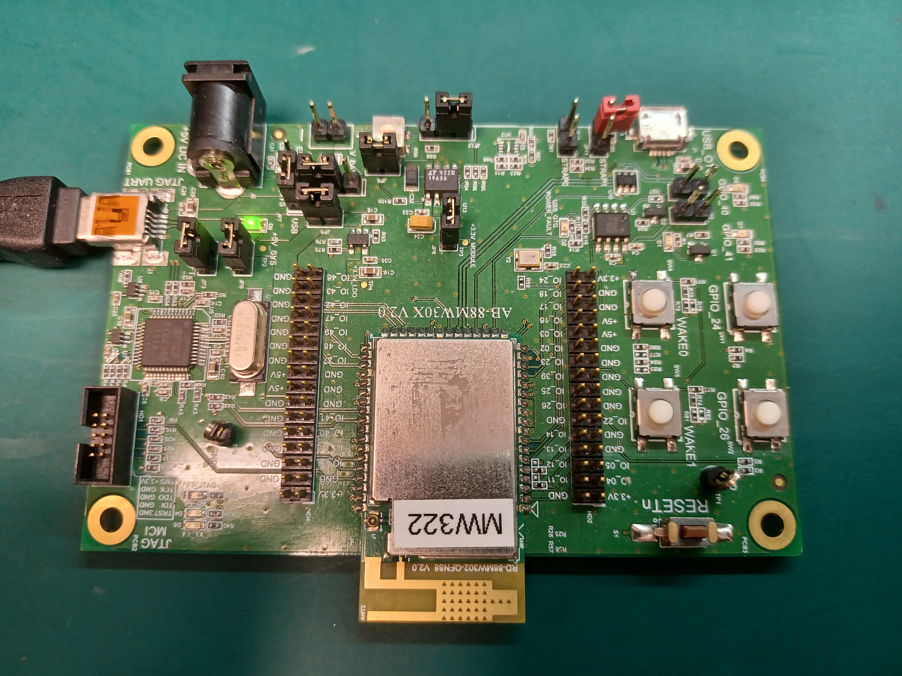
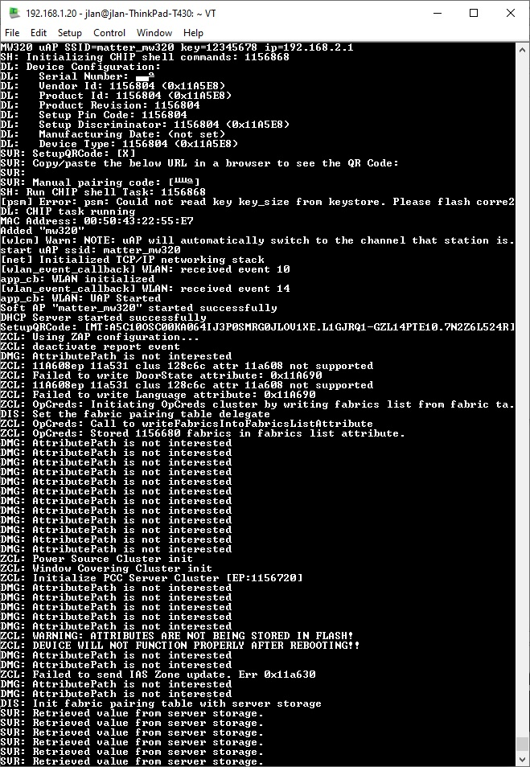
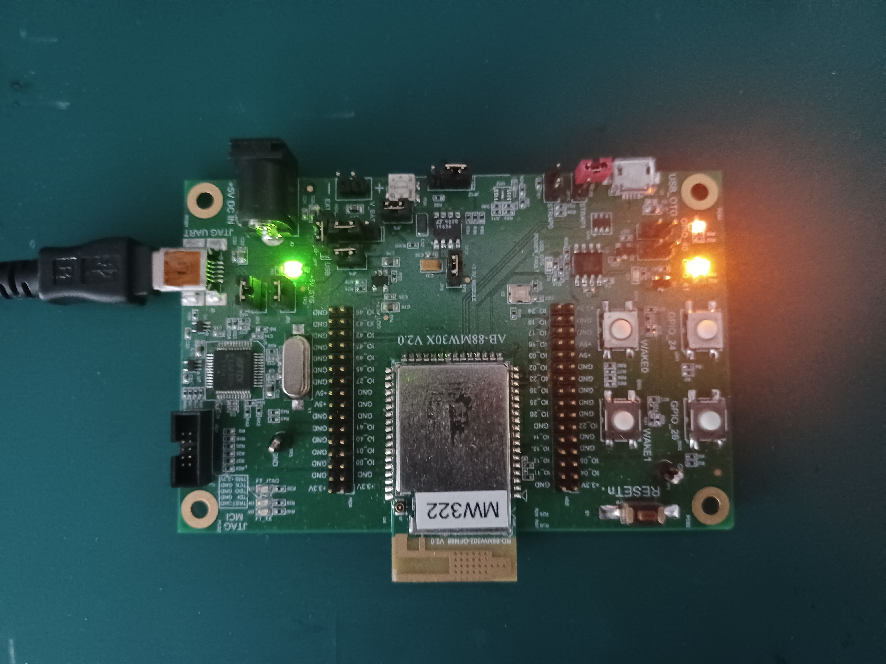

# CHIP MW320 Lighting Example Application

The Matter MW320 Lighting Example demonstrates how to remotely control a light
bulb. The light bulb is simulated using one of the MW320 platform LED. It uses
buttons to test turn on/turn off of the light bulb. You can use this example as
a reference for creating your own application.

The example is based on
[Matter](https://github.com/project-chip/connectedhomeip) and the NXP MW320 SDK,
and supports remote access and control of a light bulb over a low-power, WiFi
802.11n network.

The example behaves as a Project CHIP accessory, that is a device that can be
used bypass paired into an existing Matter network and can be controlled by this
network.

<hr>

-   [CHIP MW320 Lighting Example Application](#chip-mw320-lighting-example-application) -
-   [Introduction](#introduction)
-   [Building](#building)
-   [Flashing and debugging](#flashdebug)
-   [Testing the example](#testing-the-example)

<hr>

<a name="intro"></a>

## Introduction



The MW320 lighting example application provides a working demonstration of a
light led device, built using the Matter code base and the NXP MW320 SDK. The
example supports remote access (e.g.: using Matter chip Tool from a Ubuntu
laptop) and control of a led light over a low-power, WiFi 802.11n network. It is
capable of being paired into an existing Matter network along with other
Matter-enabled devices.

The example targets the
[NXP MW320 WiFi Micro controller Soc](https://www.nxp.com/products/wireless/wi-fi-plus-bluetooth/88mw32x-802-11n-wi-fi-microcontroller-soc:88MW32X)
development kit.

The Matter device that runs the lighting application is controlled by the CHIP
controller device over the WiFi 802.11 protocol. By default, the CHIP device has
Soft-AP enable with SSID:matter_mw320 WPA2:12345678, and it should be connect
over WiFi network and bypass pairing from other chip tool base on Project CHIP
test_event_6 code base. The actions required before establishing full
communication are described below.

The example also comes with a test mode, which allows to start WiFi Soft-AP with
the default settings. However, this mode does not guarantee that the device will
be able to communicate with the Matter controller and other devices.

<a name="building"></a>

## Building

In order to build the Matter example, we recommend using a Linux distribution
(the demo-application was compiled on Ubuntu 20.04). We have prepared MW320 SDK
package at SDK_2_9_4_Matter_ipv6.tgz, modified from
[RD-MW320-R0 SDK 2.9.4 for Matter](https://mcuxpresso.nxp.com/) for Project
CHIP.

-   Before uncompressed SDK_2_9_4_Matter_ipv6.tgz, please create MW320_FOLDER as
    follow command:

    -   mkdir ~/Desktop/MW320
    -   MW320_FOLDER=~/Desktop/MW320

-   Begin running two script to install and configure MW320 SDK
    -   ./third_party/mw320_sdk/sdk_fixes/patch_mw320_sdk.sh
    -   ./third_party/mw320_sdk/sdk_fixes/set_env.sh

```
user@ubuntu:~/Desktop/git/connectedhomeip$ ./third_party/mw320_sdk/sdk_fixes/patch_mw320_sdk.sh
user@ubuntu:~/Desktop/git/connectedhomeip$ ./third_party/mw320_sdk/sdk_fixes/set_env.sh
```

-   Start building the application either with Matter bypass pairing
    -   with Matter bypass pairing

```
user@ubuntu:~/Desktop/git/connectedhomeip$ cd $MW320_LIGHTING
user@ubuntu:~/Desktop/git/connectedhomeip/examples/lighting-app/mw320$ gn gen out/mw320 --args='chip_bypass_rendezvous=true is_debug=false treat_warnings_as_errors=false'
user@ubuntu:~/Desktop/git/connectedhomeip/examples/lightin-app/mw320$ ninja -v -C out/mw320
user@ubuntu:~/Desktop/git/connectedhomeip/examples/lighting-app/mw320$ $MW320_SDK_ROOT/tools/mw_img_conv/src/mw_img_conv mcufw $MW320_LIGHTING/out/mw320/chip-mw320-light-example.bin $MW320_LIGHTING/out/mw320/chip-mw320-light-example.mcufw.bin 0x1F000100
user@ubuntu:~/Desktop/git/connectedhomeip/examples/lighting-app/mw320$ cp $MW320_LIGHTING/out/mw320/chip-mw320-light-example.mcufw.bin $MW320_FOLDER/mw320_matter_openocd/Matter/chip-mw320-light-example.mcufw.bin
```

The resulting output file can be found in
out/debug/chip-mw320-light-example.mcufw.bin and
\$MW320_FOLDER/mw320_matter_openocd/Matter/chip-mw320-light-example.mcufw.bin.

<a name="flashdebug"></a>

## Flashing and debugging

Connected to Universal Asynchronous Receiver/Transmitter port on MW320 platform
to Ubuntu 20 USB port and open Linux text-based serial port communications
program at second USB interface. ex. /dev/ttyUSB1.

Program the firmware using the official Open On-Chip Debugger and we have
prepared MW320 OpenOCD package at mw320_matter_openocd.tgz. It will be
uncompressed at \$MW320_FOLDER/mw320_matter_openocd. If don't have OpenOCD
installed at Ubuntu, please install it as follow command.

\$ sudo apt-get install openocd

After OpenOCD installed, flash layout.txt, boot2.bin,
mw32x_uapsta_W14.88.36.p172.bin and chip-mw320-light-example.mcufw.bin to MW320
platform.

```
user@ubuntu:~/Desktop/MW320/mw320_matter_openocd$ sudo $MW320_FOLDER/mw320_matter_openocd/flashprog.py -l $MW320_FOLDER/mw320_matter_openocd/Matter/layout.txt --boot2 $MW320_FOLDER/mw320_matter_openocd/Matter/boot2.bin
user@ubuntu:~/Desktop/MW320/mw320_matter_openocd$ sudo $MW320_FOLDER/mw320_matter_openocd/flashprog.py --wififw $MW320_FOLDER/mw320_matter_openocd/Matter/mw32x_uapsta_W14.88.36.p172.bin
user@ubuntu:~/Desktop/MW320/mw320_matter_openocd$ sudo $MW320_FOLDER/mw320_matter_openocd/flashprog.py --mcufw $MW320_FOLDER/mw320_matter_openocd/Matter/chip-mw320-light-example.mcufw.bin -r
```



## Testing the example

On MW320 side: Prepare one external AP and try to connect it by running follow
command at MW320 console.

> wifi connect "External_AP_SSID" "External_AP_WPA2_PASSWORD"


On Ubuntu20 chip tool side: Prepare Ubuntu 20
[Matter test_event_6 branch chip tool](https://github.com/project-chip/connectedhomeip/tree/test_event_6/examples/chip-tool)
example. Using the follow chip tool command:

-   Bypass pairing ./chip-tool pairing bypass "IP6 address" 5540
-   Read MW320 led status ./chip-tool onoff read on-off 1
-   Turn on MW320 led ./chip-tool onoff on 1
-   Turn off MW320 led ./chip-tool onoff off 1


