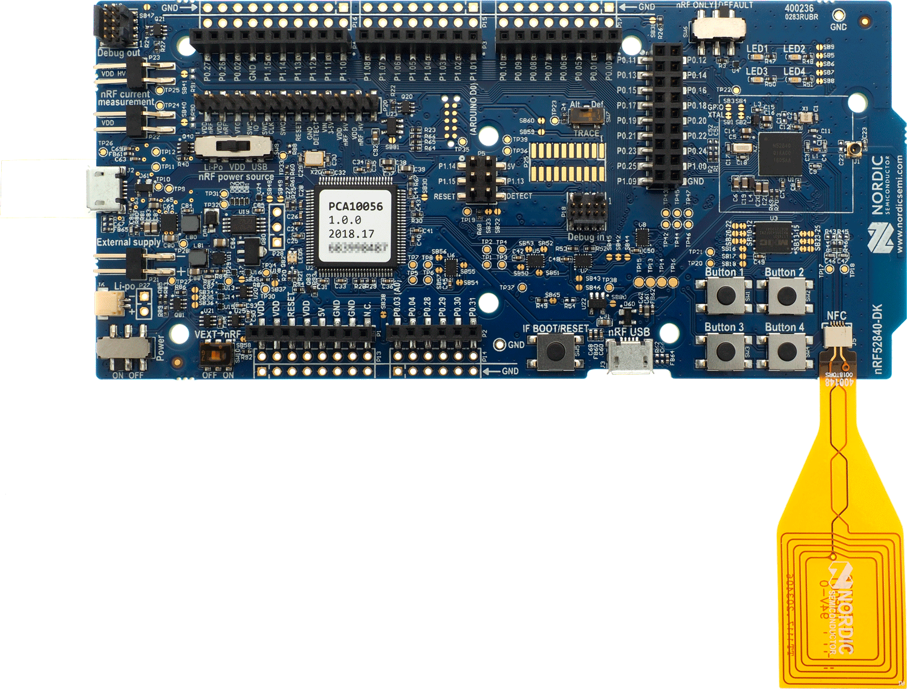

# CHIP nRF Connect Lighting Example Application

The lighting example provides demonstration of application running on the
connected lighting device. It uses
[CHIP](https://github.com/project-chip/connectedhomeip) and the nRF Connect
platform. The example supports remote access and control of a lighting over a
low-power, 802.15.4 Thread network. It is capable of being paired into an
existing CHIP network along with other CHIP-enabled devices. Besides of the
remote access, application also allows controlling lighting and device states
using buttons and visualizes those states on the LEDs.

-   [Overview](#overview)
-   [Requirements](#requirements)
-   [Device UI](#device-ui)
-   [Building](#building)
    -   [Using Docker container](#using-docker-container)
    -   [Using Native shell](#using-native-shell)
    -   [Supported nRF Connect SDK versions](#supported-nrf-connect-sdk-versions)
        -   [Building minimal binary](#building-minimal-binary)
-   [Configuring the example](#configuring-the-example)
-   [Flashing and debugging](#flashing-and-debugging)
-   [Testing the example](#testing-the-example)

## Overview

This example application is running on the nRF Connect platform, which is based
on the
[nRF Connect SDK](https://developer.nordicsemi.com/nRF_Connect_SDK/doc/latest/nrf/index.html)
and [Zephyr RTOS](https://zephyrproject.org/). Visit CHIP's
[nRF Connect Platform Overview](TODO:...) to read more information about
platform structure and dependencies.

CHIP device running lighting application is controlled by the CHIP controller
device over Thread protocol. It is assumed that CHIP device by default has
Thread disabled, so it should be paired with CHIP controller and get
configuration from it. There are few actions necessary to make before full
communication is possible and they were described below. There is also a test
mode, which allows to start Thread with default settings, by pressing button
manually, but it does not fully guarantee that device will be able to
communicate with CHIP controller and other devices.

### BLE Advertising

After powering up device for the first time, it should start advertising over
BLE in order to inform other devices about its presence. For security reasons
different devices may start advertising automatically or on User demand and in
this example case, starting is triggered by pressing button.

### BLE Rendezvous

In CHIP there is a commissioning procedure called Rendezvous, which is done over
BLE between CHIP device and CHIP controller, performing the role of the
commissioner. To start it, controller has to previously get onboarding
information from the CHIP device. Data are encoded as a QR code payload and
typically presented on a device's display or like in this example case, shared
using NFC tag.

### Thread Provisioning

Successfully finishing Rendezvous procedure allows to perform Provisioning
operation, whose goal is to send Thread network credentials from CHIP controller
to the CHIP device. As a result, device is able to join the Thread network and
communicate with other Thread devices belonging to this network.

## Requirements

In order to make sure that demonstrated application will be working properly, it
should be ran with the nRF Connect SDK 1.4 version.

The example supports building and running on the following devices:

| Board name                                                                                | Board platform build name |
| ----------------------------------------------------------------------------------------- | ------------------------- |
| [nRF52840 DK](https://www.nordicsemi.com/Software-and-Tools/Development-Kits/nRF52840-DK) | nrf52840dk_nrf52840       |

## Device UI

This section lists device's elements making User Interface in the example
application. All described items should be possible to find on the board picture
presented below:

The following elements of the development kit are used by this application to
allow User controlling and monitoring device's state.

**LED #1** shows the overall state of the device and its connectivity. Four
states are depicted:

-   _Short Flash On (50ms on/950ms off)_ &mdash; The device is in an
    unprovisioned (unpaired) state and is waiting for a commissioning
    application to connect.

*   _Rapid Even Flashing (100ms on/100ms off)_ &mdash; The device is in an
    unprovisioned state and a commissioning application is connected via BLE.

-   _Short Flash Off (950ms on/50ms off)_ &mdash; The device is fully
    provisioned, but does not yet have full network (Thread) or service
    connectivity.

*   _Solid On_ &mdash; The device is fully provisioned and has full Thread
    network and service connectivity.

**LED #2** shows the state of the lighting.

**Button #1** can be used to initiate a OTA software update as well as to reset
the device to a default state.

**Button #2** can be used to manually change the state of the lighting. Pushing
the button is changing lighting state to the opposite.

**Button #3** can be used to manually start Thread networking in the test mode,
using default configuration.

**Button #4** can be used to start BLE advertising.

**Segger J-Link USB port** can be used to get logs from the device or
communicate with it using [command line interface](TODO:).

## Building

### Using Docker container

> **Important**:
>
> Due to
> [certain limitations of Docker for MacOS](https://docs.docker.com/docker-for-mac/faqs/#can-i-pass-through-a-usb-device-to-a-container)
> it is impossible to use the Docker container to communicate with a USB device
> such as nRF 52840 DK. Therefore, MacOS users are advised to follow the
> [Using Native shell](#using-native-shell) instruction.

The easiest way to get started with the example is to use nRF Connect SDK Docker
image for CHIP applications. Run the following commands to start a Docker
container:

        $ mkdir ~/nrfconnect
        $ mkdir ~/connectedhomeip
        $ docker pull nordicsemi/nrfconnect-chip
        $ docker run --rm -it -e RUNAS=$(id -u) -v ~/nrfconnect:/var/ncs -v ~/connectedhomeip:/var/chip \
            -v /dev/bus/usb:/dev/bus/usb --device-cgroup-rule "c 189:* rmw" nordicsemi/nrfconnect-chip

> **Note**:
>
> -   `~/nrfconnect` can be replaced with an absolute path to nRF Connect SDK
>     source directory in case you have it already installed.
> -   Likewise, `~/connectedhomeip` can be replaced with an absolute path to
>     CHIP source directory.
> -   `-v /dev/bus/usb:/dev/bus/usb --device-cgroup-rule 'c 189:* rmw`
>     parameters can be omitted if you're not planning to flash the example onto
>     hardware. The parameters give the container access to USB devices
>     connected to your computer such as the nRF52840 DK.
> -   `--rm` flag can be omitted if you don't want the container to be
>     auto-removed when you exit the container shell session.
> -   `-e RUNAS=$(id -u)` is needed to start the container session as the
>     current user instead of root.

If you use the container for the first time and you don't have nRF Connect SDK
and CHIP sources downloaded yet, run `setup` command in the container to pull
the sources into directories mounted as `/var/ncs` and `/var/chip`,
respectively:

        $ setup --ncs v1.4.0
        /var/ncs repository is empty. Do you wish to check out nRF Connect SDK sources [v1.4.0]? [Y/N] y
        ...
        /var/chip repository is empty. Do you wish to check out Project CHIP sources [master]? [Y/N] y
        ...

Now you may build the example by running the commands below in the Docker
container:

        $ cd /var/chip/examples/lighting-app/nrfconnect
        $ west build -b nrf52840dk_nrf52840

If the build succeeds, the binary will be available under
`/var/chip/examples/lighting-app/nrfconnect/build/zephyr/zephyr.hex`. Note that
other operations described in this document like flashing or debugging can also
be done in the container.

### Using native shell

Before building the example,
[download the nRF Connect SDK and install all requirements](https://developer.nordicsemi.com/nRF_Connect_SDK/doc/latest/nrf/gs_installing.html).
Please read the
[Supported nRF Connect SDK versions](#supported-nrf-connect-sdk-versions)
section to learn which version to use to avoid unexpected compatibility issues.

If you don't want to use SEGGER Embedded Studio, you may skip the part about
installing and configuring it.

Download and install the
[nRF Command Line Tools](https://www.nordicsemi.com/Software-and-Tools/Development-Tools/nRF-Command-Line-Tools).

Download and install [GN meta-build system](https://gn.googlesource.com/gn/).

Make sure that you source the following file:

        $ source <ncs-dir>/zephyr/zephyr-env.sh

> **Note:**
>
> Ensure that `$ZEPHYR_BASE`, `$GNUARMEMB_TOOLCHAIN_PATH`, and
> `$ZEPHYR_TOOLCHAIN_VARIANT` environment variables are set in your current
> terminal before building. `$GNUARMEMB_TOOLCHAIN_PATH` and
> `$ZEPHYR_TOOLCHAIN_VARIANT` must be set manually.

After your environment is set up, you are ready to build the example. The
recommended tool for building and flashing the device is
[west](https://docs.zephyrproject.org/latest/guides/west/).

The following commands will build the `lighting-app` example:

        $ cd ~/connectedhomeip/examples/lighting-app/nrfconnect

        # If this is a first time build or if `build` directory was deleted
        $ west build -b nrf52840dk_nrf52840

        # Any subsequent build
        $ west build

After a successful build, the binary will be available under
`<example-dir>/build/zephyr/zephyr.hex`

### Supported nRF Connect SDK versions

It is recommended to use the nRF Connect version which is being verified as a
part of CHIP Continuous Integration testing, which happens to be `v1.4.0` at the
moment. You may verify that the revision is used in
[chip-build-nrf-platform](https://github.com/project-chip/connectedhomeip/blob/master/integrations/docker/images/chip-build-nrf-platform/Dockerfile)
Docker image in case of doubt.

Please refer to
[this section](https://developer.nordicsemi.com/nRF_Connect_SDK/doc/latest/nrf/gs_installing.html#updating-the-repositories)
in the user guide to learn how to update nRF Connect SDK repository. For example
to checkout given `v1.4.0` revision the following commands should be called:

        # Phrase <nrfconnect-dir> should be replaced with an absolute path to nRF Connect SDK source directory.
        $ cd <nrfconnect-dir>/nrf

        $ git fetch origin
        $ git checkout v1.4.0
        $ west update

Alternatively, if you use the docker container, you may execute the following
command instead:

        $ setup --ncs v1.4.0

### Building minimal binary

In order to build the example with no diagnostic features like UART console or
application logs, which should result in significantly smaller binary, run the
following commands:

        # Delete the build directory to make sure that no settings are cached
        $ rm -rf build/

        # Build the example using release config overlay
        $ west build -b nrf52840dk_nrf52840 -- -DOVERLAY_CONFIG=third_party/connectedhomeip/config/nrfconnect/release.conf

## Configuring the example

The Zephyr ecosystem is higly configurable and allows the user to modify many
aspects of the application. The configuration system is based on `Kconfig` and
the settings can be modified using the `menuconfig` utility.

To open the configuration menu, do the following:

        $ cd <example-dir>
        # First time build
        $ west build -b nrf52840dk_nrf52840 -t menuconfig

        # Any subsequent build
        $ west build -t menuconfig

        # Running menuconfig with ninja
        $ cd <example-dir>/build
        $ ninja menuconfig

Changes done with `menuconfig` will be lost, if the `build` directory is
deleted. To make them persistent, save the configuration options in `prj.conf`
file.

## Flashing and debugging

The example application is designed to run on the
[Nordic nRF52840 DK](https://www.nordicsemi.com/Software-and-Tools/Development-Kits/nRF52840-DK)
development kit.

To flash the application to the device, use the `west` tool:

        $ cd <example-dir>
        $ west flash

If you have multiple nRF52840 DK boards connected, `west` will prompt you to
pick the correct one.

To debug the application on target:

        $ cd <example-dir>
        $ west debug

## Testing the example

Check the [CLI tutorial](../../../docs/guides/nrfconnect_examples_cli.md) to
learn how to use command-line interface of the application.

TODO: mention Rendezvous tutorial here
