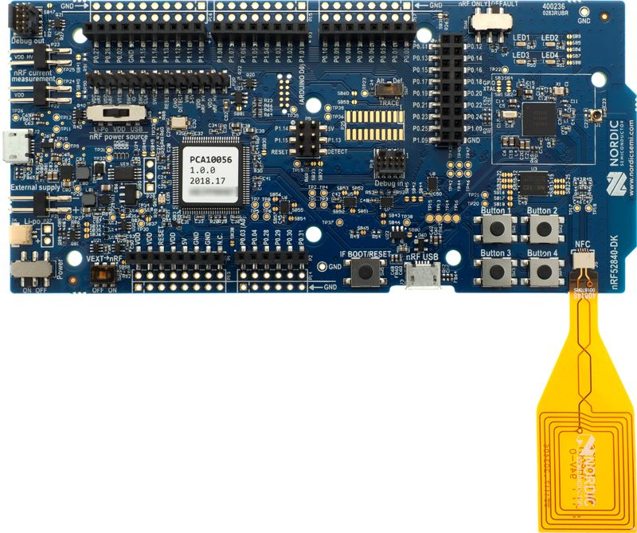

# CHIP nRF Connect Lighting Example Application

The nRF Connect Lighting Example demonstrates how to remotely control a white
dimmable light bulb. It uses buttons to test changing the lighting and device
states and LEDs to show the state of these changes. You can use this example as
a reference for creating your own application.

The example is based on [CHIP](https://github.com/project-chip/connectedhomeip)
and the nRF Connect platform, and supports remote access and control of a
lighting over a low-power, 802.15.4 Thread network.

The example behaves as a CHIP accessory, that is a device that can be paired
into an existing CHIP network and can be controlled by this network.

-   [Overview](#overview)
    -   [Bluetooth LE advertising](#bluetooth-le-advertising)
    -   [Bluetooth LE rendezvous](#bluetooth-le-rendezvous)
-   [Requirements](#requirements)
-   [Device UI](#device-ui)
-   [Setting up the environment](#setting-up-the-environment)
    -   [Using Docker container for setup](#using-docker-container-for-setup)
    -   [Using native shell for setup](#using-native-shell-for-setup)
-   [Building](#building)
    -   [Removing build artifacts](#removing-build-artifacts)
    -   [Building with release configuration](#building-with-release-configuration)
    -   [Building with Pigweed RPCs](#building-with-pigweed-rpcs)
-   [Configuring the example](#configuring-the-example)
-   [Flashing and debugging](#flashing-and-debugging)
-   [Testing the example](#testing-the-example)

## Overview

This example is running on the nRF Connect platform, which is based on the
[nRF Connect SDK](https://developer.nordicsemi.com/nRF_Connect_SDK/doc/latest/nrf/index.html)
and [Zephyr RTOS](https://zephyrproject.org/). Visit CHIP's
[nRF Connect platform overview](../../../docs/guides/nrfconnect_platform_overview.md)
to read more about the platform structure and dependencies.

The CHIP device that runs the lighting application is controlled by the CHIP
controller device over the Thread protocol. By default, the CHIP device has
Thread disabled, and it should be paired with CHIP controller and get
configuration from it. Some actions required before establishing full
communication are described below.

The example also comes with a test mode, which allows to start Thread with the
default settings by pressing button manually. However, this mode does not
guarantee that the device will be able to communicate with the CHIP controller
and other devices.

### Bluetooth LE advertising

To commission the device onto a CHIP network, the device must be discoverable
over Bluetooth LE. For security reasons, you must start Bluetooth LE advertising
manually after powering up the device by pressing **Button 4**.

### Bluetooth LE rendezvous

In CHIP, the commissioning procedure (called rendezvous) is done over Bluetooth
LE between a CHIP device and the CHIP controller, where the controller has the
commissioner role.

To start the rendezvous, the controller must get the commissioning information
from the CHIP device. The data payload is encoded within a QR code, printed to
the UART console, and shared using an NFC tag. For security reasons, you must
start NFC tag emulation manually after powering up the device by pressing
**Button 4**.

#### Thread provisioning

Last part of the rendezvous procedure, the provisioning operation involves
sending the Thread network credentials from the CHIP controller to the CHIP
device. As a result, device is able to join the Thread network and communicate
with other Thread devices in the network.

## Requirements

The application requires the nRF Connect SDK v1.4.0 to work correctly.

The example supports building and running on the following devices:

| Board name                                                                                | Board platform build name |
| ----------------------------------------------------------------------------------------- | ------------------------- |
| [nRF52840 DK](https://www.nordicsemi.com/Software-and-Tools/Development-Kits/nRF52840-DK) | `nrf52840dk_nrf52840`     |

## Device UI

This section lists the User Interface elements that you can use to control and
monitor the state of the device. All these elements can be located on the
following board picture:

**LED 1** shows the overall state of the device and its connectivity. The
following states are possible:

-   _Short Flash On (50 ms on/950 ms off)_ &mdash; The device is in the
    unprovisioned (unpaired) state and is waiting for a commissioning
    application to connect.

-   _Rapid Even Flashing (100 ms on/100 ms off)_ &mdash; The device is in the
    unprovisioned state and a commissioning application is connected through
    Bluetooth LE.

-   _Short Flash Off (950ms on/50ms off)_ &mdash; The device is fully
    provisioned, but does not yet have full Thread network or service
    connectivity.

-   _Solid On_ &mdash; The device is fully provisioned and has full Thread
    network and service connectivity.

**LED 2** simulates the light bulb and shows the state of the lighting. The
following states are possible:

-   _Solid On_ &mdash; The light bulb is on.

-   _Off_ &mdash; The light bulb is off.

**Button 1** can be used for the following purposes:

-   _Pressed for 6 s_ &mdash; Initiates the factory reset of the device.
    Releasing the button within the 6-second window cancels the factory reset
    procedure. **LEDs 1-4** blink in unison when the factory reset procedure is
    initiated.

-   _Pressed for less than 3 s_ &mdash; Initiates the OTA software update
    process. This feature is not currently supported.

**Button 2** &mdash; Pressing the button once changes the lighting state to the
opposite one.

**Button 3** &mdash; Pressing the button once starts the Thread networking in
the test mode using the default configuration.

**Button 4** &mdash; Pressing the button once starts the NFC tag emulation and
enables Bluetooth LE advertising for the predefined period of time.

**SEGGER J-Link USB port** can be used to get logs from the device or
communicate with it using the
[command line interface](../../../docs/guides/nrfconnect_examples_cli.md).

**NFC port with antenna attached** can be used to start the
[rendezvous](#bluetooth-le-rendezvous) by providing the commissioning
information from the CHIP device in a data payload that can be shared using NFC.

## Setting up the environment

Before building the example, check out the CHIP repository and sync submodules
using the following command:

        $ git submodule update --init

The example requires the nRF Connect SDK v1.4.0. You can either install it along
with the related tools directly on your system or use a Docker image that has
the tools pre-installed.

If you are a macOS user, you won't be able to use the Docker container to flash
the application onto a Nordic board due to
[certain limitations of Docker for macOS](https://docs.docker.com/docker-for-mac/faqs/#can-i-pass-through-a-usb-device-to-a-container).
Use the [native shell](#using-native-shell) for building instead.

### Using Docker container for setup

To use the Docker container for setup, complete the following steps:

1.  If you do not have the nRF Connect SDK installed yet, create a directory for
    it by running the following command:

        $ mkdir ~/nrfconnect

2.  Download the latest version of the nRF Connect SDK Docker image by running
    the following command:

        $ docker pull nordicsemi/nrfconnect-chip

3.  Start Docker with the downloaded image by running the following command,
    customized to your needs as described below:

         $ docker run --rm -it -e RUNAS=$(id -u) -v ~/nrfconnect:/var/ncs -v ~/connectedhomeip:/var/chip \
             -v /dev/bus/usb:/dev/bus/usb --device-cgroup-rule "c 189:* rmw" nordicsemi/nrfconnect-chip

    In this command:

    -   _~/nrfconnect_ can be replaced with an absolute path to the nRF Connect
        SDK source directory.
    -   _~/connectedhomeip_ must be replaced with an absolute path to the CHIP
        source directory.
    -   _-v /dev/bus/usb:/dev/bus/usb --device-cgroup-rule "c 189:_ rmw"\*
        parameters can be omitted if you are not planning to flash the example
        onto hardware. These parameters give the container access to USB devices
        connected to your computer such as the nRF52840 DK.
    -   _--rm_ can be omitted if you do not want the container to be
        auto-removed when you exit the container shell session.
    -   _-e RUNAS=\$(id -u)_ is needed to start the container session as the
        current user instead of root.

4.  Check out or update the nRF Connect SDK to the recommended `v1.4.0` version
    by running the following command in the Docker container:

         $ setup --ncs v1.4.0
         /var/ncs repository is empty. Do you wish to check out nRF Connect SDK sources [v1.4.0]? [Y/N] y
         ...
         /var/chip repository is initialized, skipping...

Now you can proceed with the [Building](#building) instruction.

### Using native shell for setup

To use the native shell for setup, complete the following steps:

1.  Download and install the following additional software:

    -   [nRF Command Line Tools](https://www.nordicsemi.com/Software-and-Tools/Development-Tools/nRF-Command-Line-Tools)
    -   [GN meta-build system](https://gn.googlesource.com/gn/)

2.  Depending on whether you have the nRF Connect SDK installed:

    -   Follow the
        [guide](https://developer.nordicsemi.com/nRF_Connect_SDK/doc/latest/nrf/gs_assistant.html#)
        in the nRF Connect SDK documentation to install the nRF Connect SDK
        v1.4.0. Since command-line tools will be used for building the example,
        installing SEGGER Embedded Studio is not required.

    -   If you have an older version of the SDK installed, use the following
        commands to update it to the recommended version. Replace
        _nrfconnect-dir_ with the path to your nRF Connect SDK installation
        directory.

               $ cd nrfconnect-dir/nrf
               $ git fetch origin
               $ git checkout v1.4.0
               $ west update

3.  Initialize environment variables referred to by the CHIP and the nRF Connect
    SDK build scripts. Replace _nrfconnect-dir_ with the path to your nRF
    Connect SDK installation directory, and _toolchain-dir_ with the path to GNU
    Arm Embedded Toolchain.

         $ source nrfconnect-dir/zephyr/zephyr-env.sh
         $ export ZEPHYR_TOOLCHAIN_VARIANT=gnuarmemb
         $ export GNUARMEMB_TOOLCHAIN_PATH=toolchain-dir

Now you can proceed with the [Building](#building) instruction.

## Building

Complete the following steps, regardless of the method used for setting up the
environment:

1.  Navigate to the example's directory:

        $ cd examples/lighting-app/nrfconnect

2.  Run the following command to build the example, with _board-name_ replaced
    with the name of the Nordic Semiconductor's board you own, for example
    `nrf52840dk_nrf52840`:

         $ west build -b board-name

    You only need to specify the board name on the first build. See
    [Requirements](#requirements) for the names of compatible boards.

The output `zephyr.hex` file will be available in the `build/zephyr/` directory.

### Removing build artifacts

If you're planning to build the example for a different board or make changes to
the configuration, remove all build artifacts before building. To do so, use the
following command:

    $ rm -r build

### Building with release configuration

To build the example with release configuration that disables the diagnostic
features like logs and command-line interface, run the following command:

    $ west build -b board-name -- -DOVERLAY_CONFIG=third_party/connectedhomeip/config/nrfconnect/app/release.conf

Remember to replace _board-name_ with the name of the Nordic Semiconductor's
board you own.

### Building with Pigweed RPCs

The RPCs in `lighting-common/pigweed-lighting.proto` can be used to control
various functionalities of the lighting app from a USB-connected host computer.
To build the example with the RPC server, run the following command with
_board-name_ replaced with the name of the Nordic Semiconductor's board you own:

    $ west build -b board-name -- -DOVERLAY_CONFIG=rpc.overlay

## Configuring the example

The Zephyr ecosystem is based on Kconfig files and the settings can be modified
using the menuconfig utility.

To open the menuconfig utility, run the following command from the example
directory:

    $ west build -b board-name -t menuconfig

Remember to replace _board-name_ with the name of the Nordic Semiconductor's
board you own.

Changes done with menuconfig will be lost if the `build` directory is deleted.
To make them persistent, save the configuration options in the `prj.conf` file.
For more information, see the
[Configuring nRF Connect SDK examples](../../../docs/guides/nrfconnect_examples_configuration.md)
page.

## Flashing and debugging

To flash the application to the device, use the west tool and run the following
command from the example directory:

        $ west flash

If you have multiple nRF52840 DK boards connected, west will prompt you to pick
the correct one.

To debug the application on target, run the following command from the example
directory:

        $ west debug

## Testing the example

Check the [CLI tutorial](../../../docs/guides/nrfconnect_examples_cli.md) to
learn how to use command-line interface of the application.
