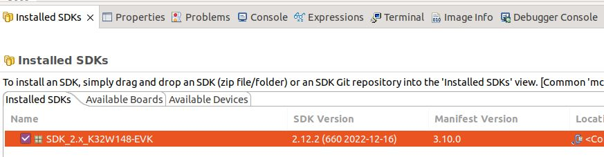

# Matter K32W1 Lighting Example Application

Matter K32W1 Lighting Example demonstrates how to remotely control a light bulb.
The light bulb is simulated using one of the LEDs from the expansion board. It
uses buttons to test turn on/turn off of the light bulb. You can use this
example as a reference for creating your own application.

The example is based on
[Matter](https://github.com/project-chip/connectedhomeip) and the NXP K32W1 SDK,
and supports remote access and control of a light bulb over a low-power,
802.15.4 Thread network.

The example behaves as a Matter accessory, that is a device that can be paired
into an existing Matter network and can be controlled by this network.

<hr>

-   [Matter K32W1 Lighting Example Application](#matter-k32w1-lighting-example-application)
-   [Introduction](#introduction)
    -   [Bluetooth LE Advertising](#bluetooth-le-advertising)
    -   [Bluetooth LE Rendezvous](#bluetooth-le-rendezvous)
-   [Device UI](#device-ui)
-   [Building](#building)
    -   [SMU2](#smu2-memory)
    -   [LED PWM](#led-pwm)
-   [Manufacturing data](#manufacturing-data)
-   [Flashing](#flashing)
    -   [Flashing the NBU image](#flashing-the-nbu-image)
    -   [Flashing the host image](#flashing-the-host-image)
-   [Debugging](#debugging)
-   [OTA](#ota)
    -   [Convert srec into sb3 file](#convert-srec-into-sb3-file)
    -   [Convert sb3 into ota file](#convert-sb3-into-ota-file)
    -   [Running OTA](#running-ota)
    -   [Known issues](#known-issues)
-   [Running RPC console](#running-rpc-console)

</hr>

## Introduction


The K32W1 lighting example application provides a working demonstration of a
light bulb device, built using the Matter codebase and the NXP K32W1 SDK. The
example supports remote access (e.g.: using CHIP Tool from a mobile phone) and
control of a light bulb over a low-power, 802.15.4 Thread network. It is capable
of being paired into an existing Matter network along with other Matter-enabled
devices.

The Matter device that runs the lighting application is controlled by the Matter
controller device over the Thread protocol. By default, the Matter device has
Thread disabled, and it should be paired over Bluetooth LE with the Matter
controller and obtain configuration from it. The actions required before
establishing full communication are described below.

### Bluetooth LE Advertising

In this example, to commission the device onto a Matter network, it must be
discoverable over Bluetooth LE. For security reasons, you must start Bluetooth
LE advertising manually after powering up the device by pressing Button SW2.

### Bluetooth LE Rendezvous

In this example, the commissioning procedure (called rendezvous) is done over
Bluetooth LE between a Matter device and the Matter controller, where the
controller has the commissioner role.

To start the rendezvous, the controller must get the commissioning information
from the Matter device. The data payload is encoded within a QR code, or printed
to the UART console.

### Thread Provisioning

## Device UI

The example application provides a simple UI that depicts the state of the
device and offers basic user control. This UI is implemented via the
general-purpose LEDs and buttons built in the K32W1 EVK board.

**LED 2** shows the overall state of the device and its connectivity. Four
states are depicted:

-   _Short Flash On (50ms on/950ms off)_ &mdash; The device is in an
    unprovisioned (unpaired) state and is waiting for a commissioning
    application to connect.

*   _Rapid Even Flashing (100ms on/100ms off)_ &mdash; The device is in an
    unprovisioned state and a commissioning application is connected via BLE.

-   _Short Flash Off (950ms on/50ms off)_ &mdash; The device is full
    provisioned, but does not yet have full network (Thread) or service
    connectivity.

*   _Solid On_ &mdash; The device is fully provisioned and has full network and
    service connectivity.

NOTE: LED2 will be disabled when CHIP_DEVICE_CONFIG_ENABLE_OTA_REQUESTOR is
enabled. On K32W1 EVK board, `PTB0` is wired to LED2 also is wired to CS (Chip
Select) External Flash Memory. OTA image is stored in external memory because of
it's size. If LED2 is enabled then it will affect External Memory CS and OTA
will not work.

**RGB LED** shows the state of the simulated light bulb. When the LED is lit the
light bulb is on; when not lit, the light bulb is off.

**Button SW2** can be used to start BLE advertising. A SHORT press of the button
will enable Bluetooth LE advertising for a predefined period of time. A LONG
Press Button SW2 initiates a factory reset. After an initial period of 3
seconds, LED 2 and RGB LED will flash in unison to signal the pending reset.
After 6 seconds will cause the device to reset its persistent configuration and
initiate a reboot. The reset action can be cancelled by press SW2 button at any
point before the 6 second limit.

**Button SW3** can be used to change the state of the simulated light bulb. This
can be used to mimic a user manually operating a switch. The button behaves as a
toggle, swapping the state every time it is short pressed. When long pressed, it
does a clean soft reset that takes into account Matter shutdown procedure.

## Building

In order to build the Matter example, we recommend using a Linux distribution
(the demo-application was compiled on Ubuntu 20.04).

-   Download [K32W1 SDK for Matter](https://mcuxpresso.nxp.com/). Creating an
    nxp.com account is required before being able to download the SDK. Once the
    account is created, login and follow the steps for downloading K32W148-EVK
    MCUXpresso SDK. The SDK Builder UI selection should be similar with the one
    from the image below.

    

    Please refer to Matter release notes for getting the latest released SDK.

```
user@ubuntu:~/Desktop/git/connectedhomeip$ export NXP_K32W1_SDK_ROOT=/home/user/Desktop/SDK_K32W1/
user@ubuntu:~/Desktop/git/connectedhomeip$ source ./scripts/activate.sh
user@ubuntu:~/Desktop/git/connectedhomeip$ scripts/checkout_submodules.py --shallow --platform nxp --recursive
user@ubuntu:~/Desktop/git/connectedhomeip$ cd examples/lighting-app/nxp/k32w/k32w1
user@ubuntu:~/Desktop/git/connectedhomeip/examples/lighting-app/nxp/k32w/k32w1$ gn gen out/debug
user@ubuntu:~/Desktop/git/connectedhomeip/examples/lighting-app/nxp/k32w/k32w1$ ninja -C out/debug
```

In case that Openthread CLI is needed, `chip_with_ot_cli` build argument must be
set to 1.

After a successful build, the `elf` and `srec` files are found in `out/debug/` -
see the files prefixed with `chip-k32w1-light-example`.

### `SMU2` Memory

Some Matter instances and global variables can be placed in the `NBU` `SMU2`
memory. When compiling with OpenThread FTD support (`chip_openthread_ftd=true`)
and with `use_smu2_static=true`, the following components are placed in `SMU2`
memory:

-   `gImageProcessor` from OTAImageProcessorImpl.cpp.
-   `gApplicationProcessor` from OTAHooks.cpp.
-   `Server::sServer` from Server.cpp.
-   `ThreadStackManagerImpl::sInstance` from ThreadStackManagerImpl.cpp.

These instances and global variables are placed in `SMU2` memory through name
matching in the application linker script. They should not be changed or, if
changed, the names must be updated in `k32w1_app.ld`. See
[k32w1_app.ld](../../../../platform/nxp/k32w/k32w1/app/ldscripts/k32w1_app.ld)
for names and `SMU2` memory range size.

The OpenThread buffers can be allocated from a 13KB `SMU2` range after a
successful commissioning process until a factory reset is initiated. This way,
the OpenThread buffers will be dynamically allocated instead of statically,
freeing some `SRAM`. To enable this feature compile with OpenThread FTD support
(`chip_openthread_ftd=true`) and with `use_smu2_dynamic=true`.

### LED PWM

In the default configuration, the onboard RGB LED pins are configured as GPIO
pins. In order to enable the dimming feature, the pins need to be configured in
PWM mode and synced with channels of the `TPM` (Timer PWM Module). To enable
this feature, compile the application with: `chip_config_dimmable_led=true`

If the feature is enabled, the LED brightness can be controlled using **Level
control** cluster
[commands](../../../../../docs/guides/chip_tool_guide.md#step-7-control-application-data-model-clusters).

## Manufacturing data

Use `chip_with_factory_data=1` in the gn build command to enable factory data.

For a full guide on manufacturing flow, please see
[Guide for writing manufacturing data on NXP devices](../../../../../docs/guides/nxp_manufacturing_flow.md).

## Flashing

Two images must be written to the board: one for the host (CM33) and one for the
`NBU` (CM3).

The image needed on the host side is the one generated in `out/debug/` while the
one needed on the `NBU` side can be found in the downloaded NXP-SDK package at
path -
`middleware\wireless\ieee-802.15.4\bin\k32w1\k32w1_nbu_ble_15_4_dyn_matter_$version.sb3`.

### Flashing the `NBU` image

`NBU` image should be written only when a new NXP-SDK is released.

[K32W148 board quick start guide](https://www.nxp.com/document/guide/getting-started-with-the-k32w148-development-platform:GS-K32W148EVK)
can be used for updating the `NBU/radio` core:

-   Section 2.5 – Get Software – install `SPSDK` (Secure Provisioning Command
    Line Tool)
-   Section 3.3 – Updating `NBU` for Wireless examples - use the corresponding
    .sb3 file found in the SDK package at path
    `middleware\wireless\ieee-802.15.4\bin\k32w1\`

### Flashing the host image

Host image is the one found under `out/debug/`. It should be written after each
build process.

If debugging is needed then jump directly to the [Debugging](#debugging)
section. Otherwise, if only flashing is needed then
[JLink 7.84b](https://www.segger.com/downloads/jlink/) can be used:

-   Plug K32W1 to the USB port (no need to keep the SW4 button pressed while
    doing this)

-   Create a new file, `commands_script`, with the following content (change
    application name accordingly):

```bash
reset
halt
loadfile chip-k32w1-light-example.srec
reset
go
quit
```

-   copy the application and `commands_script` in the same folder that JLink
    executable is placed. Execute:

```bash
$  jlink -device K32W1480 -if SWD -speed 4000 -autoconnect 1 -CommanderScript commands_script
```

## Debugging

One option for debugging would be to use MCUXpresso IDE.

-   Drag-and-drop the zip file containing the NXP SDK in the "Installed SDKs"
    tab:



-   Import any demo application from the installed SDK:

```
Import SDK example(s).. -> choose a demo app (demo_apps -> hello_world) -> Finish
```


-   Flash the previously imported demo application on the board:

```
Right click on the application (from Project Explorer) -> Debug as -> JLink/CMSIS-DAP
```

After this step, a debug configuration specific for the K32W1 board was created.
This debug configuration will be used later on for debugging the application
resulted after ot-nxp compilation.

-   Import Matter repo in MCUXpresso IDE as Makefile Project. Use _none_ as
    _Toolchain for Indexer Settings_:

```
File -> Import -> C/C++ -> Existing Code as Makefile Project
```


-   Replace the path of the existing demo application with the path of the K32W1
    application:

```
Run -> Debug Configurations... -> C/C++ Application
```


## OTA

### Convert `srec` into `sb3` file

The OTA image files must be encrypted using Over The Air Programming Tool
([OTAP](https://www.nxp.com/design/microcontrollers-developer-resources/connectivity-tool-suite:CONNECTIVITY-TOOL-SUITE?#downloads)).
Bootloader will load the new OTA image only if it detects that the file was
encrypted with the `OTAP` correct keys.

`.srec` file is input for Over The air Programming (`OTAP`) application
(unencrypted) and it's converted to `.sb3` format (encrypted).

In `OTAP` application

-   select OTA protocol => `OTAP` Matter
-   Browse File
-   follow default options (KW45/K32W148, Preserve NVM)
-   image information: will update "Application Core (MCU)" - this will generate
    the image only for the CM33 core
-   keep other settings at default values

### Convert `sb3` into `ota` file

In order to build an OTA image, use NXP wrapper over the standard tool
`src/app/ota_image_tool.py`:

-   `scripts/tools/nxp/factory_data_generator/ota_image_tool.py` The tool can be
    used to generate an OTA image with the following format:
    `| OTA image header | TLV1 | TLV2 | ... | TLVn |` where each TLV is in the
    form `|tag|length|value|`

Note that "standard" TLV format is used. Matter TLV format is only used for
factory data TLV value.

Please see more in the
[OTA image tool guide](../../../../../scripts/tools/nxp/ota/README.md).

Here is an example that generates an OTA image with application update TLV from
a sb3 file:

```
./scripts/tools/nxp/ota/ota_image_tool.py create -v 0xDEAD -p 0xBEEF -vn 43033 -vs "1.0" -da sha256 --app-input-file ~/binaries/chip-k32w1-43033.sb3 ~/binaries/chip-k32w1-43033.ota

```

A note regarding OTA image header version (`-vn` option). An application binary
has its own software version (given by
`CHIP_DEVICE_CONFIG_DEVICE_SOFTWARE_VERSION`, which can be overwritten). For
having a correct OTA process, the OTA header version should be the same as the
binary embedded software version. A user can set a custom software version in
the gn build args by setting `chip_software_version` to the wanted version.

### Running OTA

The OTA topology used for OTA testing is illustrated in the figure below.
Topology is similar with the one used for Matter Test Events.


The concept for OTA is the next one:

-   there is an OTA Provider Application that holds the OTA image. In our case,
    this is a Linux application running on an Ubuntu based-system;
-   the OTA Requestor functionality is embedded inside the Lighting Application.
    It will be used for requesting OTA blocks from the OTA Provider;
-   the controller (a linux application called chip-tool) will be used for
    commissioning both the device and the OTA Provider App. The device will be
    commissioned using the standard Matter flow (BLE + IEEE 802.15.4) while the
    OTA Provider Application will be commissioned using the _onnetwork_ option
    of chip-tool;
-   during commissioning, each device is assigned a node id by the chip-tool
    (can be specified manually by the user). Using the node id of the device and
    of the lighting application, chip-tool triggers the OTA transfer by invoking
    the _announce-ota-provider_ command - basically, the OTA Requestor is
    informed of the node id of the OTA Provider Application.

_Computer #1_ can be any system running an Ubuntu distribution. We recommand
using CSA official instructions from
[here](https://groups.csa-iot.org/wg/matter-csg/document/28566), where RPi 4 are
proposed. Also, CSA official instructions document point to the OS/Docker images
that should be used on the RPis. For compatibility reasons, we recommand
compiling chip-tool and OTA Provider applications with the same commit id that
was used for compiling the Lighting Application. Also, please note that there is
a single controller (chip-tool) running on Computer #1 which is used for
commissioning both the device and the OTA Provider Application. If needed,
[these instructions](https://itsfoss.com/connect-wifi-terminal-ubuntu/) could be
used for connecting the RPis to WiFi.

Build the Linux OTA provider application:

```
user@computer1:~/connectedhomeip$ : ./scripts/examples/gn_build_example.sh examples/ota-provider-app/linux out/ota-provider-app chip_config_network_layer_ble=false
```

Build Linux chip-tool:

```
user@computer1:~/connectedhomeip$ : ./scripts/examples/gn_build_example.sh examples/chip-tool out/chip-tool-app
```

Start the OTA Provider Application:

```
user@computer1:~/connectedhomeip$ : rm -rf /tmp/chip_*
user@computer1:~/connectedhomeip$ : ./out/ota-provider-app/chip-ota-provider-app -f chip-k32w1-43033.ota
```

Provision the OTA provider application and assign node id _1_. Also, grant ACL
entries to allow OTA requestors:

```
user@computer1:~/connectedhomeip$ : rm -rf /tmp/chip_*
user@computer1:~/connectedhomeip$ : ./out/chip-tool-app/chip-tool pairing onnetwork 1 20202021
user@computer1:~/connectedhomeip$ : ./out/chip-tool-app/chip-tool accesscontrol write acl '[{"fabricIndex": 1, "privilege": 5, "authMode": 2, "subjects": [112233], "targets": null}, {"fabricIndex": 1, "privilege": 3, "authMode": 2, "subjects": null, "targets": null}]' 1 0
```

Provision the device and assign node id _2_:

```
user@computer1:~/connectedhomeip$ : ./out/chip-tool-app/chip-tool pairing ble-thread 2 hex:<operationalDataset> 20202021 3840
```

Start the OTA process:

```
user@computer1:~/connectedhomeip$ : ./out/chip-tool-app/chip-tool otasoftwareupdaterequestor announce-ota-provider 1 0 0 0 2 0
```

### Known issues

-   SRP cache on the openthread border router needs to flushed each time a new
    commissioning process is attempted. For this, factory reset the device, then
    execute _ot-ctl server disable_ followed by _ot-ctl server enable_. After
    this step, the commissioning process of the device can start;
-   Due to some MDNS issues, the commissioning of the OTA Provider Application
    may fail. Please make sure that the SRP cache is disabled (_ot-ctl srp
    server disable_) on the openthread border router while commissioning the OTA
    Provider Application;
-   No other Docker image should be running (e.g.: Docker image needed by Test
    Harness) except the OTBR one. A docker image can be killed using the
    command:

```
user@computer1:~/connectedhomeip$ : sudo docker kill $container_id
```

-   In order to avoid MDNS issues, only one interface should be active at one
    time. E.g.: if WiFi is used then disable the Ethernet interface and also
    disable multicast on that interface:

```
user@computer1:~/connectedhomeip$ sudo ip link set dev eth0 down
user@computer1:~/connectedhomeip$ sudo ifconfig eth0 -multicast
```

-   If OTBR Docker image is used, then the "-B" parameter should point to the
    interface used for the backbone.

-   If Wi-Fi is used on a RPI4, then a 5Ghz network should be selected.
    Otherwise, issues related to BLE-WiFi combo may appear.

## Running RPC console

To build example with RPC enabled, use the following gn command:
`gn gen out/debug --args='import("//with_pw_rpc.gni") treat_warnings_as_errors=false'`

The application runs an RPC server and processes events coming from an RPC
client. An example of an RPC client is the `chip-console`, which can be accessed
by running:
`chip-console --device /dev/tty.<SERIALDEVICE> -b 115200 -o pw_log.out`

The console should already have been installed in the virtual environment. From
the `chip-console`, a user can send specific commands to the device, e.g.:

-   To toggle the LED (`#define LIGHT_BUTTON 2` in `app_config.h`)
    `rpcs.chip.rpc.Button.Event(idx=2)`
-   To start BLE advertising (`#define BLE_BUTTON 4` in `app_config.h`)
    `rpcs.chip.rpc.Button.Event(idx=4)`
-   To reboot the device `rpcs.chip.rpc.Device.Reboot()`
