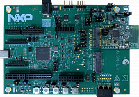

# Matter `MCXW72` Lighting Example Application

For generic information related to on/off light application, please see the
[common README](../README.md).

-   [Matter `MCXW72` Lighting Example Application](#matter-mcxw72-lighting-example-application)
    -   [Introduction](#introduction)
    -   [Device UI](#device-ui)
        -   [Configure `matter-cli`](#configure-matter-cli)
    -   [Building](#building)
    -   [Flashing](#flashing)
        -   [Flashing the `NBU` image with `blhost`](#flashing-the-nbu-image-with-blhost)
        -   [Flashing the `NBU` image with `JLink`](#flashing-the-nbu-image-with-jlink)
        -   [Flashing the host image](#flashing-the-host-image)
    -   [Factory data](#factory-data)
    -   [OTA](#ota)

## Introduction

This is an on/off lighting application implemented for an `mcxw72` device.

The following board was used when testing this Matter reference app for a
`mcxw72` device:



Please see
[`MCXW72` product page](https://www.nxp.com/products/processors-and-microcontrollers/arm-microcontrollers/general-purpose-mcus/mcx-arm-cortex-m/mcx-w-series-microcontrollers/mcx-w72x-secure-and-ultra-low-power-mcus-for-matter-thread-zigbee-and-bluetooth-le:MCX-W72X)
for more information.

## Device UI

This reference app is using `matter-cli` to send commands to the board through a
UART interface.

| interface | role                               |
| --------- | ---------------------------------- |
| UART0     | Used for logs                      |
| UART1     | Used for `matter-cli` and flashing |

The user actions are summarized below:

| matter-cli command        | output                   |
| ------------------------- | ------------------------ |
| `mattercommissioning on`  | Enable BLE advertising   |
| `mattercommissioning off` | Disable BLE advertising  |
| `matterfactoryreset`      | Initiate a factory reset |
| `matterreset`             | Reset the device         |

### Additional UART interface

You need a `USB-UART` bridge to make use of the second UART interface. The pin
configuration is the following:

-   `JP11 pin 1` (UART0 TX)
-   `JP12 pin 1` (UART0 RX)
-   `J11 pin 4` (GND)

The state feedback is also provided through LED effects:

| widget  | effect                              | description                                                                                           |
| ------- | ----------------------------------- | ----------------------------------------------------------------------------------------------------- |
| LED2    | short flash on (50ms on/950ms off)  | The device is in an unprovisioned (unpaired) state and is waiting for a commissioner to connect.      |
| LED2    | rapid even flashing (100ms period)  | The device is in an unprovisioned state and a commissioner is connected via BLE.                      |
| LED2    | short flash off (950ms on/50ms off) | The device is fully provisioned, but does not yet have full network (Thread) or service connectivity. |
| LED2    | solid on                            | The device is fully provisioned and has full network and service connectivity.                        |
| RGB LED | on                                  | The `OnOff` attribute of the `On/Off` cluster is `true` (simulating device turned on).                |
| RGB LED | off                                 | The `OnOff` attribute of the `On/Off` cluster is `false` (simulating device turned off).              |

The user actions are summarized below:

| button | action      | output                                                                                                                                 |
| ------ | ----------- | -------------------------------------------------------------------------------------------------------------------------------------- |
| SW2    | short press | Enable BLE advertising                                                                                                                 |
| SW2    | long press  | Initiate a factory reset (can be cancelled by pressing the button again within the factory reset timeout limit - 6 seconds by default) |
| SW3    | short press | Toggle attribute `OnOff` value                                                                                                         |
| SW3    | long press  | Clean soft reset of the device (takes into account proper Matter shutdown procedure)                                                   |

The example application provides a simple UI that depicts the state of the
device and offers basic user control. This UI is implemented via the
general-purpose LEDs and buttons built in the `MCXW72 EVK` board.

## Building

Manually building requires running the following commands:

```
user@ubuntu:~/Desktop/git/connectedhomeip$ export NXP_SDK_ROOT=<path_to_SDK>
user@ubuntu:~/Desktop/git/connectedhomeip$ cd examples/lighting-app/nxp/mcxw72
user@ubuntu:~/Desktop/git/connectedhomeip/examples/lighting-app/nxp/mcxw72$ gn gen out/debug
user@ubuntu:~/Desktop/git/connectedhomeip/examples/lighting-app/nxp/mcxw72$ ninja -C out/debug
```

Please note that running `gn gen out/debug` without `--args` option will use the
default gn args values found in `args.gni`.

After a successful build, the `elf` and `srec` files are found in `out/debug/`.
See the files prefixed with `chip-mcxw72-light-example`.

## Flashing

We recommend using [JLink](https://www.segger.com/downloads/jlink/) to flash
both host and `NBU` cores. To support this device, a `JLink` patch shall be
applied, so please contact your NXP liaison for guidance.

| core  | JLink target       |
| ----- | ------------------ |
| host  | `KW47B42ZB7_M33_0` |
| `NBU` | `KW47B42ZB7_M33_1` |

Note: `NBU` image should be written only when a new NXP SDK is released.

### Flashing the `NBU` image with `blhost`

1. Install
   [Secure Provisioning SDK tool](https://www.nxp.com/design/design-center/software/development-software/secure-provisioning-sdk-spsdk:SPSDK)
   using Python:

    ```
    pip install spsdk
    ```

    Note: There might be some dependencies that cause conflicts with already
    installed Python modules. However, `blhost` tool is still installed and can
    be used.

2. Updating `NBU` Firmware for Wireless examples

    It is necessary to work with the matching `NBU` image for the SDK version of
    the application you are working with. This means that when you download your
    SDK, prior to loading any wireless SDK example, update your `NBU` image with
    the SDK provided binaries:

    `middleware\wireless\ieee-802.15.4\bin\mcxw72\mcxw72_nbu_ble_15_4_dyn.bin`

    1. Place your device in `ISP` mode:

        - Press and hold `SW4` (`BOOT_CONFIG`)
        - Press and hold `SW1` (`RST`)
        - Relax `SW1`
        - Relax `SW4`

    2. Once the device is connected, you may find the assigned port by running:

        ```
        nxpdevscan
        ```

    3. Run the `blhost` command to write the `bin` file:

        ```
        blhost -p <assigned_port> write-memory 0x48800000 <path_to_SDK>/middleware/wireless/ieee-802.15.4/bin/mcxw72/mcxw72_nbu_ble_15_4_dyn.bin

        ```

### Flashing the `NBU` image with `JLink`

Steps:

-   Plug `MCXW72-EVK` board into the USB port
-   Connect JLink to the device:
    ```bash
    JLinkExe -device KW47B42ZB7_M33_1 -if SWD -speed 4000 -autoconnect 1
    ```
-   Run the following commands:
    ```bash
    reset
    halt
    loadbin <path_to_SDK>/middleware/wireless/ieee-802.15.4/bin/mcxw72/mcxw72_nbu_ble_15_4_dyn.bin 0
    reset
    go
    quit
    ```

Note: If running into issues related to board connection, please refer to
[Flashing the `NBU` image with `blhost`](#flashing-the-nbu-image-with-blhost).
This might be needed when the `NBU` core is empty.

### Flashing the host image

Host image is the one found under `out/debug/`. It should be written after each
build process.

Steps:

-   Plug `MCXW72-EVK` board into the USB port
-   Connect JLink to the device:
    ```bash
    JLinkExe -device KW47B42ZB7_M33_0 -if SWD -speed 4000 -autoconnect 1
    ```
-   Run the following commands:
    ```bash
    reset
    halt
    loadfile chip-mcxw72-light-example.srec
    reset
    go
    quit
    ```

## Factory data

Factory data is written in `IFR0, sector 1` at a predefined offset, using
`blhost`. The expanded address is `0x2002680`:

```
blhost --port <serial_port> flash-erase-region 0x2002680 <factory_data_len>
blhost --port <serial_port> write-memory 0x2002680 <factory_data_bin>
```

where `<serial_port>` is the OS assigned port, `<factory_data_len>` the length
of factory data binary in bytes and `<factory_data_bin>` the path to the factory
data binary.

## OTA

Please see [OTA guide](../../../../docs/guides/nxp/nxp_mcxw71_ota_guide.md).
