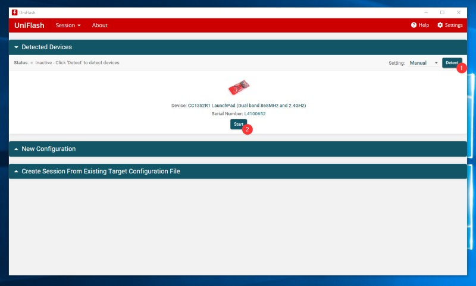
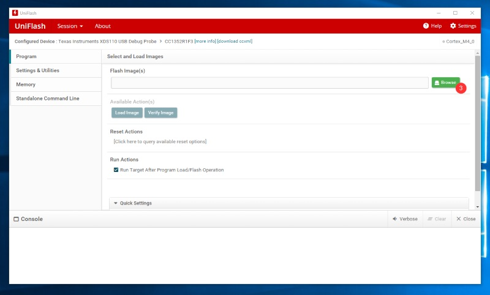
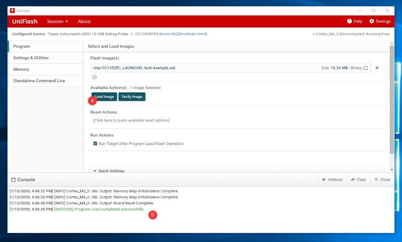

# Programming with UniFlash

-   Download and install [UniFlash][uniflash].

-   Select the Device Detect option. Then select the device you wish to program.
    Or you can create a new configuration if you know the debugger serial number

    

-   Browse for your build image by clicking the `Browse` button. It will be at
    `${connectedhomeip}/examples/lock-app/cc13x2_26x2/out/debug/chip-cc13x2_26x2-lock-example.out`

    

-   Load the image by clicking the `Load Image` button. This will eventually
    result in a success message in the console below.

    

-   Open a terminal to the XDS110 User UART and interact with the example
    application.

[uniflash]: https://www.ti.com/tool/download/UNIFLASH
