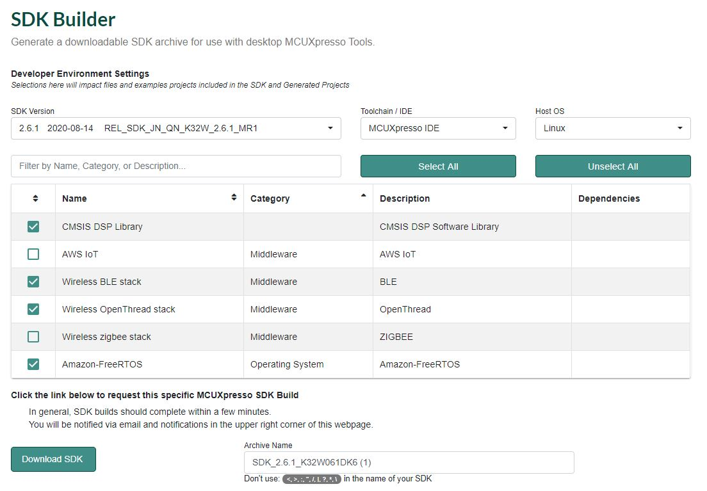
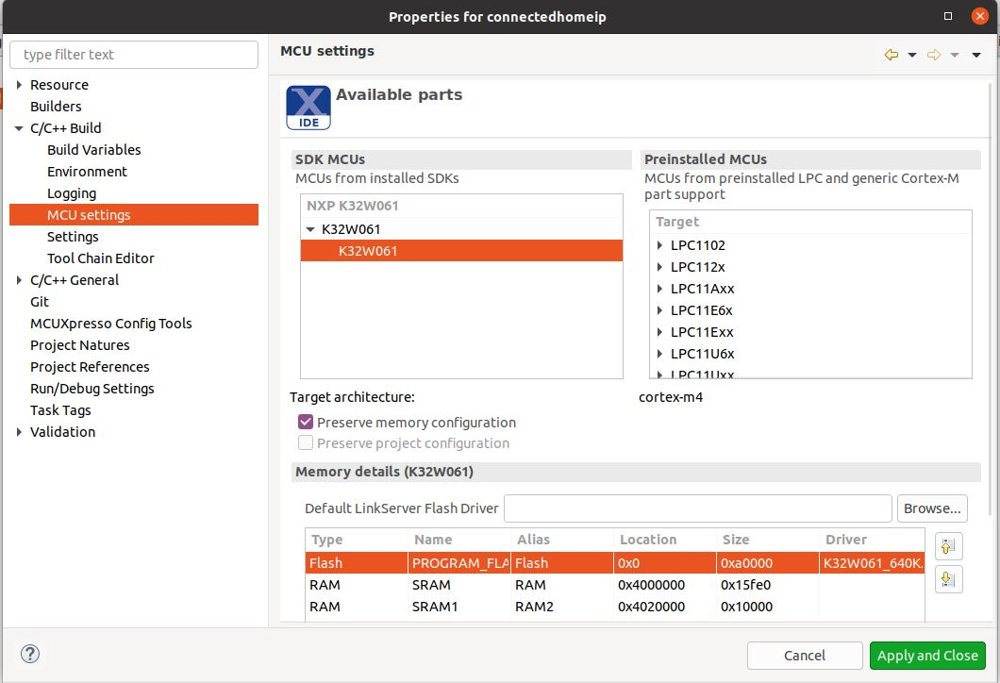
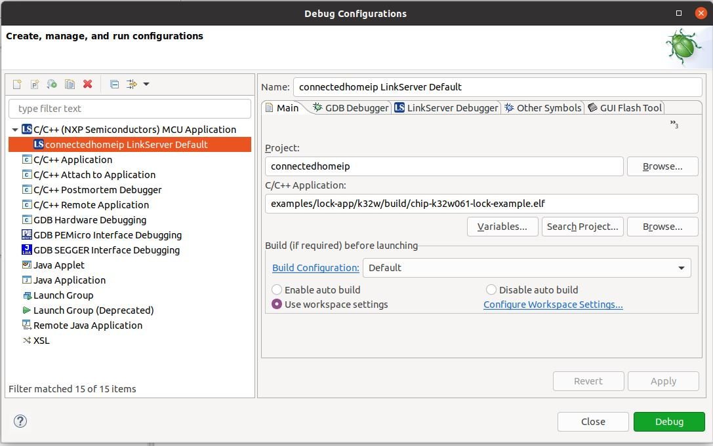

# CHIP K32W061 Lock Example Application

An example application showing the use of
[CHIP](https://github.com/project-chip/connectedhomeip) on the NXP K32W061
board.

<hr>

-   [CHIP K32W Lock Example Application](#chip-k32w-lock-example-application) -
    [Introduction](#introduction) - [Device UI](#device-ui) -
    [Building](#building) - [Flashing and debugging](#flashdebug)
    <hr>

<a name="intro"></a>

## Introduction


The K32W lock example application provides a working demonstration of a
connected door lock device, built using CHIP, and the NXP K32W061 SDK. The
functionality at this moment is limited and the demo app can be used for
changing the state of a door lock and also for factoryreset the board. Soon,
functionality for BLE pairing and ZCL control will be added. This will allow a
user to control the door lock using a mobile application (CHIP Tool).

The example targets the
[NXP K32W061 DK6](https://www.nxp.com/products/wireless/thread/k32w061-41-high-performance-secure-and-ultra-low-power-mcu-for-zigbeethread-and-bluetooth-le-5-0-with-built-in-nfc-option:K32W061_41)
development kit, but is readily adaptable to other K32W-based hardware.

The lock example is intended to serve both as a means to explore the workings of
CHIP, as well as a template for creating real products based on the NXP
platform.

The example application builds upon the CHIP. A top-level Makefile orchestrates
the entire build process, including building CHIP, and select files from the NXP
SDK. The resultant image file can be flashed directly onto the NXP dev kit
hardware using MCUXpresso.

## Device UI

The example application provides a simple UI that depicts the state of the
device and offers basic user control. This UI is implemented via the
general-purpose LEDs and buttons built in to the OM15082 Expansion board
attached to the DK6 board.

**LED D2** shows the overall state of the device and its connectivity. Four
states are depicted:

-   _Short Flash On (50ms on/950ms off)_ &mdash; The device is in an
    unprovisioned (unpaired) state and is waiting for a commissioning
    application to connect.

*   _Rapid Even Flashing (100ms on/100ms off)_ &mdash; The device is in an
    unprovisioned state and a commissioning application is connected via BLE.

-   _Short Flash Off (950ms on/50ms off)_ &mdash; The device is full
    provisioned, but does not yet have full network (Thread) or service
    connectivity.

*   _Solid On_ &mdash; The device is fully provisioned and has full network and
    service connectivity.

**Button SW2** can be used to reset the device to a default state.

Pressing and holding Button SW2 for 6 seconds initiates a factory reset. After
an initial period of 3 seconds, LED2 D2 and D3 will flash in unison to signal
the pending reset. Holding the button past 6 seconds will cause the device to
reset its persistent configuration and initiate a reboot. The reset action can
be cancelled by releasing the button at any point before the 6 second limit.

**LED D3** shows the state of the simulated lock bolt. When the LED is lit the
bolt is extended (i.e. door locked); when not lit, the bolt is retracted (door
unlocked). The LED will flash whenever the simulated bolt is in motion from one
position to another.

**Button SW3** can be used to change the state of the simulated bolt. This can
be used to mimick a user manually operating the lock. The button behaves as a
toggle, swapping the state every time it is pressed.

The remaining two LEDs and buttons (D1/D4 and SW1/SW4) are unused.

<a name="building"></a>

## Building

In order to build Project CHIP, we recommend using a Linux distribution (the
demo-application was compiled on Ubuntu 20.04).

-   Download [SDK 2.6.1 MR1 for Project CHIP](https://mcuxpresso.nxp.com/). You
    need to create an account before being able to download an SDK. Once the
    account is created, login and follow the steps for downloading
    SDK_2.6.1_K32W061DK6. The UI is very intuitive and the correct selection
    should be similiar with the one from the image below.
    

-   Download the suitable
    [ARM GCC toolchain](https://developer.arm.com/tools-and-software/open-source-software/developer-tools/gnu-toolchain/gnu-rm/downloads/7-2018-q2-update)
    for your Linux distribution

-   Set two Linux environmental variables based on the above downloaded
    packages:

```
user@ubuntu:~/Desktop/git/connectedhomeip$ export K32W061_SDK_ROOT=/home/user/Desktop/git/SDK_2.6.1_K32W061DK6
user@ubuntu:~/Desktop/git/connectedhomeip$ export GNU_INSTALL_ROOT=/home/user/Desktop/git/gcc-arm-none-eabi-7-2018-q2-update/bin/
```

-   You may start building the application

```
user@ubuntu:~/Desktop/git/connectedhomeip$ cd examples/lock-app/k32w/
user@ubuntu:~/Desktop/git/connectedhomeip/examples/lock-app/k32w$ make
```

In case OpenThread fails to compile due to some signing errors just follow the
compilation logs and install the recommanded packages (python version > 3, pip3,
pycrypto, pycryptodome):

```
user@ubuntu:~$ python3 --version
Python 3.8.2
user@ubuntu:~$ pip3 --version
pip 20.0.2 from /usr/lib/python3/dist-packages/pip (python 3.8)
user@ubuntu:~$ pip3 list | grep -i pycrypto
pycrypto               2.6.1
pycryptodome           3.9.8
```

The resulting elf file can be found in the build directory and it's named
chip-k32w061-lock-example.elf.

## Flashing and debugging

In order to flash the application we recommend using
[MCUXpresso IDE (version >= 11.0.0)](https://www.nxp.com/design/software/development-software/mcuxpresso-software-and-tools-/mcuxpresso-integrated-development-environment-ide:MCUXpresso-IDE?tab=Design_Tools_Tab).

-   Import the previously downloaded NXP SDK into MCUXpresso IDE. This can be
    done by drag-and-dropping the SDK archive into MCUXpresso IDE's "Installed
    SDKs" tab; 
-   Import Project CHIP in MCUXpresso IDE as Makefile Project:
    <i>File->Import->C/C++->Existing Code as Makefile Project-> Next </i>.
    Select Project CHIP folder as the <i>Existing Code Location</i>. In the
    <i>Toolchain for Indexer Settings </i> list, be sure to keep the setting to
    <i>none</i>. Click <i>Finish</i>;
-   Configure MCU Settings: right click on project from the workspace and go to
    <i>Properties->C/C++ Build->MCU Settings</i>. Select K32W061 from the SDK
    MCUs list;
-   Configure the toolchain editor: <i>C/C++ Build->Tool Chain Editor</i>.
    Untick the <i>Display compatible toolchains only</i> checkbox. In the
    drop-down menu named <i>Current toolchain</i>, select <i>NXP MCU Tools</i>.
    Click <i>Apply and Close</i>;
-   Create a debug configuration: right click on the project and select <i>Debug
    As->MCUXpresso IDE LinkServer (inc. CMSIS-DAP) probes</i>. A window to
    select the binary will appear. Select
    <i>examples/lock-app/k32w/build/chip-k32w061-lock-example.elf</i> and click
    OK;
-   Use the debug configuration: under the menu bar, towards the center of the
    screen, there is a green bug icon with a drop-down arrow next to it. Click
    on the arrow and select <i>Debug Configurations</i>. In the right side of
    the Debug Configurations window, go to <i>C/C++ (NXP Semiconductors) MCU
    Application->openthread LinkServer Default</i>. Make sure that the <i>C/C++
    Application</i> text box contains
    <i>examples/lock-app/k32w/build/chip-k32w061-lock-example.elf</i> path. Go
    to <i>GUI Flash Tool</i> tab. In <i>Target Operations->Program->Options</i>,
    select "bin" as the <i>Format to use for programming</i>. Make sure the
    <i>Base address</i> is 0x0. Click <i>Debug</i>. A pop-up window entitled
    <i>Errors in Workspace</i> will appear. Click <i>Proceed</i>.
    
