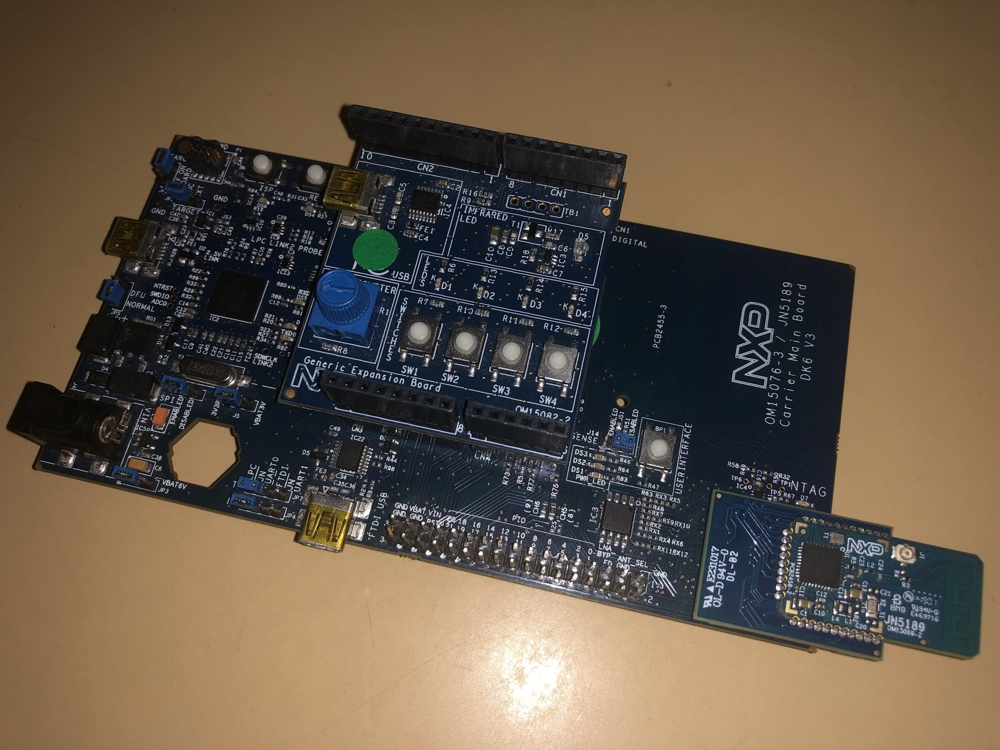
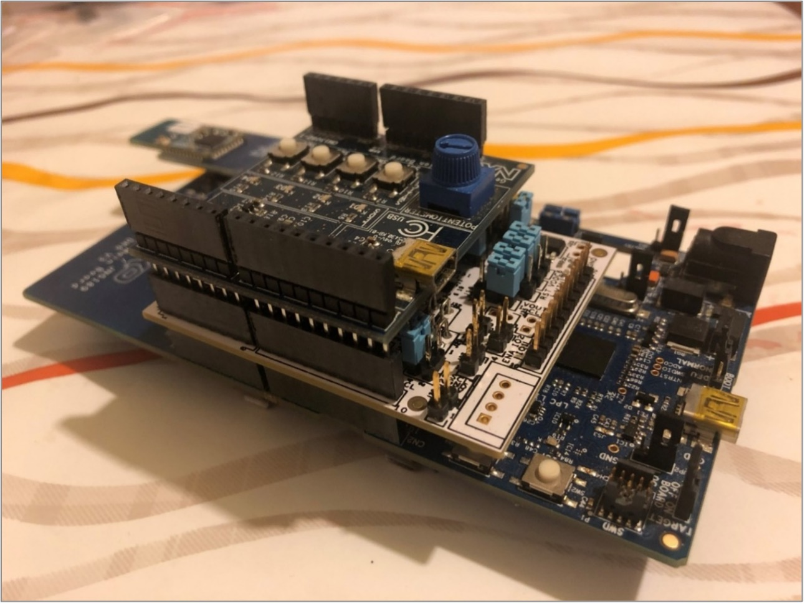
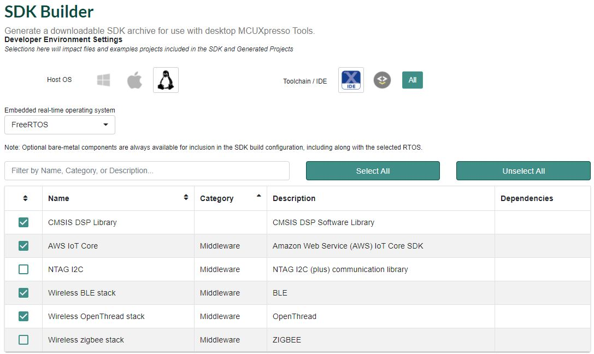

# CHIP K32W061 Lock Example Application

The Project CHIP K32W061 Lock Example demonstrates how to remotely control a
door lock device with one basic bolt. It uses buttons to test changing the lock
and device states and LEDs to show the state of these changes. You can use this
example as a reference for creating your own application.

The example is based on
[Project CHIP](https://github.com/project-chip/connectedhomeip) and the NXP K32W
SDK, and supports remote access and control of a simulated door lock over a
low-power, 802.15.4 Thread network.

The example behaves as a Project CHIP accessory, that is a device that can be
paired into an existing Project CHIP network and can be controlled by this
network.

<hr>

-   [CHIP K32W Lock Example Application](#chip-k32w-lock-example-application) -
-   [Introduction](#introduction)
    -   [Bluetooth LE Advertising](#bluetooth-le-advertising)
    -   [Bluetooth LE Rendezvous](#bluetooth-le-rendezvous)
-   [Device UI](#device-ui)
-   [Building](#building)
-   [Flashing and debugging](#flashdebug)
-   [Known Issues](#knownissues)
-   [Testing the example](#testing-the-example)

<hr>

<a name="intro"></a>

## Introduction



The K32W lock example application provides a working demonstration of a
connected door lock device, built using the Project CHIP codebase and the NXP
K32W061 SDK. The example supports remote access (e.g.: using CHIP Tool from a
mobile phone) and control of a simulated door lock over a low-power, 802.15.4
Thread network. It is capable of being paired into an existing Project CHIP
network along with other Project CHIP-enabled devices.

The example targets the
[NXP K32W061 DK6](https://www.nxp.com/products/wireless/thread/k32w061-41-high-performance-secure-and-ultra-low-power-mcu-for-zigbeethread-and-bluetooth-le-5-0-with-built-in-nfc-option:K32W061_41)
development kit, but is readily adaptable to other K32W-based hardware.

The CHIP device that runs the lock application is controlled by the CHIP
controller device over the Thread protocol. By default, the CHIP device has
Thread disabled, and it should be paired over Bluetooth LE with the CHIP
controller and obtain configuration from it. The actions required before
establishing full communication are described below.

The example also comes with a test mode, which allows to start Thread with the
default settings by pressing a button. However, this mode does not guarantee
that the device will be able to communicate with the CHIP controller and other
devices.

### SE051H Secure Element

Deployment of this firmware configuration requires the K32W061 board setups
using the K32W0/JN5189 module board, SE051 Expansion board and Generic Expansion
board as shown below:



The SE051H Secure Element extension may be used for best in class security and
offloading some of the Project CHIP cryptographic operations. Depending on your
hardware configuration, choose one of the options below (building with or
without Secure Element). NOTE: the SE051H is a derivative of the SE051 product
family (see http://www.nxp.com/SE051) including dedicated CHIP support in
addition to the SE051 feature set. See the material provided separately by NXP
for more details on SE051H.

### Bluetooth LE Advertising

In this example, to commission the device onto a Project CHIP network, it must
be discoverable over Bluetooth LE. For security reasons, you must start
Bluetooth LE advertising manually after powering up the device by pressing
Button USERINTERFACE.

### Bluetooth LE Rendezvous

In this example, the commissioning procedure (called rendezvous) is done over
Bluetooth LE between a CHIP device and the CHIP controller, where the controller
has the commissioner role.

To start the rendezvous, the controller must get the commissioning information
from the CHIP device. The data payload is encoded within a QR code, printed to
the UART console and shared using an NFC tag. For security reasons, you must
start NFC tag emulation manually after powering up the device by pressing
Button 4.

### Thread Provisioning

Last part of the rendezvous procedure, the provisioning operation involves
sending the Thread network credentials from the CHIP controller to the CHIP
device. As a result, device is able to join the Thread network and communicate
with other Thread devices in the network.

## Device UI

The example application provides a simple UI that depicts the state of the
device and offers basic user control. This UI is implemented via the
general-purpose LEDs and buttons built in to the OM15082 Expansion board
attached to the DK6 board.

**LED D2** shows the overall state of the device and its connectivity. Four
states are depicted:

-   _Short Flash On (50ms on/950ms off)_ &mdash; The device is in an
    unprovisioned (unpaired) state and is waiting for a commissioning
    application to connect.

*   _Rapid Even Flashing (100ms on/100ms off)_ &mdash; The device is in an
    unprovisioned state and a commissioning application is connected via BLE.

-   _Short Flash Off (950ms on/50ms off)_ &mdash; The device is full
    provisioned, but does not yet have full network (Thread) or service
    connectivity.

*   _Solid On_ &mdash; The device is fully provisioned and has full network and
    service connectivity.

**LED D3** shows the state of the simulated lock bolt. When the LED is lit the
bolt is extended (i.e. door locked); when not lit, the bolt is retracted (door
unlocked). The LED will flash whenever the simulated bolt is in motion from one
position to another.

**Button SW2** can be used to reset the device to a default state. Pressing and
holding Button SW2 for 6 seconds initiates a factory reset. After an initial
period of 3 seconds, LED2 D2 and D3 will flash in unison to signal the pending
reset. Holding the button past 6 seconds will cause the device to reset its
persistent configuration and initiate a reboot. The reset action can be
cancelled by releasing the button at any point before the 6 second limit.

**Button SW3** can be used to change the state of the simulated bolt. This can
be used to mimic a user manually operating the lock. The button behaves as a
toggle, swapping the state every time it is pressed.

**Button SW4** can be used for joining a predefined Thread network advertised by
a Border Router. Default parameters for a Thread network are hard-coded and are
being used if this button is pressed.

The remaining two LEDs (D1/D2) and button (SW1) are unused.

Directly on the development board, **Button USERINTERFACE** can be used for
enabling Bluetooth LE advertising for a predefined period of time. Also, pushing
this button starts the NFC emulation by writing the onboarding information in
the NTAG.

### No expansion board

In case the **OM15082** Expansion board is not attached to the DK6 board, the
functionality of LED D2 and LED D3 is taken over by LED DS2, respectively LED
DS3, which can be found on the DK6 board.

Also, by long pressing the **USERINTERFACE** button, the factory reset action
will be initiated.

<a name="building"></a>

## Building

In order to build the Project CHIP example, we recommend using a Linux
distribution (the demo-application was compiled on Ubuntu 20.04).

-   Download [K32W061 SDK 2.6.3 for Project CHIP](https://mcuxpresso.nxp.com/).
    Creating an nxp.com account is required before being able to download the
    SDK. Once the account is created, login and follow the steps for downloading
    SDK_2.6.3_K32W061DK6. The SDK Builder UI selection should be similar with
    the one from the image below.
    

-   Start building the application either with Secure Element or without

    -   with Secure Element

```
user@ubuntu:~/Desktop/git/connectedhomeip$ export K32W061_SDK_ROOT=/home/user/Desktop/SDK_2.6.3_K32W061DK6/
user@ubuntu:~/Desktop/git/connectedhomeip$ ./third_party/k32w_sdk/sdk_fixes/patch_k32w_sdk.sh
user@ubuntu:~/Desktop/git/connectedhomeip$ source ./scripts/activate.sh
user@ubuntu:~/Desktop/git/connectedhomeip$ cd examples/lock-app/k32w/
user@ubuntu:~/Desktop/git/connectedhomeip/examples/lock-app/k32w$ gn gen out/debug --args="k32w_sdk_root=\"${K32W061_SDK_ROOT}\" chip_with_OM15082=1 chip_with_ot_cli=0 is_debug=false chip_crypto=\"mbedtls\" chip_with_se05x=1"
user@ubuntu:~/Desktop/git/connectedhomeip/examples/lock-app/k32w$ ninja -C out/debug
user@ubuntu:~/Desktop/git/connectedhomeip/examples/lock-app/k32w$ $K32W061_SDK_ROOT/tools/imagetool/sign_images.sh out/debug/
```

    -   without Secure element
        Exactly the same steps as above but set chip_with_se05x=0 in the gn command

Note that "patch_k32w_sdk.sh" script must be run for patching the K32W061 SDK
2.6.3.

Also, in case the OM15082 Expansion Board is not attached to the DK6 board, the
build argument (chip_with_OM15082) inside the gn build instruction should be set
to zero. The argument chip_with_OM15082 is set to zero by default.

In case that Openthread CLI is needed, chip_with_ot_cli build argument must be
set to 1.

In case signing errors are encountered when running the "sign_images.sh" script
install the recommanded packages (python version > 3, pip3, pycrypto,
pycryptodome):

```
user@ubuntu:~$ python3 --version
Python 3.8.2
user@ubuntu:~$ pip3 --version
pip 20.0.2 from /usr/lib/python3/dist-packages/pip (python 3.8)
user@ubuntu:~$ pip3 list | grep -i pycrypto
pycrypto               2.6.1
pycryptodome           3.9.8
```

The resulting output file can be found in out/debug/chip-k32w061-lock-example.

<a name="flashdebug"></a>

## Flashing and debugging

Program the firmware using the official
[OpenThread Flash Instructions](https://github.com/openthread/openthread/blob/master/examples/platforms/k32w/k32w061/README.md#flash-binaries).

All you have to do is to replace the Openthread binaries from the above
documentation with _out/debug/chip-k32w061-lock-example.bin_ if DK6Programmer is
used or with _out/debug/chip-k32w061-lock-example_ if MCUXpresso is used.

<a name="knownissues"></a>

## Known issues

-   When cross-compiling on Linux - Log messages from the Plug&Trust middleware
    stack may not echo to the console.

## Testing the example

The app can be deployed against any generic OpenThread Border Router. See the
guide
[Commissioning NXP K32W using Android CHIPTool](../../../docs/guides/nxp_k32w_android_commissioning.md)
for step-by-step instructions.

## Video demo

See
[Unlocking the Future of Project CHIP Webinar](https://www.nxp.com/design/training/unlocking-the-future-of-project-chip:TIP-EEE-UNLOCKING-THE-FUTURE-OF-PROJECT-CHIP)
for an in-depth analysis of NXP capabilities for Project CHIP.
