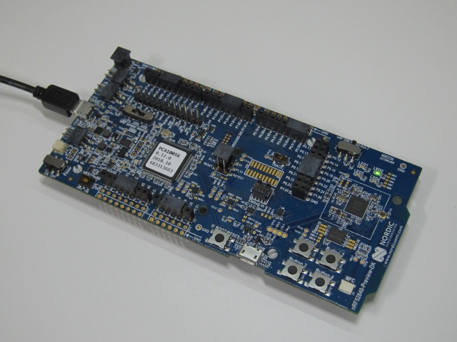

# CHIP nRF52840 Lock Example Application

An example application showing the use
[CHIP](https://github.com/project-chip/connectedhomeip) on the Nordic nRF52840.

-   [CHIP nRF52840 Lock Example Application](#chip-nrf52840-lock-example-application)
    -   [Introduction](#introduction)
    -   [Device UI](#device-ui)
    -   [Building](#building)
        -   [Using CHIP's nRF Platform Docker container](#using-chips-nrf-platform-docker-container)
        -   [Using Native Shell](#using-native-shell)
    -   [Initializing the nRF52840 DK](#initializing-the-nrf52840-dk)
    -   [Flashing the Application](#flashing-the-application)
    -   [Viewing Logging Output](#viewing-logging-output)

## Introduction

The nRF52840 lock example application provides a working demonstration of a
connected door lock device, built using CHIP, and the Nordic nRF5 SDK. The
example supports remote access and control of a simulated door lock over a
low-power, 802.15.4 Thread network. It is capable of being paired into an
existing CHIP network along with other CHIP-enabled devices. The example targets
the
[Nordic nRF52840 DK](https://www.nordicsemi.com/Software-and-Tools/Development-Kits/nRF52840-DK)
development kit, but is readily adaptable to other nRF52840-based hardware.

The lock example is intended to serve both as a means to explore the workings of
CHIP, as well as a template for creating real products based on the Nordic
platform.

The example application builds upon the CHIP. A top-level BUILD.gn or Makefile
orchestrates the entire build process, including building CHIP, and select files
from the nRF5 SDK. The resultant image file can be flashed directly onto the
Nordic dev kit hardware.

## Device UI

The example application provides a simple UI that depicts the state of the
device and offers basic user control. This UI is implemented via the
general-purpose LEDs and buttons built in to the nRF52840 DK dev board.

**LED #1** shows the overall state of the device and its connectivity. Four
states are depicted:

-   _Short Flash On (50ms on/950ms off)_ &mdash; The device is in an
    unprovisioned (unpaired) state and is waiting for a commissioning
    application to connect.

*   _Rapid Even Flashing (100ms on/100ms off)_ &mdash; The device is in an
    unprovisioned state and a commissioning application is connected via BLE.

-   _Short Flash Off (950ms on/50ms off)_ &mdash; The device is full
    provisioned, but does not yet have full network (Thread) or service
    connectivity.

*   _Solid On_ &mdash; The device is fully provisioned and has full network and
    service connectivity.

**Button #1** can be used to initiate a OTA software update as well as to reset
the device to a default state.

Pressing and holding Button #1 for 6 seconds initiates a factory reset. After an
initial period of 3 seconds, all four LED will flash in unison to signal the
pending reset. Holding the button past 6 seconds will cause the device to reset
its persistent configuration and initiate a reboot. The reset action can be
cancelled by releasing the button at any point before the 6 second limit.

**LED #2** shows the state of the simulated lock bolt. When the LED is lit the
bolt is extended (i.e. door locked); when not lit, the bolt is retracted (door
unlocked). The LED will flash whenever the simulated bolt is in motion from one
position to another.

**Button #2** can be used to change the state of the simulated bolt. This can be
used to mimick a user manually operating the lock. The button behaves as a
toggle, swapping the state every time it is pressed.

The remaining two LEDs and buttons (#3 and #4) are unused.

## Building

### Using CHIP's nRF Platform Docker container

Tools and SDK are preinstalled in CHIP's nRF Platform Docker container. You can
build this example on a clean tree by running `make`.

Run the following commands to start a shell using Docker container.

        $ cd <connectedhomeip source directory>
        $ git submodule update --init
        $ docker run -v $(pwd):/workspaces/connectedhomeip -it connectedhomeip/chip-build-nrf-platform:latest /bin/bash

Run the following commands in the Docker container shell.

        $ cd /workspaces/connectedhomeip

        # CAUTION: the following step will delete any unstaged files
        $ git clean -Xdf

        $ scripts/examples/nrf_lock_app.sh

Other alternatives in the container:

-   Run `Build nRF5 Lock App` VSCode task.

-   Run the `GN build` VSCode task. This does not require a clean tree.

-   Build manually with GN.

            $ source scripts/activate.sh
            $ cd examples/lock-app/nrf5
            $ gn gen out/debug
            $ ninja -C out/debug

### Using Native Shell

-   Download and install the
    [Nordic nRF5 SDK for Thread and Zigbee](https://www.nordicsemi.com/Software-and-Tools/Software/nRF5-SDK-for-Thread-and-Zigbee)
    ([Direct download link](https://www.nordicsemi.com/-/media/Software-and-other-downloads/SDKs/nRF5-SDK-for-Thread/nRF5-SDK-for-Thread-and-Zigbee/nRF5SDKforThreadandZigbeev400dc7186b.zip))

*   Download and install the
    [Nordic nRF5x Command Line Tools](https://www.nordicsemi.com/Software-and-Tools/Development-Tools/nRF-Command-Line-Tools/Download)
    (Direct download link:
    [Linux](https://www.nordicsemi.com/-/media/Software-and-other-downloads/Desktop-software/nRF-command-line-tools/sw/Versions-10-x-x/10-7-0/nRFCommandLineTools1070Linuxamd64tar.gz)
    [Mac OS X](https://www.nordicsemi.com/-/media/Software-and-other-downloads/Desktop-software/nRF-command-line-tools/sw/Versions-10-x-x/10-7-0/nRF-Command-Line-Tools_10_7_0_OSX.tar))

*   Download and install a suitable ARM gcc tool chain:
    [GNU Arm Embedded Toolchain 7-2018-q2-update](https://developer.arm.com/tools-and-software/open-source-software/developer-tools/gnu-toolchain/gnu-rm/downloads)
    (Direct download link:
    [Linux](https://armkeil.blob.core.windows.net/developer/Files/downloads/gnu-rm/9-2019q4/gcc-arm-none-eabi-9-2019-q4-major-x86_64-linux.tar.bz2)
    [Mac OS X](https://armkeil.blob.core.windows.net/developer/Files/downloads/gnu-rm/9-2019q4/gcc-arm-none-eabi-9-2019-q4-major-mac.tar.bz2))

-   Install some additional tools:

           # Linux
           $ sudo apt-get install git make automake libtool ccache

           # Mac OS X
           $ brew install automake libtool ccache

-   Set the following environment variables based on the locations/versions of
    the packages installed above:

          export NRF5_SDK_ROOT=${HOME}/tools/nRF5_SDK_for_Thread_and_Zigbee_v4.0.0
          export NRF5_TOOLS_ROOT=${HOME}/tools/nRF-Command-Line-Tools
          export ARM_GCC_INSTALL_ROOT=${HOME}/tools/gcc-arm-none-eabi-9-2019-q4-major/bin
          export PATH=${PATH}:${NRF5_TOOLS_ROOT}/nrfjprog

For convenience, place these settings in local script file (e.g. setup-env.sh) so that they can be loaded into the environment as needed (e.g. by running 'source ./setup-env.sh').

-   Clone the [CHIP](https://github.com/project-chip/connectedhomeip) repo into
    a local directory

          $ cd ~
          $ git clone https://github.com/project-chip/connectedhomeip.git

*   Run GN to build the application

          $ cd ~/connectedhomeip
          $ git submodule update --init
          $ source scripts/activate.sh
          $ cd examples/lock-app/nrf5
          $ gn gen out/debug
          $ ninja -C out/debug

*   Or, run make to build the application

          $ cd ~/connectedhomeip
          $ git submodule update --init
          $ scripts/examples/nrf_lock_app.sh

## Initializing the nRF52840 DK

The example application is designed to run on the
[Nordic nRF52840 DK](https://www.nordicsemi.com/Software-and-Tools/Development-Kits/nRF52840-DK)
development kit. Prior to installing the application, the device's flash memory
should be erased and the Nordic SoftDevice image installed.

-   Connect the host machine to the J-Link Interface MCU USB connector on the
    nRF52840 DK. The Interface MCU connector is the one on the _short_ side of
    the board.

*   If you are using the GN build, the flashing script will install the
    SoftDevice image if it is not already present. If you prefer to do so
    manually first, to verify your board function, run:

          $ python \
              ~/connectedhomeip/third_party/nrf5_sdk/nrf5_firmware_utils.py \
              --eraseall \
              --application $NRF5_SDK_ROOT/components/softdevice/s140/hex/s140_nrf52_*_softdevice.hex

*   Or, use the Makefile to erase the flash and program the Nordic SoftDevice
    image.

          $ cd ~/connectedhomeip/examples/lock-app/nrf5
          $ make erase
          $ make flash-softdevice

Once the above is complete, it shouldn't need be done again _unless_ the
SoftDevice image or the Nordic configuration storage (fds) area becomes corrupt.
To correct either of these problems erase the device and reflash the SoftDevice
and application again.

## Flashing the Application

To flash the example app, run the following commands:

        $ cd ~/connectedhomeip/examples/lock-app/nrf5
        $ python out/debug/chip-nrf52840-lock-example.flash.py

Or, if you are using the Makefile build,

        $ cd ~/connectedhomeip/examples/lock-app/nrf5
        $ make flash-app

> The [VSCode devcontainer](#using-chips-vscode-devcontainer) cannot communicate
> with the nRF device. So, the above command must be run from a native shell.
> This also means that the `nRF command line tools` must be installed on your
> development machine. 

## Viewing Logging Output

The example application is built to use the SEGGER Real Time Transfer (RTT)
facility for log output. RTT is a feature built-in to the J-Link Interface MCU
on the development kit board. It allows bi-directional communication with an
embedded application without the need for a dedicated UART.

Using the RTT facility requires downloading and installing the _SEGGER J-Link
Software and Documentation Pack_
([web site](https://www.segger.com/downloads/jlink#J-LinkSoftwareAndDocumentationPack)).

-   Download the J-Link installer by navigating to the appropriate URL and
    agreeing to the license agreement.

Linux: <a href="https://www.segger.com/downloads/jlink/JLink_Linux_x86_64.deb">JLink_Linux_x86_64.deb</a>

MacOS: <a href="https://www.segger.com/downloads/jlink/JLink\_MacOSX.pkg">JLink_MacOSX.pkg</a>

-   Install the J-Link software

          $ cd ~/Downloads
          $ sudo dpkg -i JLink_Linux_V*_x86_64.deb

*   In Linux, grant the logged in user the ability to talk to the development
    hardware via the linux tty device (/dev/ttyACMx) by adding them to the
    dialout group.

          $ sudo usermod -a -G dialout ${USER}

Once the above is complete, log output can be viewed using the JLinkExe tool in
combination with JLinkRTTClient as follows:

-   Run the JLinkExe tool with arguments to autoconnect to the nRF82480 DK
    board:

          $ JLinkExe -device NRF52840_XXAA -if SWD -speed 4000 -autoconnect 1

-   In a second terminal, run the JLinkRTTClient:

          $ JLinkRTTClient

Logging output will appear in the second terminal.

An alternate method for viewing log output is to use the J-Link GDB server
described in the following section.
