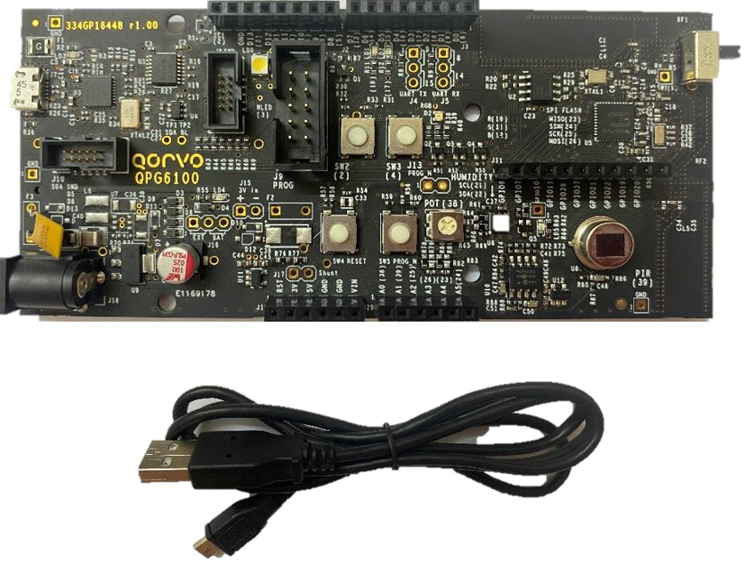

# CHIP QPG6100 Lock Example Application

An example application showing the use
[CHIP](https://github.com/project-chip/connectedhomeip) on the Qorvo QPG6100.

---

-   [CHIP QPG6100 Lock Example Application](#chip-qpg6100-lock-example-application)
    -   [Introduction](#introduction)
    -   [Building](#building)
    -   [Flashing the application](#flashing-the-application)
    -   [Viewing Logging Output](#viewing-logging-output)

---

## Introduction



The QPG6100 Lock shows an implementation of a Door Lock device, based on CHIP
and the Qorvo QPG6100 SDK. Intention of this example is to demonstrate a CHIP
device, with Thread connectivity, using BLE to perform CHIP provisioning.

The example will be implemented in a phased approach, enabling more features
with separate updates.

Current status of implementation:

-   Button and LED control
-   Initialization of the CHIP stack.
-   CHIP Logging, PlatformManager and ConfigurationManager enabled.
-   BLE: CHIPoBLE advertisement and connection available for provisioning
-   CHIP ZCL cluster control for the Lock mechanism through CHIP tool.

Pending:

-   Thread: Linking QPG6100 OpenThread implementation to CHIP build

For more information on Qorvo and the platforms, please visit
[the Qorvo website](http://www.qorvo.com) or contact us on
LPW.support@qorvo.com.

## Building

### Preparation

-   Download and install a suitable ARM gcc tool chain:
    [GNU Arm Embedded Toolchain 9-2019-q4-update](https://developer.arm.com/tools-and-software/open-source-software/developer-tools/gnu-toolchain/gnu-rm/downloads)
    (Direct download link:
    [Linux](https://armkeil.blob.core.windows.net/developer/Files/downloads/gnu-rm/9-2019q4/gcc-arm-none-eabi-9-2019-q4-major-x86_64-linux.tar.bz2)
    [Mac OS X](https://armkeil.blob.core.windows.net/developer/Files/downloads/gnu-rm/9-2019q4/gcc-arm-none-eabi-9-2019-q4-major-mac.tar.bz2))

-   Install additional tools used by the CHIP build:

```
# Linux
sudo apt-get install git make libtool ccache ninja-build
```

```
# Mac OS X
brew install libtool ccache ninja
```

-   Clone the [CHIP](https://github.com/project-chip/connectedhomeip) repo into
    a local directory

```
cd ~
git clone https://github.com/project-chip/connectedhomeip.git
```

-   The Qorvo CHIP SDK is added as a submodule in /third_party/qpg_sdk/repo. To
    manually clone this repo you can clone it from
    [CHIP SDK](https://github.com/Qorvo/qpg-connectedhomeip)

```
cd ~
git clone https://github.com/Qorvo/qpg-connectedhomeip
```

### Compilation

-   Set the following environment variables before compilation:

```
export ARM_GCC_INSTALL_ROOT=${HOME}/tools/gcc-arm-none-eabi-9-2019-q4-major/bin
export PATH=$PATH:$ARM_GCC_INSTALL_ROOT
export QPG6100_SDK_ROOT=${HOME}/qpg-connectedhomeip
```

-   All builds are GN/ninja based

```
cd ~/connectedhomeip/examples/lock-app/qpg6100
source third_party/connectedhomeip/scripts/activate.sh
gn gen out/debug
ninja -C out/debug
```

## Flashing the application

The QPG6100 DK boards can be programmed using:

### CMSIS-DAP Drag and Drop

Drag/copy the hex-file generated to the mBED drive that appears when plugging in
the DK board.

### Segger JLink debugger

Connect the Segger J-Link to the programming header and use the Segger SW to
flash the .hex.

More detailed information to be included in SDK Documentation.

## Viewing Logging Output

-   Launch a serial terminal with baudrate 115200.
-   At startup you will see:

```
qvCHIP v0.0.0.0 (CL:155586) running
[P][-] Init CHIP Stack
[P][DL] BLEManagerImpl::Init() complete
[P][-] Starting Platform Manager Event Loop
[P][-] ============================
[P][-] Qorvo Lock-app Launching
[P][-] ============================
[D][DL] CHIP task running
```

-   Note! Logging is currently encapsulated by the Qorvo logging module. Output
    will have additional header and footer bytes. This will be updated later
    into a raw stream for any serial terminal to parse.
