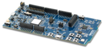
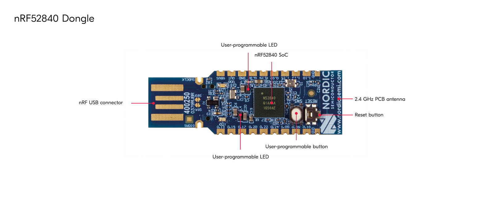
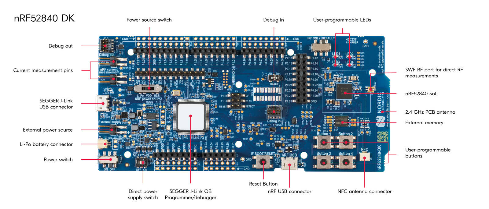

# CHIP nRF Connect Pigweed Example Application

The nRF Connect Pigweed Example demonstrates the usage of Pigweed module
functionalities in an application.

  
  

The example is based on [CHIP](https://github.com/project-chip/connectedhomeip),
the [Pigweed](https://pigweed.googlesource.com/pigweed/pigweed) module, which is
a collection of libraries that provide different functionalities for embedded
systems, and Nordic Semiconductor's nRF Connect SDK.

You can use this example as a training ground for making experiments, testing
Pigweed module features and checking what actions are necessary to fully
integrate Pigweed in a CHIP project.

Pigweed functionalities are being gradually integrated into CHIP. Currently, the
following features are available:

-   **Echo RPC** - Creates a Remote Procedure Call server and allows sending
    commands through the serial port to the device, which makes echo and sends
    the received commands back.

-   [Overview](#overview)
-   [Requirements](#requirements)
    -   [Supported devices](#supported_devices)
-   [Device UI](#device-ui)
-   [Setting up the environment](#setting-up-the-environment)
    -   [Using Docker container for setup](#using-docker-container-for-setup)
    -   [Using native shell for setup](#using-native-shell-for-setup)
-   [Building](#building)
-   [Configuring the example](#configuring-the-example)
-   [Flashing and debugging](#flashing-and-debugging)
    -   [Flashing on the nRF52840 DK](#nrf52840dk_flashing)
    -   [Flashing on the nRF52840 Dongle](#nrf52840dongle_flashing)
-   [Testing the example](#testing-the-example)

## Overview

This example is running on the nRF Connect platform, which is based on the
[nRF Connect SDK](https://developer.nordicsemi.com/nRF_Connect_SDK/doc/latest/nrf/index.html)
and [Zephyr RTOS](https://zephyrproject.org/). Visit CHIP's
[nRF Connect platform overview](../../../docs/guides/nrfconnect_platform_overview.md)
to read more about the platform structure and dependencies.

Pigweed libraries are built and organized in a way that enables faster and more
reliable development. In the CHIP project, the Pigweed module is planned to be
used to create system infrastructures, for example for performing on-device
tests, but considering its general functionalities, it can be useful also in
other cases.

## Requirements

The application requires a specific revision of the nRF Connect SDK to work
correctly. See [Setting up the environment](#setting-up-the-environment) for
more information.

### Supported devices

The example supports building and running on the following devices:

| Hardware platform                                                                                 | Build target              | Platform image                                                                                                                                          |
| ------------------------------------------------------------------------------------------------- | ------------------------- | ------------------------------------------------------------------------------------------------------------------------------------------------------- |
| [nRF52840 Dongle](https://www.nordicsemi.com/Software-and-Tools/Development-Kits/nRF52840-Dongle) | `nrf52840dongle_nrf52840` | 

nRF52840 Dongle

 |
| [nRF52840 DK](https://www.nordicsemi.com/Software-and-Tools/Development-Kits/nRF52840-DK)         | `nrf52840dk_nrf52840`     | 

nRF52840 DK

        |

## Device UI

This section lists the User Interface elements that you can use to control and
monitor the state of the device. These correspond to PCB components on the
hardware platform.

**LED 1** shows the overall state of the device. The following states are
possible:

-   _Solid On_ &mdash; The application was flashed and ran successfully.

**Serial port** can be used to communicate with the device by sending commands
and receiving responses.

> **Important**:
>
> Please note that supported hardware platforms are using different transport
> interfaces to perform serial communication, which leads to differences in
> configuration. By default, these interfaces are used:
>
> -   `nrf52840dk_nrf52840` - UART interface routed to the SEGGER J-Link USB
>     port.
> -   `nrf52840dongle_nrf52840` - USB interface routed to the USB port.

## Setting up the environment

Before building the example, check out the CHIP repository and sync submodules
using the following command:

        $ git submodule update --init

The example requires a specific revision of the nRF Connect SDK. You can either
install it along with the related tools directly on your system or use a Docker
image that has the tools pre-installed.

If you are a macOS user, you won't be able to use the Docker container to flash
the application onto a Nordic development kit due to
[certain limitations of Docker for macOS](https://docs.docker.com/docker-for-mac/faqs/#can-i-pass-through-a-usb-device-to-a-container).
Use the [native shell](#using-native-shell) for building instead.

### Using Docker container for setup

To use the Docker container for setup, complete the following steps:

1.  If you do not have the nRF Connect SDK installed yet, create a directory for
    it by running the following command:

        $ mkdir ~/nrfconnect

2.  Download the latest version of the nRF Connect SDK Docker image by running
    the following command:

        $ docker pull nordicsemi/nrfconnect-chip

3.  Start Docker with the downloaded image by running the following command,
    customized to your needs as described below:

         $ docker run --rm -it -e RUNAS=$(id -u) -v ~/nrfconnect:/var/ncs -v ~/connectedhomeip:/var/chip \
             -v /dev/bus/usb:/dev/bus/usb --device-cgroup-rule "c 189:* rmw" nordicsemi/nrfconnect-chip

    In this command:

    -   _~/nrfconnect_ can be replaced with an absolute path to the nRF Connect
        SDK source directory.
    -   _~/connectedhomeip_ must be replaced with an absolute path to the CHIP
        source directory.
    -   _-v /dev/bus/usb:/dev/bus/usb --device-cgroup-rule "c 189:_ rmw"\*
        parameters can be omitted if you are not planning to flash the example
        onto hardware. These parameters give the container access to USB devices
        connected to your computer such as the nRF52840 DK.
    -   _--rm_ can be omitted if you do not want the container to be
        auto-removed when you exit the container shell session.
    -   _-e RUNAS=\$(id -u)_ is needed to start the container session as the
        current user instead of root.

4.  Update the nRF Connect SDK to the most recent supported revision, by running
    the following command:

         $ cd /var/chip
         $ python3 scripts/setup/nrfconnect/update_ncs.py --update

Now you can proceed with the [Building](#building) instruction.

### Using native shell for setup

To use the native shell for setup, complete the following steps:

1.  Download and install the following additional software:

    -   [nRF Command Line Tools](https://www.nordicsemi.com/Software-and-Tools/Development-Tools/nRF-Command-Line-Tools)
    -   [GN meta-build system](https://gn.googlesource.com/gn/)

2.  If you do not have the nRF Connect SDK installed, follow the
    [guide](https://developer.nordicsemi.com/nRF_Connect_SDK/doc/latest/nrf/gs_assistant.html#)
    in the nRF Connect SDK documentation to install the latest stable nRF
    Connect SDK version. Since command-line tools will be used for building the
    example, installing SEGGER Embedded Studio is not required.

    If you have the SDK already installed, continue to the next step and update
    the nRF Connect SDK after initializing environment variables.

3.  Initialize environment variables referred to by the CHIP and the nRF Connect
    SDK build scripts. Replace _nrfconnect-dir_ with the path to your nRF
    Connect SDK installation directory, and _toolchain-dir_ with the path to GNU
    Arm Embedded Toolchain.

         $ source nrfconnect-dir/zephyr/zephyr-env.sh
         $ export ZEPHYR_TOOLCHAIN_VARIANT=gnuarmemb
         $ export GNUARMEMB_TOOLCHAIN_PATH=toolchain-dir

4.  Update the nRF Connect SDK to the most recent supported revision by running
    the following command (replace _chip-dir_ with the path to CHIP repository
    directory):

         $ cd chip-dir
         $ python3 scripts/setup/nrfconnect/update_ncs.py --update

Now you can proceed with the [Building](#building) instruction.

## Building

Complete the following steps, regardless of the method used for setting up the
environment:

1.  Run the `activate.sh` script, regardless of the building strategy. The
    script is required for building the Pigweed library. Use the following
    command:

            $ source scripts/activate.sh

2.  Navigate to the example's directory:

        $ cd examples/pigweed-app/nrfconnect

3.  Run the following command to build the example, with _build-target_ replaced
    with the build target name of the Nordic Semiconductor's kit you own, for
    example `nrf52840dk_nrf52840`:

         $ west build -b build-target

    You only need to specify the build target on the first build. See
    [Requirements](#requirements) for the build target names of compatible kits.

The output `zephyr.hex` file will be available in the `build/zephyr/` directory.

### Removing build artifacts

If you're planning to build the example for a different kit or make changes to
the configuration, remove all build artifacts before building. To do so, use the
following command:

    $ rm -r build

## Configuring the example

The Zephyr ecosystem is highly configurable and allows you to modify many
aspects of the application. The configuration system is based on Kconfig files
and the settings can be modified using the menuconfig utility.

To open the menuconfig utility, complete the following steps:

1.  Go to the example directory by running the following command, with the
    _example-dir_ directory name updated for your configuration:

         $ cd example-dir

2.  Choose one of the following options:

    -   If you are running the build for the first time, run the following
        command:

               $ west build -b nrf52840dk_nrf52840 -t menuconfig

    -   If you are running a subsequent build, run the following command:

               $ west build -t menuconfig

    -   If you are running menuconfig with ninja, run the following commands:

               $ cd example-dir/build
               $ ninja menuconfig

Changes done with menuconfig will be lost if the `build` directory is deleted.
To make them persistent, save the configuration options in the `prj.conf` file.

For more information, see the
[Configuring nRF Connect SDK examples](../../../docs/guides/nrfconnect_examples_configuration.md)
page.

## Flashing and debugging

The flashing and debugging procedure is different for the nRF52840 DK and the
nRF52840 Dongle.

### Flashing on the nRF52840 DK

To flash the application to the device, use the west tool and run the following
command from the example directory:

        $ west flash --erase

If you have multiple nRF52840 development kits connected, west will prompt you
to pick the correct one.

To debug the application on target, run the following command from the example
directory:

        $ west debug

### Flashing on the nRF52840 Dongle

Visit
[Programming and Debugging nRF52840 Dongle](https://docs.zephyrproject.org/latest/boards/arm/nrf52840dongle_nrf52840/doc/index.html#programming-and-debugging)
to read more about flashing on the nRF52840 Dongle.

## Testing the example

Run the following command to start an interactive Python shell, where the Echo
RPC commands can be invoked:

        python -m pw_hdlc.rpc_console --device /dev/ttyACM0 -b 115200 $CHIP_ROOT/third_party/pigweed/repo/pw_rpc/echo.proto -o /tmp/pw_rpc.out

To send an Echo RPC message, type the following command, where the actual
message is the text in quotation marks after the `msg=` phrase:

        rpcs.pw.rpc.EchoService.Echo(msg="hi")
