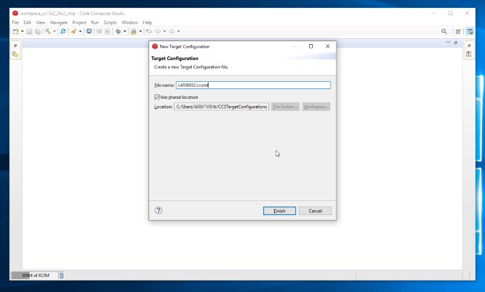
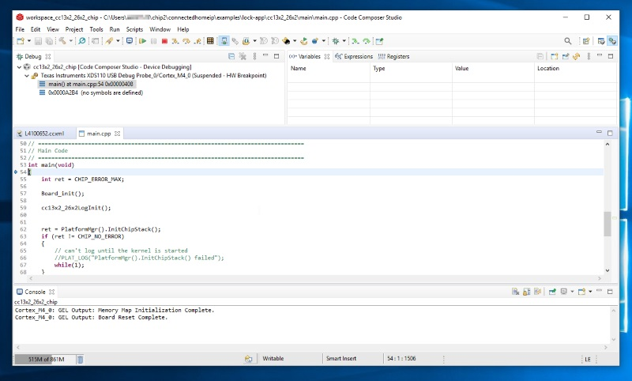

# Programming and Debugging with CCS

-   Download and install [Code Composer Studio][ccs].

-   Use `xdsdfu` to determine the XDS110 serial number to identify the device.
    This may be skipped if there is only one LaunchPad connected to your PC, but
    it is recommended.

    ```
    C:\>cd \ti\ccs1010\ccs\ccs_base\common\uscif\xds110

    C:\ti\ccs1010\ccs\ccs_base\common\uscif\xds110>xdsdfu.exe -e

    USB Device Firmware Upgrade Utility
    Copyright (c) 2008-2019 Texas Instruments Incorporated.  All rights reserved.

    Scanning USB buses for supported XDS110 devices...
    ```

<<<< Device 0 >>>>

VID: 0x0451 PID: 0xbef3 Device Name: XDS110 Embed with CMSIS-DAP Version:
3.0.0.13 Manufacturer: Texas Instruments Serial Num: L4100652 Mode: Runtime
Configuration: Standard

Found 1 device.

```
In this example, my LaunchPad's XDS110 has a serial number of `L4100652`.

- Start a new Code Composer Studio Workspace. This can be named anything you
would like. But it is recommended that you use a blank workspace.


- Create a new Target Configuration File by selecting `File` >> `New` >>
`Target Configuration File`. This file can also be exported from UniFlash
with the `download ccxml` function.


- Name the new ccxml file a useful name. Here I use the XDS110 serial number
from before. Leave the Location as the shared location and click `Finish` to
create the file.



- In the new ccxml, select the `Connection` and the `Board or Device`. This may
be different for your setup, but all LaunchPads will use the `Texas
Instruments XDS110 USB Debug Probe` for the target connection. And the and a
`CC1352R1F3` is mounted on the `CC1352R1_LAUNCHXL` LaunchPads. Builds for
other LaunchPads should use the corresponding SoC name.


- Now set the XDS110 serial number in the advanced tab of the ccxml. First
select the `Advanced` tab at the bottom of the window. Then select the Debug
Probe in the connection tree. Then select `Select by serial number` in the
`Debug Probe Selection`. Then enter the serial number from `xdsdfu` earlier
in the `Enter the serial number` text field. Finally click `Save` to save
your ccxml.


- Clicking `Test Connection` with the LaunchPad connected will cause a JTAG
Integrity scan with the Debug Probe. This is a nice way to check that your
ccxml is setup correctly.


- Now open the Debug Configurations dialog to setup a new debug configuration.
Select `Run` >> `Debug Configurations...`.


- Create a new launch configuration from the default CCS launch configuration.
Select `Code Composer Studio - Device Debugging` and then create a new launch
configuration with the `New launch configuration` button.


- Name your new configuration. Update the `Target Configuration` field with the
ccxml you created earlier. Click `Apply` to save the launch configuration.

Once the launch configuration is created you do not need to re-create it
every time. The Debug session can be started with the `Debug` button in the
`Debug Configurations` dialog, or by selecting `Run` >> `Debug History` >>
`<launch configuration name>`.


- Now that the Debug session is started we can connect to the target. Make sure
that the right Debug Probe is selected in the `Debug` window and click
`Connect Target`.


- The target MCU is connected. The MCU is halted on connection by default.
Select the `Load Program...` option to select the ELF image to load.


- Navigate to the ELF file
(`${connectedhomeip}/examples/lock-app/cc13x2_26x2/out/debug/chip-cc13x2_26x2-lock-example.out`
file) in the `Load Program` dialog. Click `OK` to begin loading the target.


- After locating the source file for `main.cpp` we can step through the code
as it executes.



[ccs]: https://www.ti.com/tool/CCSTUDIO
```
