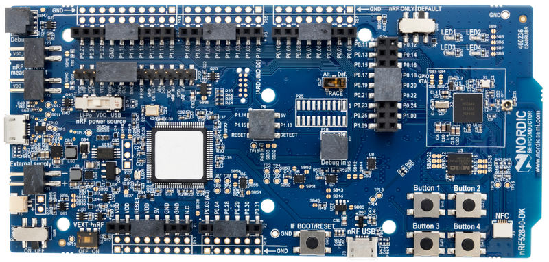
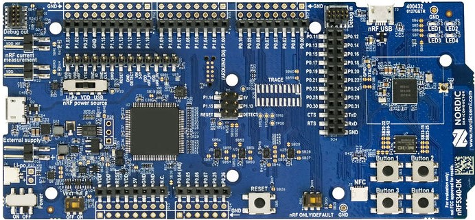

# Matter nRF Connect Pump Example Application

The nRF Connect Pump Example demonstrates how to remotely control a pump device
with basic start/stop functionality. It uses buttons to test changing the pump
state and device states and LEDs to show the state of these changes. This
example is inherited from the "lock-app" example but modified to simulate a pump
device and can be used as a reference for creating your own pump application.

  
  

The example is based on
[Matter](https://github.com/project-chip/connectedhomeip) and Nordic
Semiconductor's nRF Connect SDK, and supports remote access and control of a
simulated pump over a low-power, 802.15.4 Thread network.

The example behaves as a Matter accessory, that is a device that can be paired
into an existing Matter network and can be controlled by this network.

-   [Overview](#overview)
    -   [Bluetooth LE advertising](#bluetooth-le-advertising)
    -   [Bluetooth LE rendezvous](#bluetooth-le-rendezvous)
-   [Requirements](#requirements)
    -   [Supported devices](#supported_devices)
-   [Device UI](#device-ui)
-   [Setting up the environment](#setting-up-the-environment)
    -   [Using Docker container for setup](#using-docker-container-for-setup)
    -   [Using native shell for setup](#using-native-shell-for-setup)
-   [Building](#building)
-   [Configuring the example](#configuring-the-example)
-   [Flashing and debugging](#flashing-and-debugging)
-   [Testing the example](#testing-the-example)
    -   [Testing using CHIPTool](#testing-using-chiptool)

## Overview

This example is running on the nRF Connect platform, which is based on Nordic
Semiconductor's
[nRF Connect SDK](https://developer.nordicsemi.com/nRF_Connect_SDK/doc/latest/nrf/index.html)
and [Zephyr RTOS](https://zephyrproject.org/). Visit CHIP's
[nRF Connect platform overview](../../../docs/guides/nrfconnect_platform_overview.md)
to read more about the platform structure and dependencies.

The CHIP device that runs the pump application is controlled by the Matter
controller device over the Thread protocol. By default, the Matter device has
Thread disabled, and it should be paired with Matter controller and get
configuration from it. Some actions required before establishing full
communication are described below.

The example also comes with a test mode, which allows to start Thread with the
default settings by pressing button manually. However, this mode does not
guarantee that the device will be able to communicate with the Matter controller
and other devices.

### Bluetooth LE advertising

In this example, to commission the device onto a Matter network, it must be
discoverable over Bluetooth LE. For security reasons, you must start Bluetooth
LE advertising manually after powering up the device by pressing **Button 4**.

### Bluetooth LE rendezvous

In this example, the commissioning procedure (called rendezvous) is done over
Bluetooth LE between a Matter device and the Matter controller, where the
controller has the commissioner role.

To start the rendezvous, the controller must get the commissioning information
from the Matter device. The data payload is encoded within a QR code, printed to
the UART console, and shared using an NFC tag. For security reasons, you must
start NFC tag emulation manually after powering up the device by pressing
**Button 4**.

#### Thread provisioning

Last part of the rendezvous procedure, the provisioning operation involves
sending the Thread network credentials from the Matter controller to the Matter
device. As a result, device is able to join the Thread network and communicate
with other Thread devices in the network.

## Requirements

The application requires a specific revision of the nRF Connect SDK to work
correctly. See [Setting up the environment](#setting-up-the-environment) for
more information.

### Supported devices

The example supports building and running on the following devices:

| Hardware platform                                                                         | Build target               | Platform image                                                                                                                                      |
| ----------------------------------------------------------------------------------------- | -------------------------- | --------------------------------------------------------------------------------------------------------------------------------------------------- |
| [nRF52840 DK](https://www.nordicsemi.com/Software-and-Tools/Development-Kits/nRF52840-DK) | `nrf52840dk_nrf52840`      | 

nRF52840 DK

 |
| [nRF5340 DK](https://www.nordicsemi.com/Software-and-Tools/Development-Kits/nRF5340-DK)   | `nrf5340dk_nrf5340_cpuapp` | 

nRF5340 DK

    |

## Device UI

This section lists the User Interface elements that you can use to control and
monitor the state of the device. These correspond to PCB components on the
platform image.

**LED 1** shows the overall state of the device and its connectivity. The
following states are possible:

-   _Short Flash On (50 ms on/950 ms off)_ &mdash; The device is in the
    unprovisioned (unpaired) state and is waiting for a commissioning
    application to connect.

-   _Rapid Even Flashing (100 ms on/100 ms off)_ &mdash; The device is in the
    unprovisioned state and a commissioning application is connected through
    Bluetooth LE.

-   _Short Flash Off (950ms on/50ms off)_ &mdash; The device is fully
    provisioned, but does not yet have full Thread network or service
    connectivity.

-   _Solid On_ &mdash; The device is fully provisioned and has full Thread
    network and service connectivity.

**LED 2** simulates the pump motor and shows the state of the pump. The
following states are possible:

-   _Solid On_ &mdash; The pump is running.

-   _Off_ &mdash; The pump is stopped.

-   _Rapid Even Flashing (100 ms on/100 ms off during 2 s)_ &mdash; The
    simulated pump motor is starting.

**Button 1** can be used for the following purposes:

-   _Pressed for 6 s_ &mdash; Initiates the factory reset of the device.
    Releasing the button within the 6-second window cancels the factory reset
    procedure. **LEDs 1-4** blink in unison when the factory reset procedure is
    initiated.

-   _Pressed for less than 3 s_ &mdash; Initiates the OTA software update
    process. This feature is not currently supported.

**Button 2** &mdash; Pressing the button once changes the pump state to the
opposite one.

**Button 3** &mdash; Pressing the button once starts the Thread networking in
the test mode using the default configuration.

**Button 4** &mdash; Pressing the button once starts the NFC tag emulation and
enables Bluetooth LE advertising for the predefined period of time (15 minutes
by default).

**SEGGER J-Link USB port** can be used to get logs from the device or
communicate with it using the
[command line interface](../../../docs/guides/nrfconnect_examples_cli.md).

**NFC port with antenna attached** can be used to start the
[rendezvous](#bluetooth-le-rendezvous) by providing the commissioning
information from the CHIP device in a data payload that can be shared using NFC.

## Setting up the environment

Before building the example, check out the CHIP repository and sync submodules
using the following command:

        $ git submodule update --init

The example requires a specific revision of the nRF Connect SDK. You can either
install it along with the related tools directly on your system or use a Docker
image that has the tools pre-installed.

If you are a macOS user, you won't be able to use the Docker container to flash
the application onto a Nordic development kit due to
[certain limitations of Docker for macOS](https://docs.docker.com/docker-for-mac/faqs/#can-i-pass-through-a-usb-device-to-a-container).
Use the [native shell](#using-native-shell) for building instead.

### Using Docker container for setup

To use the Docker container for setup, complete the following steps:

1.  If you do not have the nRF Connect SDK installed yet, create a directory for
    it by running the following command:

        $ mkdir ~/nrfconnect

2.  Download the latest version of the nRF Connect SDK Docker image by running
    the following command:

        $ docker pull nordicsemi/nrfconnect-chip

3.  Start Docker with the downloaded image by running the following command,
    customized to your needs as described below:

         $ docker run --rm -it -e RUNAS=$(id -u) -v ~/nrfconnect:/var/ncs -v ~/connectedhomeip:/var/chip \
             -v /dev/bus/usb:/dev/bus/usb --device-cgroup-rule "c 189:* rmw" nordicsemi/nrfconnect-chip

    In this command:

    -   _~/nrfconnect_ can be replaced with an absolute path to the nRF Connect
        SDK source directory.
    -   _~/connectedhomeip_ must be replaced with an absolute path to the CHIP
        source directory.
    -   _-v /dev/bus/usb:/dev/bus/usb --device-cgroup-rule "c 189:_ rmw"\*
        parameters can be omitted if you are not planning to flash the example
        onto hardware. These parameters give the container access to USB devices
        connected to your computer such as the nRF52840 DK.
    -   _--rm_ can be omitted if you do not want the container to be
        auto-removed when you exit the container shell session.
    -   _-e RUNAS=\$(id -u)_ is needed to start the container session as the
        current user instead of root.

4.  Update the nRF Connect SDK to the most recent supported revision, by running
    the following command:

         $ cd /var/chip
         $ python3 scripts/setup/nrfconnect/update_ncs.py --update

Now you can proceed with the [Building](#building) instruction.

### Using native shell for setup

To use the native shell for setup, complete the following steps:

1.  Download and install the following additional software:

    -   [nRF Command Line Tools](https://www.nordicsemi.com/Software-and-Tools/Development-Tools/nRF-Command-Line-Tools)
    -   [GN meta-build system](https://gn.googlesource.com/gn/)

2.  If you do not have the nRF Connect SDK installed, follow the
    [guide](https://developer.nordicsemi.com/nRF_Connect_SDK/doc/latest/nrf/gs_assistant.html#)
    in the nRF Connect SDK documentation to install the latest stable nRF
    Connect SDK version. Since command-line tools will be used for building the
    example, installing SEGGER Embedded Studio is not required.

    If you have the SDK already installed, continue to the next step and update
    the nRF Connect SDK after initializing environment variables.

3.  Initialize environment variables referred to by the CHIP and the nRF Connect
    SDK build scripts. Replace _nrfconnect-dir_ with the path to your nRF
    Connect SDK installation directory, and _toolchain-dir_ with the path to GNU
    Arm Embedded Toolchain.

         $ source nrfconnect-dir/zephyr/zephyr-env.sh
         $ export ZEPHYR_TOOLCHAIN_VARIANT=gnuarmemb
         $ export GNUARMEMB_TOOLCHAIN_PATH=toolchain-dir

4.  Update the nRF Connect SDK to the most recent supported revision by running
    the following command (replace _chip-dir_ with the path to CHIP repository
    directory):

         $ cd chip-dir
         $ python3 scripts/setup/nrfconnect/update_ncs.py --update

Now you can proceed with the [Building](#building) instruction.

## Building

Complete the following steps, regardless of the method used for setting up the
environment:

1.  Navigate to the example's directory:

        $ cd examples/pump-app/nrfconnect

2.  Run the following command to build the example, with _build-target_ replaced
    with the build target name of the Nordic Semiconductor's kit you own, for
    example `nrf52840dk_nrf52840`:

         $ west build -b build-target

    You only need to specify the build target on the first build. See
    [Requirements](#requirements) for the build target names of compatible kits.

The output `zephyr.hex` file will be available in the `build/zephyr/` directory.

### Removing build artifacts

If you're planning to build the example for a different kit or make changes to
the configuration, remove all build artifacts before building. To do so, use the
following command:

    $ rm -r build

### Building with release configuration

To build the example with release configuration that disables the diagnostic
features like logs and command-line interface, run the following command:

    $ west build -b build-target -- -DOVERLAY_CONFIG=third_party/connectedhomeip/config/nrfconnect/app/release.conf

Remember to replace _build-target_ with the build target name of the Nordic
Semiconductor's kit you own.

## Configuring the example

The Zephyr ecosystem is based on Kconfig files and the settings can be modified
using the menuconfig utility.

To open the menuconfig utility, run the following command from the example
directory:

    $ west build -b build-target -t menuconfig

Remember to replace _build-target_ with the build target name of the Nordic
Semiconductor's kit you own.

Changes done with menuconfig will be lost if the `build` directory is deleted.
To make them persistent, save the configuration options in the `prj.conf` file.
For more information, see the
[Configuring nRF Connect SDK examples](../../../docs/guides/nrfconnect_examples_configuration.md)
page.

## Flashing and debugging

To flash the application to the device, use the west tool and run the following
command from the example directory:

        $ west flash

If you have multiple development kits connected, west will prompt you to pick
the correct one.

To debug the application on target, run the following command from the example
directory:

        $ west debug

## Testing the example

Check the [CLI tutorial](../../../docs/guides/nrfconnect_examples_cli.md) to
learn how to use command-line interface of the application.

### Testing using CHIPTool

Read the
[Android commissioning guide](../../../docs/guides/nrfconnect_android_commissioning.md)
to see how to use [CHIPTool](../../../src/android/CHIPTool/README.md) for
Android smartphones to commission and control the application within a
CHIP-enabled Thread network.
