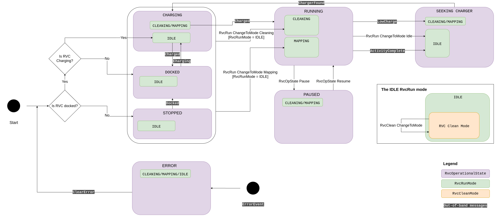

# RVC example app

This example app is meant to demonstrate an implementation of a Matter Robotic
Vacuum Cleaner device.

## State machine

Below is a diagram describing the state machine for this app.

This app can support most of the tests in the test plans.

## Out-of-band messages

Out-of-band messages are available to simulate typical device behaviors and
allow the app to navigate to all the states. To send an out-of-band message,
echo the JSON message to the `/tmp/chip_rvc_fifo_<PID>` file. The JSON message
must have a `"Name"` key that contains the command name. This name is shown in
the state machine diagram above. Example
`echo '{"Name": "Charged"}' > /tmp/chip_rvc_fifo_42`.

### ServiceArea related messages

#### `AddMap` message

This message adds a map to the SupportedMaps attribute of the Service Area
cluster. This message requires the following extra keys.

-   `MapId` This is an `int` setting the ID of the new map.
-   `MapName` This is a `string` setting the name of the new map.

#### `AddArea` message

This message adds a new area to the SupportedAreas attribute of the Service Area
cluster. This message requires the following extra keys, most of which are
optional. Consult the `SupportedAreas` attribute spec for more information on
what are valid areas.

-   `AreaId` This is an `int` setting the ID of the area.
-   `MapId` This is an `int` sitting the map ID the area is associated with.
-   `LocationName` This is a `string` setting the location's name.
-   `FloorNumber` This is an `int` setting the floor number of the area.
-   `AreaType` This is an `int` setting the area type tag.
-   `LandmarkTag` This is an `int` setting the landmark tag.
-   `PositianTag` This is an `int` setting the position tag.

#### `RemoveMap` message

This message removes a map with the given map ID. This message requires the
`int` key `MapId`.

#### `RemoveArea` message

This message removes an area with the given area ID. This message requires the
`int` key `AreaId`.

#### `AreaComplete` message

This indicates that the area currently being serviced as indicated by the
service area cluster is now complete.

### `ErrorEvent` message

The error event message requires the additional key `"Error"` which specifies
the error state ID. This can be one of `UnableToStartOrResume`,
`UnableToCompleteOperation`, `CommandInvalidInState`,
`FailedToFindChargingDock`, `Stuck`, `DustBinMissing`, `DustBinFull`,
`WaterTankEmpty`, `WaterTankMissing`, `WaterTankLidOpen`,
`MopCleaningPadMissing`.

## Testing

A PICS file that details what this app supports testing is available in the
`pics` directory as a txt file. After building the RVC example app, chip-tool,
and setting up the testing environment, python tests can be executed with
`./scripts/tests/run_python_test.py --script src/python_testing/<script_name>.py --script-args "--storage-path admin_storage.json --PICS examples/rvc-app/rvc-common/pics/RVC_App_Test_Plan.txt --int-arg <PIXIT_Definitions:1>"`

**Note:** If the testing environment has not been commissioned with the RVC app,

1. use chip-tool to switch on the commissioning window
   `out/debug/chip-tool pairing open-commissioning-window 0x1230 1 180 1000 42`
2. Get the manual pairing code. This will look something like
   `Manual pairing code: [01073112097]`.
3. Run any one of the tests with the `--commission-only` and `--manual-code`
   flags:
   `./scripts/tests/run_python_test.py --script src/python_testing/TC_RVCCLEANM_1_2.py --script-args "--commissioning-method on-network --manual-code 01073112097 --commission-only"`

Below are the PIXIT definitions required for the different python tests.

### RVC Clean Mode cluster

#### TC 1.2

Example command:
`./scripts/tests/run_python_test.py --script src/python_testing/TC_RVCCLEANM_1_2.py --script-args "--storage-path admin_storage.json --PICS examples/rvc-app/rvc-common/pics/rvc-app-pics-values --endpoint=1"`

#### TC 2.1

PIXIT: `PIXIT.RVCCLEANM.MODE_CHANGE_FAIL:1 PIXIT.RVCCLEANM.MODE_CHANGE_OK:2`  
Example command:
`./scripts/tests/run_python_test.py --script src/python_testing/TC_RVCCLEANM_2_1.py --script-args "--storage-path admin_storage.json --PICS examples/rvc-app/rvc-common/pics/rvc-app-pics-values --endpoint 1 --int-arg PIXIT.RVCCLEANM.MODE_CHANGE_FAIL:1 PIXIT.RVCCLEANM.MODE_CHANGE_OK:2"`

When asked "Manually put the device in a state from which it will FAIL to
transition to mode 1", set the `RvcRunMode` to 1.
`chip-tool rvcrunmode change-to-mode 1`

When asked "Manually put the device in a state from which it will SUCCESSFULLY
transition to mode 2", set the `RvcRunMode` to 0.
`chip-tool rvcrunmode change-to-mode 0`

#### TC 2.2

Example command:
`./scripts/tests/run_python_test.py --script src/python_testing/TC_RVCCLEANM_2_2.py --script-args "--storage-path admin_storage.json --PICS examples/rvc-app/rvc-common/pics/rvc-app-pics-values --endpoint=1"`

### RVC Run Mode cluster

#### TC 1.2

Example command:
`./scripts/tests/run_python_test.py --script src/python_testing/TC_RVCRUNM_1_2.py --script-args "--storage-path admin_storage.json --PICS examples/rvc-app/rvc-common/pics/rvc-app-pics-values --endpoint=1"`

#### TC 2.1

PIXIT: `PIXIT.RVCRUNM.MODE_CHANGE_FAIL:2 PIXIT.RVCRUNM.MODE_CHANGE_OK:0`  
Example command:
`./scripts/tests/run_python_test.py --script src/python_testing/TC_RVCRUNM_2_1.py --script-args "--storage-path admin_storage.json --PICS examples/rvc-app/rvc-common/pics/rvc-app-pics-values --endpoint 1 --int-arg PIXIT.RVCRUNM.MODE_CHANGE_OK:0 PIXIT.RVCRUNM.MODE_CHANGE_FAIL:2"`

When asked "Manually put the device in a state from which it will FAIL to
transition to mode 2", set the `RvcRunMode` to 1.
`chip-tool rvcrunmode change-to-mode 1`

When asked "Manually put the device in a state from which it will SUCCESSFULLY
transition to mode 0", do nothing.

#### TC 2.2

PIXIT: `PIXIT.RVCRUNM.MODE_A:1 PIXIT.RVCRUNM.MODE_B:2`  
Example command:
`./scripts/tests/run_python_test.py --script src/python_testing/TC_RVCRUNM_2_2.py --script-args "--storage-path admin_storage.json --PICS examples/rvc-app/rvc-common/pics/rvc-app-pics-values --endpoint 1 --int-arg PIXIT.RVCRUNM.MODE_A:1 PIXIT.RVCRUNM.MODE_B:2"`

### RVC Operational State cluster

#### TC 2.1

Example command:
`./scripts/tests/run_python_test.py --script src/python_testing/TC_RVCOPSTATE_2_1.py --script-args "--storage-path admin_storage.json --PICS examples/rvc-app/rvc-common/pics/rvc-app-pics-values --endpoint 1"`

Use the out-of-band messages, chip-tool messages and the state machine diagram
to navigate to the required states.

#### TC 2.3

Example command:
`./scripts/tests/run_python_test.py --script src/python_testing/TC_RVCOPSTATE_2_3.py --script-args "--storage-path admin_storage.json --PICS examples/rvc-app/rvc-common/pics/rvc-app-pics-values --endpoint 1"`

Use the out-of-band messages, chip-tool messages and the state machine diagram
to transition to the required states.

#### TC 2.4

Example command:
`./scripts/tests/run_python_test.py --script src/python_testing/TC_RVCOPSTATE_2_4.py --script-args "--storage-path admin_storage.json --PICS examples/rvc-app/rvc-common/pics/rvc-app-pics-values --endpoint 1"`

Use the out-of-band messages, chip-tool messages and the state machine diagram
to transition to the required states.

### Running the yaml tests

After commissioning the device, all the yaml tests can be run by running the
`run_all_yaml_tests.sh` script from the root dir with the node ID that the
device was commissioned with.

### Service Area Cluster

### TC 1.2

Example command:
`./scripts/tests/run_python_test.py --script src/python_testing/TC_SEAR_1_2.py --script-args "--storage-path admin_storage.json --PICS examples/rvc-app/rvc-common/pics/rvc-app-pics-values --endpoint 1"`

### TC 1.3

PIXIT: `PIXIT.SEAR.VALID_AREAS:'[7, 1234567]'` Example command:
`./scripts/tests/run_python_test.py --script src/python_testing/TC_SEAR_1_3.py --script-args "--storage-path admin_storage.json --PICS examples/rvc-app/rvc-common/pics/rvc-app-pics-values --endpoint 1 --json-arg PIXIT.SEAR.VALID_AREAS:'[7, 1234567]'`

### TC 1.4

Example command:
`./scripts/tests/run_python_test.py --script src/python_testing/TC_SEAR_1_4.py --script-args "--storage-path admin_storage.json --PICS examples/rvc-app/rvc-common/pics/rvc-app-pics-values --endpoint 1`

#### TC 1.5

Example command:
`./scripts/tests/run_python_test.py --script src/python_testing/TC_SEAR_1_5.py --script-args "--storage-path admin_storage.json --PICS examples/rvc-app/rvc-common/pics/rvc-app-pics-values --endpoint 1"`

#### TC 1.6

Example command:
`./scripts/tests/run_python_test.py --script src/python_testing/TC_SEAR_1_6.py --script-args "--storage-path admin_storage.json --PICS examples/rvc-app/rvc-common/pics/rvc-app-pics-values --endpoint 1`
