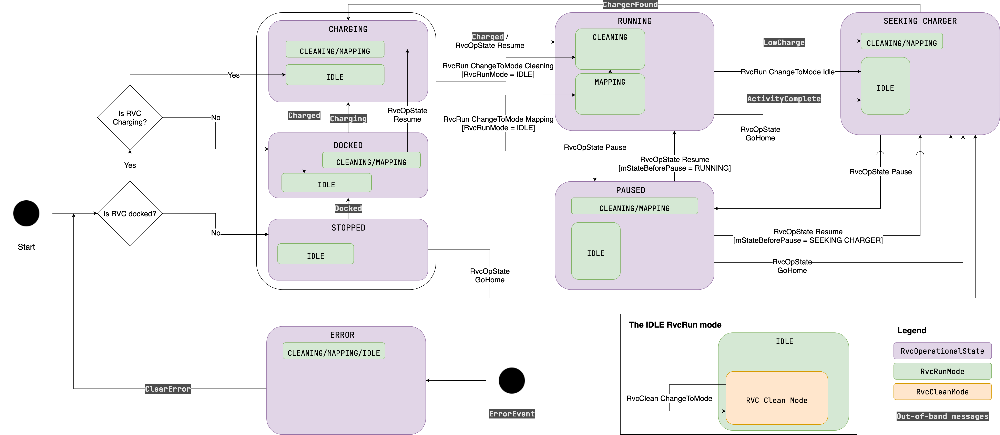

# RVC example app

This example app is meant to demonstrate an implementation of a Matter Robotic Vacuum Cleaner device.

## State machine

Below is a diagram describing the state machine for this app.

This app can support most of the tests in the test plans.

## Out-of-band messages

Out-of-band messages are available to simulate typical device behaviours and allow the app to navigate to all the states.
To send an out-of-band message, echo the JSON message to the `/tmp/chip_rvc_fifq_<PID>` file.
The JSON message must have a `"Name"` key that contains the command name.
This name is shown in the state machine diagram above.
Example `echo '{"Name": "Charged"}' > /tmp/chip_rvc_fifo_42`.

### ErrorEvent message

The error event message requires the additional key `"Error"` which specifies the error state ID.
This can be one of UnableToStartOrResume, UnableToCompleteOperation, CommandInvalidInState, FailedToFindChargingDock, 
Stuck, DustBinMissing, DustBinFull, WaterTankEmpty, WaterTankMissing, WaterTankLidOpen, MopCleaningPadMissing

## Testing

PICS files that detail what this app supports testing are available in the `pics` directory as txt files.
After building the RVC example app, chip-tool, and setting up the testing environment, python tests can be executed with
`./scripts/tests/run_python_test.py --script src/python_testing/<script_name>.py --script-args "--storage-path admin_storage.json --PICS examples/rvc-app/rvc-common/pics/<PICS_FILE>.txt --int-arg <PIXIT_Definitions:1>"`

**Note:** If the testing environment has not been commissioned with the RVC app, use chip-tool to switch on the 
commissioning window `chip-tool pairing open-commissioning-window`, and add the following flags ta the `--script-args`
above. `--commissioning-method on-network --discriminator XXXX --passcode XXXX`.

Below are the PICS files and PXIT definitions required for the different python tests.

### RvcClean cluster

PICS: `examples/rvc-app/rvc-common/pics/RVC_Clean_Mode_Cluster_Test_Plan.txt`

#### TC_RVCCLEANM_1_2.py
 
PIXIT: `PIXIT_ENDPOINT:1`  
Example command: `./scripts/tests/run_python_test.py --script src/python_testing/TC_RVCCLEANM_1_2.py --script-args "--storage-path admin_storage.json --PICS examples/rvc-app/rvc-common/pics/RVC_Clean_Mode_Cluster_Test_Plan.txt --int-arg PIXIT_ENDPOINT:1"`

#### TC_RVCCLEANM_2_1.py

PIXIT: `PIXIT_ENDPOINT:1 PIXIT.RVCCLEANM.MODE_CHANGE_FAIL:1 PIXIT.RVCCLEANM.MODE_CHANGE_OK:2`  
Example command: `/scripts/tests/run_python_test.py --script src/python_testing/TC_RVCCLEANM_2_1.py --script-args "--storage-path admin_storage.json --PICS examples/rvc-app/rvc-common/pics/RVC_Clean_Mode_Cluster_Test_Plan.txt --int-arg PIXIT_ENDPOINT:1 PIXIT.RVCCLEANM.MODE_CHANGE_FAIL:1 PIXIT.RVCCLEANM.MODE_CHANGE_OK:2"`

When asked "Manually put the device in a state from which it will FAIL to transition to mode 1", set the RvcRunMode to 1.
`chip-tool rvcrunmode change-to-mode 1`

When asked "Manually put the device in a state from which it will SUCCESSFULLY transition to mode 2", set the RvcRunMode to 0.
`chip-tool rvcrunmode change-to-mode 0`

#### TC_RVCCLEANM_3_2.py

This is not applicable because the RVC device does not support the StartUpMode attribute.

### RvcRun cluster

PICS: `examples/rvc-app/rvc-common/pics/RVC_Run_Mode_Cluster_Test_Plan.txt`

#### TC_RVCRUNM_1_2.py

PIXIT: `PIXIT_ENDPOINT:1`
Example command: `./scripts/tests/run_python_test.py --script src/python_testing/TC_RVCRUNM_1_2.py  --script-args "--storage-path admin_storage.json --PICS examples/rvc-app/rvc-common/pics/RVC_Run_Mode_Cluster_Test_Plan.txt --int-arg PIXIT_ENDPOINT:1"`

#### TC_RVCRUNM_2_1.py

PIXIT: `PIXIT_ENDPOINT:1 PIXIT.RVCRUNM.MODE_CHANGE_FAIL:2 PIXIT.RVCRUNM.MODE_CHANGE_OK:0`  
Example command: `./scripts/tests/run_python_test.py --script src/python_testing/TC_RVCRUNM_2_1.py --script-args "--storage-path admin_storage.json --PICS examples/rvc-app/rvc-common/pics/RVC_Run_Mode_Cluster_Test_Plan.txt --int-arg PIXIT_ENDPOINT:1 PIXIT.RVCRUNM.MODE_CHANGE_FAIL:2 PIXIT.RVCRUNM.MODE_CHANGE_OK:0"`

When asked "Manually put the device in a state from which it will FAIL to transition to mode 2", set the RvcRunMode to 1.
`chip-tool rvcrunmode change-to-mode 1`

When asked "Manually put the device in a state from which it will SUCCESSFULLY transition to mode 0", do nothing.

#### TC_RVCRUNM_3_2.py

This is not applicable because the RVC device does not support the StartUpMode attribute.

### RvcOperationalState cluster

PICS: `examples/rvc-app/rvc-common/pics/RVC_Operational_State_Cluster_Test_Plan.txt`

#### TC_RVCOPSTATE_2_1.py

PIXIT: `PIXIT_ENDPOINT:1`  
Example command: `./scripts/tests/run_python_test.py --script src/python_testing/TC_RVCOPSTATE_2_1.py --script-args "--storage-path admin_storage.json --PICS examples/rvc-app/rvc-common/pics/RVC_Operational_State_Cluster_Test_Plan.txt --int-arg PIXIT_ENDPOINT:1"`

Use the out-of-band messages, chip-tool messages and the state machine diagram to navigate to the required states.

#### TC_RVCOPSTATE_2_3.py

PIXIT: `PIXIT_ENDPOINT:1`  
Example command: `./scripts/tests/run_python_test.py --script src/python_testing/TC_RVCOPSTATE_2_3.py --script-args "--storage-path admin_storage.json --PICS examples/rvc-app/rvc-common/pics/RVC_Operational_State_Cluster_Test_Plan.txt --int-arg PIXIT_ENDPOINT:1"`

Use the out-of-band messages, chip-tool messages and the state machine diagram to navigate to the required states.

### Running the yaml tests

After commissioning the device, all the yaml tests can be run by running the `run_all_yaml_tests.sh` script from the 
root dir with the node ID that the device was commissioned with.
