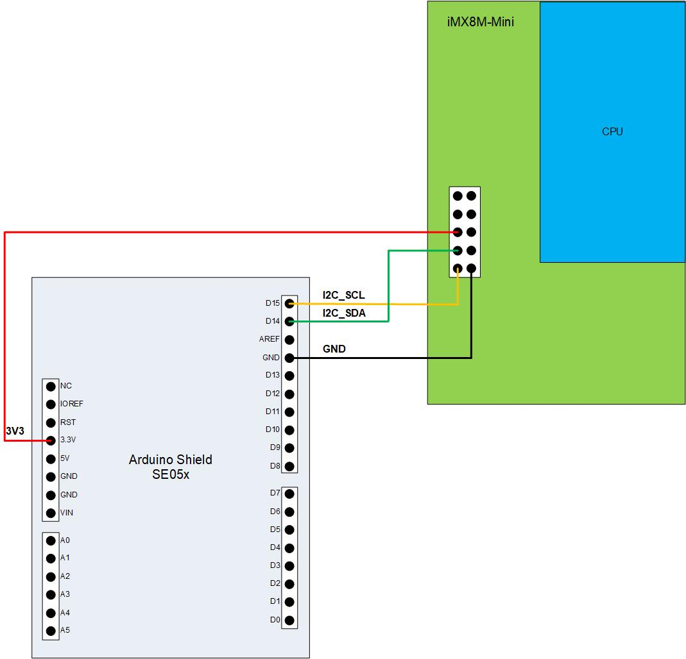

# Building

To cross-compile this example on x64 host and run on **NXP i.MX 8M Mini**
**EVK**, see the associated
[README document](../../../../docs/platforms/nxp/nxp_imx8m_linux_examples.md)
for details.

# Connecting SE05x to i.MX 8M

Refer the below image to connect SE05x to i.MX 8M using I2C pins.



# SE05x Integration Configuration

Following crypto operations can be offloaded to SE05x secure element,

    1. Random number generation
    2. EC Key Generate
    3. ECDSA Sign
    4. ECDSA Verify
    5. HKDF
    6. HMAC
    7. Spake(Disabled by default)

Other crypto operations are done on host (using mbed-TLS)

Use the config file
`src/platform/nxp/crypto/se05x/CHIPCryptoPALHsm_se05x_config.h` to enable /
disable offloading required crypto operation on SE05x.

```
/*
 * Enable se05x for random number generation
 */
#define ENABLE_SE05X_RND_GEN 1

/*
 * Enable se05x for Generate EC Key
 */
#define ENABLE_SE05X_GENERATE_EC_KEY 1

/*
 * Enable ECDSA Verify using se05x
 */
#define ENABLE_SE05X_ECDSA_VERIFY 1

/*
 * Enable se05x for PBKDF SHA256
 * Not supported for SE052F
 */
#define ENABLE_SE05X_PBKDF2_SHA256 0

/*
 * Enable se05x for HKDF SHA256
 * Not supported for SE052F
 */
#define ENABLE_SE05X_HKDF_SHA256 1

/*
 * Enable se05x for HMAC SHA256
 */
#define ENABLE_SE05X_HMAC_SHA256 1

/*
 * Enable se05x for DA
 */
#define ENABLE_SE05X_DEVICE_ATTESTATION 0
```

# SE05x Type Configuration

Ensure to update the SE05x feature file
`third_party/simw-top-mini/repo/fsl_sss_ftr.h` with correct product variant.
SE050E is enabled by default.

```
/** Compiling without any Applet Support */
#define SSS_HAVE_APPLET_NONE 0

/** SE050 Type A (ECC) */
#define SSS_HAVE_APPLET_SE05X_A 0

/** SE050 Type B (RSA) */
#define SSS_HAVE_APPLET_SE05X_B 0

/** SE050 (Super set of A + B), SE051, SE052 */
#define SSS_HAVE_APPLET_SE05X_C 0

/** SE051 with SPAKE Support */
#define SSS_HAVE_APPLET_SE051_H 0

/** AUTH */
#define SSS_HAVE_APPLET_AUTH 0

/** SE050E */
#define SSS_HAVE_APPLET_SE050_E 1
```

# Device attestation

To use SE05x for device attestation,

1. Enable `ENABLE_SE05X_DEVICE_ATTESTATION` in CHIPCryptoPALHsm_se05x_config.h
   config file

2. Run the provision example (one time)
   `third_party/simw-top-mini/repo/demos/se05x_dev_attest_key_prov/` to
   provision the device attestation key at id - 0x7D300000 and device
   attestation certificate at id - 0x7D300001.

```
cd third_party/simw-top-mini/repo/demos/se05x_dev_attest_key_prov/linux
gn gen out
ninja -C out se05x_dev_attest_key_prov
./out/se05x_dev_attest_key_prov
```

# SCP03

To enable SCP03 authentication with SE05x, build the example with option

```
gn gen out --args="chip_se05x_auth=\"scp03\""
```

Ensure to enable CMAC (MBEDTLS_CMAC_C) in mbedtls config file used.
