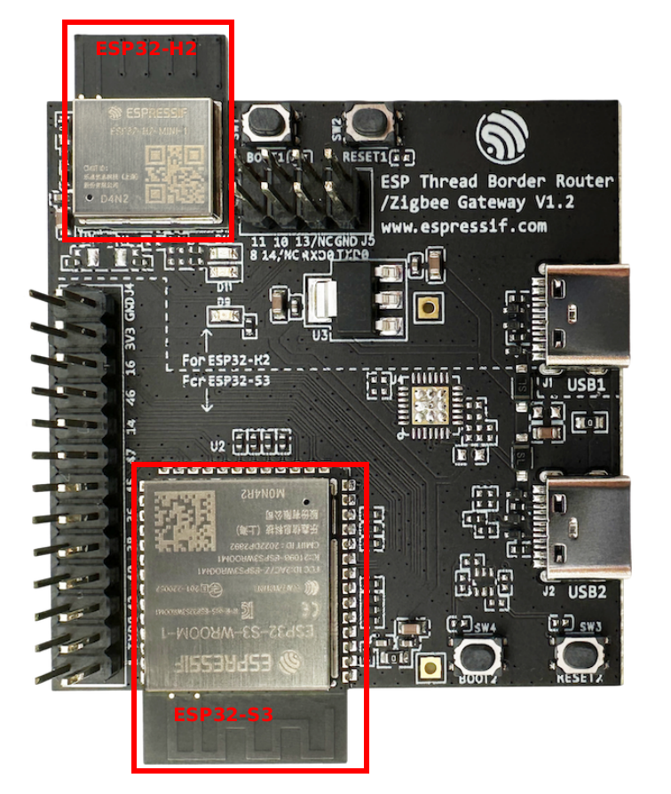

# Matter ESP32 Thread Border Router Example

A prototype application that demonstrates OpenThread Border Router on ESP32-S3 +
ESP32-H2 Thread Border Router DevKit Board.

Please
[setup ESP-IDF and CHIP Environment](../../../docs/guides/esp32/setup_idf_chip.md)
and refer
[building and commissioning](../../../docs/guides/esp32/build_app_and_commission.md)
guides to get started.

---

-   [OpenThread Border Router Board](#openthread-border-router-board)
-   [OpenThread RCP](#openthread-rcp)
-   [OpenThread CLI](#openthread-cli)
-   [Setup Thread Network](#setup-thread-network)
-   [Commissioning Thread End Devices](#commissioning-thread-end-devices)

---

### OpenThread Border Router Board

The ESP Thread border router board provides an integrated module of an ESP32-S3
and an ESP32-H2.



### OpenThread RCP

We need to build an OpenThread RCP(Radio Co-Processor) firmware for ESP32-H2 of
the Border Router Board before building this Thread Border example.

```
cd $IDF_PATH/examples/openthread/ot_rcp
idf.py set-target esp32h2
idf.py build
```

Then we need to connect the USB2 port(ESP32-S3) of the Border Router Board to
your host machine. Build and flash this example.

```
cd ${CHIP_ROOT}/examples/thread-br-app/esp32
idf.py set-target esp32s3
idf.py build
idf.py -p {port} erase-flash flash monitor
```

This example will detect the RCP firmware built in ESP-IDF path and flash it to
the spiffs partition. When starting this example, the ESP32-S3 will compare the
versions of both the RCP firmware in the spiffs partition and the firmware on
ESP32-H2. if the spiffs RCP firmware is newer than the firmware on ESP32-H2, the
Thread BR will flash the RCP firmware to ESP32-H2 automatically.

### OpenThread CLI

After you build this example and flash it to the ESP32-S3 of Border Router
Board, you can access a standard OpenThread CLI via the device console with a
`matter otcli` prefix.

For instance, you can get the state:

```
> matter otcli state
Detached
Done
```

### Setup Thread Network

You can send SetActiveDatasetRequest command to the Thread BR after
commissioning it as a Matter-Over-Wi-Fi device to setup the Thread network or
join an existing Thread network.

```
./chip-tool pairing ble-wifi 1 <ssid> <password> 20202021 3840
./chip-tool generalcommissioning arm-fail-safe 180 1 1 0
./chip-tool threadborderroutermanagement set-active-dataset-request hex:<dataset-tlvs> 1 1 1
./chip-tool generalcommissioning commissioning-complete 1 0
```

The Thread BR with enable the Thread network interface and start Thread network
after it receives SetActiveDatasetRequest command. And after the Thread BR sets
up or join a Thread network, it will send the success response.

### Commissioning Thread End Devices

After setting up the Thread network, you can commission a Thread End-device to
the Thread network.

```
./chip-tool pairing ble-wifi 2 hex:<dataset_tlvs> <pincode> <discriminator>
```
