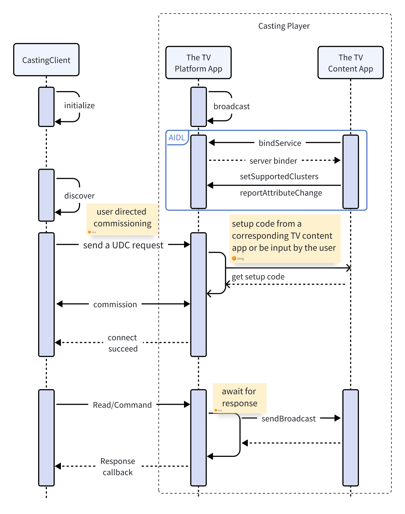

# Matter Casting APIs

Matter Casting consists of three parts:

-   **The mobile app**: For most content providers, this would be your
    consumer-facing mobile app. By making your mobile app a Matter "Casting
    Client", you enable the user to discover casting targets, cast content, and
    control casting sessions. The
    [example Matter tv-casting-app](https://github.com/project-chip/connectedhomeip/tree/master/examples/tv-casting-app)
    for Android / iOS and Linux builds on top of the Matter SDK to demonstrate
    how a TV Casting mobile app works.
-   **The TV content app**: For most content providers, this would be your
    consumer-facing app on a Smart TV. By enhancing your TV app to act as a
    Matter "Content app", you enable Matter Casting Clients to cast content. The
    [example Matter content-app](https://github.com/project-chip/connectedhomeip/tree/master/examples/tv-app/android/App/content-app)
    for Android builds on top of the Matter SDK to demonstrate how a TV Content
    app works.
-   **The TV platform app**: The TV platform app implements the Casting Video  
    Player device type and provides common capabilities around media playback on
    the TV such as play/pause, keypad navigation, input and output control,
    content search, and an implementation of an app platform as described in the
    media chapter of the device library specification. This is generally
    implemented by the TV manufacturer. The
    [example Matter tv-app](https://github.com/project-chip/connectedhomeip/tree/master/examples/tv-app)
    for Android builds on top of the Matter SDK to demonstrate how a TV platform
    app works.

This document describes how enable your Android and iOS apps to act as a Matter
"Casting Client". This documentation is also designed to work with the example
[example Matter tv-casting-app](https://github.com/project-chip/connectedhomeip/tree/master/examples/tv-casting-app)
samples so you can see the experience end to end.

## Introduction

A Casting Client (e.g. a mobile phone app) is expected to be a Matter
Commissionable Node and a `CastingPlayer` (i.e. a TV) is expected to be a Matter
Commissioner. In the context of the Matter Video Player architecture, a
`CastingPlayer` would map to Casting "Video" Player. The `CastingPlayer` is
expected to be hosting one or more `Endpoints` (some of which can represent
Content Apps in the Matter Video Player architecture) that support one or more
Matter Media `Clusters`.

The steps to start a casting session are:

1. [Initialize](#initialize-the-casting-client) the `CastingClient` using the
   Matter SDK.
1. [Discover](#discover-casting-players) `CastingPlayer` devices using Matter
   Commissioner discovery.
1. [Connect](#connect-to-a-casting-player) to the `CastingPlayer` to discover
   available endpoints. By connecting, the `CastingClient` will send a User
   Directed Commissioning (UDC) request to the `CastingPlayer` device in order
   to make a Matter commissioning request. The `CastingPlayer` will then obtain
   the appropriate user consent to allow a connection from this `CastingClient`
   and obtain the setup code needed to commission the `CastingClient`. The setup
   code will typically come from a corresponding TV content app or be input by
   the user.
1. [Select](#select-an-endpoint-on-the-casting-player) an available `Endpoint`
   hosted by the `CastingPlayer`.

Next, you're ready to:

1. [Issue commands](#issuing-commands) to the `Endpoint`.
1. [Read](#read-operations) endpoint attributes like playback state.
1. [Subscribe](#subscriptions) to playback events.

In order to illustrate these steps, refer to the figure below


## Build and Setup

The Casting Client is expected to consume the Matter TV Casting library built
for its respective platform which implements the APIs described in this
document. Refer to the tv-casting-app READMEs for [Linux](linux/README.md),
[Android](https://github.com/project-chip/connectedhomeip/blob/master/examples/tv-casting-app/android/README.md)
and [iOS](darwin/TvCasting/README.md) to understand how to build and consume
each platform's specific libraries. The libraries MUST be built with the
client's specific values for `CHIP_DEVICE_CONFIG_DEVICE_VENDOR_ID` and
`CHIP_DEVICE_CONFIG_DEVICE_PRODUCT_ID` updated in the
[CHIPProjectAppConfig.h](tv-casting-common/include/CHIPProjectAppConfig.h) file.
Other values like the `CHIP_DEVICE_CONFIG_DEVICE_NAME` may be updated as well to
correspond to the client being built.

`CHIP_DEVICE_CONFIG_DEVICE_VENDOR_ID` and `CHIP_DEVICE_CONFIG_DEVICE_PRODUCT_ID`
can be obtained during the CSA certification of your mobile app. The Matter SDK
has pre-configured sample/test values for them in the
[CHIPDeviceConfig.h](https://github.com/project-chip/connectedhomeip/blob/master/src/include/platform/CHIPDeviceConfig.h)
file.

### Initialize the Casting Client

_{Complete Initialization examples: [Linux](linux/simple-app.cpp) |
[Android](android/App/app/src/main/java/com/matter/casting/InitializationExample.java)
| [iOS](darwin/TvCasting/TvCasting/MCInitializationExample.swift)}_

A Casting Client must first initialize the Matter SDK and define the following
`DataProvider` objects for the the Matter Casting library to use throughout the
client's lifecycle:

1.  **Rotating Device Identifier** - "This unique per-device identifier SHALL
    consist of a randomly-generated 128-bit or longer octet string." Refer to
    the Matter specification for more details. Instantiate a `DataProvider`
    object as described below to provide this identifier.

    On Linux, define a `RotatingDeviceIdUniqueIdProvider` to provide the Casting
    Client's `RotatingDeviceIdUniqueId`, by implementing a
    `matter:casting::support::MutableByteSpanDataProvider`:

    ```c
    class RotatingDeviceIdUniqueIdProvider : public MutableByteSpanDataProvider {
    private:
        chip::MutableByteSpan rotatingDeviceIdUniqueIdSpan;
        uint8_t rotatingDeviceIdUniqueId[chip::DeviceLayer::ConfigurationManager::kRotatingDeviceIDUniqueIDLength];

    public:
        RotatingDeviceIdUniqueIdProvider() {
            // generate a random Unique ID for this example app for demonstration
            for (size_t i = 0; i < sizeof(rotatingDeviceIdUniqueId); i++) {
                rotatingDeviceIdUniqueId[i] = chip::Crypto::GetRandU8();
            }
            rotatingDeviceIdUniqueIdSpan = chip::MutableByteSpan(rotatingDeviceIdUniqueId);
        }

        chip::MutableByteSpan * Get() { return &rotatingDeviceIdUniqueIdSpan; }
    };
    ```

    On Android, define a `rotatingDeviceIdUniqueIdProvider` to provide the
    Casting Client's `RotatingDeviceIdUniqueId`, by implementing a
    `com.matter.casting.support.DataSource`:

    ```java
    private static final DataProvider<byte[]> rotatingDeviceIdUniqueIdProvider =
      new DataProvider<byte[]>() {
        private static final String ROTATING_DEVICE_ID_UNIQUE_ID =
            "EXAMPLE_IDENTIFIER"; // dummy value for demonstration only

        @Override
        public byte[] get() {
          return ROTATING_DEVICE_ID_UNIQUE_ID.getBytes();
        }
      };
    ```

    On iOS, define the
    `func castingAppDidReceiveRequestForRotatingDeviceIdUniqueId` in a class,
    `MCAppParametersDataSource`, that implements the `MCDataSource`:

    ```swift
    class MCAppParametersDataSource : NSObject, MCDataSource
    {
        func castingAppDidReceiveRequestForRotatingDeviceIdUniqueId(_ sender: Any) -> Data {
            // dummy value, with at least 16 bytes (ConfigurationManager::kMinRotatingDeviceIDUniqueIDLength), for demonstration only
            return "0123456789ABCDEF".data(using: .utf8)!
        }
        ...
    }
    ```

2.  **Commissioning Data** - This object contains the passcode, discriminator,
    etc. which identify the app and are provided to the `CastingPlayer` during
    the commissioning process. "A Passcode SHALL be included as a 27-bit
    unsigned integer, which serves as proof of possession during commissioning."
    "A Discriminator SHALL be included as a 12-bit unsigned integer, which SHALL
    match the value which a device advertises during commissioning." Refer to
    the Matter specification's "Onboarding Payload" section for more details on
    commissioning data.

    For the optional `CastingPlayer` / Commissioner-Generated Passcode User
    Directed Commissioning (UDC) feature, the Commissioning `DataProvider` needs
    to be updated during the commissioning process. In this scenario, the
    `CastingPlayer` generates a Passcode and displays it for the user. The user
    enters the Passcode on the UX of the Casting Client which should update its
    Commissioning `DataProvider`. This allows the Matter Casting Library to run
    commissioning with the `CastingPlayer` using a PAKE verifier based on the
    user-entered passcode. See the Matter specification’s UDC section for more
    information on the Commissioner-Generated Passcode feature.

    On Linux, define a function `InitCommissionableDataProvider` to initialize a
    `LinuxCommissionableDataProvider` that can provide the required values to
    the `CastingApp`.

    ```c
    CHIP_ERROR InitCommissionableDataProvider(LinuxCommissionableDataProvider & provider, LinuxDeviceOptions & options) {
        chip::Optional<uint32_t> setupPasscode;

        if (options.payload.setUpPINCode != 0) {
            setupPasscode.SetValue(options.payload.setUpPINCode);
        } else if (!options.spake2pVerifier.HasValue()) {
            // default to TestOnlyCommissionableDataProvider for demonstration
            uint32_t defaultTestPasscode = 0;
            chip::DeviceLayer::TestOnlyCommissionableDataProvider TestOnlyCommissionableDataProvider;
            VerifyOrDie(TestOnlyCommissionableDataProvider.GetSetupPasscode(defaultTestPasscode) == CHIP_NO_ERROR);
            setupPasscode.SetValue(defaultTestPasscode);
            options.payload.setUpPINCode = defaultTestPasscode;
        }
        uint32_t spake2pIterationCount = chip::Crypto::kSpake2p_Min_PBKDF_Iterations;
        if (options.spake2pIterations != 0) {
            spake2pIterationCount = options.spake2pIterations;
        }
        return provider.Init(options.spake2pVerifier, options.spake2pSalt, spake2pIterationCount, setupPasscode,
                         options.payload.discriminator.GetLongValue());
    }
    ```

    On Linux, if using the `CastingPlayer` / Commissioner-Generated Passcode UDC
    feature, set up a new `LinuxCommissionableDataProvider` when called back on
    the `CommissionerDeclarationCallback` during the
    [VerifyOrEstablishConnection()](#connect-to-a-casting-player) API call
    (described later). The `CastingPlayer` generated passcode (as entered by the
    user on the Casting Client UX) should be set in this
    `LinuxCommissionableDataProvider` which should then be passed to the
    CastingApp using the `UpdateCommissionableDataProvider` API.

    ```c
        LinuxDeviceOptions::GetInstance().payload.setUpPINCode = userEnteredPasscode;
        LinuxCommissionableDataProvider gCommissionableDataProvider;
        CHIP_ERROR err = CHIP_NO_ERROR;
        err = InitCommissionableDataProvider(gCommissionableDataProvider, LinuxDeviceOptions::GetInstance());
        if (err != CHIP_NO_ERROR)
        {
            ChipLogError(AppServer,
                            "CommandHandler() setcommissionerpasscode InitCommissionableDataProvider() err %" CHIP_ERROR_FORMAT, err.Format());
            return err;
        }
        err = matter::casting::core::CastingApp::GetInstance()->UpdateCommissionableDataProvider(&gCommissionableDataProvider);
        if (err != CHIP_NO_ERROR)
        {
            ChipLogError(AppServer,
                            "CommandHandler() setcommissionerpasscode InitCommissionableDataProvider() err %" CHIP_ERROR_FORMAT, err.Format());
            return err;
        }
    ```

    On Android, define a `commissioningDataProvider` that can provide the
    required values to the `CastingApp`. If using the `CastingPlayer` /
    Commissioner-Generated Passcode UDC feature, the Casting Client needs to
    update this `commissioningDataProvider` during the
    [verifyOrEstablishConnection()](#connect-to-a-casting-player) API call
    (described later). In the example below,
    `updateCommissionableDataSetupPasscode` updates the CommissionableData with
    the `CastingPlayer` generated passcode entered by the user on the Casting
    Client UX.

    ```java
    public static class CommissionableDataProvider implements DataProvider<CommissionableData> {
    CommissionableData commissionableData =
        // Dummy values for commissioning demonstration only. These are hard coded in the example tv-app:
        // connectedhomeip/examples/tv-app/tv-common/src/AppTv.cpp
        private static final long DUMMY_SETUP_PASSCODE = 20202021;
        private static final int DUMMY_DISCRIMINATOR = 3874;

        new CommissionableData(DUMMY_SETUP_PASSCODE, DUMMY_DISCRIMINATOR);

        @Override
        public CommissionableData get() {
          return commissionableData;
        }

        // If using the alternate CastingPlayer / Commissioner-Generated Passcode UDC feature:
        public void updateCommissionableDataSetupPasscode(long setupPasscode, int discriminator) {
            commissionableData.setSetupPasscode(setupPasscode);
            commissionableData.setDiscriminator(discriminator);
        }
      };
    ```

    On iOS, add a `func commissioningDataProvider` to the
    `MCAppParametersDataSource` class defined above, that can provide the
    required values to the `MCCastingApp`. If using the `CastingPlayer` /
    Commissioner-Generated Passcode UDC feature, the Casting Client needs to
    update this `commissioningDataProvider` during the
    [VerifyOrEstablishConnection()](#connect-to-a-casting-player) API call
    (described later). In the example below, the `update` function updates the
    CommissionableData with the `CastingPlayer` generated passcode entered by
    the user on the Casting Client UX.

    ```swift
    // Dummy values for demonstration only.
    private var commissionableData: MCCommissionableData = MCCommissionableData(
        passcode: 20202021,
        discriminator: 3874,
        spake2pIterationCount: 1000,
        spake2pVerifier: nil,
        spake2pSalt: nil
    )

    func castingAppDidReceiveRequestForCommissionableData(_ sender: Any) -> MCCommissionableData {
        return commissionableData
    }

    // If using the alternate CastingPlayer / Commissioner-Generated Passcode UDC feature:
    func update(_ newCommissionableData: MCCommissionableData) {
        self.commissionableData = newCommissionableData
    }
    ```

3.  **Device Attestation Credentials** - This object contains the
    `DeviceAttestationCertificate`, `ProductAttestationIntermediateCertificate`,
    etc. and implements a way to sign messages when called upon by the Matter TV
    Casting Library as part of the Matter Device Attestation process during
    commissioning.

    On Linux, implement a define a `dacProvider` to provide the Casting Client's
    Device Attestation Credentials, by implementing a
    `chip::Credentials::DeviceAttestationCredentialsProvider`. For this example,
    we will use the `chip::Credentials::Examples::ExampleDACProvider`

    On Android, define a `dacProvider` to provide the Casting Client's Device
    Attestation Credentials, by implementing a
    `com.matter.casting.support.DACProvider`:

    ```java
    private static final DACProvider dacProvider = new DACProviderStub();
    private final static DataProvider<DeviceAttestationCredentials> dacProvider = new DataProvider<DeviceAttestationCredentials>() {
        private static final String kDevelopmentDAC_Cert_FFF1_8001 = "MIIB5z...<snipped>...CXE1M=";     // dummy values for demonstration only
        private static final String kDevelopmentDAC_PrivateKey_FFF1_8001 = "qrYAror...<snipped>...StE+/8=";
        private static final String KPAI_FFF1_8000_Cert_Array = "MIIByzC...<snipped>...pwP4kQ==";

        @Override
        public DeviceAttestationCredentials get() {
            DeviceAttestationCredentials deviceAttestationCredentials = new DeviceAttestationCredentials() {
            @Override
            public byte[] SignWithDeviceAttestationKey(byte[] message) {
                try {
    	        byte[] privateKeyBytes = Base64.decode(kDevelopmentDAC_PrivateKey_FFF1_8001, Base64.DEFAULT);
    	        AlgorithmParameters algorithmParameters = AlgorithmParameters.getInstance("EC");
    	        algorithmParameters.init(new ECGenParameterSpec("secp256r1"));
    	        ECParameterSpec parameterSpec = algorithmParameters.getParameterSpec(ECParameterSpec.class);
    	        ECPrivateKeySpec ecPrivateKeySpec = new ECPrivateKeySpec(new BigInteger(1, privateKeyBytes), parameterSpec);

    	        KeyFactory keyFactory = KeyFactory.getInstance("EC");
    	        PrivateKey privateKey = keyFactory.generatePrivate(ecPrivateKeySpec);

    	        Signature signature = Signature.getInstance("SHA256withECDSA");
    	        signature.initSign(privateKey);
    	        signature.update(message);

    	        return signature.sign();
                } catch (Exception e) {
    	        return null;
                }
            }
            };

            deviceAttestationCredentials.setDeviceAttestationCert(
            Base64.decode(kDevelopmentDAC_Cert_FFF1_8001, Base64.DEFAULT));
            deviceAttestationCredentials.setProductAttestationIntermediateCert(
            Base64.decode(KPAI_FFF1_8000_Cert_Array, Base64.DEFAULT));
            return deviceAttestationCredentials;
        }
    };
    ```

    On iOS, add functions
    `castingAppDidReceiveRequestForDeviceAttestationCredentials` and
    `didReceiveRequestToSignCertificateRequest` to the
    `MCAppParametersDataSource` class defined above, that can return
    `MCDeviceAttestationCredentials` and sign messages for the Casting Client,
    respectively.

    ```swift
    // dummy DAC values for demonstration only
    let kDevelopmentDAC_Cert_FFF1_8001: Data = Data(base64Encoded: "MIIB..<snipped>..CXE1M=")!;
    let kDevelopmentDAC_PrivateKey_FFF1_8001: Data = Data(base64Encoded: "qrYA<snipped>tE+/8=")!;
    let kDevelopmentDAC_PublicKey_FFF1_8001: Data = Data(base64Encoded: "BEY6<snipped>I=")!;
    let KPAI_FFF1_8000_Cert_Array: Data = Data(base64Encoded: "MIIB<snipped>4kQ==")!;
    let kCertificationDeclaration: Data = Data(base64Encoded: "MII<snipped>fA==")!;

    func castingAppDidReceiveRequestForDeviceAttestationCredentials(_ sender: Any) -> MCDeviceAttestationCredentials {
        return MCDeviceAttestationCredentials(
            certificationDeclaration: kCertificationDeclaration,
            firmwareInformation: Data(),
            deviceAttestationCert: kDevelopmentDAC_Cert_FFF1_8001,
            productAttestationIntermediateCert: KPAI_FFF1_8000_Cert_Array)
    }

    func castingApp(_ sender: Any, didReceiveRequestToSignCertificateRequest csrData: Data, outRawSignature: AutoreleasingUnsafeMutablePointer<NSData>) -> MatterError {
        Log.info("castingApp didReceiveRequestToSignCertificateRequest")

        // get the private SecKey
        var privateKeyData = Data()
        privateKeyData.append(kDevelopmentDAC_PublicKey_FFF1_8001);
        privateKeyData.append(kDevelopmentDAC_PrivateKey_FFF1_8001);
        let privateSecKey: SecKey = SecKeyCreateWithData(privateKeyData as NSData,
                                    [
                                        kSecAttrKeyType: kSecAttrKeyTypeECSECPrimeRandom,
                                        kSecAttrKeyClass: kSecAttrKeyClassPrivate,
                                        kSecAttrKeySizeInBits: 256
                                    ] as NSDictionary, nil)!

        // sign csrData to get asn1SignatureData
        var error: Unmanaged<CFError>?
        let asn1SignatureData: CFData? = SecKeyCreateSignature(privateSecKey, .ecdsaSignatureMessageX962SHA256, csrData as CFData, &error)
        if(error != nil)
        {
            Log.error("Failed to sign message. Error: \(String(describing: error))")
            return MATTER_ERROR_INVALID_ARGUMENT
        }
        else if (asn1SignatureData == nil)
        {
            Log.error("Failed to sign message. asn1SignatureData is nil")
            return MATTER_ERROR_INVALID_ARGUMENT
        }

        // convert ASN.1 DER signature to SEC1 raw format
        return MCCryptoUtils.ecdsaAsn1SignatureToRaw(withFeLengthBytes: 32,
                                                    asn1Signature: asn1SignatureData!,
                                                         outRawSignature: &outRawSignature.pointee)
    }
    ```

Once you have created the `DataProvider` objects above, you are ready to
initialize the Casting App as described below. Note: When you initialize the
Casting client, make sure your code initializes it only once, before it starts a
Matter casting session.

On Linux, create an `AppParameters` object using the
`RotatingDeviceIdUniqueIdProvider`, `LinuxCommissionableDataProvider`,
`CommonCaseDeviceServerInitParamsProvider`, `ExampleDACProvider` and
`DefaultDACVerifier`, and call `CastingApp::GetInstance()->Initialize` with it.
Then, call `Start` on the `CastingApp`.

```c
LinuxCommissionableDataProvider gCommissionableDataProvider;
int main(int argc, char * argv[]) {
    // Create AppParameters that need to be passed to CastingApp.Initialize()
    AppParameters appParameters;
    RotatingDeviceIdUniqueIdProvider rotatingDeviceIdUniqueIdProvider;
    CommonCaseDeviceServerInitParamsProvider serverInitParamsProvider;
    CHIP_ERROR err = CHIP_NO_ERROR;
    err            = InitCommissionableDataProvider(gCommissionableDataProvider, LinuxDeviceOptions::GetInstance());
    VerifyOrReturnValue(
        err == CHIP_NO_ERROR, 0,
        ChipLogError(AppServer, "Initialization of CommissionableDataProvider failed %" CHIP_ERROR_FORMAT, err.Format()));
    err = appParameters.Create(&rotatingDeviceIdUniqueIdProvider, &gCommissionableDataProvider,
                               chip::Credentials::Examples::GetExampleDACProvider(),
                               GetDefaultDACVerifier(chip::Credentials::GetTestAttestationTrustStore()), &serverInitParamsProvider);
    VerifyOrReturnValue(err == CHIP_NO_ERROR, 0,
                        ChipLogError(AppServer, "Creation of AppParameters failed %" CHIP_ERROR_FORMAT, err.Format()));

    // Initialize the CastingApp
    err = CastingApp::GetInstance()->Initialize(appParameters);
    VerifyOrReturnValue(err == CHIP_NO_ERROR, 0,
                        ChipLogError(AppServer, "Initialization of CastingApp failed %" CHIP_ERROR_FORMAT, err.Format()));

    // Initialize Linux KeyValueStoreMgr
    chip::DeviceLayer::PersistedStorage::KeyValueStoreMgrImpl().Init(CHIP_CONFIG_KVS_PATH);

    // Start the CastingApp
    err = CastingApp::GetInstance()->Start();
    VerifyOrReturnValue(err == CHIP_NO_ERROR, 0,
                        ChipLogError(AppServer, "CastingApp::Start failed %" CHIP_ERROR_FORMAT, err.Format()));
    ...
}
```

On Android, create an `AppParameters` object using the
`rotatingDeviceIdUniqueIdProvider`, `commissioningDataProvider`, `dacProvider`
and `DataProvider<ConfigurationManager>`, and call
`CastingApp.getInstance().initialize` with it. Then, call `start` on the
`CastingApp`

```java
public static MatterError initAndStart(Context applicationContext) {
    // Create an AppParameters object to pass in global casting parameters to the SDK
    final AppParameters appParameters =
        new AppParameters(
            applicationContext,
            new DataProvider<ConfigurationManager>() {
              @Override
              public ConfigurationManager get() {
                return new PreferencesConfigurationManager(
                    applicationContext, "chip.platform.ConfigurationManager");
              }
            },
            rotatingDeviceIdUniqueIdProvider,
            commissionableDataProvider,
            dacProvider);

    // Initialize the SDK using the appParameters and check if it returns successfully
    MatterError err = CastingApp.getInstance().initialize(appParameters);
    if (err.hasError()) {
      Log.e(TAG, "Failed to initialize Matter CastingApp");
      return err;
    }

    // Start the CastingApp
    err = CastingApp.getInstance().start();
    if (err.hasError()) {
      Log.e(TAG, "Failed to start Matter CastingApp");
      return err;
    }
    return err;
}
```

On iOS, call `MCCastingApp.initialize` with an object of the
`MCAppParametersDataSource`.

```swift
func initialize() -> MatterError {
    if let castingApp = MCCastingApp.getSharedInstance() {
        return castingApp.initialize(with: MCAppParametersDataSource())
    } else {
        return MATTER_ERROR_INCORRECT_STATE
    }
}
```

After initialization, on iOS, call `start` and `stop` on the `MCCastingApp`
shared instance when the App sends the
`UIApplication.didBecomeActiveNotification` and
`UIApplication.willResignActiveNotification`

```objectivec
struct TvCastingApp: App {
    let Log = Logger(subsystem: "com.matter.casting", category: "TvCastingApp")
    @State
    var firstAppActivation: Bool = true

    var body: some Scene {
        WindowGroup {
            ContentView()
                .onAppear(perform: {
                    let err: Error? = MCInitializationExample().initialize()
                    if err != nil
                    {
                        self.Log.error("MCCastingApp initialization failed \(err)")
                        return
                    }
                })
                .onReceive(NotificationCenter.default.publisher(for: UIApplication.didBecomeActiveNotification)) { _ in
                    self.Log.info("TvCastingApp: UIApplication.didBecomeActiveNotification")
                    if let castingApp = MCCastingApp.getSharedInstance()
                    {
                        castingApp.start(completionBlock: { (err : Error?) -> () in
                            if err != nil
                            {
                                self.Log.error("MCCastingApp start failed \(err)")
                            }
                        })
                    }
                }
                .onReceive(NotificationCenter.default.publisher(for: UIApplication.willResignActiveNotification)) { _ in
                    self.Log.info("TvCastingApp: UIApplication.willResignActiveNotification")
                    if let castingApp = MCCastingApp.getSharedInstance()
                    {
                        castingApp.stop(completionBlock: { (err : Error?) -> () in
                            if err != nil
                            {
                                self.Log.error("MCCastingApp stop failed \(err)")
                            }
                        })
                    }
                }
            }   // WindowGroup
    }   // body
}   // App
```

Note about on-device cache: The Casting App maintains an on-device cache
containing information about the Casting Players it has connected with so far.
This cached information allows the Casting App to connect with Casting Players
(that it had previously connected with) faster and using fewer resources, by
potentially skipping the longer commissioning process and instead, simply
re-establishing the CASE session. This cache can be cleared by calling the
`ClearCache` API on the `CastingApp`, say when the user signs out of the app.
See API and its documentation for [Linux](tv-casting-common/core/CastingApp.h),
[Android](android/App/app/src/main/jni/com/matter/casting/core/CastingApp.java)
and [iOS](darwin/MatterTvCastingBridge/MatterTvCastingBridge/MCCastingApp.h).

### Discover Casting Players

_{Complete Discovery examples: [Linux](linux/simple-app-helper.cpp) |
[Android](android/App/app/src/main/java/com/matter/casting/DiscoveryExampleFragment.java)
| [iOS](darwin/TvCasting/TvCasting/MCDiscoveryExampleViewModel.swift)}_

The Casting Client discovers `CastingPlayers` using Matter Commissioner
discovery over DNS-SD by listening for `CastingPlayer` events as they are
discovered, updated, or lost from the network.

On Linux, define a `DiscoveryDelegateImpl` that implements the
`matter::casting::core::DiscoveryDelegate`.

```c
class DiscoveryDelegateImpl : public DiscoveryDelegate {
private:
    int commissionersCount = 0;

public:
    void HandleOnAdded(matter::casting::memory::Strong<CastingPlayer> player) override {
        if (commissionersCount == 0) {
            ChipLogProgress(AppServer, "Select discovered CastingPlayer to request commissioning");
            ChipLogProgress(AppServer, "Example: cast request 0");
        }
        ++commissionersCount;
        ChipLogProgress(AppServer, "Discovered CastingPlayer #%d", commissionersCount);
        player->LogDetail();
    }

    void HandleOnUpdated(matter::casting::memory::Strong<CastingPlayer> player) override {
        ChipLogProgress(AppServer, "Updated CastingPlayer with ID: %s", player->GetId());
    }
};
```

On Android, implement the `CastingPlayerDiscovery.CastingPlayerChangeListener`.

```java
private static final CastingPlayerDiscovery.CastingPlayerChangeListener castingPlayerChangeListener =
    new CastingPlayerDiscovery.CastingPlayerChangeListener() {
        private final String TAG = CastingPlayerDiscovery.CastingPlayerChangeListener.class.getSimpleName();

        @Override
        public void onAdded(CastingPlayer castingPlayer) {
            Log.i(TAG, "onAdded() Discovered CastingPlayer deviceId: " + castingPlayer.getDeviceId());
            // Display CastingPlayer info on the screen
            new Handler(Looper.getMainLooper()).post(() -> {
                arrayAdapter.add(castingPlayer);
            });
        }

        @Override
        public void onChanged(CastingPlayer castingPlayer) {
            Log.i(TAG, "onChanged() Discovered changes to CastingPlayer with deviceId: " + castingPlayer.getDeviceId());
            // Update the CastingPlayer on the screen
            new Handler(Looper.getMainLooper()).post(() -> {
                final Optional<CastingPlayer> playerInList = castingPlayerList.stream().filter(node -> castingPlayer.equals(node)).findFirst();
                if (playerInList.isPresent()) {
                    Log.d(TAG, "onChanged() Updating existing CastingPlayer entry " + playerInList.get().getDeviceId() + " in castingPlayerList list");
                    arrayAdapter.remove(playerInList.get());
                }
                arrayAdapter.add(castingPlayer);
            });
        }

        @Override
        public void onRemoved(CastingPlayer castingPlayer) {
            Log.i(TAG, "onRemoved() Removed CastingPlayer with deviceId: " + castingPlayer.getDeviceId());
            // Remove CastingPlayer from the screen
            new Handler(Looper.getMainLooper()).post(() -> {
                final Optional<CastingPlayer> playerInList = castingPlayerList.stream().filter(node -> castingPlayer.equals(node)).findFirst();
                if (playerInList.isPresent()) {
                    Log.d(TAG, "onRemoved() Removing existing CastingPlayer entry " + playerInList.get().getDeviceId() + " in castingPlayerList list");
                    arrayAdapter.remove(playerInList.get());
                }
            });
        }
};
```

On iOS, implement a `func addDiscoveredCastingPlayers`,
`func removeDiscoveredCastingPlayers` and `func updateDiscoveredCastingPlayers`
which listen to notifications as Casting Players are added, removed, or updated.

```swift
@objc
func didAddDiscoveredCastingPlayers(notification: Notification)
{
    Log.info("didAddDiscoveredCastingPlayers() called")
    guard let userInfo = notification.userInfo,
        let castingPlayer     = userInfo["castingPlayer"] as? MCCastingPlayer else {
        self.Log.error("didAddDiscoveredCastingPlayers called with no MCCastingPlayer")
        return
    }

    self.Log.info("didAddDiscoveredCastingPlayers notified of a MCCastingPlayer with ID: \(castingPlayer.identifier())")
    DispatchQueue.main.async
    {
        self.displayedCastingPlayers.append(castingPlayer)
    }
}

@objc
func didRemoveDiscoveredCastingPlayers(notification: Notification)
{
    Log.info("didRemoveDiscoveredCastingPlayers() called")
    guard let userInfo = notification.userInfo,
        let castingPlayer     = userInfo["castingPlayer"] as? MCCastingPlayer else {
        self.Log.error("didRemoveDiscoveredCastingPlayers called with no MCCastingPlayer")
        return
    }

    self.Log.info("didRemoveDiscoveredCastingPlayers notified of a MCCastingPlayer with ID: \(castingPlayer.identifier())")
    DispatchQueue.main.async
    {
        self.displayedCastingPlayers.removeAll(where: {$0 == castingPlayer})
    }
}

@objc
func didUpdateDiscoveredCastingPlayers(notification: Notification)
{
    Log.info("didUpdateDiscoveredCastingPlayers() called")
    guard let userInfo = notification.userInfo,
        let castingPlayer     = userInfo["castingPlayer"] as? MCCastingPlayer else {
        self.Log.error("didUpdateDiscoveredCastingPlayers called with no MCCastingPlayer")
        return
    }

    self.Log.info("didUpdateDiscoveredCastingPlayers notified of a MCCastingPlayer with ID: \(castingPlayer.identifier())")
    if let index = displayedCastingPlayers.firstIndex(where: { castingPlayer.identifier() == $0.identifier() })
    {
        DispatchQueue.main.async
        {
            self.displayedCastingPlayers[index] = castingPlayer
        }
    }
}
```

Finally, register these listeners and start discovery.

On Linux, register an instance of the `DiscoveryDelegateImpl` with
`matter::casting::core::CastingPlayerDiscovery` by calling `SetDelegate` on its
singleton instance. Then, call `StartDiscovery` by optionally specifying the
`kTargetPlayerDeviceType` to filter results by.

```c
const uint64_t kTargetPlayerDeviceType = 35; // 35 represents device type of Matter Video Player
...
...
DiscoveryDelegateImpl delegate;
CastingPlayerDiscovery::GetInstance()->SetDelegate(&delegate);
VerifyOrReturnValue(err == CHIP_NO_ERROR, 0,
                    ChipLogError(AppServer, "CastingPlayerDiscovery::SetDelegate failed %" CHIP_ERROR_FORMAT, err.Format()));

err = CastingPlayerDiscovery::GetInstance()->StartDiscovery(kTargetPlayerDeviceType);
VerifyOrReturnValue(err == CHIP_NO_ERROR, 0,
                    ChipLogError(AppServer, "CastingPlayerDiscovery::StartDiscovery failed %" CHIP_ERROR_FORMAT, err.Format()));
chip::DeviceLayer::PlatformMgr().RunEventLoop();
...
```

On Android, add the implemented `castingPlayerChangeListener` as a listener to
the singleton instance of `MatterCastingPlayerDiscovery` to listen to changes in
the discovered Casting Players and call `startDiscovery`.

```java
MatterError err = MatterCastingPlayerDiscovery.getInstance().addCastingPlayerChangeListener(castingPlayerChangeListener);
if (err.hasError()) {
    Log.e(TAG, "startDiscovery() addCastingPlayerChangeListener() called, err Add: " + err);
    return false;
}

// Start discovery
Log.i(TAG, "startDiscovery() calling CastingPlayerDiscovery.startDiscovery()");
err = MatterCastingPlayerDiscovery.getInstance().startDiscovery(DISCOVERY_TARGET_DEVICE_TYPE);
if (err.hasError()) {
    Log.e(TAG, "Error in startDiscovery(): " + err);
    return false;
}
```

On iOS, register the listeners by calling `addObserver` on the
`NotificationCenter` with the appropriate selector, and then call start on the
`sharedInstance` of `MCCastingPlayerDiscovery`.

```swift
func startDiscovery() {
    NotificationCenter.default.addObserver(self, selector: #selector(self.didAddDiscoveredCastingPlayers), name: NSNotification.Name.didAddCastingPlayers, object: nil)
    NotificationCenter.default.addObserver(self, selector: #selector(self.didRemoveDiscoveredCastingPlayers), name: NSNotification.Name.didRemoveCastingPlayers, object: nil)
    NotificationCenter.default.addObserver(self, selector: #selector(self.didUpdateDiscoveredCastingPlayers), name: NSNotification.Name.didUpdateCastingPlayers, object: nil)

    MCCastingPlayerDiscovery.sharedInstance().start()
    ...
}
```

Note: You will need to connect with a Casting Player as described below to se
the list of Endpoints that they support. Refer to the
[Connection](#connect-to-a-casting-player) section for details on how to
discover available endpoints supported by a Casting Player.

### Connect to a Casting Player

_{Complete Connection examples: [Linux](linux/simple-app-helper.cpp) |
[Android](android/App/app/src/main/java/com/matter/casting/ConnectionExampleFragment.java)
| [iOS](darwin/TvCasting/TvCasting/MCConnectionExampleViewModel.swift)}_

Each `CastingPlayer` object created during
[Discovery](#discover-casting-players) contains information such as
`deviceName`, `vendorId`, `productId`, etc. which can help the user pick the
right `CastingPlayer`. A Casting Client can attempt to connect to the
`selectedCastingPlayer` using Matter User Directed Commissioning (UDC), where
the Casting Client generates the passcode. Alternately, a Casting Client can
attempt to connect to a `CastingPlayer`, using the `CastingPlayer`/
Commissioner-Generated Passcode UDC feature, if the
`supportsCommissionerGeneratedPasscode` flag on the `selectedCastingPlayer` is
set to `true`.

For a Casting Client to connect to a `CastingPlayer` using the optional
`CastingPlayer` / Commissioner-Generated Passcode UDC feature, the Casting
Client may specify optional parameters in the `VerifyOrEstablishConnection`
function call and then respond to the CastingPlayer's CommissionerDeclaration
message as follows:

1. In `VerifyOrEstablishConnection` the Casting Client should set the UDC
   IdentificationDeclaration `CommissionerPasscode` field to true and provide a
   `CommissionerDeclarationCallback` in the `ConnectionCallbacks` parameter to
   handle the CastingPlayer's CommissionerDeclaration message during
   commissioning.
2. Upon receiving the CastingPlayer’s CommissionerDeclaration message with
   PasscodeDialogDisplayed set to true, the Casting Client should prompt the
   user to input the Passcode displayed on the `CastingPlayer` UX. If the user
   declines to enter the Passcode, the Casting Client should call
   `StopConnecting` to alert the `CastingPlayer` that the commissioning attempt
   was canceled.
3. The Casting Client should then update the passcode to be used for
   commissioning session to the user-entered Passcode. Refer to how to set up
   the `commissioningDataProvider` in
   [Initialize the Casting Client](#initialize-the-casting-client) section
   above.
4. Finally, the Casting Client should call `ContinueConnecting` to send a second
   IdentificationDeclaration message to the `CastingPlayer` with
   `CommissionerPasscodeReady` in `IdentificationDeclarationOptions` set to
   true.

The Matter TV Casting library locally caches information required to reconnect
to a `CastingPlayer`, once the Casting client has been commissioned by it. After
that, the Casting client is able to skip the full UDC process by establishing
CASE with the `CastingPlayer` directly. Once connected, the `CastingPlayer`
object will contain the list of available Endpoints on that `CastingPlayer`.
Optionally, the following arguments may also be passed in. The optional
`commissioningWindowTimeoutSec` indicates how long to keep the commissioning
window open, if commissioning is required. And `DesiredEndpointFilter` specifies
the attributes, such as Vendor ID and Product ID of the `Endpoint`, the Casting
client desires to interact with after connecting. This forces the Matter TV
Casting library to go through the full UDC process in search of the desired
Endpoint, in cases where it is not available in the Casting client's cache.

On Linux, the Casting Client can connect to a `CastingPlayer` by successfully
calling `VerifyOrEstablishConnection` on it. Alternately, the Casting Client can
connect to a `CastingPlayer` using the `CastingPlayer` / Commissioner-Generated
Passcode UDC feature, by successfully calling `VerifyOrEstablishConnection`,
updating the commissioning passcode and then calling `ContinueConnecting` on the
`CastingPlayer`.

```c
// VendorId of the Endpoint on the CastingPlayer that the CastingApp desires to interact with after connection
const uint16_t kDesiredEndpointVendorId = 65521;

void ConnectionHandler(CHIP_ERROR err, matter::casting::core::CastingPlayer * castingPlayer)
{
    if(err == CHIP_NO_ERROR)
    {
        ChipLogProgress(AppServer, "ConnectionHandler: Successfully connected to CastingPlayer(ID: %s)", castingPlayer->GetId());
        ...
    }
}

// If using the alternate CastingPlayer / Commissioner-Generated Passcode UDC feature:
// Define a callback to handle CastingPlayer’s CommissionerDeclaration messages.
void CommissionerDeclarationCallback(const chip::Transport::PeerAddress & source,
                                     chip::Protocols::UserDirectedCommissioning::CommissionerDeclaration cd)
{
    ChipLogProgress(AppServer,
                    "simple-app-helper.cpp::CommissionerDeclarationCallback() called with CommissionerDeclaration message:");
    if (cd.GetCommissionerPasscode())
    {
        // A Passcode is now displayed for the user by the CastingPlayer. Prompt the user to enter the Passcode.
        ...

        // Update the commissioning session's passcode with the user-entered Passcode
        LinuxDeviceOptions::GetInstance().payload.setUpPINCode = userEnteredPasscode;
        LinuxCommissionableDataProvider gCommissionableDataProvider;
        CHIP_ERROR err = CHIP_NO_ERROR;
        err = InitCommissionableDataProvider(gCommissionableDataProvider, LinuxDeviceOptions::GetInstance());
        err = matter::casting::core::CastingApp::GetInstance()->UpdateCommissionableDataProvider(&gCommissionableDataProvider);

        // Call continueConnecting to complete commissioning.
        err = targetCastingPlayer->ContinueConnecting();
        if (err != CHIP_NO_ERROR)
        {
            ChipLogError(AppServer, "CommandHandler() setcommissionerpasscode ContinueConnecting() err %" CHIP_ERROR_FORMAT,
                            err.Format());
            // Since continueConnecting() failed, Attempt to cancel the connection attempt with
            // the CastingPlayer/Commissioner by calling StopConnecting().
            err = targetCastingPlayer->StopConnecting();
            if (err != CHIP_NO_ERROR)
            {
                ChipLogError(AppServer, "CommandHandler() setcommissionerpasscode, ContinueConnecting() failed and then StopConnecting failed due to err %" CHIP_ERROR_FORMAT, err.Format());
            }
        }
    }
}

// Specify the TargetApp that the client wants to interact with after commissioning. If this value is passed in,
// VerifyOrEstablishConnection() will force UDC, in case the desired TargetApp is not found in the on-device
// CastingStore
matter::casting::core::IdentificationDeclarationOptions idOptions;
chip::Protocols::UserDirectedCommissioning::TargetAppInfo targetAppInfo;
targetAppInfo.vendorId = kDesiredEndpointVendorId;
CHIP_ERROR result = idOptions.addTargetAppInfo(targetAppInfo);

matter::casting::core::ConnectionCallbacks connectionCallbacks;
connectionCallbacks.mOnConnectionComplete = ConnectionHandler;

// If using the alternate CastingPlayer / Commissioner-Generated Passcode UDC feature:
// Set the IdentificationDeclaration CommissionerPasscode flag to instruct the CastingPlayer /
// Commissioner to use the Commissioner-generated Passcode for commissioning. Set the
// CommissionerDeclarationCallback in ConnectionCallbacks.
idOptions.mCommissionerPasscode = true;
connectionCallbacks.mCommissionerDeclarationCallback = CommissionerDeclarationCallback;

// targetCastingPlayer is a discovered CastingPlayer
targetCastingPlayer->VerifyOrEstablishConnection(connectionCallbacks,
                                                    matter::casting::core::kCommissioningWindowTimeoutSec,
                                                    idOptions);
...
```

On Android, the Casting Client may call `verifyOrEstablishConnection` on the
`CastingPlayer` object it wants to connect to. Alternately, the Casting Client
can connect to a `CastingPlayer`, using the `CastingPlayer` /
Commissioner-Generated Passcode UDC feature by successfully calling
`verifyOrEstablishConnection`, updating the commissioning passcode and then
calling `continueConnecting` on the `CastingPlayer`.

```java
private static final short MIN_CONNECTION_TIMEOUT_SEC = 3 * 60;
private static final Integer DESIRED_TARGET_APP_VENDOR_ID = 65521;

// Specify the TargetApp that the client wants to interact with after commissioning. If this value is passed in,
// VerifyOrEstablishConnection() will force UDC, in case the desired TargetApp is not found in the on-device
// CastingStore
IdentificationDeclarationOptions idOptions = new IdentificationDeclarationOptions();
TargetAppInfo targetAppInfo = new TargetAppInfo(DESIRED_TARGET_APP_VENDOR_ID);
idOptions.addTargetAppInfo(targetAppInfo);

// If using the alternate CastingPlayer / Commissioner-Generated Passcode UDC feature.
// Set the IdentificationDeclaration CommissionerPasscode flag to instruct the CastingPlayer /
// Commissioner to use the Commissioner-generated Passcode for commissioning.
idOptions = new IdentificationDeclarationOptions(commissionerPasscode:true);
idOptions.addTargetAppInfo(targetAppInfo);

ConnectionCallbacks connectionCallbacks =
    new ConnectionCallbacks(
        new MatterCallback<Void>() {
        @Override
        public void handle(Void v) {
            Log.i(
                TAG,
                "Successfully connected to CastingPlayer with deviceId: "
                    + targetCastingPlayer.getDeviceId());
            getActivity()
                .runOnUiThread(
                    () -> {
                    connectionFragmentStatusTextView.setText(
                        "Successfully connected to Casting Player with device name: "
                            + targetCastingPlayer.getDeviceName()
                            + "\n\n");
                    connectionFragmentNextButton.setEnabled(true);
                    });
        }
        },
        new MatterCallback<MatterError>() {
        @Override
        public void handle(MatterError err) {
            Log.e(TAG, "CastingPlayer connection failed: " + err);
            getActivity()
                .runOnUiThread(
                    () -> {
                    connectionFragmentStatusTextView.setText(
                        "Casting Player connection failed due to: " + err + "\n\n");
                    });
        }
        },
        // If using the alternate CastingPlayer / Commissioner-Generated Passcode UDC feature.
        // Define a callback to handle CastingPlayer’s CommissionerDeclaration messages.
        // This can be null if using Casting Client / Commissionee generated passcode commissioning.
        new MatterCallback<CommissionerDeclaration>() {
        @Override
        public void handle(CommissionerDeclaration cd) {
            getActivity()
                .runOnUiThread(
                    () -> {
                        connectionFragmentStatusTextView.setText(
                            "CommissionerDeclaration message received from Casting Player: \n\n");
                        if (cd.getCommissionerPasscode()) {

                        displayPasscodeInputDialog(getActivity());
                        ...

                        // Update the commissioning session's passcode with the user-entered Passcode
                        InitializationExample.commissionableDataProvider.updateCommissionableDataSetupPasscode(
                                        passcodeLongValue, DEFAULT_DISCRIMINATOR_FOR_CGP_FLOW);

                        // Call continueConnecting to complete commissioning.
                        MatterError err = targetCastingPlayer.continueConnecting();
                        if (err.hasError()) {
                            ...
                            Log.e(
                                TAG,
                                "displayPasscodeInputDialog() continueConnecting() failed, calling stopConnecting() due to: "
                                    + err);
                            // Since continueConnecting() failed, Attempt to cancel the connection attempt with
                            // the CastingPlayer/Commissioner by calling stopConnecting().
                            err = targetCastingPlayer.stopConnecting();
                            if (err.hasError()) {
                                Log.e(TAG, "displayPasscodeInputDialog() stopConnecting() failed due to: " + err);
                            }
                            }
                        }
                    });
            }
        }
    );

MatterError err = targetCastingPlayer.verifyOrEstablishConnection(
        connectionCallbacks, MIN_CONNECTION_TIMEOUT_SEC, idOptions);
if (err.hasError())
{
    getActivity()
        .runOnUiThread(
            () -> {
                connectionFragmentStatusTextView.setText(
                    "Casting Player connection failed due to: " + err + "\n\n");
            });
}
```

On iOS, the Casting Client may call `verifyOrEstablishConnection` on the
`MCCastingPlayer` object it wants to connect to and handle any `NSErrors` that
may happen in the process. Alternately, the Casting Client can connect to a
`CastingPlayer` using the `CastingPlayer` / Commissioner-Generated Passcode UDC
feature, by successfully calling `verifyOrEstablishConnection`, updating the
commissioning passcode and then calling `continueConnecting` on the
`CastingPlayer`.

```swift
// VendorId of the MCEndpoint on the MCCastingPlayer that the MCCastingApp desires to interact with after connection
let kDesiredEndpointVendorId: UInt16 = 65521;

@Published var connectionSuccess: Bool?;

@Published var connectionStatus: String?;

func connect(selectedCastingPlayer: MCCastingPlayer?) {

    let connectionCompleteCallback: (Swift.Error?) -> Void = { err in
        self.Log.error("MCConnectionExampleViewModel connect() completed with: \(err)")
        DispatchQueue.main.async {
            if err == nil {
                self.connectionSuccess = true
                self.connectionStatus = "Successfully connected to Casting Player!"
            } else {
                self.connectionSuccess = false
                self.connectionStatus = "Connection to Casting Player failed with: \(String(describing: err))"
            }
        }
    }

    // If using the alternate CastingPlayer / Commissioner-Generated Passcode UDC feature.
    // Define a callback to handle CastingPlayer’s CommissionerDeclaration messages.
    let commissionerDeclarationCallback: (MCCommissionerDeclaration) -> Void = { commissionerDeclarationMessage in
        DispatchQueue.main.async {
            self.Log.info("MCConnectionExampleViewModel connect() commissionerDeclarationCallback, recived a message form the MCCastingPlayer:\n\(commissionerDeclarationMessage)")
            if commissionerDeclarationMessage.commissionerPasscode {
                if let topViewController = self.getTopMostViewController() {
                    self.displayPasscodeInputDialog(on: topViewController, continueConnecting: { userEnteredPasscode in
                        self.Log.info("MCConnectionExampleViewModel connect() commissionerDeclarationCallback, Continuing to connect with user entered MCCastingPlayer/Commissioner-Generated passcode: \(passcode)")

                        // Update the commissioning session's passcode with the user-entered Passcode
                        if let dataSource = initializationExample.getAppParametersDataSource() {
                            let newCommissionableData = MCCommissionableData(
                                passcode: UInt32(userEnteredPasscode) ?? 0,
                                discriminator: 0,
                                ...
                            )
                            dataSource.update(newCommissionableData)
                            ...
                        } else {
                            self.Log.error("MCConnectionExampleViewModel connect() commissionerDeclarationCallback, InitializationExample.getAppParametersDataSource() failed, calling stopConnecting()")
                            self.connectionStatus = "Failed to update the MCAppParametersDataSource with the user entered passcode: \n\nRoute back and try again."
                            self.connectionSuccess = false
                            // Since we failed to update the passcode, attempt to cancel the connection attempt with
                            // the CastingPlayer/Commissioner.
                            let err = selectedCastingPlayer?.stopConnecting()
                            if err == nil {
                                self.Log.info("MCConnectionExampleViewModel connect() commissionerDeclarationCallback, InitializationExample.getAppParametersDataSource() failed, then stopConnecting() succeeded")
                            } else {
                                self.Log.error("MCConnectionExampleViewModel connect() commissionerDeclarationCallback, InitializationExample.getAppParametersDataSource() failed, then stopConnecting() failed due to: \(err)")
                            }
                            return
                        }

                        // Call continueConnecting to complete commissioning.
                        let errContinue = selectedCastingPlayer?.continueConnecting()
                        if errContinue == nil {
                            self.connectionStatus = "Continuing to connect with user entered passcode: \(userEnteredPasscode)"
                        } else {
                            self.connectionStatus = "Continue Connecting to Casting Player failed with: \(String(describing: errContinue)) \n\nRoute back and try again."
                            self.Log.error("MCConnectionExampleViewModel connect() commissionerDeclarationCallback, MCCastingPlayer.continueConnecting() failed due to: \(errContinue)")
                            // Since continueConnecting() failed, Attempt to cancel the connection attempt with
                            // the CastingPlayer/Commissioner by calling stopConnecting().
                            let err = selectedCastingPlayer?.stopConnecting()
                            if err == nil {
                                self.Log.info("MCConnectionExampleViewModel connect() commissionerDeclarationCallback, MCCastingPlayer.continueConnecting() failed, then stopConnecting() succeeded")
                            } else {
                                self.Log.error("MCConnectionExampleViewModel connect() commissionerDeclarationCallback, MCCastingPlayer.continueConnecting() failed, then stopConnecting() failed due to: \(err)")
                            }
                        }
                    }, cancelConnecting: {
                        self.Log.info("MCConnectionExampleViewModel connect() commissionerDeclarationCallback, Connection attempt cancelled by the user, calling MCCastingPlayer.stopConnecting()")
                        let err = selectedCastingPlayer?.stopConnecting()
                        ...
                    })
                }
            }
        }
    }

    let identificationDeclarationOptions: MCIdentificationDeclarationOptions
    let targetAppInfo: MCTargetAppInfo
    let connectionCallbacks: MCConnectionCallbacks

    // Specify the TargetApp that the client wants to interact with after commissioning. If this value is passed in,
    // VerifyOrEstablishConnection() will force UDC, in case the desired TargetApp is not found in the on-device
    // CastingStore
    identificationDeclarationOptions = MCIdentificationDeclarationOptions()
    targetAppInfo = MCTargetAppInfo(vendorId: kDesiredEndpointVendorId)
    connectionCallbacks = MCConnectionCallbacks(
        callbacks: connectionCompleteCallback,
        commissionerDeclarationCallback: nil
    )
    identificationDeclarationOptions.addTargetAppInfo(targetAppInfo)

    // If using the alternate CastingPlayer / Commissioner-Generated Passcode UDC feature.
    // Set the IdentificationDeclaration CommissionerPasscode flag to instruct the CastingPlayer /
    // Commissioner to use the Commissioner-generated Passcode for commissioning. Set the
    // CommissionerDeclarationCallback in MCConnectionCallbacks.
    identificationDeclarationOptions = MCIdentificationDeclarationOptions(commissionerPasscodeOnly: true)
    targetAppInfo = MCTargetAppInfo(vendorId: kDesiredEndpointVendorId)
    connectionCallbacks = MCConnectionCallbacks(
        callbacks: connectionCompleteCallback,
        commissionerDeclarationCallback: commissionerDeclarationCallback
    )
    identificationDeclarationOptions.addTargetAppInfo(targetAppInfo)

    let err = selectedCastingPlayer?.verifyOrEstablishConnection(with: connectionCallbacks, identificationDeclarationOptions: identificationDeclarationOptions)
    if err != nil {
        self.Log.error("MCConnectionExampleViewModel connect(), MCCastingPlayer.verifyOrEstablishConnection() failed due to: \(err)")
    }
}
```

### Select an Endpoint on the Casting Player

_{Complete Endpoint selection examples: [Linux](linux/simple-app-helper.cpp) |
[Android](android/App/app/src/main/java/com/matter/casting/EndpointSelectorExample.java)
|
[iOS](darwin/TvCasting/TvCasting/MCContentLauncherLaunchURLExampleViewModel.swift)}_

On a successful connection with a `CastingPlayer`, a Casting Client may select
one of the Endpoints to interact with based on its attributes (e.g. Vendor ID,
Product ID, list of supported Clusters, etc).

On Linux, for example, it may select an Endpoint with a particular VendorID.

```c
// VendorId of the Endpoint on the CastingPlayer that the CastingApp desires to interact with after connection
const uint16_t kDesiredEndpointVendorId = 65521;

std::vector<matter::casting::memory::Strong<matter::casting::core::Endpoint>> endpoints = castingPlayer->GetEndpoints();
// Find the desired Endpoint and auto-trigger some Matter Casting demo interactions
auto it = std::find_if(endpoints.begin(), endpoints.end(),
                        [](const matter::casting::memory::Strong<matter::casting::core::Endpoint> & endpoint) {
                            return endpoint->GetVendorId() == 65521;
                        });
if (it != endpoints.end())
{
    // The desired endpoint is endpoints[index]
    unsigned index = (unsigned int) std::distance(endpoints.begin(), it);
    ...
}
```

On Android, it can select an `Endpoint` as shown below.

```java
private static final Integer SAMPLE_ENDPOINT_VID = 65521;

public static Endpoint selectFirstEndpointByVID(CastingPlayer selectedCastingPlayer) {
Endpoint endpoint = null;
if (selectedCastingPlayer != null) {
    List<Endpoint> endpoints = selectedCastingPlayer.getEndpoints();
    if (endpoints == null) {
    Log.e(TAG, "selectFirstEndpointByVID() No Endpoints found on CastingPlayer");
    } else {
    endpoint =
        endpoints
            .stream()
            .filter(e -> SAMPLE_ENDPOINT_VID.equals(e.getVendorId()))
            .findFirst()
            .orElse(null);
    }
}
return endpoint;
}
```

On iOS, it can select an `MCEndpoint` similarly and as shown below.

```swift
// VendorId of the MCEndpoint on the MCCastingPlayer that the MCCastingApp desires to interact with after connection
let sampleEndpointVid: Int = 65521
...

// Select the MCEndpoint on the MCCastingPlayer to invoke the command on
static func selectEndpoint(from castingPlayer: MCCastingPlayer, sampleEndpointVid: Int) -> MCEndpoint? {
    Log.info("MCEndpointSelector.selectEndpoint()")

    if let endpoint = castingPlayer.endpoints().filter({ $0.vendorId().intValue == sampleEndpointVid }).first {
        Log.info("MCEndpointSelector.selectEndpoint() Found endpoint matching the sampleEndpointVid: \(sampleEndpointVid)")
        return endpoint
    }
    ...

    Log.error("No endpoint matching the example VID or identifier 1 found")
    return nil
}
```

## Interacting with a Casting Endpoint

Once the Casting Client has selected an `Endpoint`, it is ready to
[issue commands](#issuing-commands) to it, [read](#read-operations) current
playback state, and [subscribe](#subscriptions) to playback events.

Refer to the following platform specific files, to find the list of clusters,
commands and attributes, with their request/response types available for use
with the Matter TV Casting library.

For Linux, refer to the following files:

1. For a list of supported clusters, commands and attributes:
   [tv-casting-common/clusters/Clusters.h](tv-casting-common/clusters/Clusters.h)
2. For the IDs and request / response types to use with these APIs:
   [/zzz_generated/app-common/app-common/zap-generated/cluster-objects.h](/zzz_generated/app-common/app-common/zap-generated/cluster-objects.h)

For Android, refer to the following files:

1. For a list of supported clusters, commands and attributes:
   [/src/controller/java/generated/java/chip/devicecontroller/ChipClusters.java](/src/controller/java/generated/java/chip/devicecontroller/ChipClusters.java)

On iOS, refer to the following files:

1. For a list of supported clusters, commands and attribute:
   [darwin/MatterTvCastingBridge/MatterTvCastingBridge/zap-generated/MCClusterObjects.h](darwin/MatterTvCastingBridge/MatterTvCastingBridge/zap-generated/MCClusterObjects.h)
2. For the IDs and request / response types to use with the commands:
   [darwin/MatterTvCastingBridge/MatterTvCastingBridge/zap-generated/MCCommandObjects.h](darwin/MatterTvCastingBridge/MatterTvCastingBridge/zap-generated/MCCommandObjects.h)
   and
   [darwin/MatterTvCastingBridge/MatterTvCastingBridge/zap-generated/MCCommandPayloads.h](darwin/MatterTvCastingBridge/MatterTvCastingBridge/zap-generated/MCCommandPayloads.h)
3. For attribute [read operations](#read-operations) and
   [subscriptions](#subscriptions):
   [darwin/MatterTvCastingBridge/MatterTvCastingBridge/zap-generated/MCAttributeObjects.h](darwin/MatterTvCastingBridge/MatterTvCastingBridge/zap-generated/MCAttributeObjects.h)

### Issuing Commands

_{Complete Command invocation examples: [Linux](linux/simple-app-helper.cpp) |
[Android](android/App/app/src/main/java/com/matter/casting/ContentLauncherLaunchURLExampleFragment.java)
|
[iOS](darwin/TvCasting/TvCasting/MCContentLauncherLaunchURLExampleViewModel.swift)}_

The Casting Client can get a reference to an `Endpoint` on a `CastingPlayer`,
check if it supports the required cluster/command, and send commands to it. It
can then handle any command response / error the `CastingPlayer` sends back.

On Linux, for example, given an `Endpoint`, it can send a `LaunchURL` command
(part of the Content Launcher cluster) by calling the `Invoke` API on a
`Command` of type
`matter::casting::core::Command<chip::app::Clusters::ContentLauncher::Commands::LaunchURL::Type>`

```c
void InvokeContentLauncherLaunchURL(matter::casting::memory::Strong<matter::casting::core::Endpoint> endpoint)
{
    // get contentLauncherCluster from the endpoint
    matter::casting::memory::Strong<matter::casting::clusters::content_launcher::ContentLauncherCluster> contentLauncherCluster =
        endpoint->GetCluster<matter::casting::clusters::content_launcher::ContentLauncherCluster>();
    VerifyOrReturn(contentLauncherCluster != nullptr);

    // get the launchURLCommand from the contentLauncherCluster
    matter::casting::core::Command<chip::app::Clusters::ContentLauncher::Commands::LaunchURL::Type> * launchURLCommand =
        static_cast<matter::casting::core::Command<chip::app::Clusters::ContentLauncher::Commands::LaunchURL::Type> *>(
            contentLauncherCluster->GetCommand(chip::app::Clusters::ContentLauncher::Commands::LaunchURL::Id));
    VerifyOrReturn(launchURLCommand != nullptr, ChipLogError(AppServer, "LaunchURL command not found on ContentLauncherCluster"));

    // create the LaunchURL request
    chip::app::Clusters::ContentLauncher::Commands::LaunchURL::Type request;
    request.contentURL    = chip::CharSpan::fromCharString(kContentURL);
    request.displayString = chip::Optional<chip::CharSpan>(chip::CharSpan::fromCharString(kContentDisplayStr));
    request.brandingInformation =
        chip::MakeOptional(chip::app::Clusters::ContentLauncher::Structs::BrandingInformationStruct::Type());

    // call Invoke on launchURLCommand while passing in success/failure callbacks
    launchURLCommand->Invoke(
        request, nullptr,
        [](void * context, const chip::app::Clusters::ContentLauncher::Commands::LaunchURL::Type::ResponseType & response) {
            ChipLogProgress(AppServer, "LaunchURL Success with response.data: %.*s", static_cast<int>(response.data.Value().size()),
                            response.data.Value().data());
        },
        [](void * context, CHIP_ERROR error) {
            ChipLogError(AppServer, "LaunchURL Failure with err %" CHIP_ERROR_FORMAT, error.Format());
        },
        chip::MakeOptional(kTimedInvokeCommandTimeoutMs));      // time out after kTimedInvokeCommandTimeoutMs
}
```

On Android, given an `Endpoint`, it can send a `LaunchURL` command (part of the
Content Launcher cluster) by calling the `launchURL` API on a
`ChipClusters.ContentLauncherCluster` object.

```java
// get ChipClusters.ContentLauncherCluster from the endpoint
ChipClusters.ContentLauncherCluster cluster =
    endpoint.getCluster(ChipClusters.ContentLauncherCluster.class);
if (cluster == null) {
    Log.e(TAG, "Could not get ContentLauncherCluster for endpoint with ID: " + endpoint.getId());
    return;
}

// call launchURL on the cluster object while passing in a
// ChipClusters.ContentLauncherCluster.LauncherResponseCallback and request parameters
cluster.launchURL(
    new ChipClusters.ContentLauncherCluster.LauncherResponseCallback() {
    @Override
    public void onSuccess(Integer status, Optional<String> data) {
        Log.d(TAG, "LaunchURL success. Status: " + status + ", Data: " + data);
        new Handler(Looper.getMainLooper())
            .post(
                () -> {
                TextView launcherResult = getView().findViewById(R.id.launcherResult);
                launcherResult.setText(
                    "LaunchURL result\nStatus: " + status + ", Data: " + data);
                });
    }

    @Override
    public void onError(Exception error) {
        Log.e(TAG, "LaunchURL failure " + error);
        new Handler(Looper.getMainLooper())
            .post(
                () -> {
                TextView launcherResult = getView().findViewById(R.id.launcherResult);
                launcherResult.setText("LaunchURL result\nError: " + error);
                });
    }
    },
    contentUrl,
    Optional.of(contentDisplayString),
    Optional.empty());
```

On iOS, given an `MCEndpoint` endpoint, it can send a `LaunchURL` command (part
of the Content Launcher cluster) by calling the `invoke` API on a
`MCContentLauncherClusterLaunchURLCommand`

```swift
// validate that the selected endpoint supports the ContentLauncher cluster
if(!endpoint.hasCluster(MCEndpointClusterTypeContentLauncher))
{
    self.Log.error("No ContentLauncher cluster supporting endpoint found")
    DispatchQueue.main.async
    {
        self.status = "No ContentLauncher cluster supporting endpoint found"
    }
    return
}

// get ContentLauncher cluster from the endpoint
let contentLaunchercluster: MCContentLauncherCluster = endpoint.cluster(for: MCEndpointClusterTypeContentLauncher) as! MCContentLauncherCluster

// get the launchURLCommand from the contentLauncherCluster
let launchURLCommand: MCContentLauncherClusterLaunchURLCommand? = contentLaunchercluster.launchURLCommand()
if(launchURLCommand == nil)
{
    self.Log.error("LaunchURL not supported on cluster")
    DispatchQueue.main.async
    {
        self.status = "LaunchURL not supported on cluster"
    }
    return
}

// create the LaunchURL request
let request: MCContentLauncherClusterLaunchURLParams = MCContentLauncherClusterLaunchURLParams()
request.contentURL = contentUrl
request.displayString = displayString

// call invoke on launchURLCommand while passing in a completion block
launchURLCommand!.invoke(request, context: nil, completion: { context, err, response in
    DispatchQueue.main.async
    {
        if(err == nil)
        {
            self.Log.info("LaunchURLCommand invoke completion success with \(String(describing: response))")
            self.status = "Success. Response data: \(String(describing: response?.data))"
        }
        else
        {
            self.Log.error("LaunchURLCommand invoke completion failure with \(String(describing: err))")
            self.status = "Failure: \(String(describing: err))"
        }
    }
},
timedInvokeTimeoutMs: 5000) // time out after 5000ms
```

### Read Operations

_{Complete Attribute Read examples: [Linux](linux/simple-app-helper.cpp) |
[Android](android/App/app/src/main/java/com/matter/casting/ApplicationBasicReadVendorIDExampleFragment.java)
|
[iOS](darwin/TvCasting/TvCasting/MCApplicationBasicReadVendorIDExampleViewModel.swift)}_

The `CastingClient` may read an Attribute from the `Endpoint` on the
`CastingPlayer`. It should ensure that the desired cluster / attribute are
available for reading on the endpoint before trying to read it.

On Linux, for example, given an `endpoint`, it can read the `VendorID` (part of
the Application Basic cluster) by calling the `Read` API on an `Attribute` of
type
`matter::casting::core::Attribute<chip::app::Clusters::ApplicationBasic::Attributes::VendorID::TypeInfo>`

```c
void ReadApplicationBasicVendorID(matter::casting::memory::Strong<matter::casting::core::Endpoint> endpoint)
{
    // get applicationBasicCluster from the endpoint
    matter::casting::memory::Strong<matter::casting::clusters::application_basic::ApplicationBasicCluster> applicationBasicCluster =
        endpoint->GetCluster<matter::casting::clusters::application_basic::ApplicationBasicCluster>();
    VerifyOrReturn(applicationBasicCluster != nullptr);

    // get the vendorIDAttribute from the applicationBasicCluster
    matter::casting::core::Attribute<chip::app::Clusters::ApplicationBasic::Attributes::VendorID::TypeInfo> * vendorIDAttribute =
        static_cast<matter::casting::core::Attribute<chip::app::Clusters::ApplicationBasic::Attributes::VendorID::TypeInfo> *>(
            applicationBasicCluster->GetAttribute(chip::app::Clusters::ApplicationBasic::Attributes::VendorID::Id));
    VerifyOrReturn(vendorIDAttribute != nullptr,
                   ChipLogError(AppServer, "VendorID attribute not found on ApplicationBasicCluster"));

    // call Read on vendorIDAttribute while passing in success/failure callbacks
    vendorIDAttribute->Read(
        nullptr,
        [](void * context,
           chip::Optional<chip::app::Clusters::ApplicationBasic::Attributes::VendorID::TypeInfo::DecodableArgType> before,
           chip::app::Clusters::ApplicationBasic::Attributes::VendorID::TypeInfo::DecodableArgType after) {
            if (before.HasValue())
            {
                ChipLogProgress(AppServer, "Read VendorID value: %d [Before reading value: %d]", after, before.Value());
            }
            else
            {
                ChipLogProgress(AppServer, "Read VendorID value: %d", after);
            }
        },
        [](void * context, CHIP_ERROR error) {
            ChipLogError(AppServer, "VendorID Read failure with err %" CHIP_ERROR_FORMAT, error.Format());
        });
}
```

On Android, given an `Endpoint`, the `VendorID` can be read, by calling
`readVendorIDAttribute` on the `ChipClusters.ApplicationBasicCluster` object.

```java
// get ChipClusters.ApplicationBasic from the endpoint
ChipClusters.ApplicationBasicCluster cluster = endpoint.getCluster(ChipClusters.ApplicationBasicCluster.class);
if (cluster == null) {
    Log.e(TAG, "Could not get ApplicationBasicCluster for endpoint with ID: " + endpoint.getId());
    return;
}

// call readVendorIDAttribute on the cluster object while passing in a
// ChipClusters.IntegerAttributeCallback
cluster.readVendorIDAttribute(new ChipClusters.IntegerAttributeCallback() {
    @Override
    public void onSuccess(int value) {
        Log.d(TAG, "ReadVendorID success. Value: " + value);
        new Handler(Looper.getMainLooper())
                .post(
                        () -> {
                            TextView vendorIdResult = getView().findViewById(R.id.vendorIdResult);
                            vendorIdResult.setText(
                                    "Read VendorID result\nValue: " + value );
                        });
    }

    @Override
    public void onError(Exception error) {
        Log.e(TAG, "ReadVendorID failure " + error);
        new Handler(Looper.getMainLooper())
                .post(
                        () -> {
                            TextView vendorIdResult = getView().findViewById(R.id.vendorIdResult);
                            vendorIdResult.setText("Read VendorID result\nError: " + error);
                        });
    }
});
```

On iOS, given a `MCEndpoint`, the `VendorID` can be read similarly, by calling
the `read` API on the `MCApplicationBasicClusterVendorIDAttribute`

```swift
// validate that the selected endpoint supports the ApplicationBasic cluster
if(!endpoint.hasCluster(MCEndpointClusterTypeApplicationBasic))
{
    self.Log.error("No ApplicationBasic cluster supporting endpoint found")
    DispatchQueue.main.async
    {
        self.status = "No ApplicationBasic cluster supporting endpoint found"
    }
    return
}

// get ApplicationBasic cluster from the endpoint
let applicationBasiccluster: MCApplicationBasicCluster = endpoint.cluster(for: MCEndpointClusterTypeApplicationBasic) as! MCApplicationBasicCluster

// get the vendorIDAttribute from the applicationBasiccluster
let vendorIDAttribute: MCApplicationBasicClusterVendorIDAttribute? = applicationBasiccluster.vendorIDAttribute()
if(vendorIDAttribute == nil)
{
    self.Log.error("VendorID attribute not supported on cluster")
    DispatchQueue.main.async
    {
        self.status = "VendorID attribute not supported on cluster"
    }
    return
}

// call read on vendorIDAttribute and pass in a completion block
vendorIDAttribute!.read(nil) { context, before, after, err in
    DispatchQueue.main.async
    {
        if(err != nil)
        {
            self.Log.error("Error when reading VendorID value \(String(describing: err))")
            self.status = "Error when reading VendorID value \(String(describing: err))"
            return
        }

        if(before != nil)
        {
            self.Log.info("Read VendorID value: \(String(describing: after)) Before: \(String(describing: before))")
            self.status = "Read VendorID value: \(String(describing: after)) Before: \(String(describing: before))"
        }
        else
        {
            self.Log.info("Read VendorID value: \(String(describing: after))")
            self.status = "Read VendorID value: \(String(describing: after))"
        }
    }
}
```

### Subscriptions

_{Complete Attribute subscription examples: [Linux](linux/simple-app-helper.cpp)
|
[Android](android/App/app/src/main/java/com/matter/casting/MediaPlaybackSubscribeToCurrentStateExampleFragment.java)
|
|[iOS](darwin/TvCasting/TvCasting/MCMediaPlaybackSubscribeToCurrentStateExampleViewModel.swift)}_

A Casting Client may subscribe to an attribute on an `Endpoint` of the
`CastingPlayer` to get data reports when the attributes change.

On Linux, for example, given an `endpoint`, it can subscribe to the
`CurrentState` (part of the Media Playback Basic cluster) by calling the
`Subscribe` API on an `Attribute` of type
`matter::casting::core::Attribute<chip::app::Clusters::MediaPlayback::Attributes::CurrentState::TypeInfo>`

```c
void SubscribeToMediaPlaybackCurrentState(matter::casting::memory::Strong<matter::casting::core::Endpoint> endpoint)
{
    // get mediaPlaybackCluster from the endpoint
    matter::casting::memory::Strong<matter::casting::clusters::media_playback::MediaPlaybackCluster> mediaPlaybackCluster =
        endpoint->GetCluster<matter::casting::clusters::media_playback::MediaPlaybackCluster>();
    VerifyOrReturn(mediaPlaybackCluster != nullptr);

    // get the currentStateAttribute from the mediaPlaybackCluster
    matter::casting::core::Attribute<chip::app::Clusters::MediaPlayback::Attributes::CurrentState::TypeInfo> *
        currentStateAttribute =
            static_cast<matter::casting::core::Attribute<chip::app::Clusters::MediaPlayback::Attributes::CurrentState::TypeInfo> *>(
                mediaPlaybackCluster->GetAttribute(chip::app::Clusters::MediaPlayback::Attributes::CurrentState::Id));
    VerifyOrReturn(currentStateAttribute != nullptr,
                   ChipLogError(AppServer, "CurrentState attribute not found on MediaPlaybackCluster"));

    // call Subscribe on currentStateAttribute while passing in success/failure callbacks
    currentStateAttribute->Subscribe(
        nullptr,
        [](void * context,
           chip::Optional<chip::app::Clusters::MediaPlayback::Attributes::CurrentState::TypeInfo::DecodableArgType> before,
           chip::app::Clusters::MediaPlayback::Attributes::CurrentState::TypeInfo::DecodableArgType after) {
            if (before.HasValue())
            {
                ChipLogProgress(AppServer, "Read CurrentState value: %d [Before reading value: %d]", static_cast<int>(after),
                                static_cast<int>(before.Value()));
            }
            else
            {
                ChipLogProgress(AppServer, "Read CurrentState value: %d", static_cast<int>(after));
            }
        },
        [](void * context, CHIP_ERROR error) {
            ChipLogError(AppServer, "CurrentState Read failure with err %" CHIP_ERROR_FORMAT, error.Format());
        },
        kMinIntervalFloorSeconds, kMaxIntervalCeilingSeconds);
}
```

On Android, given an `Endpoint`, `CurrentState` can be subscribe to by calling
`subscribeCurrentStateAttribute` on a `ChipClusters.MediaPlaybackCluster`
object.

```java
                    // get ChipClusters.MediaPlaybackCluster from the endpoint
                    ChipClusters.MediaPlaybackCluster cluster =
                            endpoint.getCluster(ChipClusters.MediaPlaybackCluster.class);
                    if (cluster == null) {
                        Log.e(
                                TAG,
                                "Could not get ApplicationBasicCluster for endpoint with ID: " + endpoint.getId());
                        return;
                    }

                    // call subscribeCurrentStateAttribute on the cluster object while passing in a
                    // ChipClusters.IntegerAttributeCallback and [0, 1] for min and max interval params
                    cluster.subscribeCurrentStateAttribute(new ChipClusters.IntegerAttributeCallback() {
                        @Override
                        public void onSuccess(int value) {
                            Log.d(TAG, "Read success on subscription. Value: " + value + " @ " + new Date());
                            new Handler(Looper.getMainLooper())
                                    .post(
                                            () -> {
                                                TextView currentStateResult = getView().findViewById(R.id.currentStateResult);
                                                currentStateResult.setText(
                                                        "Current State result\nValue: " + value );
                                            });
                        }

                        @Override
                        public void onError(Exception error) {
                            Log.e(TAG, "Read failure on subscription: " + error);
                            new Handler(Looper.getMainLooper())
                                    .post(
                                            () -> {
                                                TextView currentStateResult = getView().findViewById(R.id.currentStateResult);
                                                currentStateResult.setText("Current State result\nError: " + error);
                                            });
                        }
                    }, 0, 1);
```

On iOS, given a `MCEndpoint`, `CurrentState` can be subscribed to by calling the
`subscribe` API on the it can subscribe to the `CurrentState` (part of the Media
Playback Basic cluster) by calling the `Subscribe` API on the
`MCMediaPlaybackClusterCurrentStateAttribute`

```swift
// validate that the selected endpoint supports the MediaPlayback cluster
if(!endpoint.hasCluster(MCEndpointClusterTypeMediaPlayback))
{
    self.Log.error("No MediaPlayback cluster supporting endpoint found")
    DispatchQueue.main.async
    {
        self.status = "No MediaPlayback cluster supporting endpoint found"
    }
    return
}

// get MediaPlayback cluster from the endpoint
let mediaPlaybackCluster: MCMediaPlaybackCluster = endpoint.cluster(for: MCEndpointClusterTypeMediaPlayback) as! MCMediaPlaybackCluster

// get the currentStateAttribute from the mediaPlaybackCluster
let currentStateAttribute: MCMediaPlaybackClusterCurrentStateAttribute? = mediaPlaybackCluster.currentStateAttribute()
if(currentStateAttribute == nil)
{
    self.Log.error("CurrentState attribute not supported on cluster")
    DispatchQueue.main.async
    {
        self.status = "CurrentState attribute not supported on cluster"
    }
    return
}

// call read on currentStateAttribute and pass in a completion block
currentStateAttribute!.subscribe(nil, completion: { context, before, after, err in

    let dateFormatter = DateFormatter()
    dateFormatter.dateFormat = "HH:mm:ss"
    let currentTime = dateFormatter.string(from: Date())
    DispatchQueue.main.async
    {
        if(err != nil)
        {
            self.Log.error("Error when reading CurrentState value \(String(describing: err)) at \(currentTime)")
            self.status = "Error when reading CurrentState value \(String(describing: err)) at \(currentTime)"
            return
        }
        if(before != nil)
        {
            self.Log.info("Read CurrentState value: \(String(describing: after)) Before: \(String(describing: before)) at \(currentTime)")
            self.status = "Read CurrentState value: \(String(describing: after)) Before: \(String(describing: before)) at \(currentTime)"
        }
        else
        {
            self.Log.info("Read CurrentState value: \(String(describing: after)) at \(currentTime)")
            self.status = "Read CurrentState value: \(String(describing: after)) at \(currentTime)"
        }
    }
}, minInterval: 0, maxInterval: 1)
```

The Casting client can Shutdown all running Subscriptions by calling the
`ShutdownAllSubscriptions` API on the `CastingApp` on Linux/Android and
`MCCastingApp` on iOS. See API and its documentation for
[Linux](tv-casting-common/core/CastingApp.h),
[Android](android/App/app/src/main/jni/com/matter/casting/core/CastingApp.java)
and [iOS](darwin/MatterTvCastingBridge/MatterTvCastingBridge/MCCastingApp.h).
