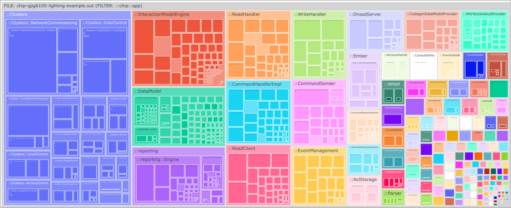

# ELF binary size information

## Individual size information

`file_size_from_nm.py` is able to build an interactive tree map of
methods/namespaces sizes within an elf binary.

Use it to determine how much space specific parts of the code take. For example:

```
./scripts/tools/file_size_from_nm.py \
    --zoom '::chip::app'             \
    ./out/qpg-qpg6105-light/chip-qpg6105-lighting-example.out
```

could result in a graph like:



## Determine difference between two binaries

`binary_elf_size_diff` provides the ability to compare two elf files. Usually
you can build the master branch of a binary and save it somewhere like
`./out/master.elf` and then re-build with changes and compare.

Example runs:

```
> ./scripts/tools/binary_elf_size_diff.py \
  ./out/qpg-qpg6105-light/chip-qpg6105-lighting-example.out \
  ./out/qpg-master.out

Type       Size  Function
-------  ------  -----------------------------------------------------------------------------------------------------------------------
CHANGED    -128  chip::app::CodegenDataModelProvider::WriteAttribute(chip::app::DataModel::WriteAttributeRequest const&, chip::app::A...
CHANGED     -76  chip::app::InteractionModelEngine::CheckCommandExistence(chip::app::ConcreteCommandPath const&, chip::app::DataModel...
CHANGED     -74  chip::app::reporting::Engine::CheckAccessDeniedEventPaths(chip::TLV::TLVWriter&, bool&, chip::app::ReadHandler*)
REMOVED     -58  chip::app::DataModel::EndpointFinder::EndpointFinder(chip::app::DataModel::ProviderMetadataTree*)
REMOVED     -44  chip::app::DataModel::EndpointFinder::Find(unsigned short)
CHANGED      18  chip::app::WriteHandler::WriteClusterData(chip::Access::SubjectDescriptor const&, chip::app::ConcreteDataAttributePa...
ADDED       104  chip::app::DataModel::ValidateClusterPath(chip::app::DataModel::ProviderMetadataTree*, chip::app::ConcreteClusterPat...
ADDED       224  chip::app::WriteHandler::CheckWriteAllowed(chip::Access::SubjectDescriptor const&, chip::app::ConcreteDataAttributeP...
TOTAL       -34


```

```
> ./scripts/tools/binary_elf_size_diff.py \
  --output csv --skip-total       \
  ./out/qpg-qpg6105-light/chip-qpg6105-lighting-example.out ./out/qpg-master.out

Type,Size,Function
CHANGED,-128,"chip::app::CodegenDataModelProvider::WriteAttribute(chip::app::DataModel::WriteAttributeRequest const&, chip::app::AttributeValueDecoder&)"
CHANGED,-76,"chip::app::InteractionModelEngine::CheckCommandExistence(chip::app::ConcreteCommandPath const&, chip::app::DataModel::AcceptedCommandEntry&)"
CHANGED,-74,"chip::app::reporting::Engine::CheckAccessDeniedEventPaths(chip::TLV::TLVWriter&, bool&, chip::app::ReadHandler*)"
REMOVED,-58,chip::app::DataModel::EndpointFinder::EndpointFinder(chip::app::DataModel::ProviderMetadataTree*)
REMOVED,-44,chip::app::DataModel::EndpointFinder::Find(unsigned short)
CHANGED,18,"chip::app::WriteHandler::WriteClusterData(chip::Access::SubjectDescriptor const&, chip::app::ConcreteDataAttributePath const&, chip::TLV::TLVReader&)"
ADDED,104,"chip::app::DataModel::ValidateClusterPath(chip::app::DataModel::ProviderMetadataTree*, chip::app::ConcreteClusterPath const&, chip::Protocols::InteractionModel::Status)"
ADDED,224,"chip::app::WriteHandler::CheckWriteAllowed(chip::Access::SubjectDescriptor const&, chip::app::ConcreteDataAttributePath const&)"

```
