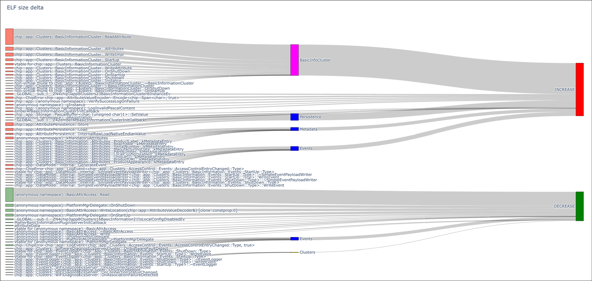
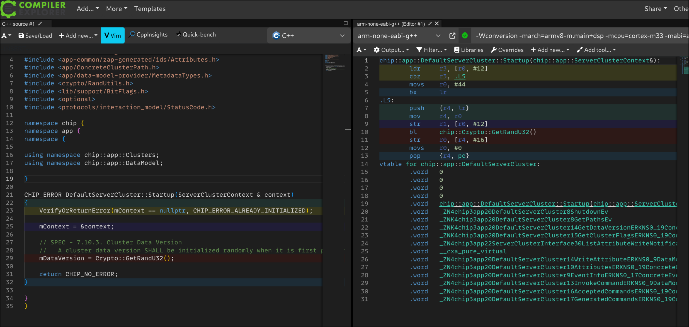

# ELF binary size information

## Individual size information

`file_size_from_nm.py` is able to build an interactive tree map of
methods/namespaces sizes within an elf binary.

Use it to determine how much space specific parts of the code take. For example:

```
./scripts/tools/file_size_from_nm.py \
    --zoom '::chip::app'             \
    ./out/qpg-qpg6200-light/chip-qpg6200-lighting-example.out
```

could result in a graph like:


## Determine difference between two binaries

`binary_elf_size_diff` provides the ability to compare two elf files. Usually
you can build the master branch of a binary and save it somewhere like
`./out/master.elf` and then re-build with changes and compare.

Example runs:

```
> ./scripts/tools/binary_elf_size_diff.py \
  ./out/qpg-qpg6200-light/chip-qpg6200-lighting-example.out \
  ./out/qpg-master.out

Type       Size  Function
-------  ------  -----------------------------------------------------------------------------------------------------------------------
CHANGED    -128  chip::app::CodegenDataModelProvider::WriteAttribute(chip::app::DataModel::WriteAttributeRequest const&, chip::app::A...
CHANGED     -76  chip::app::InteractionModelEngine::CheckCommandExistence(chip::app::ConcreteCommandPath const&, chip::app::DataModel...
CHANGED     -74  chip::app::reporting::Engine::CheckAccessDeniedEventPaths(chip::TLV::TLVWriter&, bool&, chip::app::ReadHandler*)
REMOVED     -58  chip::app::DataModel::EndpointFinder::EndpointFinder(chip::app::DataModel::ProviderMetadataTree*)
REMOVED     -44  chip::app::DataModel::EndpointFinder::Find(unsigned short)
CHANGED      18  chip::app::WriteHandler::WriteClusterData(chip::Access::SubjectDescriptor const&, chip::app::ConcreteDataAttributePa...
ADDED       104  chip::app::DataModel::ValidateClusterPath(chip::app::DataModel::ProviderMetadataTree*, chip::app::ConcreteClusterPat...
ADDED       224  chip::app::WriteHandler::CheckWriteAllowed(chip::Access::SubjectDescriptor const&, chip::app::ConcreteDataAttributeP...
TOTAL       -34


```

```
> ./scripts/tools/binary_elf_size_diff.py \
  --output csv --skip-total       \
  ./out/qpg-qpg6200-light/chip-qpg6200-lighting-example.out ./out/qpg-master.out

Type,Size,Function
CHANGED,-128,"chip::app::CodegenDataModelProvider::WriteAttribute(chip::app::DataModel::WriteAttributeRequest const&, chip::app::AttributeValueDecoder&)"
CHANGED,-76,"chip::app::InteractionModelEngine::CheckCommandExistence(chip::app::ConcreteCommandPath const&, chip::app::DataModel::AcceptedCommandEntry&)"
CHANGED,-74,"chip::app::reporting::Engine::CheckAccessDeniedEventPaths(chip::TLV::TLVWriter&, bool&, chip::app::ReadHandler*)"
REMOVED,-58,chip::app::DataModel::EndpointFinder::EndpointFinder(chip::app::DataModel::ProviderMetadataTree*)
REMOVED,-44,chip::app::DataModel::EndpointFinder::Find(unsigned short)
CHANGED,18,"chip::app::WriteHandler::WriteClusterData(chip::Access::SubjectDescriptor const&, chip::app::ConcreteDataAttributePath const&, chip::TLV::TLVReader&)"
ADDED,104,"chip::app::DataModel::ValidateClusterPath(chip::app::DataModel::ProviderMetadataTree*, chip::app::ConcreteClusterPath const&, chip::Protocols::InteractionModel::Status)"
ADDED,224,"chip::app::WriteHandler::CheckWriteAllowed(chip::Access::SubjectDescriptor const&, chip::app::ConcreteDataAttributePath const&)"

```

The diff can also export a sankey data for the differences. Example run:

```
# Running via `uv` from https://github.com/astral-sh/uv ensures packages are loaded and is generally fast
# sankey-rules are optional and are of the form:
#   match "<regex>" to <group_name> "color" colorstr
# where the color part is optional
#
# Example used rules.txt:
#
#  match "::k(MetadataEntry|MandatoryAttributes)" to "Metadata"
#  match "chip::app::Clusters::BasicInformationCluster" to "BasicInfoCluster" color magenta
#  match "AttributePersistence" to Persistence
#  match "Event" to Events color blue
#  match "chip::app::Clusters::" to Clusters color yellow
#
uv run --script ./scripts/tools/binary_elf_size_diff.py                                                   \
   out/branch-builds/migrate_basic_info_to_code/stm32-stm32wb5mm-dk-light/chip-stm32-lighting-example.elf \
   out/branch-builds/better_scripts/stm32-stm32wb5mm-dk-light/chip-stm32-lighting-example.elf             \
   --output sankey                                                                                        \
   --sankey-rules out/rules.txt
```



## Looking at assembly code

For general tests, the [Godbolt compiler explorer](https://godbolt.org) is a
great resource.

### Locally running compiler explorer

There are cases where you may want to investigate how CHIP code is compiled and
the CHIP include/build options can be quite complex. In this case, you can run
the compiler explorer from
[source](https://github.com/compiler-explorer/compiler-explorer) locally using
the following instructions:

-   install node 20 or above (if you do not have it installed yet)
-   compile compiler-explorer from source
-   Set up a local C++ config in `etc/config/c++.local.properties`, often
    `gcc-arm-none-eabi-g++` as a compiler
-   add the relevant compiler settings:
    -   compile a sample application using the relevant variant. For example
        `./scripts/build/build_examples.py --target efr32-brd2703a-lock build`
    -   This will create a compile_commands.json that contains compiler
        arguments to compile files. We have a tool
        `compile_flags_from_compile_commands.py` to extract relevant compile
        flags.

The following instructions should work on a `chip-build-vscode` image. Set the
port accordingly (default is 10240)

```sh

# Install NVM to get node modules available
curl -o- https://raw.githubusercontent.com/nvm-sh/nvm/v0.40.3/install.sh | bash
source ~/.bashrc

# Install Node 22 (20 is minimum required, newer is better)
nvm install 22
nvm use 22

# for the compiler path for arm-none-eabi-g++ to be correct, this may be needed
source scripts/activate

# Checkout compiler explorer and build
git clone https://github.com/compiler-explorer/compiler-explorer.git out/compiler-explorer
cd out/compiler-explorer

# generate a relevant config file, like:
echo "compilers=gcc-arm-none-eabi-g++"                       >etc/config/c++.local.properties
echo "compiler.gcc-arm-none-eabi-g++.name=arm-none-eabi-g++" >>etc/config/c++.local.properties
echo "compiler.gcc-arm-none-eabi-g++.exe=arm-none-eabi-g++" >>etc/config/c++.local.properties

# Build and run, ready for testing
make EXTRA_ARGS="--language c++ --port 8000"
```

You can get compile flags (generally include paths are important) via
`scripts/tools/compile_flags_from_compile_commands.py`. Here is an example
invocation

```sh
scripts/tools/compile_flags_from_compile_commands.py \
    -c out/efr32-brd2703a-lock/compile_commands.json \
    flags basic-information \
| wl-copy

# NOTE: could also use `xclip -selection clipboard` for X11 systems
```

You may want to enable highlighting via `More->Settings` and have:

-   Site theme (as applicable)
-   Line highlighting color scheme as Rainbow (clearer code as opposed to just
    gray scale)


