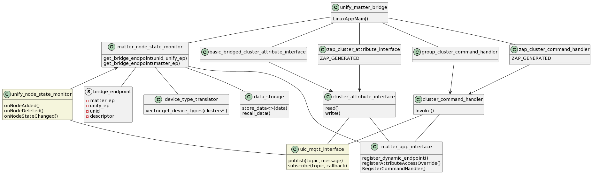
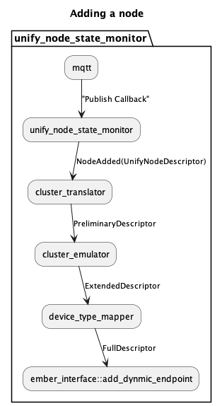
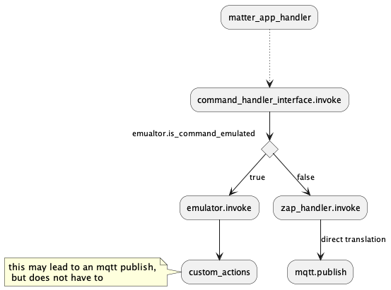
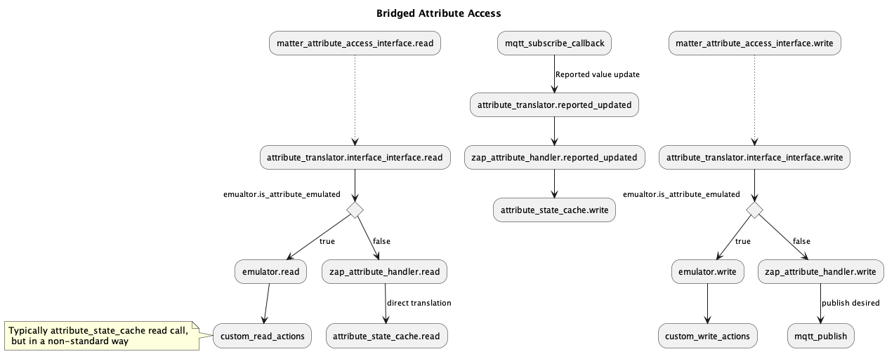

# Unify Matter Bridge(UMB) Design
-   [Introduction](#introduction)
-   [Component Overview](#component-overview)
-   [Bridged Node Inclusion and Mapping](#unify-node-inclusion-and-mapping)
-   [Command Handling](#cluster-command-handling)
-   [Attribute Access](#attribute-access)

## Introduction
The purpose of the Unify Matter Bridge is to make nodes from legacy protocols available on a matter fabric, in such a way that they can be operated and monitored through the matter fabric. The system level design consisting of the Unify Matter Bridge and a number of Unify Protocol Controllers is as shown in figure below.

For detailed overview, refer [readme_overview](../readme_overview.md). This document focuses on the design of UMB.

## Component Overview

### Node Monitoring
Node Monitoring consists of below components and is responsible for keeping track of nodes included in the Unify gateway and mapping them bridged enpoints. Detailed process in [Node Inclusion Section](#unify-node-inclusion-and-mapping)
- **Unify Node State Monitor**  :   
    This tracks the publish messages on State topic for the nodes in Unify network and updates, and triggers events to Matter Node State Monitor when 
    -  New Node is added
    -  Existing Node is removed
    -  Existing Node's state changes
- **Device Type Translator**    :  
    This component helps determines the matter device type for the node being added based on the clusters it supports. It also provides below translations:
    -  Unify Cluster Name -> CHIP Cluster ID 
    -  Unify cluster and attribute name -> CHIP Attribute ID 
    -  Unify cluster and command name -> CHIP Command ID
    -  CHIP cluster name -> CHIP Cluster ID
    -  CHIP cluster and attribute name -> CHIP Attribute ID 
    -  CHIP cluster and command name -> CHIP Command ID
- **Matter App Interface**      :  
    This provides with utilies and wrapper interface to Matter stack to register a legacy node and its capabilities as dynamic endpoint
- **Matter Node State Monitor** :  
    This is the binding component which acts on events from unify node state monitor, converts it and matter bridged endpoint with help of device type tanslator and matter app interface. It is also responsible for maintaining the mappings between matter endpoint ID and its corresponding UNID and EPIDs.

### Bridged Device Basic Information Cluster
**Basic Bridged Cluster Atrribute Interface**:  
The Unify Matter Bridge must fill in the Bridged Device Information cluster to the greatest extent possible, most fields can be derived directly from the UCL Basic Cluster. The Unify Name and Location cluster will ensure that we can map the NodeLabel in a sensible way.

`Note: When the functionality of a Bridged Device is represented using a set of Endpoints, this cluster SHALL only be exposed on the Endpoint which is at the top of the hierarchy for the functionality of that Bridged Device.`

| BDBI Attribute | Required | Unify Topic |
|----------------|----------|-------------|
|VendorName	     | O        |	ucl/by-unid/+/ep0/Basic/Attributes/ManufacturerName/Reported |
|VendorID	       |  O	      | ucl/by-unid/+/ep0/Basic/Attributes/ApplicationVersion/Reported |
|ProductName	| O |	ucl/by-unid/+/ep0/Basic/Attributes/ModelIdentifier/Reported|
|NodeLabel	| O |	ucl/by-unid/+/ep0/NameAndLocation/Attributes/Name|
|HardwareVersion | O | ucl/by-unid/+/ep0/Basic/Attributes/HWVersion/Reported|
|HardwareVersionString | O | ucl/by-unid/+/ep0/Basic/Attributes/HWVersion/Reported   ucl/by-unid/+/ep0/Basic/Attributes/ModelIdentifier/Reported |
|SoftwareVersion | O | ucl/by-unid/+/ep0/Basic/Attributes/ApplicationVersion/Reported|
|SoftwareVersionString | O | ucl/by-unid/+/ep0/Basic/Attributes/ApplicationVersion/Reported   ucl/by-unid/+/ep0/Basic/Attributes/SWBuildID/Reported |
|ManufacturingDate | O | ucl/by-unid/+/ep0/Basic/Attributes/DateCode/Reported |
|PartNumber | O | ucl/by-unid/+/ep0/Basic/Attributes/ProductCode/Reported |
|ProductURL | O | ucl/by-unid/+/ep0/Basic/Attributes/ProductURL/Reported |
ProductLabel | O | ucl/by-unid/+/ep0/Basic/Attributes/ProductLabel/Reported |
|SerialNumber | O | ucl/by-unid/+/ep0/Basic/Attributes/SerialNumber/Reported |
|Reachable | M | ucl/by-unid/+/State |
|UniqueID | O | ucl/by-unid/+/ep0/Basic/Attributes/ApplicationVersion/Reported |
|

### Cluster specific Attribute Access Interfaces
The controller may perform read and write operations on individual attribute of any cluster on any bridged endpoint. The matter bridge must implement translators that convert the write operation to corresponding WriteAttribute Unify MQTT message. It shall also parse and store ReportedValue(s) of all attributes from unsolicited publish messages from Protocol Controllers when there is update on attribute. The stored values shall be refered to while responding to Read operation on that resource. These translators and parser interfaces shall be zap generated to the greatest extent possible.  
The translators will be fairly simple, as both the Unfiy data model and the Matter data model are both based on Zigbee Cluster Library. However, there are still some discrepancies. In order to bridge these gaps, some cluster attributes may need to be emulated to best extent possible by matter bridge.

More details in [Attribute Access](#attribute-access) section below.

### Cluster specific Command Handler Interfaces
The commands invoked by controller will also need translation to Unify MQTT topic space. For this purpose, matter bridge must implement command mappers/translator which translates the matter command received from matter interface into relevant MQTT topic space and payload of Unify data model. These mappers/translators shall also be zap generated to the greatest extent possible. 

More details in [Command Handling](#cluster-command-handling) section below.

### Group Command Handling
The Matter Bridge endpoints may become part of a group. The matter bridge must create/remove Unify groups corresponding to the matter groups. The bridge should have an internal group table with (<matter_group_id>, <unify_group_ids>) tuples. The group table must be updated when groups are added or removed on the matter fabric. When a group message is received on the matter fabric, this command must be translated and propagated to the corresponding Unify Group.

**Group Communication**  
Matter multi-cast group is managed using 16-bits Group ID and tracked via Group Key Management Cluster. The Unify Matter Bridge shall register to receive on associated IPv6 multicast address, and the matter IPv6 multicast port for each group they are a member. Group Key Management Cluster manages group keys and maintains a list of groups supported via a node. Each group entry includes a membership list of zero of more endpoints that are members of the group on the node. Modification of this membership list is done via the Groups cluster, which is scoped to an endpoint. The Groups cluster is scoped to the endpoint. Groups cluster commands support discovering the endpoint membership in a group, adding the endpoint to a group, removing the endpoint from a group, removing endpoint membership from all groups. All commands defined in this cluster SHALL only affect groups scoped to the accessing fabric. The Unify matter bridge shall have a component that manages Group IDs via caching the list of endpoints.
When it receives a group command it shall translate the commands to an MQTT group cluster hierarchy publication to notify the respected Protocol controller.

## Unify Node Inclusion and Mapping

When a new node's state topic is published by protocol controller, the Unify node state monitor component shall read the network capabilities and ultimately relay to matter node monitor that a new node has been added along with the description/capabilities read during node interview. The Unify capabilities/description are then translated to a preliminary matter description. Further any mandatory or necessary cluster, if it can be emulated, is added into description. A list of device types are then derived by the device type mapper based on the description, forming a full description for the Unify node as matter endpoint, which is then registered as a dynamic endpoint into matter stack. 

## Cluster Command Handling

Each cluster's command handler shall register itself to matter stack as command handler. When a command is received matter stack will invoke the registered command handler to process the command. The command handler shall implement an InvokeCommand method which processes the command specific to the cluster. The command handler shall check if the received command is actually supported by device and can be handled by it or if its supported though emulation and direct the command to either the emulator implementation or towards Unify node. The emulator implementation may be completely emulated in which just a custom action is executed or it may also additionally translate and send a UCL MQTT message. When there is no emulation the command is directly translated to UCL topic and the command parameters to the JSON body of the UCL MQTT message.  

## Attribute Access

### Attribute Read 
The matter bridge shall subscribe to all the topic spaces specific to the clusters supported. The matter bridge gets the reported value published and translates the UCL topic and its payload to the corresponding mapped enpoint, cluster's attribute and its value. The translated value is stored it in cache which is later refered to when there is a Read from matter fabric.

Each attribute translator shall register itself to matter stack as Attribute access override. When there is a Read request from matter fabric, matter stack will invoke the registered override to fetch the attribute value. The attribute translator shall implement `Read` method to process the Read request. The `Read` in each translator shall check if the attribute being read is an emulated attribute and redirect the request to emulator. When not emulated the attribute value should be available in the cache which fetched and returned after encoding it in expected format. 

### Attribute Write 
Each attribute translator shall register itself to matter stack as Attribute access override. When there is a Write request from matter fabric, matter stack will invoke the registered override to write the attribute value. The attribute translator shall implement `Write` method to process the Write request. The `Write` in each translator shall check if the attribute being written is a emulated attribute and redirect the request to emulator. When not emulated the attribute write is converted to corresponding WriteAttributes UCL topic and value is converted to JSON body of the UCL MQTT message and published to broker. The emulator may just perform some custom action limited to matter bridge or it may additionally perform a custom translation and publish to broker if needed.
