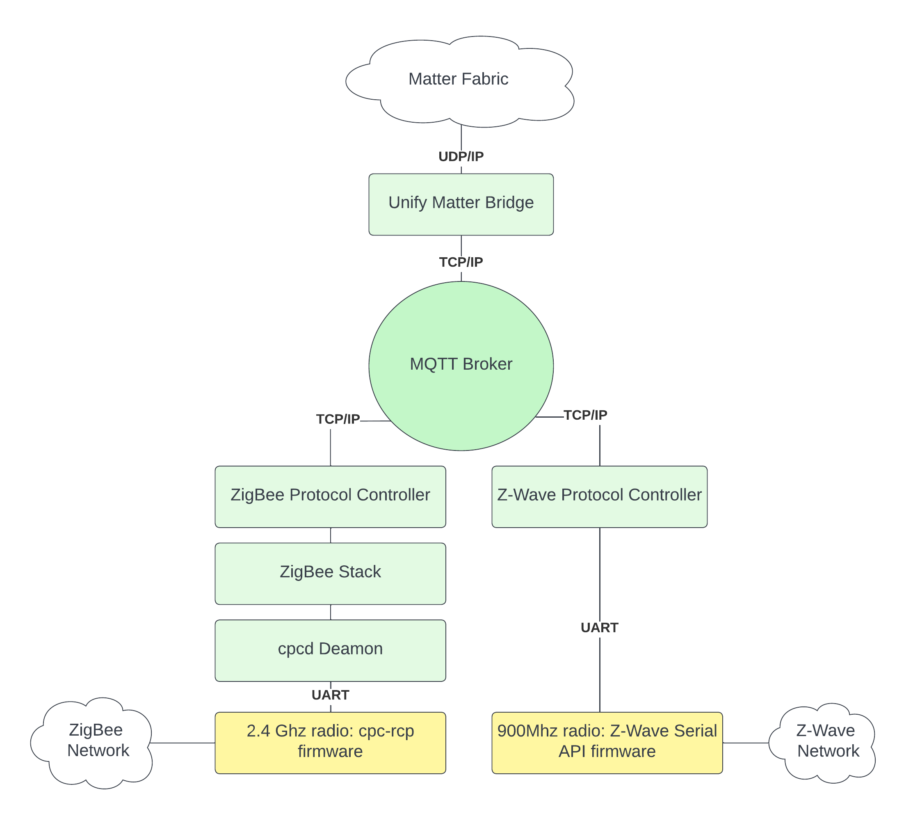

# Unify Matter Bridge Overview

The Unify Matter Bridge is an application that makes legacy devices, such as
Z-Wave and Zigbee devices, accessible on a Matter fabric. It does so by acting
as an _IoT Service_ in a Unify Framework.

In the Unify Framework, _protocol controllers_ translate raw wireless
application protocols such as Z-Wave and Zigbee into a common API called the
Unify Controller Language (UCL). This enables IoT services to operate and
monitor Z-Wave and Zigbee networks without being aware of the underlying
wireless protocol.

In Unify, the transport between IoT services and Protocol Controllers is MQTT
using JSON payloads for data representation.

On the Matter fabric, the Unify Matter Bridge is a Matter device that has
dynamic endpoints, each representing an endpoint on one of the nodes in the
Unify network. See the "Matter Specification" section "9.12. Bridge for
non-Matter devices" for details.

The figure below illustrates the system architecture of the Unify Matter Bridge
and two Unify protocol controllers.

More Information about the Unify Framework can be found
[here](https://siliconlabs.github.io/UnifySDK/doc/UnifySDK.html)

## Trying Out the Unify Matter Bridge

To test the Unify Matter Bridge, a Raspberry Pi 4 is recommended. Install the
latest release of the Unify SDK following the
[Unify Host SDK Getting Started Guide](https://siliconlabs.github.io/UnifySDK/doc/getting_started.html).
Once the base Unify system is up and running, the Unify Matter Bridge may be
installed on the Raspberry Pi 4.

The
[Silicon Labs Matter GitHub release](https://github.com/SiliconLabs/matter/releases)
contains ready-to-use binaries of the Unify Matter Bridge and the chip-tool.

> Note that the Unify Host SDK uses Raspberry Pi OS as the base system as
> opposed to the standard Ubuntu system used for the Matter OpenThread Border
> Router image.

## Unify Matter Bridge as an IoT Service

The Unify Matter Bridge is a Unify IoT Service that allows for control of Unify
devices from a Matter fabric. It translates Matter cluster commands and
attributes accesses into the corresponding Unify MQTT publish messages. Unify
node attributes are readable from the Matter Fabric, for example by a Google
Home App, as the Unify Matter Bridge also caches the state of those attributes.

The Unify data model is largely based on the same data model as Matter, making
the job of the Unify Matter Bridge relatively simple. There is almost a 1-1
relationship between them.

> **Note:** Currently no control goes out to the Matter Fabric from the Unify
> Matter Bridge. The Unify Matter Bridge cannot '_see_' what else is on the
> Matter Fabric, let alone control end devices in the Matter Fabric.

See the [GitHub release notes](https://github.com/SiliconLabs/matter/releases)
for details on feature additions, bug fixes, and known issues.

## Supported Clusters/Devices

The Unify Matter Bridge currently supports mapping the following clusters/device
types.

| Cluster                       |Zigbee Support| Z-Wave Support|
| :---------------------------- | :-----: | :-----: |
| Bridge Device Information     |❌|✅| 
| Level                         |✅|✅|
| OnOff                         |✅|✅|
| Identify                      |✅|❌|
| Group                         |✅|✅|
| Color Control                 |✅|✅|
| Occupancy Sensing             |✅|✅|
| Temperature Measurement       |❌|✅|
| Illuminance Measurement       |❌|✅|
| Pressure Measurement          |❌|✅|
| Flow Measurement              |❌|❌|
| RelativeHumidity Measurement  |❌|✅|

## Next Steps

-   [Building the Matter Bridge](./readme_building.md)
-   [Running the Matter Bridge](./readme_user.md#running-the-matter-bridge)
-   [Controlling a Z-Wave OnOff device](./readme_user.md#toggle-an-onoff-device)
-   [Toggling a group of OnOff devices](./readme_user.md#toggle-a-group-of-onoff-devices)

For more information about the Unify SDK see
[Unify Host SDK Documentation](https://siliconlabs.github.io/UnifySDK/doc/UnifySDK.html)
