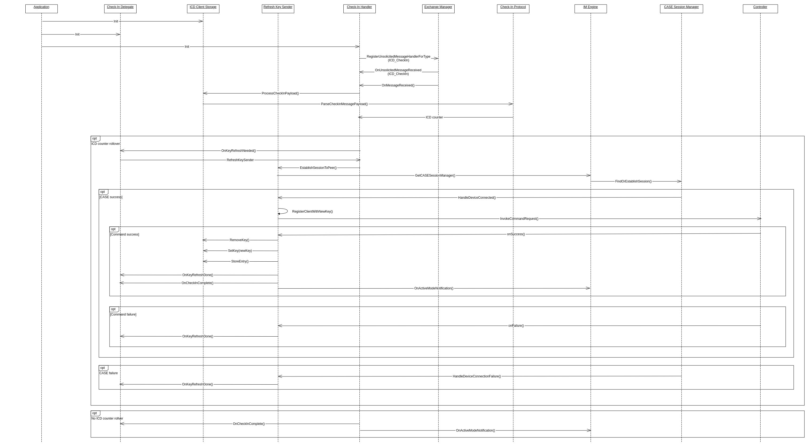

# Check-in handler overview

ICD servers send check-in messages to a registered ICD client when a subscription is lost or one was never established. A subscription can be lost for several reasons, such as:

• The ICD might not have full RAM retention when it is in an idle state.

• When the ICD is powered off to change the battery.

• Power or network outage causing the connection between the client and the ICD to be interrupted.

• The client is unavailable for any reason

The Check-In handler in an ICD client is responsible for handling unsolicited check-in messages from an ICD server. All ICD clients should add support for Check-In protocol as it is a fail safe mechanism that provides a means to re-establish a secure session with an ICD server. The heart of the module is the check-in handler that receives and parses check-in messages from ICD servers. After ensuring the validity of the message, the check-in handler passes it on to the check-in protocol to parse the message and retrieves the ICD counter value. The ICD counter is used to derive the nonce in the encryption process of the check-in protocol. Beyond that, ICD counters are also used to detect repeated reception of the same message and eliminate duplicates. Once the maximum value for an ICD counter is reached, the counter should roll-over to 0 and when that is done, it is necessary for the ICD client to re-register with the ICD server using a fresh key. 

The following diagram shows how the Check-in handler and key refresh algorithm are implemented in the Matter SDK.

