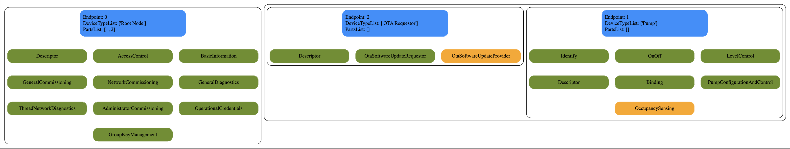

# Setup

This tool uses the python environment used by the python_testing efforts, which
can be built using the below command. Notice that graphviz is required as an
extra package in order for the tool to generate the graph file.

```
scripts/build_python.sh -m platform -i out/python_env --extra_packages graphviz
```

Once the python environment is build it can be activated using this command:

```
source out/python_env/bin/activate
```

# How to run

When the python environment is activated the tool can be started as a regular
python script. The tool does rely on the "framework" used for python testing,
which means it is possible to do the commissioning of the DUT as well.

By adding the appropriate parameters to the script execution, it will
automatically perform a commissioning before running the tool itself.

This is an example of running the test including commissioning a Thread based
example app device

```
python3 '/Users/renejosefsen/Developer/GitData/connectedhomeip/src/tools/device-graph/matter-device-graph.py' --commissioning-method ble-thread --discriminator 3840 --passcode 20202021 --thread-dataset-hex 0e08000000000001000035060004001fffe00708fdbeb88eb19ecbe60410ec73aeaadc21448df01599e6eaf216eb0c0402a0f7f8000300001901025b3502085b35dead5b35beef030435623335051000112233445566778899aabbccddeeff
```

In case the setup code and discriminator is not available, the QR code can also
be used:

```
python3 '/Users/renejosefsen/Developer/GitData/connectedhomeip/src/tools/device-graph/matter-device-graph.py' --commissioning-method ble-thread --qr-code MT:K2AA04EG15LL6I0LF00 --thread-dataset-hex 0e08000000000001000035060004001fffe00708fd6df9cc6d0db45b0410e12c1d624d8b4daf6adbfe5b2cd7787b0c0402a0f7f8000300001901025b3502085b35dead5b35beef030435623335051000112233445566778899aabbccddeeff
```

In case the device uses a development PAA, the following parameter should be
added.

```
--paa-trust-store-path credentials/development/paa-root-certs
```

In case the device uses a production PAA, the following parameter should be
added.

```
--paa-trust-store-path credentials/production/paa-root-certs
```

Once a commissioning is completed for the device, is is possible to rerun the
tool again for an already commissioned devices, this is an example of how to do
so:

```
python3 '/Users/renejosefsen/Developer/GitData/connectedhomeip/src/tools/device-graph/matter-device-graph.py'
```

The tool currently outputs the dot file in this folder and the output file is
named "matter-device-graph.dot".

# How to view graph

In order to view the graph, any tool that renders dot/graphviz files can be
used.

It is possible to open dot files and get them rendered in vscode using this
extension:
[vscode-graphviz](https://marketplace.visualstudio.com/items?itemName=joaompinto.vscode-graphviz)

# Example of output

This is an example of the graph outputted from a device:


